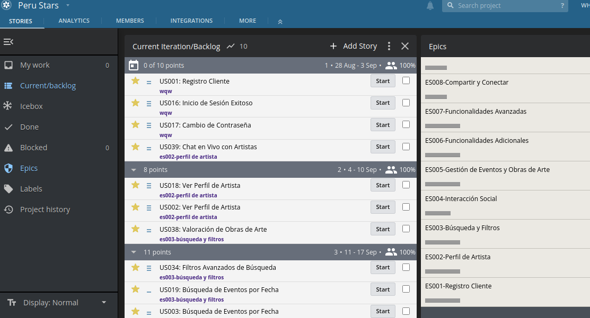
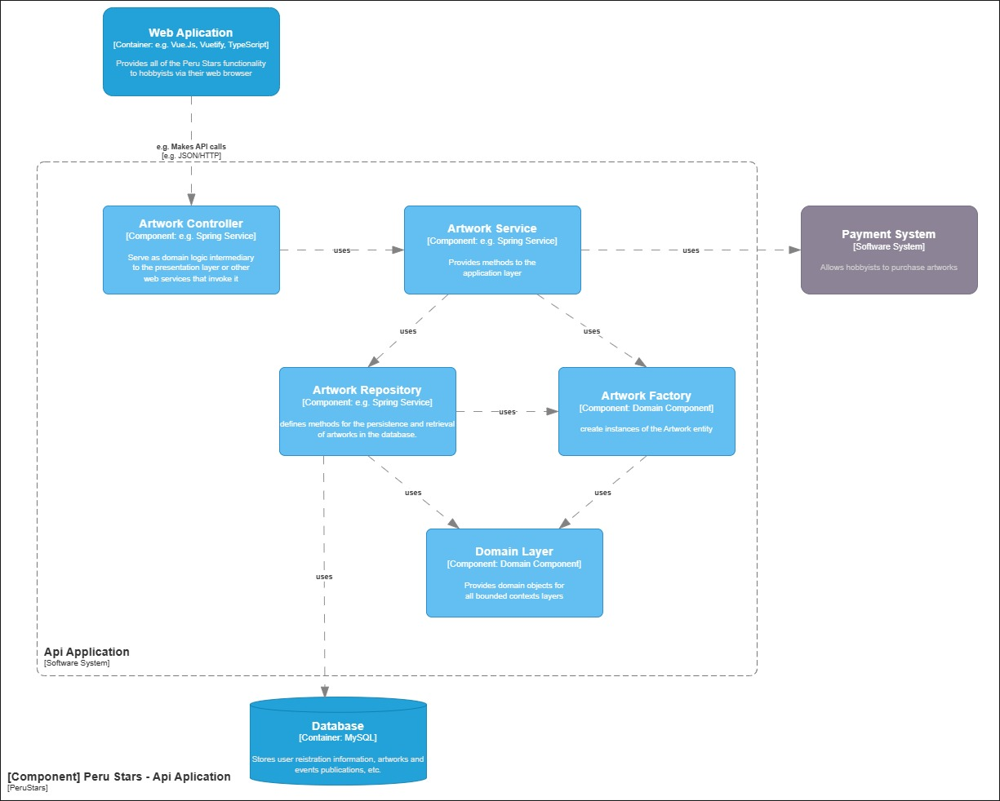
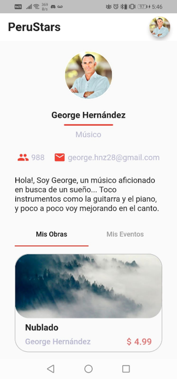
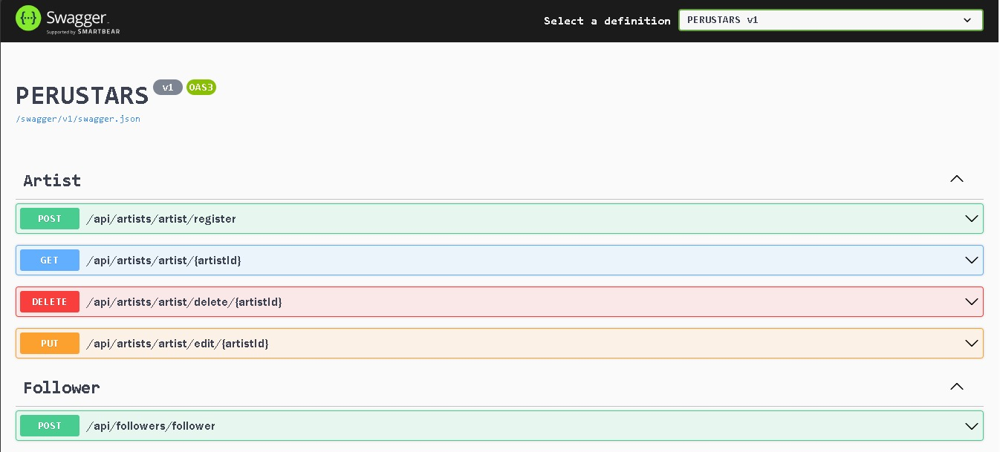
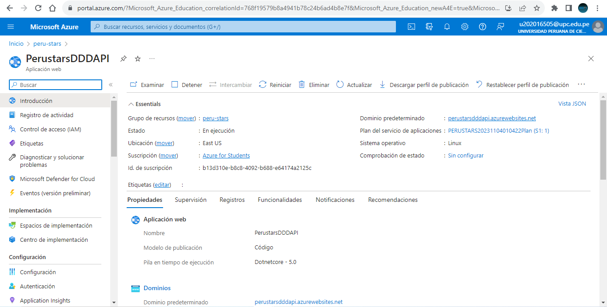

[comment]: <> (Carátula)

<b>Informe de Trabajo Final</b>

Project Report

Universidad Peruana de Ciencias Aplicadas, Ingeniería de Software, 8vo Ciclo

Arquitecturas De Software Emergentes

WX82

Angel Augusto Velasquez Nuñez

Softeam

Peru Stars

Relación de integrantes:

- u202016505 Miguel Ángel Cahuas Vergara
- u201911572 Manuel Alonso Aranguri Vargas
- u201914246 Diego Alonso Olivera Barrantes
- u201821078 Franchesco Alexis Soto Morales
- u202015074 Alvaro Antonio Julca Gallardo
- u201924504 Joyce Salome Bautista Villaverde
- u201420260 Brayan Anthony Cruces Castillo
- u201416643 Maximo Ali Mallqui Tertuliano
- u201521128 De La Mar Geronimo Zurita Palacios
- u202010482 Mauricio Jesús Prado Chumbes

---

[comment]: <> (Historial de versiones)

<b> Historial de versiones </b>

| _Versión_ | _Fecha_    | _Autor_                                                                                                                                                        | _Descripción de modificación_                                                                                           |
| --------- | ---------- | -------------------------------------------------------------------------------------------------------------------------------------------------------------- | ----------------------------------------------------------------------------------------------------------------------- |
| 1.0       | 20/08/2023 | Miguel Cahuas, Manuel Aranguri, Diego Olivera, Franchesco Soto, Alvaro Julca, Joyce Bautista, Brayan Cruces, Maximo Mallqui, De La Mar Zurita y Mauricio Prado | Se realizó un primer avance de los capítulos 1, 2, 3 y 4.                                                               |
| 1.1       | 31/09/2023 | Miguel Cahuas, Manuel Aranguri, Diego Olivera, Franchesco Soto, Alvaro Julca, Joyce Bautista, Brayan Cruces, Maximo Mallqui, De La Mar Zurita y Mauricio Prado | Se realizó un segundo avance de los capítulos 1, 2, 3 y 4.                                                              |
| 1.2       | 08/09/2023 | Miguel Cahuas, Manuel Aranguri, Diego Olivera, Franchesco Soto, Alvaro Julca, Joyce Bautista, Brayan Cruces, Maximo Mallqui, De La Mar Zurita y Mauricio Prado | Se realizó el término y refinamiento de los capítulos 1, 2, 3 y 4.                                                      |
| 2.0       | 14/09/2023 | Miguel Cahuas, Manuel Aranguri, Diego Olivera, Franchesco Soto, Alvaro Julca, Joyce Bautista, Brayan Cruces, Maximo Mallqui, De La Mar Zurita y Mauricio Prado | Se avanzaron los domain e interface layer de los bounded contexts y el capítulo 6 de acuerdo a la organización pactada. |
| 2.1       | 20/09/2023 | Miguel Cahuas, Manuel Aranguri, Diego Olivera, Franchesco Soto, Alvaro Julca, Joyce Bautista, Brayan Cruces, Maximo Mallqui, De La Mar Zurita y Mauricio Prado | Se realizaron correcciones en gran parte de los capítulos del TB1 debido a las observaciones del profesor.              |
| 2.2       | 27/09/2023 | Miguel Cahuas, Manuel Aranguri, Diego Olivera, Franchesco Soto, Alvaro Julca, Joyce Bautista, Brayan Cruces, Maximo Mallqui, De La Mar Zurita y Mauricio Prado | Se terminaron todos los capítulos 5 y 6 para convertir el documento a pdf y realizar el envío del trabajo parcial.      |
| 3.0       | 04/11/2023 | Miguel Cahuas, Manuel Aranguri, Diego Olivera, Franchesco Soto, Alvaro Julca, Joyce Bautista, Brayan Cruces, Maximo Mallqui, De La Mar Zurita y Mauricio Prado | Se terminaron los capítulos 6 y 7 a nivel de contenido correspondiente a la entrega TB2.                                |
| 4.0       | 20/11/2023 | Miguel Cahuas, Manuel Aranguri, Diego Olivera, Franchesco Soto, Alvaro Julca, Joyce Bautista, Brayan Cruces, Maximo Mallqui, De La Mar Zurita y Mauricio Prado | Se realizó un avance del contenido correspondiente a la entrega TF.                                                     |
| 4.1       | 23/11/2023 | Miguel Cahuas, Manuel Aranguri, Diego Olivera, Franchesco Soto, Alvaro Julca, Joyce Bautista, Brayan Cruces, Maximo Mallqui, De La Mar Zurita y Mauricio Prado | Se terminó de realizar el contenido correspondiente a la entrega TF.                                                    |

---

[comment]: <> (Historial de versiones)

<b>Project Report Collaboration Insights </b>

Se ha creado un repositorio en dónde hemos centralizado la documentación del proyecto.

Link del repositorio: [SoftTeam-Emergentes](https://github.com/SoftTeam-Emergentes/Documents).

Asimismo, se ha creado una rama develop que se usa como 
base para que cada integrante del equipo cree sus ramas feature en donde podrán
avanzar sus asignaciones de acuerdo a lo acordado en una reunión previa. 
A continuación unas ilustraciones al respecto.

   
   
  

En adición, se ha acordado con el equipo tener reuniones semanales en donde se realizarán revisiones de avance y consultas al respecto.

---

[comment]: <> (Indice)

# Índice

<!-- TOC -->

- [Índice](#índice)
- [Student Outcome](#student-outcome)
- [Capítulo I: Introducción](#capítulo-i-introducción)
  - [1.1. Startup Profile](#11-startup-profile)
    - [1.1.1. Descripción de la StartUp](#111-descripción-de-la-startup)
    - [1.1.2. Perfiles de integrantes del equipo](#112-perfiles-de-integrantes-del-equipo)
  - [1.2. Solution Profile](#12-solution-profile)
    - [1.2.1 Antecedentes y problemática](#121-antecedentes-y-problemática)
    - [1.2.2 Lean UX Process](#122-lean-ux-process)
      - [1.2.2.1 Lean UX Problem Statement](#1221-lean-ux-problem-statement)
      - [1.2.2.2 Lean UX Assumptions](#1222-lean-ux-assumptions)
      - [1.2.2.3 Lean UX Hypothesis Statements](#1223-lean-ux-hypothesis-statements)
      - [1.2.2.4 Lean UX Canvas](#1224-lean-ux-canvas)
  - [1.3. Segmentos Objetivo](#13-segmentos-objetivo)
- [Capítulo II: Requirements Elicitation \& Analysis](#capítulo-ii-requirements-elicitation--analysis)
  - [2.1. Competidores](#21-competidores)
  - [2.1.1. Análisis competitivo](#211-análisis-competitivo)
    - [2.1.2. Estrategias y tácticas frente a competidores](#212-estrategias-y-tácticas-frente-a-competidores)
    - [Nuestras Fortalezas](#nuestras-fortalezas)
  - [2.2 Entrevista](#22-entrevista)
    - [2.2.1 Diseño entrevistas](#221-diseño-entrevistas)
      - [Guion realizado:](#guion-realizado)
- [2.2.2 Registro de Entrevistas](#222-registro-de-entrevistas)
  - [2.2.2. Analisis de entrevistas](#222-analisis-de-entrevistas)
    - [2.2.2.1 Artistas](#2221-artistas)
    - [2.2.2.2 Aficionados al Arte](#2222-aficionados-al-arte)
  - [2.3. Needfinding](#23-needfinding)
    - [2.3.1. User Personas](#231-user-personas)
    - [2.3.2 User Task Matrix](#232-user-task-matrix)
    - [2.3.3. Empathy Mapping.](#233-empathy-mapping)
    - [2.3.4. As-is Scenario Mapping.](#234-as-is-scenario-mapping)
- [Capítulo III: Requirements Specification](#capítulo-iii-requirements-specification)
  - [3.1. To-Be Scenario Mapping](#31-to-be-scenario-mapping)
  - [3.2. User Stories](#32-user-stories)
  - [3.3. Impact Mappin](#33-impact-mappin)
- [Capítulo IV: Strategic-Level Software Design.](#capítulo-iv-strategic-level-software-design)
  - [3.4. Product Backlog](#34-product-backlog)
  - [4.1 Strategic-Level Attribute-Driven Design](#41-strategic-level-attribute-driven-design)
    - [4.1.1 Design purpose](#411-design-purpose)
    - [4.1.2 Attribute-Driven Design Inputs](#412-attribute-driven-design-inputs)
      - [4.1.2.1. Primary Functionality (Primary User Stories)](#4121-primary-functionality-primary-user-stories)
      - [4.1.2.2. Quality attribute Scenarios](#4122-quality-attribute-scenarios)
      - [4.1.2.3. Constraints](#4123-constraints)
    - [4.1.3. Architectural Drivers Backlog.](#413-architectural-drivers-backlog)
      - [4.1.2.2. Quality attribute Scenarios](#4122-quality-attribute-scenarios-1)
    - [4.1.4. Architectural Design Decisions.](#414-architectural-design-decisions)
    - [4.1.5. Quality Attribute Scenario Refinements.](#415-quality-attribute-scenario-refinements)
  - [4.2 Strategic-Level Domain-Driven Design.](#42-strategic-level-domain-driven-design)
    - [4.2.1. EventStorming](#421-eventstorming)
    - [4.2.2. Candidate Context Discovery](#422-candidate-context-discovery)
    - [4.2.3. Domain Message Flows Modeling](#423-domain-message-flows-modeling)
    - [4.2.4. Bounded Context Canvases](#424-bounded-context-canvases)
    - [4.2.5 Context Mapping](#425-context-mapping)
  - [4.3. Software Arquitecture](#43-software-arquitecture)
    - [4.3.1. Software Arquitecture System Landscape Diagrams](#431-software-arquitecture-system-landscape-diagrams)
    - [4.3.2. Software Arquitecture Context Level Diagrams](#432-software-arquitecture-context-level-diagrams)
    - [4.3.3. Software Architecture Container Level Diagrams](#433-software-architecture-container-level-diagrams)
    - [4.3.4. Software Architecture Deployment Diagrams](#434-software-architecture-deployment-diagrams)
- [Capítulo V: Tactical-Level Software Design.](#capítulo-v-tactical-level-software-design)
  - [5.1 Bounded Context: Identity and account management](#51-bounded-context-identity-and-account-management)
    - [5.1.1 Domain Layer](#511-domain-layer)
    - [5.1.2 Interface Layer](#512-interface-layer)
    - [5.1.3 Application Layer](#513-application-layer)
    - [5.1.4. Infrastructure Layer](#514-infrastructure-layer)
    - [5.1.6. Bounded Context Software Architecture Component Level Diagrams.](#516-bounded-context-software-architecture-component-level-diagrams)
    - [5.1.7. Bounded Context Software Architecture Code Level Diagrams.](#517-bounded-context-software-architecture-code-level-diagrams)
      - [5.1.7.1. Bounded Context Domain Layer Class Diagrams.](#5171-bounded-context-domain-layer-class-diagrams)
      - [5.1.7.2. Bounded Context Database Design Diagram.](#5172-bounded-context-database-design-diagram)
  - [5.2 Bounded Context: Profile management](#52-bounded-context-profile-management)
    - [5.2.1 Domain Layer](#521-domain-layer)
    - [5.2.2 Interface Layer](#522-interface-layer)
    - [5.2.3 Application Layer](#523-application-layer)
    - [5.2.4. Infrastructure Layer](#524-infrastructure-layer)
    - [5.2.6. Bounded Context Software Architecture Component Level Diagrams.](#526-bounded-context-software-architecture-component-level-diagrams)
    - [5.2.7 Bounded Context Software Architecture Code Level Diagrams](#527-bounded-context-software-architecture-code-level-diagrams)
      - [5.2.7.2 Bounded Context Database Design Diagram.](#5272-bounded-context-database-design-diagram)
  - [5.3 Bounded Context: Conduct Report Management](#53-bounded-context-conduct-report-management)
    - [5.3.2 Domain Layer](#532-domain-layer)
    - [5.3.2 Interface Layer](#532-interface-layer)
    - [5.3.3 Application Layer](#533-application-layer)
    - [5.3.4 Infrastructure Layer](#534-infrastructure-layer)
    - [5.3.6. Bounded Context Software Architecture Component Level Diagrams.](#536-bounded-context-software-architecture-component-level-diagrams)
    - [5.3.7. Bounded Context Software Architecture Code Level Diagrams.](#537-bounded-context-software-architecture-code-level-diagrams)
      - [5.3.7.1. Bounded Context Domain Layer Class Diagrams.](#5371-bounded-context-domain-layer-class-diagrams)
      - [5.3.7.2. Bounded Context Database Design Diagram.](#5372-bounded-context-database-design-diagram)
  - [5.4 Bounded Context: Art Event Management](#54-bounded-context-art-event-management)
    - [5.4.1 Domain Layer](#541-domain-layer)
    - [5.4.2 Interface Layer](#542-interface-layer)
    - [5.4.3 Application Layer](#543-application-layer)
    - [5.4.4 Infrastructure Layer](#544-infrastructure-layer)
    - [5.4.5 Bounded Context Software Architecture Component Level Diagrams](#545-bounded-context-software-architecture-component-level-diagrams)
    - [5.4.6 Bounded Context Software Architecture Code Level Diagrams](#546-bounded-context-software-architecture-code-level-diagrams)
      - [5.4.6.1 Bounded Context Domain Layer Class Diagrams](#5461-bounded-context-domain-layer-class-diagrams)
      - [5.4.6.2 Bounded Context Database Diagram](#5462-bounded-context-database-diagram)
  - [5.6 Communication Management](#56-communication-management)
    - [5.6.1 Domain Layer](#561-domain-layer)
    - [5.6.2 Interface Layer](#562-interface-layer)
    - [5.6.3 Application Layer](#563-application-layer)
    - [5.6.4 Infrastructure Layer](#564-infrastructure-layer)
    - [5.6.5 Bounded Context Software](#565-bounded-context-software)
    - [5.6.6 Bounded Context Software Architecture Code Level Diagrams](#566-bounded-context-software-architecture-code-level-diagrams)
      - [5.6.6.1 Bounded Context Domain Layer Class Diagrams](#5661-bounded-context-domain-layer-class-diagrams)
      - [5.6.6.2 Bounded Context Database Diagrams](#5662-bounded-context-database-diagrams)
  - [5.7 Bounded Context: Artwork Management](#57-bounded-context-artwork-management)
    - [5.7.1 Domain Layer](#571-domain-layer)
    - [5.7.2 Interface Layer](#572-interface-layer)
    - [5.7.3 Application Layer](#573-application-layer)
    - [5.7.4 Infrastructure Layer](#574-infrastructure-layer)
    - [5.7.5 Bounded Context Software Architecture Component Level Diagrams](#575-bounded-context-software-architecture-component-level-diagrams)
    - [5.7.6 Bounded Context Software Architecture Code Level Diagrams](#576-bounded-context-software-architecture-code-level-diagrams)
      - [5.7.6.1 Bounded Context Domain Layer Class Diagrams](#5761-bounded-context-domain-layer-class-diagrams)
      - [5.7.6.2 Bounded Context Database Diagram](#5762-bounded-context-database-diagram)
- [Capítulo VI: Solution UX Design](#capítulo-vi-solution-ux-design)
  - [6.1 Style Guidelines](#61-style-guidelines)
    - [6.1.1. General Style Guidelines](#611-general-style-guidelines)
    - [6.1.2. Web Mobile Devices Style Guidelines](#612-web-mobile-devices-style-guidelines)
  - [6.2. Information Architecture](#62-information-architecture)
    - [6.2.2. Labeling Systems](#622-labeling-systems)
    - [6.2.3. Searching Systems](#623-searching-systems)
    - [6.2.4. SEO Tags and Meta Tags](#624-seo-tags-and-meta-tags)
    - [6.2.5. Navigation Systems.](#625-navigation-systems)
  - [6.3 Landing Page UI Design](#63-landing-page-ui-design)
    - [6.3.1. Landing Page Wireframe](#631-landing-page-wireframe)
    - [6.3.2. Landing Page Mock-up](#632-landing-page-mock-up)
  - [6.4 Applications UX/UI Design.](#64-applications-uxui-design)
    - [6.4.1. Applications Wireframes](#641-applications-wireframes)
    - [6.4.2. Applications Wireflow Diagrams](#642-applications-wireflow-diagrams)
    - [6.4.3. Applications Mock-ups](#643-applications-mock-ups)
    - [6.4.4. Applications User Flow Diagrams](#644-applications-user-flow-diagrams)
    - [6.5. Applications Prototyping](#65-applications-prototyping)
- [Capítulo VII: Product Implementation, Validation \& Deployment](#capítulo-vii-product-implementation-validation--deployment)
  - [7.1. Software Configuration Management](#71-software-configuration-management)
    - [7.1.1. Software Development Environment Configuration](#711-software-development-environment-configuration)
    - [7.1.2. Source Code Management](#712-source-code-management)
    - [7.1.3. Source Code Style Guide \& Conventions](#713-source-code-style-guide--conventions)
    - [7.1.4. Software Deployment Configuration](#714-software-deployment-configuration)
  - [7.2. Solution Implementation](#72-solution-implementation)
    - [7.2.1. Sprint 1](#721-sprint-1)
      - [7.2.1.1. Sprint Planning 1](#7211-sprint-planning-1)
      - [7.2.1.2. Sprint Backlog 1](#7212-sprint-backlog-1)
      - [7.2.1.3. Development Evidence for Sprint Review](#7213-development-evidence-for-sprint-review)
      - [7.2.1.4. Testing Suite Evidence for Sprint Review](#7214-testing-suite-evidence-for-sprint-review)
      - [7.2.1.5. Execution Evidence for Sprint Review](#7215-execution-evidence-for-sprint-review)
        - [Section Back-End](#section-back-end)
      - [7.2.1.6. Services Documentation Evidence for Sprint Review](#7216-services-documentation-evidence-for-sprint-review)
      - [7.2.1.7. Software Deployment Evidence for Sprint Review](#7217-software-deployment-evidence-for-sprint-review)
      - [7.2.1.8. Team Collaboration Insights during Sprint](#7218-team-collaboration-insights-during-sprint)
  - [7.2.2. Sprint 2](#722-sprint-2)
    - [7.2.2.1. Sprint Planning 2](#7221-sprint-planning-2)
      - [7.2.2.2. Sprint Backlog 2](#7222-sprint-backlog-2)
      - [7.2.2.3. Development Evidence for Sprint Review](#7223-development-evidence-for-sprint-review)
      - [7.2.2.4. Testing Suite Evidence for Sprint Review](#7224-testing-suite-evidence-for-sprint-review)
      - [7.2.2.5. Execution Evidence for Sprint Review](#7225-execution-evidence-for-sprint-review)
        - [Section Back-End](#section-back-end)
        - [Section Front-End](#section-front-end)
        - [Section Mobile](#section-mobile)
      - [7.2.2.6. Services Documentation Evidence for Sprint Review](#7226-services-documentation-evidence-for-sprint-review)
      - [7.2.2.7. Software Deployment Evidence for Sprint Review](#7227-software-deployment-evidence-for-sprint-review)
      - [7.2.2.8. Team Collaboration Insights during Sprint](#7228-team-collaboration-insights-during-sprint)
  - [7.3. Validation Interviews](#73-validation-interviews)
    - [7.3.1. Diseño de Entrevistas](#731-diseño-de-entrevistas)
    - [7.3.2. Registro de Entrevistas](#732-registro-de-entrevistas)
    - [7.3.3. Evaluaciones según heurísticas](#733-evaluaciones-según-heurísticas)
  - [7.4. Video About-the-Product.](#74-video-about-the-product)
- [Conclusiones](#conclusiones)
- [Video About-the-Team.](#video-about-the-team)
- [Bibliografía](#bibliografía)
- [Anexos](#anexos)

---

# Student Outcome

<table >
  <thead>
    <tr>
      <th colspan="3">Criterio especifico</th>
      <th colspan="3"><strong>Acciones realizadas</strong></th>
      <th colspan="3"><strong>Conclusiones</strong></th>
    </tr>
  </thead>
  <tbody>
    <tr>
      <td colspan="3">Comunica oralmente sus ideas y/o resultados con objetividad a público de diferentes especialidades y niveles jerárquicos, en el marco del desarrollo de un proyecto en ingeniería.</td>
      <td colspan="3" align = "justify">
<h3>Miguel Angel Cahuas Vergara</h3>
        <strong>TB1</strong>
          
 He comunicado ideas para la descripción, perfiles y antecedentes. 
 
        <strong>TP1</strong>
          
 Comuniqué ideas para las 4 primeras partes del Bounded Context Data Analytics

        <strong>TB2</strong>
          
 Comuniqué propuestas para organización e implementación técnica para los diversos bounded contexts en la aplicación backend 

        <strong>TF</strong>
          
 Comuniqué las ideas de desarrollo para el mejoramiento de la aplicación 

<h3>Franchesco Alexis Soto Morales</h3>
        <strong>TB1</strong>
          
 He comunicado ideas para la descripción, perfiles y antecedentes. 
 
        <strong>TP1</strong>
          
 Comuniqué ideas para los diagramas de Bounded Context a nivel de Data Art Event Management

        <strong>TB2</strong>
          
 Comuniqué mis avances y algunas correcciones a todos los miembros del equipo.

        <strong>TF</strong>
          
 Reestructure la arquitectura del proyecto mobile comunicando las neuvas consideraciones que surgieron a raiz de las nuevas implementaciones. 

<h3>Alvaro Antonio Julca Gallardo</h3>
        <strong>TB1</strong>
          
 He apoyado en las ideas de segmentos objetivos, análisis competitivo y estrategias y tácticas frente a competidores.
 
        <strong>TP1</strong>
          
 He comunicado ideas para los diagramas de Bounded Context en función de Conduct Reports

        <strong>TB2</strong>
          
 Comuniqué mis ideas de mejora para el desarrollo de back-end

        <strong>TF</strong>
          
 Resiví y compartí mis conocimientos para apoyar con el desarrollo del back-end

<h3>De La Mar Geronimo Zurita Palacios</h3>
        <strong>TB1</strong>
          
He apoyado en ideas para las entrevistas
 
        <strong>TP1</strong>
          
 Comuniqué ideas para el Bounded Context de Conduct Report.

        <strong>TB2</strong>
          
 Durante el desarrollo de un proyecto de ingeniería, he demostrado mi capacidad para comunicar mis ideas y resultados de manera objetiva a personas de diferentes especialidades y niveles jerárquicos. En particular, he coordinado los avances de los requerimientos en la parte de front-end, comunicándome eficazmente a través de llamadas y videos. En estos, he detallado el diseño y el flujo de trabajo que se implementará en este sprint. Además, he participado en reuniones donde he planteado consultas e ideas sobre cómo podemos adaptar y mejorar el diseño para alinearlo con la evolución de la idea de negocio. Esta experiencia ha reforzado mi habilidad para comunicar de manera efectiva en un entorno de ingeniería. 

        <strong>TF</strong>
          
 He desarrollado la parte del frontend comunicando mis nuevos cambios y consideraciones que se tuvieron durante el desarrollo. 

<h3>Maximo Ali Mallqui Tertuliano</h3>
        <strong>TB1</strong>
          
He definido las pautas de User Personas, User Task Matrix, Empathy Mapping y As-is Scenario Mapping.
 
        <strong>TP1</strong>
          
 He apoyado en ideas para el Bounded Context de Data Analytics.

        <strong>TB2</strong>
          
 He definido las metas del proyecto desde el lado Frontend. 

        <strong>TF</strong>
          
 He apoyado en la reestructuración e implementación de los neuvos bounded context en la aplicación mobile.

<h3>Joyce Salome Bautista Villaverde</h3>
        <strong>TB1</strong>
          
He apoyado en las ideas para To-Be Scenario Mapping, User Stories, Impact Mapping y Product Backlog.
 
        <strong>TP1</strong>
          
 He apoyado en ideas de la funcionalidad User para su Bounded Context respectivo

        <strong>TB2</strong>
          
He implementado el bounded context ProfileManagement siguiendo un enfoque DDD, aportando nuevas ideas con todo el equipo.

        <strong>TF</strong>
          
 He apoyado en registro de las actividades realizadas en las tecnologías poniendolas en el sprint backlog. 

<h3>Diego Alonso Olivera Barrantes</h3>
        <strong>TB1</strong>
          
He definido las pautas para Primary Funcionality, Quality attribute Scenarios y Constraints
 
        <strong>TP1</strong>
          
 He aportado ideas para los diagramas del Bounded Context Artwork Management

        <strong>TB2</strong>
          
Comuniqué cómo iban mis avances durante el desarrollo del bounded context de artwork management y pregunté a los demás miembros del equipo cuando tuve problemas o dudas

        <strong>TF</strong>
          
 He comunicado mis ideas con respecto a la reestructuración de la aplicación mobile. 

<h3>Manuel Aranguri Vargas</h3>
        <strong>TB1</strong>
          
He apoyado en la definición de Architectural Drivers Backlog, Architectural Design Decisions, Quality Attribute Scenario Refinements y Event Storming.
 
        <strong>TP1</strong>
          
 He apoyado en ideas para Artwork Management en su respectivo Bounded Context.

        <strong>TB2</strong>
          
 Logré comunicar mis avances en el bounded context de notificación de manera objetiva y clara a un público diverso, facilitando así una colaboración efectiva y la toma de decisiones informadas. 

        <strong>TF</strong>
          
 He apoyado en la verificación del funcionamiento del bounded context Notificatión, además de constatar los avances en la documentación. 

<h3>Brayan Anthony Cruces Castillo</h3>
        <strong>TB1</strong>
          
He apoyado en ideas para Candidate Context Discovery, Domain Message Flows Modeling, Bounded Context Canvases y Context Mapping.
 
        <strong>TP1</strong>
          
 He apoyado en la concreción de ideas para los diagramas del Bounded Context Data Analytics.

        <strong>TB2</strong>
          
 ---------------------------------- 

        <strong>TF</strong>
          
 He apoyado implementando los nuevos bounded contexs en el frontend.

<h3>Mauricio Jesús Prado Chumbes</h3>
        <strong>TB1</strong>
          
He aportado ideas para las áreas de Software Architecture
 
        <strong>TP1</strong>
          
 He apoyado en ideas con respecto a diagramas de Bounded Context para Users.

        <strong>TB2</strong>
          
 He apoyado con el desarrollo y reestructuración del backend. 

        <strong>TF</strong>
          
 He apoyado con la implementacion de los nuevos bounded context en el frontend.

      </td>
      <td colspan="3">Se ha participado en conjunto con la definición de la solución y asignado tareas de manera equitativa</td>
    </tr>
    <tr>
      <td colspan="3">Comunica en forma escrita ideas y/o resultados con objetividad a público de diferentes especialidades y niveles jerarquicos, en el marco del desarrollo de un proyecto en ingeniería.</td>
      <td colspan="3" align = "justify">
<h3>Miguel Angel Cahuas Vergara</h3>
        <strong>TB1</strong>
          
 He desarrollado la descripción, perfiles y antecedentes y apoyado en la elaboración del registro de entrevistas. 
 
        <strong>TP1</strong>
          
 He desarrollado los Bounded Contexts generales solicitados en conjunto con el grupo. 

        <strong>TB2</strong>
          
 He desarrollado el bounded context de Data Analytics así como su integración y pruebas del concepto del modelo de machine learning para el sistema de recomendación de artistas a implementar 

        <strong>TF</strong>
          
 Desarrolle la sección mobile y web para el mejoramiento de las funcionalidades 

<h3>Franchesco Alexis Soto Morales</h3>
        <strong>TB1</strong>
          
 He desarrollado los Lean UX asignados. 
 
        <strong>TP1</strong>
          
 He apoyado en la realización de los diagramas de Bounded Context del grupo 

        <strong>TB2</strong>
          
 Notifiqué y apoyé los avances para el entregable en el chat del equipo 

        <strong>TF</strong>
          
 Comunique mis nuevas consideraciones a raíz de la implementación de los nuevos bounded context en la aplicación mobile. 

<h3>Alvaro Antonio Julca Gallardo</h3>
        <strong>TB1</strong>
          
 He desarrollado los segmentos objetivos, el análisis objetivo y estrategias y tácticas frente a competidores para obtener diferencias definidas. 
 
        <strong>TP1</strong>
          
 He colaborado con el desarrollo del Landing Page. 

        <strong>TB2</strong>
          
 Colabore con el desarrollo del back-end Conduct Report 

        <strong>TF</strong>
          
 Culminé con el desarrollo del back-end Conduct Report y apoye en la documentación 

<h3>De La Mar Geronimo Zurita Palacios</h3>
        <strong>TB1</strong>
          
He desarrollado las secciones de entrevistas para la realización de ellas en diseño y el resumen de cada una con base en la información obtenida de los clips.
 
        <strong>TP1</strong>
          
 He desarrollado los Guidelines con apoyo del grupo.

        <strong>TB2</strong>
          
 he ejercido una comunicación escrita efectiva y objetiva, dirigida a individuos de diversas especialidades y rangos jerárquicos. Mi responsabilidad principal ha sido la coordinación de los avances en los requerimientos del front-end, lo cual he logrado documentando de manera meticulosa a través de informes escritos. Estos informes han sido detallados, abarcando el diseño y el flujo de trabajo que se implementará en cada sprint 

        <strong>TF</strong>
          
 He ejercido una comunicacion efectiva con respecto a mis nuevas implementaciones en el frontend. 

<h3>Maximo Ali Mallqui Tertuliano</h3>
        <strong>TB1</strong>
          
He desarrollado los User Personas, User Task Matrix, Empathy Mapping y As-is Scenario Mapping.
 
        <strong>TP1</strong>
          
 He corregido el video de Needfinding de TB1 (Reducción a 30 minutos) y apoyado en la corrección de los Bounded Contexts.

        <strong>TB2</strong>
          
 He colaborado con el proyecto desde el lado Frontend. 

        <strong>TF</strong>
          
 He colaborado con la reestructuración de la aplicación mobile. 

<h3>Joyce Salome Bautista Villaverde</h3>
        <strong>TB1</strong>
          
He desarrollado el To-Be Scenario Mapping, los User Stories, el Impact Mapping y el Product Backlog a nivel del proyecto presente.
 
        <strong>TP1</strong>
          
 He colaborado en el desarrollo de Labelling Systems y Searching Systems. 

        <strong>TB2</strong>
          
 Durante el desarrollo del sprint se comunique correctamente los avances de la implementación de mi bounded context asignado. 

        <strong>TF</strong>
          
 Se registra de manera correcta la evidencia de la implementación y registro del último entregable del presente trabajo.

<h3>Diego Alonso Olivera Barrantes</h3>
        <strong>TB1</strong>
          
He desarrollado el Primary Functionality, Quality attribute Scenarios y Constraints.
 
        <strong>TP1</strong>
          
 He colaborado en la corrección de los diagramas de Bounded Context.

        <strong>TB2</strong>
          
He codificado el bounded context de artwork management en el backend.

        <strong>TF</strong>
          
 He realizado una correcta comunicación en la redacción de las nuevas implementaciones. 

<h3>Manuel Aranguri Vargas</h3>
        <strong>TB1</strong>
          
He desarrollado el Architectural Drivers Backlog, Architectural Design Decisions, Quaity Attribute Scenario y Event Storming en base a las funciones que el proyecto debe tener.
 
        <strong>TP1</strong>
          
 He apoyado en la corrección general de los Bounded Contexts.

        <strong>TB2</strong>
          
 Me enfoqué en comunicar de manera objetiva y efectiva, por escrito, mis ideas y resultados en el contexto del bounded context de notificación en el backend, adaptándome a diversas especialidades y niveles jerárquicos del equipo.  

        <strong>TF</strong>
          
 He recibido apoyo para documentar todos los avances y evidendicas de ejecución establecidos tanto del frontend como de la aplicación mobile 

<h3>Brayan Anthony Cruces Castillo</h3>
        <strong>TB1</strong>
          
He desarrollado el Candidate Context Discovery, Domain Message Flows Modeling, Bounded Context Canvases y Context Mapping.
 
        <strong>TP1</strong>
          
 He recibido apoyo del grupo para los Application Wireframes y Applications Wireflow Diagrams.

        <strong>TB2</strong>
          
 ---------------------------------- 

        <strong>TF</strong>
          
 He desarrollado los nuevos bounded context en el frontend. 

<h3>Mauricio Jesús Prado Chumbes</h3>
        <strong>TB1</strong>
          
He desarrollado los diagramas para los Software Architectures establecidos.
 
        <strong>TP1</strong>
          
 He recibido apoyo de Joyce en la elaboración de Labeling Systems y Searching Systems.

        <strong>TB2</strong>
          
 He realizado el backend implementando mi bounded context Identtity

        <strong>TF</strong>
          
 He aportado en el desarrollo del frontend reestructurando e implementando nuevas consideraciones. 

      </td>
      <td colspan="3">Se completaron las tareas asignadas con el fin de cumplir con los requisitos a tomar en cuenta </td>
    </tr>
  </tbody>
</table>

---

# Capítulo I: Introducción

## 1.1. Startup Profile

Dada la coyuntura que ha afectado a nuestro país en tiempos recientes, 
nuestro equipo ha tomado nota de las necesidades surgidas a raíz de esta situación. 
Especialmente, estamos enfocados en idear una solución capaz de abordarlas.    
Durante la pandemia, uno de los sectores más impactados fue el ámbito artístico. 
La falta de espacios físicos para mostrar su arte ha dejado a los artistas sin los 
medios necesarios para sobrevivir durante el período de crisis. Como resultado, se han
visto obligados a recurrir a diferentes plataformas virtuales como Zoom, YouTube, Instagram y 
Facebook. Sin embargo, debido a la existencia de tantas plataformas en lugar de una única, es complicado 
que las personas accedan a las obras de los artistas. Esto ha generado una menor visibilidad e ingresos para los
artistas, agravando la situación de este sector particular.  

### 1.1.1. Descripción de la StartUp

SoftTeam es un grupo de 10 jóvenes estudiantes de la carrera 
de Ingeniería de Software que buscan generar un cambio que impacte de forma 
positiva en la sociedad a través de sus conocimientos. Este equipo surgió 
parcialmente impulsado por la situación vivida en el periodo 2020-2021 con 
la pandemia mundial de Covid-19. Su principal motivación radica en ayudar 
a los artistas independientes y reconocidos a hacer llegar sus obras a un 
público más amplio. Además, buscan fomentar el interés por el arte y los 
artistas entre las personas.

### 1.1.2. Perfiles de integrantes del equipo

| **Integrante**                         | **Perfil**                                                                                                                                                                                                                                                                                                                                                                                                                                                                                                | **Imagen**                                                                                                       |
| -------------------------------------- | --------------------------------------------------------------------------------------------------------------------------------------------------------------------------------------------------------------------------------------------------------------------------------------------------------------------------------------------------------------------------------------------------------------------------------------------------------------------------------------------------------- | ---------------------------------------------------------------------------------------------------------------- |
| **Alvaro Julca Gallardo**              | Soy estudiante de la carrera de ingeniería de software. Me considero una persona optimista, generosa, siempre dispuesto a investigar y aprender nuevos temas para desarrollar un proyecto.                                                                                                                                                                                                                                                                                                                |                  |
| **Brayan Cruces Castillo**             | Mi nombre es Brayan Cruces Castillo y soy estudiante de ingeniería de software. Mi enfoque se centra en combinar creatividad y soluciones técnicas para abordar desafíos complejos. Como miembro del equipo, aportar una profunda comprensión desarrollo web y una habilidad innata para colaborar de manera efectiva. Espero aprender mucho también del equipo y también de las tecnologías que utilizaremos para llevar a cabo el proyecto.                                                             |                 |
| **De La Mar Geronimo Zurita Palacios** | Mi deseo de aprender más sobre tecnología me inspiró a estudiar tecnologias en software. Mi motivación es brindar un mejor servicio con el software y ahorrar tiempo en las transacciones físicas que se pueden realizar desde la comodidad de su hogar. Mi compromiso con el proyecto es el conocimiento de la ética y la responsabilidad y las habilidades de base de datos.                                                                                                                            |    |
| **Diego Alonso Olivera Barrantes**     | Mi nombre es Diego Alonso Olivera Barrantes, tengo 20 años y me encuentro cursando la carrera de Ingeniería de Software en la UPC. Me considero una persona amable, responsable, persistente y optimista. En esta ocasión voy a ayudar a mi equipo con mi experiencia en desarrollo de productos de software y mi gran capacidad de investigación y recolección de datos que vengan de fuentes confiables. Además, trataré de apoyar a mis compañeros de equipo con el resto de los problemas que surjan. |  |
| **Franchesco Alexis Soto Morales**     | Mi nombre es Franchesco Alexis Soto Morales, soy estudiante de la carrera de Ingeniería de Software en la Universidad Peruana de Ciencias Aplicadas (UPC). Soy una persona honesta y trabajadora, que cumple con los objetivos planteados. Mis hobbies son escuchar música, jugar videojuegos y salir con amigos.Tengo experiencias con lenguajes como C++, C#, Java, etc.                                                                                                                                |       |
| **Joyce Salome Bautista Villaverde**   | Mi nombre es Joyce Salome Bautista Villaverde. Tengo 22 años y me encuentro cursando la carrera de Ingeniería de Software en la Universidad Peruana de Ciencias Aplicadas. Me considero una persona muy ingeniosa y creativa, por lo cual, siempre busco diferentes maneras de resolver problemas. Con respecto al proyecto, espero me ayude tanto a aplicar como descubrir nuevos aspectos de mi carrera.                                                                                                |      |
| **Manuel Alonso Aranguri Vargas**      | Soy Manuel Aranguri Vargas y actualmente curso la carrera de Ingeniería de Software en la UPC. Me considero una persona creativa con mente abierta y determinación en el aprendizaje de temas relacionados a la programación. Asimismo, me gusta estar informado con respecto a las nuevas tendencias en el área de la tecnología. Espero que este proyecto me permita desenvolverme mejor en un equipo en donde todos nos enfocamos en un solo objetivo y dar solución a las necesidades del cliente.    |              |
| **Mauricio Jesús Prado Chumbes**       | Tengo 20 años y ahora llevo el 8vo ciclo de la carrera de Ingeniería de Software, la cual elegí porque me agrada la informática y por los altos sueldos. Sé programar en C++, en C#, Java, HTML, CSS, JavaScript, TypeScript y Kotlin. Me va mejor en los números que en las letras, donde tengo dificultades.                                                                                                                                                                                            |          |
| **Maximo Ali Mallqui Tertuliano**      | Me encuentro en la carrera de Ingeniería de Software en la Universidad Peruana de Ciencias Aplicadas (UPC). Soy una persona relativamente exigente y tiendo a dedicar el mayor tiempo posible a los trabajos a realizar. Tengo conocimientos de los lenguajes C++, C#, Java y JavaScript.                                                                                                                                                                                                                 |         |
| **Miguel Ángel Cahuas Vergara**        | Mi nombre es Miguel Ángel Cahuas Vergara y estudio la carrera de Ingeniería de Software. Escogí esta carrera porque de niño siempre he sido un aficionado a la tecnología. Me apasiona programar y crear soluciones de software que sean útiles para los demás Mis hobbies son bailar, escuchar música, programar y jugar videojuegos. Soy una persona bastante objetiva y siempre busco que el equipo donde me encuentre siempre logre lo que se proponga.                                               |            |

## 1.2. Solution Profile

### 1.2.1 Antecedentes y problemática

Debido a la problemática causada por la Covid-19, miles de artistas peruanos se 
han visto sin trabajo. Y por su contraparte, muchas personas han descubierto en
pandemia, el potencial del arte peruano. Por lo cual, nuestra plataforma será un
espacio de divulgación en donde los artistas y entidades relacionadas con el arte,
podrán publicar todas sus obras o la ubicación de estas, creando así un espacio
unificado donde las personas podrán encontrar todas las obras de un respectivo 
artista.   
<b>¿Que?</b>  
¿Qué problema se está presentando?   
La poca accesibilidad que se presenta en las plataformas de promoción artística,
además de las múltiples plataformas que existen de agendas artísticas para
los aficionados (es difícil recabar información acerca de eventos artísticos).
Estos dos factores representan la problemática principal la cual resolveremos
con este proyecto y se podría resumir en: La inexistencia de una plataforma 
unificada que sea accesible para artistas peruanos.    
<b>¿Por qué?</b> 
¿Por qué ocurre el problema?  
El problema ocurre principalmente porque las plataformas de promoción artísticas
son de muy difícil acceso, dado que las únicas maneras de poder acceder a estas 
son: ganando un concurso, tener un amplio portafolio, ya ser conocido en el mundo
artístico o tener algún conocido dentro de la institución. Del lado de los 
aficionados, cuentan con muchas plataformas de agendas artísticas, es decir, 
pueden recabar información, pero no pueden filtrarla ni buscarla según su ubicación,
lo que dificulta la tarea de buscar un evento artístico.    
<b>¿Cómo?</b> 
¿Cómo ocurre el problema?  
El problema surge desde varios años atrás, donde el arte era parte de la clase alta,
al igual que su promoción. Por lo cual, ser un artista nuevo siempre ha resultado
poco accesible en el Perú. Además, no ha aparecido una alternativa accesible que
intente reducir esta problemática.  
<b>¿Quiénes?</b> 
¿A Quiénes perjudica nuestra problemática? 
Nuestra problemática afecta principalmente a 2 sectores.
Artistas nuevos en el medio y personas aficionadas al arte.   
<b>¿Cuándo?</b> 
¿Cuándo ocurre el problema? 
El problema ocurre cuando el artista quiere promocionar una exposición o un 
evento que quiera realizar. Y de parte del usuario, cuando este quiere acudir 
a un evento artístico.  
<b>¿Dónde?</b> 
¿Dónde ocurre el problema?  
La problemática en sí sucede en todo el Perú, sin embargo, la gran mayoría de 
artistas nuevos y aficionados al arte se encuentran en el departamento de Lima,
por lo cual nos enfocaremos en este mismo, más adelante podremos expandir nuestra 
solución a más regiones.   
<b>¿Cuántas?</b> 
¿Cuántas veces sucede este problema?  
Esta problemática sucede muy a menudo en artistas que quieren comenzar a vivir
de su arte, dado que necesitan tener varias actividades artísticas al mes, por
lo cual se podría definir en una frecuencia de 1 vez por semana. Y en cuanto a
los usuarios, por lo general, acuden a eventos artísticos los fines de semana 
(viernes, sábado, domingo), por lo cual, podría ser en una frecuencia de 3 veces
por semana. 

---

### 1.2.2 Lean UX Process

#### 1.2.2.1 Lean UX Problem Statement

En la actualidad los medios de difusión artística son muy variados, e incluso
se utilizan las redes sociales como un medio de difusión. En dichas plataformas
se puede ofrecer diferentes productos que brindan sus respectivos autores.
 
 
Para el artista un problema común es no la falta de visibilidad de sus obras de arte
o eventos que quiere promover y vender. Y en caso de encontrar un cliente potencial,
existen dificultades al momento de acordar un método de pago y por ende se pierde el
interés en realizar la compra.
 
 
Para el de aficionados se les dificulta encontrar y concretar la compra de un artículo
artístico, resultando en la frustación por parte de este.
 
 
¿Qué soluciones deberíamos brindar, para lograr que los procesos relacionados
con la difusión de obras de arte y eventos artísticas sean más automatizadas y 
poder conectar de forma más rápida al artista con el fanático?

#### 1.2.2.2 Lean UX Assumptions

  
<b>Bussines Outcomes</b>   
Lo que queremos lograr como organización con nuestra plataforma es:   
<ul>  
<li> 
  Incrementar el número de compras de obras de arte o entradas a eventos artísticos que organizan nuestro segmento cliente artista. Podremos comprobarlo registrando un total de 100 compras diarias en los primeros 3 meses.</li>  
<li> 
  Si logramos que nuestros usuarios puedan utilizar fácilmente las herramientas de la plataforma podremos brindar un servicio competitivo al mercado actual. Podremos comprobarlo cuando al menos el 75% de las reseñas sobre nuestra aplicación sean positivas</li>  
</ul >  
<b>Bussines Assumptions</b>   
Creo que mis clientes necesitan:   
<ul><li align="justify">Una manera de conectarse más rápido con el fanático con sus obras/eventos artísticos.</li></ul> 
Estas necesidades pueden ser resueltas con: 
<ul><li align="justify">Una plataforma intuitiva, fácil de usar y acceder. A su vez, que solucione las necesidades de nuestros clientes. </li></ul>   
El principal valor que un cliente quiere encontrar en mi servicio es:  
<ul><li align="justify">El dinero que ganen al vender obras y/o entradas a eventos artísticos gracias a la difusión de este a través de la plataforma</li></ul> 
Adquiriré la mayor cantidad de clientes a través de:  
<ul><li align="justify">La difusión de nuestra plataforma a través de redes sociales y distintos medios de comunicación</li></ul>
Mi principal competencia en el mercado será:  
<ul><li align="justify">Las redes sociales por las cuales se puede vender y promover eventos</li></ul>
<b>User Assumptions</b>

¿Quién es el usuario?

<ul>
    <li align="justify">Los artistas que buscan promover sus obras y eventos artísticos y los fanáticos que las compran.</li>
</ul>

¿Dónde encaja nuestro producto en su vida?

<ul>
    <li align="justify">Durante el proceso de difusión y compra/venta de una obra/evento artístico.</li>
</ul>

¿Qué problemas resuelve nuestro producto?

<ul>
    <li align="justify">La pérdida de dinero que sufre el artista al no poder difundir lo suficiente sus productos y servicios.</li>
</ul>

¿Cuándo y cómo se utiliza nuestro producto?

<ul>
    <li align="justify">Cada vez que se quiera difundir alguna obra o evento artístico, y cuando se quiera adquirir obras o entradas a eventos artísticos.</li>
</ul>
<b>Users</b>   
<ul>  
<li>Artistas nuevos y ya experimentados, al igual que organizaciones que estén involucradas en el sector artístico.</li>  
<li>Personas consumidoras de arte o que estén interesadas en estos temas.</li>  
</ul>  
   
<b>Users Outcomes</b> 
<ul>
    <li>
Si los artistas logran aumentar sus ventas un 40% más en comparación de lo propuesto sin la plataforma. Esto lo comprobaremos cuando aumenten las ventas registradas.
</li>    
    <li>
Si los artistas logran aumentar su visibilidad un 30% más en comparación de lo propuesto sin la plataforma. Esto lo comprobaremos cuando aumente el número de visitas y seguidores en su perfil.
</li>    
    <li>
Si logramos que los fanáticos descubran y acudan a una mayor variedad de obras/eventos artísticos un 20% más de lo que cuando no conocían nuestra plataforma. Esto lo comprobaremos cuando aumente su actividad en la plataforma.
</li>    
    <li>
Si logramos que los usuarios se sientan más seguros con nuestra plataforma, dado que podrán reportar artistas y viceversa en caso existan incidentes desagradables en alguna presentación. Esto lo comprobaremos cuando el número de reclamos sea menos de 10 en el lapso de 1 mes.
</li>    
    <li>
Si logramos que los fanáticos se sientan más motivados al descubrir nuevos temas artísticos recomendando nuevo contenido constantemente. Esto lo podremos comprobar cuando aumente un 20% sus preferencias artísticas en comparación al momento que crearon su cuenta.
</li>    
    <li>
Si logramos que los fanáticos recuerden las fechas de los eventos a los que se suscribieron.
</li>
</ul>
   
<b>Features</b> 
  <ul>
    <li>
Los fanáticos podrán ver todos los proyectos y eventos de un artista en específico y podrán compartirlos.
</li>    
    <li>
Los usuarios podrán tener su propio calendario de eventos a los que asistirán, para poder organizar mejor sus tiempos, y crear un recorrido artístico. Los eventos se agregarán al calendario cuando se presione el botón de Asistiré.
</li>    
    <li>
Los usuarios podrán filtrar los eventos según, fecha, costo y rubro artístico, para que se adecue más a sus necesidades y gustos respectivos.
</li>    
    <li>
Los usuarios podrán ver recomendaciones nuevas por parte de la aplicación, como proyectos artísticos o eventos, de acuerdo a sus preferencias y tipo de arte vistos en la plataforma.
</li>    
    <li>
Los usuarios podrán compartir alguna obra u evento artístico con otros usuarios en diferentes redes sociales.
</li>
</ul>

#### 1.2.2.3 Lean UX Hypothesis Statements

<ul>
    <li>
Creemos que incrementar el número de ventas será logrado si los artistas aumentan su visibilidad al publicar sus obras/eventos artísticos en nuestra plataforma con la opción de ver proyectos y eventos de un artista en específico. Podremos comprobarlo cuando se registren 10,000 ventas después de haber buscado un artista en específico, en el lapso de los 3 primeros meses.
</li>    
    <li>
Creemos que incrementar el número de ventas será logrado si los fanáticos descubren una variedad de obras/eventos artísticos con las recomendaciones de la plataforma. Podremos comprobarlo cuando registremos 4,000 ventas por recomendación de la aplicación en los primeros 3 meses.
</li>    
    <li>
Creemos que utilizar fácilmente las herramientas de la plataforma será logrado si los fanáticos descubran y acudan a una mayor cantidad de eventos artísticos con su propio calendario. Podremos comprobarlo cuando se registren 9,000 visitas a la sección del calendario en los primeros 3 meses.
</li>    
    <li>
Creemos que incrementar el número de ventas será logrado si los fanáticos descubran y acudan a una mayor variedad de obras/eventos artísticos con la opción de filtrarlos por rubro artístico, costo, fecha, etc. Podremos comprobarlo cuando se registren 6,000 ventas y suscripciones a eventos después de haber hecho una búsqueda personalizada en los primeros 3 meses.
</li>    
    <li>
Creemos que incrementar el número de ventas será logrado si los fanáticos descubran y acudan a una mayor variedad de obras/eventos artísticos con la opción de compartir dichos elementos del arte. Podremos comprobarlo cuando se registren 2,500 ventas y suscripciones a eventos gracias a haber compartido la obra/evento artístico en los primeros 3 meses.
</li>
</ul>

#### 1.2.2.4 Lean UX Canvas

    

 

---

## 1.3. Segmentos Objetivo

La plataforma "Perú Stars" tiene como segmento objetivo a dos grupos de clientes.

<ul>
    <li>
El primero vendría a ser los artistas y entidades peruanas que desean publicitar sus obras de arte con la finalidad de obtener reconocimiento y tener un incremento de audiencia.
</li>
    <li>
El segundo grupo que utilizará nuestra plataforma serán los consumidores de contenido artístico y que deseen conocer y seguir a sus autores respectivos de cada arte publicado.
</li>
</ul>

---

# Capítulo II: Requirements Elicitation & Analysis

## 2.1. Competidores

## 2.1.1. Análisis competitivo

---

**_Centros Culturales:_**

 Aquellos centros que cuenten con una plataforma virtual, no obstante, las limitaciones de estas mismas  
son la poca accesibilidad que tienen con los artistas, lo cual no le permita a su plataforma ser muy conocida, esto es debido a que  
solo pueden ser usadas siempre y cuando se accedan a estos centros.   
   
<picture>
&nbsp;&nbsp;
</picture>

- **_Design:Related:_**

 Fotógrafos, dibujantes y diseñadores podrán acceder a esta plataforma a través de una invitación de otro usuario. Una vez que ingreses podrás crear un perfil personalizado que incluya no solo tus trabajos, sino tu disponibilidad laboral,  
sitios en los que has trabajado, currículum adjunto, etc.  

   
<picture> 

 </picture>

- **_Folk:_**

 Es una iniciativa peruana dedicada a la promoción artística, cabe recalcar que esta iniciativa cuenta con los mismos objetivos que nosotros, por este motivo lo podremos considerar una competencia.  
Esta iniciativa se basa principalmente en realizar la entrega de revistas con mucho contenido sobre entrevistas y artículos relacionado sobre el contenido artístico en general.  

<picture>

</picture>  
 

- **_Crevado:_**

 Es una plataforma que permite subir contenido audiovisual, fotográfico, GIFs, entre otros. Cuenta con una interfaz gráfica de usuario agradable a la vista, sin embargo, sus planes de suscripción  
no son económicas para el usuario por lo que podemos considerar que sería su gran debilidad.  

<picture>

</picture>  
 

---

### 2.1.2. Estrategias y tácticas frente a competidores

**_Fortalezas:_**

- Muy fácil acceso a la plataforma para explorar las obras de arte de los artistas.
- Brindar interacción y/o contacto entre artistas y aficionados.
- Brindar espacio al artista para la creación de portafolios.
- Capacidad de almacenar a los artistas favoritos de cada aficionado.

**_Oportunidades:_**

- Los artistas no cuentan con muchos lugares para exponer sus galerías.
- Los aficionados al arte no tienen plataformas, lugares o formas de consumir arte.
- La falta de existencia de contacto o interacción entre los artistas y aficionados al arte.

**_Debilidades:_**

- La falta de conocimiento de usar como medio plataformas de arte por parte de los aficionados.
- La falta de confianza de parte de los artistas para publicar y almacenar sus galerías en plataformas digitales.

**_Amenazas:_**

- Falta de familiaridad a las plataformas digitales por algunos artistas.
- Malas experiencias con otras plataformas digitales por parte del artista y los aficionados.

**_Estrategias:_**

- Realización de entrevistas para conocer con mayor profundidad a nuestros posibles usuarios e identificar que necesidades principales tienen.
- Diseño de un plan de proyecto para desarrollar de manera exitosa nuestro producto final.
- Investigar proyectos similares que puedan ser posibles competidores para recolectar información de sus fortalezas, debilidades y que les falta mejorar para incluirla en nuestro proyecto.

### Nuestras Fortalezas

<table>
    <thead>
        <tr>
            <th colspan="6"><b>Competitive Analysis Landscape</b></th>
        </tr>
    </thead>
    <tbody>
        <tr>
            <td colspan="2" align="center">¿Por qué llevar a cabo este análisis?</td>
            <td colspan="4">Nos Ayuda a explorar el alcance que puede lograr nuestra plataforma digital, como también las competencias
                            que debemos mejorar a lo largo del proyecto</td>
        </tr>
        <tr>
            <td colspan="2">Marcas</td>
            <td>PeruStarts</td>
            <td><picture> 

 </picture></td>
            <td><picture>

</picture></td>
            <td><picture>

</picture></td>
        </tr>
        <tr>
            <td rowspan="2">Perfil</td>
            <td>Overview</td>
            <td>Plataforma digital enfocada en promocionar a los artistas con sus galerías de arte y darse a 
                conocer a los aficionados y puedan interactuar</td>
            <td>Es una plataforma donde puedes crear un perfil personalizado e incluir los trabajos realizados, también tu disponibilidad y localización</td>
            <td>Es una plataforma donde presentan y publican sobre la gran cantidad de eventos distribuidos en todo el mes, 
                lo cual promueve al consumidor a seguir yendo a más eventos</td>
            <td>Es un website cuyo enfoque es la creación de portafolios online, brinda una suscripción para más beneficios para proporcionar su perfil del artista</td>
        </tr>
        <tr>
           <td>Ventaja competitiva</td>
           <td>Consumir obras de arte de artistas independientes, como también un contacto o interacción directa con el artista. 
            Y al artista le ofrece publicar sus obras artísticas</td>
           <td>Permite gestionar un perfil personalizado donde se puede presentar las obras artísticas</td>
           <td>Permite de manera óptima la publicación de los eventos de los artistas que pasaron o pasarán dándole un impulso a su carrera</td>
           <td>Le ofrece al artista una gran variedad de herramientas para producir un portafolio de manera profesional</td>
        </tr>
        <tr>
            <td rowspan="2">Perfil de Marketing</td>
            <td>Mercado objetivo</td>
            <td>Artistas independientes o reconocidos y aficionados al arte</td>
            <td>Artistas que presentan o buscan una oportunidad laboral</td>
            <td>Marcas, artistas independientes, eventos artísticos</td>
            <td>Artistas que buscan crear presentación de su carrera</td>
        </tr>
        <tr>
           <td>Estrategias de marketing</td>
           <td>Publicaciones en redes sociales y publicidad en Videos de YouTube</td>
           <td>Ads en plataformas de contacto de artistas</td>
           <td>Publicación en redes sociales y en revistas reconocidos</td>
           <td>Ads en redes sociales y en videos de YouTube</td>
        </tr>
        <tr>
            <td rowspan="3">Perfil del Producto</td>
            <td>Productos & Servicios</td>
            <td>Plataforma digital de publicaciones, creación de perfil yu de portafolios para artistas</td>
            <td>Plataforma para presentar de manera profesional las obras artísticas</td>
            <td>Plataforma que permite la publicación de eventos artísticos</td>
            <td>Plataforma que ofrece la creación de una presentación de un perfil profesional</td>
        </tr>
        <tr>
           <td>Precios & Costos</td>
           <td>Contamos con el modo gratuito y el registro de la aplicación será gratis y ganaremos dinero a través de la publicidad y suscripciones</td>
           <td>Mediante publicidad en la website</td>
           <td>Con la venta de las revistas que cuestan S/. 15 por venta</td>
           <td>El modo gratuito brinda herramientas básicas y con $ 15 por mes acceder a más herramientas</td>
        </tr>
        <tr>
           <td>Canales de distribución (Web y/o Móvil)</td>
           <td>Aplicación Web y Móvil</td>
           <td>Presenta aplicación web y móvil para el control de los perfiles</td>
           <td>Tienen plataforma digital y móvil para la compra de sus revistas</td>
           <td>Aplicación Web mediante navegadores</td>
        </tr>
        <tr>
           <td rowspan="4">FODA</td>
           <td>Fortalezas</td>
           <td>Brindar interacción y/o contacto entre artistas y aficionados. Brindar espacio al artista
               para la creación del portafolio</td>
           <td>Brindan herramientas y difundir información del perfil del artistas</td>
           <td>Publicación de eventos de los artistas</td>
           <td>Brindar herramientas para crear perfiles profesionales</td>
        </tr>
        <tr>
           <td>Oportunidades</td>
           <td>Los artistas no cuentas con muchos lugares donde puedan exponer sus galerías. Los aficionados al arte no tienen plataformas,
               lugares o formas de consumir arte.</td>
           <td>Una pequeña bolsa de trabajo para los perfiles creados</td>
           <td>Los artistas pueden publicar sus eventos futuros y registrar sus eventos</td>
           <td>Contar con herramientas para la creación de portafolios profesionales</td>
        </tr>
        <tr>
           <td>Debilidades</td>
           <td>Falta de confianza por parte del artista para la publicación de obras artísticas</td>
           <td>Solo puedes ingresar por invitación a la plataforma</td>
           <td>Solo aparece registro de los eventos de los artistas</td>
           <td>No te brinda difusión de la información creada o perfiles</td>
        </tr>
        <tr>
           <td>Amenazas</td>
           <td>Falta de familiaridad a las plataformas digitales por algunos artistas</td>
           <td>Pocos perfiles registrados en la plataforma</td>
           <td>Pocos artistas publican porque es demasiado caro</td>
           <td>El contacto ofrecido no directo y se puede perder el interés en el transcurso del tiempo.</td>
        </tr>
    </tbody>
</table>

---

## 2.2 Entrevista

### 2.2.1 Diseño entrevistas

Las preguntas por realizar tendrán 
como objetivo determinar cuáles son los problemas que 
tienen los artistas al momento de publicitarse en el 
mercado actual. Además de los problemas con los cuales 
cuentan los consumidores al momento de encontrar nuevos 
artistas, obras y eventos relacionados al arte. Esto con 
el fin de poder determinar sus principales necesidades, 
que tendrán que ser aplicadas en nuestra solución.

#### Guion realizado:

Preguntas de introducción:

- Preguntas para introducir al entrevistado (Descripción breve de la persona)

- ¿Qué tanto le ha afectado el aislamiento social en su vida diaria o de qué manera? (Para empatizar con el usuario)

Artista:

<ul>
    <li>
        
¿Cómo la pandemia ha afectado su trabajo? (Preguntar si exploró nuevas técnicas o se enfocó en su especialidad).

    </li>
    <li>
        
¿Cómo haces para que las personas conozcan y vean tus obras? ¿En qué plataforma las públicas o brindas información de estas?

    </li>
    <li>
        
¿Sueles utilizar referencias artísticas en tu trabajo? Si es así, ¿en dónde ves las obras de referencia?

    </li>
    <li>
        
En caso sea no: Hacer hincapié en el supuesto caso en donde necesite una referencia.

    </li>
    <li>
        
¿Conoces algún medio a través del cual puedas publicitar tu arte de una manera más profesional?

    </li>
    <li>
        
En caso sea no: Preguntar si conoce el proceso y los requerimientos que le pide una entidad o la complejidad que esto conlleva.

    </li>
    <li>
        
¿Consideras que ser artista en el país es fácil? ¿Por qué?

    </li>
    <li>
        
Si hubiera un medio por el cual, puedas mostrar tu trabajo de una manera accesible, ¿Cómo te gustaría que fuera?

    </li>
</ul>

Aficionado al Arte:

<ul>
    <li>
        
¿Qué rol toma el arte en tu vida diaria? (Preguntar qué rama del arte lo apasiona más)

    </li>
    <li>
        
¿En dónde descubres nuevos artistas de tu gusto?

    </li>
    <li>
        
¿Se te hace complicado seguir encontrando nuevos artistas?

    </li>
    <li>
        
¿Crees que encontrar a un artista nuevo antes de la pandemia era más fácil o difícil? ¿Por qué?

    </li>
    <li>
        
Si hubiera un medio por el cual, los artistas puedan mostrar sus obras y proyectos, y sobre todo las fechas en donde se encontrarán estos proyectos (conciertos, conversatorios, galerías, etc.), ¿cómo te gustaría que fuera?

    </li>
</ul>

---

# 2.2.2 Registro de Entrevistas

| Nombre del Entrevistado | Edad | Distrito        | Segmento Objetivo | Tiempo de inicio |
| ----------------------- | ---- | --------------- | ----------------- | ---------------- |
| Erika Huanqui           | 22   | San Miguel      | Aficionado        | 3:07             |
| Fulgencio Vilca         | 20   | Los Olivos      | Aficionado        | 0:00             |
| Valeria Cahuas          | 18   | Callao          | Aficionado        | 6:13             |

| Entrevistado    | Segmento Objetivo | Resumen                                                                                                                                                                                                                                                                                                                                                                                                                                                                                                                                                                                                                                                                                                                                                                                                                                                                                                                                                                                                                                                                                                                                                                                                                                                                                                                                                           | Captura Video                                                           | Timing y Duración   | Link del timing en el conglomerado de entrevistas                                                                                                                                                                                                                                                                                                                                                 |
| --------------- | ----------------- | ----------------------------------------------------------------------------------------------------------------------------------------------------------------------------------------------------------------------------------------------------------------------------------------------------------------------------------------------------------------------------------------------------------------------------------------------------------------------------------------------------------------------------------------------------------------------------------------------------------------------------------------------------------------------------------------------------------------------------------------------------------------------------------------------------------------------------------------------------------------------------------------------------------------------------------------------------------------------------------------------------------------------------------------------------------------------------------------------------------------------------------------------------------------------------------------------------------------------------------------------------------------------------------------------------------------------------------------------------------------- | ----------------------------------------------------------------------- | ------------------- | ------------------------------------------------------------------------------------------------------------------------------------------------------------------------------------------------------------------------------------------------------------------------------------------------------------------------------------------------------------------------------------------------- |
| Erika Huanqui   | Aficionado        | 
El arte para ella es un hobbie y prefiere el teatro aunque le gusta el cine y la danza. Descubre nuevos artistas a través de publicaciones de grupos o videos en TikTok, en general en redes sociales. Se hace complicado cuando no uno no suele seguir constantemente a los grupos, dado que se le pierde la pista con facilidad y no hay muchas propagandas de este tipo. Indica que después de pandemia es más facil ubicar a artistas comparado antes de era más era más complicado. Asimismo, le gustaría que la aplicación sea interactiva y que notifique de los proximos estrenos. A ella le gustaría que nuestra aplicación le indique información pertinente de una determinada función como costos o ubicación. Por otro lado, es estudiante universitaria y considera que es de un sector económico medio. Ella es soltera y se considera una persona amable y alegre.                                                                                                                                                                                                                                                                                                                                                                                                                                                             |    | 03:51 (4min 30seg)  | [Link instante](https://upcedupe.sharepoint.com/:v:/s/TeamArquideSoftwareEmergentes/EYF_cf-Z9TRCnnsUew56tkABRTDwxRV-dks65NHrZ6rN6A?e=72FIRa&nav=eyJyZWZlcnJhbEluZm8iOnsicmVmZXJyYWxBcHAiOiJTdHJlYW1XZWJBcHAiLCJyZWZlcnJhbFZpZXciOiJTaGFyZURpYWxvZyIsInJlZmVycmFsQXBwUGxhdGZvcm0iOiJXZWIiLCJyZWZlcnJhbE1vZGUiOiJ2aWV3In0sInBsYXliYWNrT3B0aW9ucyI6eyJzdGFydFRpbWVJblNlY29uZHMiOjIzMS4zOX19)         |
| Fulgencio Vilca | Aficionado        | 
Le gusta la música y ha estado muy involucrado en ello desde hace mucho tiempo. Descubre nuevos artistas en diferentes plataformas de internet mediante una búsqueda aleatoria o por las recomendaciones de las mismas como en Instagram. Considera que es dificil encontrar nuevas canciones y artistas que se acoplen a su gusto. Asimismo, indica que antes de la pandemia era más facil hallar artistas debido a que por el aislamiento navegaba más en internet y se mantenía más al tanto de las tendencias. Por otro lado, le seria interesante la plataforma propuesta ya que podría disponer de una agencia de cada artista y estar al tanto de sus eventos o conciertos. Fulgencio es un estudiante universitario de clase media que se considera sociable y amable.                                                                                                                                                                                                                                                                                                                                                                                                                                                                                                                                                                 |  | 00:00               | [Link instante](https://upcedupe.sharepoint.com/:v:/s/TeamArquideSoftwareEmergentes/EYF_cf-Z9TRCnnsUew56tkABRTDwxRV-dks65NHrZ6rN6A?e=vRfOhi&nav=eyJyZWZlcnJhbEluZm8iOnsicmVmZXJyYWxBcHAiOiJTdHJlYW1XZWJBcHAiLCJyZWZlcnJhbFZpZXciOiJTaGFyZURpYWxvZyIsInJlZmVycmFsQXBwUGxhdGZvcm0iOiJXZWIiLCJyZWZlcnJhbE1vZGUiOiJ2aWV3In0sInBsYXliYWNrT3B0aW9ucyI6eyJzdGFydFRpbWVJblNlY29uZHMiOjAuNH19)             |
| Valeria Cahuas  | Aficionado        | 
Ella es estudiante de la carrera de Marketing y publicidad y es aficionada del arte y le interesan especialmente el baile y las manualidades los cuales suele practicar bastante a menudo en sus tiempos libres. Considera que antes en la pandemia era un poco más sencillo encontrar contenido de sus artistas preferidos o algo nuevo que le atraiga debido a que estaba más inmersa en las redes sociales y principalmente en Instagram. Ahora se hace un poco más complicado por el hecho de que sus gustos suelen cambiar con el tiempo. Ella estaría interesada en la plataforma si le ofreciera contenido atractivo con diversas alternativas que la motiven a usarla. Valeria se considera a ella misma amable y sociable.                                                                                                                                                                                                                                                                                                                                                                                                                                                                                                                                                                                                            |   | 07:46 (7min 38seg)  | [Link instante](https://upcedupe.sharepoint.com/:v:/s/TeamArquideSoftwareEmergentes/EYF_cf-Z9TRCnnsUew56tkABRTDwxRV-dks65NHrZ6rN6A?e=vDmzjW&nav=eyJyZWZlcnJhbEluZm8iOnsicmVmZXJyYWxBcHAiOiJTdHJlYW1XZWJBcHAiLCJyZWZlcnJhbFZpZXciOiJTaGFyZURpYWxvZyIsInJlZmVycmFsQXBwUGxhdGZvcm0iOiJXZWIiLCJyZWZlcnJhbE1vZGUiOiJ2aWV3In0sInBsYXliYWNrT3B0aW9ucyI6eyJzdGFydFRpbWVJblNlY29uZHMiOjQ2Ni4zNX19)         |

---

### 2.2.2. Analisis de entrevistas

#### 2.2.2.1 Artistas

**_TENDENCIAS RECURRENTES ENTRE LOS ARTISTAS ENTREVISTADOS:_**

- Sector económico: Medio-Alto
- Ocupación: Se desempeñan en la rama del arte que les apasiona como el diseño
- Estado civil: Solteros
- Personalidad: Alegres, Sociables, Creativos
- Medios de Interacción con sus clientes:
  - Facebook
    
  - Instagram
    
  - Twitter
    
  - Discord
    
  - Telegram
    
  - ArtStation
    
- Dispositivos usados: Movil y computadora

**_Análisis por pregunta_**

<ul>
    <li>
        
¿Debido a la pandemia, ¿cómo ha afectado esto a tu arte?

    </li>
        
De los 3 entrevistados, dos mencionaron que la pandemia, más que un obstáculo, fue un beneficio o impulso en cuanto a sus ocupaciones como artistas.

    <li>
        
¿Cómo haces para que las personas conozcan y vean tus obras? ¿En qué plataforma las publicas o brindas información de estas?

    </li>
         
En las entrevistas, 2 de 3 confirmaron que publican sus obras en alguna red social. 2 de los 3 artistas saben que los medios por los cuales publican no son dedicados al arte.

    <li>
        
¿Sueles utilizar referencias artísticas para realizar tu arte? Si es así, ¿en dónde ves las obras de referencia?

    </li>
        
En las entrevistas, 2 de 3 artistas confirmaron que utilizan referencias al momento de realizar sus obras. Lo cual indica que nuestra plataforma será perfecta para que diversos artistas puedan tomar referencias lo más parecidas a sus proyectos.

    <li>
        
¿Conoces algún medio a través del cual puedas publicitar tu arte de una manera más profesional?

    </li>
        
En este caso, 2 de los 3 artistas conocen al menos un medio digital adecuado para publicitar sus obras.

    <li>
        
¿Consideras que ser artista en el país es fácil? ¿Por qué?

    </li>
        
Dos de los tres artistas confirmaron que ser artista en el país no es fácil y suele ser complicado. Uno de los principales motivos por el cual sucede esto es la difícil accesibilidad que tienen los nuevos artistas hacia los medios publicitarios, además de la inexistencia de un medio adecuado relacionado al arte. Con esto hemos podido determinar la principal problemática a la cual nos enfrentamos: la poca accesibilidad existente en el mundo artístico.

    <li>
        
¿Si hubiera un medio por el cual puedas mostrar tu arte de una manera accesible, cómo te gustaría que fuera?

    </li>
        
Los artistas mencionaron las siguientes características: accesible, de fácil uso, intuitivo e inclusive similar a algunas redes sociales en cuanto al aspecto.

</ul>

#### 2.2.2.2 Aficionados al Arte

**_Tendencias recurrentes entre los aficionados entrevistados:_**

- Sector económico: Medio

- Ocupación: Estudiantes de Universidad o instituto

- Estado civil: Solteros

- Personalidad: Sociables, amables, alegres

- Medios de Interacción con el arte:

  - Instagram
    

  - Tiktok
    

- Dispositivos usados: Movil y computadora

**_Análisis por pregunta_**

<ul>
    <li>
        
¿Qué rol toma el arte en tu vida diaria? (Preguntar qué rama del arte lo apasiona más)

    </li>

Todos los aficionados al Arte mencionaron que el arte forma gran parte de su vida diaria. 2 de 3 usuarios mencionaron que el arte influye directamente en su carrera profesional (fuente de inspiración), mientras que todos los usuarios confirmaron que el arte influye indirectamente en su carrera profesional (relajante, desestresante). Con esto hemos determinado que el arte es esencial en la vida diaria de los usuarios, y que muchos utilizarán nuestra aplicación como fuente de inspiración en sus carreras.

    <li>
        
¿En dónde descubres nuevos artistas de tu gusto?

    </li>  

Los aficionados al arte mencionaron los siguientes lugares o plataformas donde encuentran nuevos artistas u obras: redes sociales, principalmente Instagram.

    <li>
        
¿Se te hace complicado seguir encontrando nuevos artistas?

    </li>    

Los aficionados mencionaron que a veces es complicado seguir encontrando artistas, porque principalmente sus gustos son cambiantes. Además, que los medios convencionales no se basan estrictamente en sus gustos. Asimismo, en las redes sociales que usan para encontrar nuevos artistas están supeditados a ser activos o sino se les pierde la pista con facilidad, como dijo Erika Huanqui.

    <li>
        
¿Crees que encontrar a un artista nuevo antes de la pandemia era más fácil o más difícil? ¿Por qué?

    </li>    

Los aficionados mencionaron que ahora es un poco más fácil encontrar nuevos proyectos, ya que pasan más tiempo en internet. Y los artistas han encontrado en las redes sociales un método accesible para que puedan darse a conocer y publicitar sus obras. Sin embargo, estas plataformas no están dedicadas exclusivamente al arte, por lo cual, sigue siendo complicado encontrar nuevos proyectos.

    <li>
        
¿Si hubiera un medio por el cual, los artistas puedan mostrar sus obras y proyectos, y sobre todo las fechas en donde se encontrarán estos proyectos (conciertos, conversatorios, galerías, etc.), cómo te gustaría que fuera?

    </li>   

Los aficionados mencionaron las siguientes características: una variedad para todos los gustos y que le permita estar al tanto de las actividades y eventos de sus artistas preferidos.

    <li>
        
¿Cómo te has enterado de la existencia de algún evento artístico?

    </li>
</ul>

---

## 2.3. Needfinding

### 2.3.1. User Personas

- Artista

Se observa el user persona del segmento de artista, como sería nuestro usuario ideal, destacando como caracteristica principal querer dar a conocer su arte.

- Aficionado

A continuación se muestra el user persona del segmento aficionado, una de las caracteristicas de nuestro usuario ideal sería su afición por el arte.

---

### 2.3.2 User Task Matrix

En esta sección se mostrarán las diferentes tareas que realizaran los usuarios, compartiendo algunas de ellas que cuentan con igual o mayor importancia.

---

### 2.3.3. Empathy Mapping.

- Artista

  

- Aficionado

  

---

### 2.3.4. As-is Scenario Mapping.

En esta sección se ralizó una preparación incluyendo lluvia de ideas individual, revisión e identificación de las fases como columnas. Por otro lado, tambien se identifico y etiqueto áreas positivas y negativas para los usuarios, junto con blank areas.

- Artista

-Aficionado

---

# Capítulo III: Requirements Specification

## 3.1. To-Be Scenario Mapping

En esta sección se realizó una preparación incluyendo lluvia de ideas individual, revisión e identificación de las fases como columnas. Por otro lado, también se identificó y etiqueto áreas positivas y negativas para los usuarios, junto con blank áreas.

- Artista

- Aficionado

---

## 3.2. User Stories

| User Story ID | 
Título

                                | 
Descripción

                                                                                                                                                          | Criterios de Aceptación                                                                                                                                                                                                                                                                                                                                                                                                                                    | Relacionado con (Epic ID) |
| :------------ | :-------------------------------------------------- | :--------------------------------------------------------------------------------------------------------------------------------------------------------------------------------- | :--------------------------------------------------------------------------------------------------------------------------------------------------------------------------------------------------------------------------------------------------------------------------------------------------------------------------------------------------------------------------------------------------------------------------------------------------------- | :------------------------ |
| **EP01**      | Registro de Artistas                                | Como usuario administrador, quiero poder registrar artistas nuevos o establecidos en la plataforma para que puedan promocionar su trabajo.                                         |
| **EP02**      | Creación de Perfil de Artista                       | Como usuario artista, quiero poder crear un perfil personalizado con información sobre mi obra, para que los aficionados al arte puedan conocerme mejor.                           |
| **EP03**      | Búsqueda de Eventos                                 | Como usuario aficionado al arte, quiero poder buscar eventos artísticos por ubicación y fecha para que pueda planificar mi asistencia.                                             |
| **EP04**      | Seguimiento de Artistas Favoritos                   | Como usuario registrado, quiero poder seguir a mis artistas favoritos y recibir notificaciones sobre sus próximos proyectos y eventos.                                             |
| **EP05**      | Publicación de Eventos                              | Como usuario organizador de eventos, quiero poder publicar información sobre mis eventos artísticos para llegar a un público más amplio.                                           |
| **EP06**      | Compra de Boletos en Línea                          | Como usuario aficionado al arte, quiero poder comprar boletos para eventos artísticos directamente a través de la aplicación para una experiencia más conveniente.                 |
| **EP07**      | Comentarios y Calificaciones de Eventos             | Como usuario registrado, quiero poder dejar comentarios y calificaciones sobre eventos artísticos a los que asistí para ayudar a otros usuarios a tomar decisiones informadas.     |
| **EP08**      | Galería de Arte Virtual                             | Como usuario, quiero poder explorar una galería virtual de obras de arte para descubrir nuevas creaciones y artistas.                                                              |
| **EP09**      | Conexión con Redes Sociales                         | Como usuario, quiero poder compartir mis actividades y descubrimientos artísticos en redes sociales para promover la plataforma.                                                   |
| **EP010**     | Alertas de Eventos Personalizadas                   | Como usuario registrado, quiero recibir alertas personalizadas sobre eventos y proyectos artísticos que puedan interesarme según mis preferencias.                                 |
| **EP011**     | Integración con Mapas                               | Como usuario, quiero poder ver la ubicación de eventos artísticos en un mapa para facilitar la planificación de mi asistencia.                                                     |
| **EP012**     | Venta de Obras de Arte en Línea                     | Como usuario artista, quiero tener la opción de vender mis obras de arte directamente a través de la plataforma.                                                                   |
| **EP013**     | Boletín de Noticias Artísticas                      | Como usuario, quiero suscribirme a un boletín de noticias que me mantenga informado sobre las últimas novedades en el mundo del arte.                                              |
| **EP014**     | Gestión de Perfil de Usuario                        | Como usuario, quiero poder editar y gestionar mi perfil de usuario, incluyendo información personal y preferencias de notificación.                                                |
| **EP015**     | Soporte al Cliente                                  | Como usuario, quiero tener acceso a un servicio de soporte al cliente que responda a mis preguntas y solucione problemas relacionados con la plataforma.                           |
| **EP016**     | Galería de Fotos de Eventos Pasados                 | Como usuario, quiero poder explorar una galería de fotos de eventos artísticos pasados para tener una idea de lo que puedo esperar en futuros eventos.                             |
| **EP017**     | Filtrar Eventos por Categoría                       | Como usuario, quiero poder filtrar eventos por categoría artística (por ejemplo, pintura, música, danza) para encontrar fácilmente eventos de mi interés.                          |
| **EP018**     | Calendario de Eventos Personalizado                 | Como usuario registrado, quiero tener acceso a un calendario personalizado que muestre los eventos que planeo asistir y las fechas importantes relacionadas con el arte.           |
| **EP019**     | Evaluación de Portafolios de Artistas               | Como usuario administrador, quiero tener la capacidad de evaluar y aprobar los portafolios de artistas nuevos antes de que sean publicados en la plataforma.                       |
| **EP020**     | Información de Subvenciones y Becas                 | Como usuario, quiero acceder a información sobre subvenciones y becas disponibles para artistas y proyectos artísticos.                                                            |
| **EP021**     | Creación de Eventos Privados                        | Como usuario organizador de eventos, quiero poder crear eventos privados y enviar invitaciones selectivas a personas de mi elección.                                               |
| **EP022**     | Compra de Obras de Arte en Línea                    | Como usuario aficionado al arte, quiero tener la posibilidad de comprar obras de arte en línea directamente de los artistas presentados en la plataforma.                          |
| **EP023**     | Información de Galerías y Espacios de Arte          | Como usuario, quiero acceder a información sobre galerías de arte y espacios de exhibición para conocer lugares donde se exponen obras de arte.                                    |
| **EP024**     | Reseñas de Obras de Arte                            | Como usuario, quiero poder leer y escribir reseñas sobre obras de arte específicas para compartir opiniones y experiencias.                                                        |
| **EP025**     | Seguridad de la Información del Usuario             | Como usuario, quiero que mis datos personales y financieros estén seguros en la plataforma, incluyendo medidas de protección de la privacidad y seguridad de pago.                 |
| US001         | Visualización de Página de Inicio                   | Como visitante del sitio web...                                                                                                                                                    | Escenario: El visitante desea ver una presentación visual atractiva de "Perú Stars" con imágenes y texto informativo. Dado que estoy en la página de inicio. Cuando visite la página, debería ver una presentación visual atractiva de "Perú Stars". Entonces, la información debe ser clara y destacar los beneficios clave para ambos grupos de clientes.                                                                                                |
| US002         | Información de Planes de Suscripción                | Como visitante del sitio web...                                                                                                                                                    | Escenario: El visitante desea encontrar información detallada sobre los planes de suscripción disponibles. Dado que estoy navegando por la página. Cuando navegue por la página, debería encontrar una sección dedicada que enumere los diferentes planes de suscripción, sus características y precios. Entonces, deben proporcionarse recursos visuales y descripciones claras para cada plan.                                                           |
| US003         | Descripción de Business Core                        | Como visitante del sitio web...                                                                                                                                                    | Escenario: El visitante quiere comprender claramente el enfoque principal de "Perú Stars" y cómo beneficia a los artistas y consumidores. Dado que estoy en la página de inicio. Cuando visite la página, debería encontrar una sección que explique el "Business Core" de la plataforma y cómo se relaciona con los objetivos de los dos grupos de clientes. Entonces, la descripción debe ser clara y convincente.                                       |
| US004         | Beneficios para Artistas y Entidades                | Como artista o entidad peruana...                                                                                                                                                  | Escenario: El artista o entidad peruana desea ver una lista de los beneficios específicos que obtendrá al unirse a "Perú Stars". Dado que estoy visitando la página. Cuando visite la página, debería encontrar una sección que destaque los beneficios clave para artistas y entidades peruanas. Entonces, deben incluirse recursos visuales y ejemplos concretos.                                                                                        |
| US005         | Beneficios para Consumidores de Contenido Artístico | Como consumidor de contenido artístico...                                                                                                                                          | Escenario: El consumidor de contenido artístico quiere ver una lista de los beneficios específicos que obtendrá al utilizar "Perú Stars". Dado que estoy visitando la página. Cuando visite la página, debería encontrar una sección que destaque los beneficios clave para los consumidores de contenido artístico. Entonces, deben incluirse ejemplos y recursos visuales que muestren cómo la plataforma satisface sus necesidades.                     |
| US006         | Información del Equipo                              | Como visitante del sitio web...                                                                                                                                                    | Escenario: El visitante quiere conocer al equipo detrás de "Perú Stars" para establecer confianza en la plataforma. Dado que estoy en la página de inicio. Cuando visite la página, debería encontrar una sección que presente al equipo de "Perú Stars" con fotos, nombres y roles. Entonces, la información debe generar confianza y credibilidad.                                                                                                       |
| US007         | Recursos Visuales Atractivos                        | Como visitante del sitio web...                                                                                                                                                    | Escenario: El visitante desea ver imágenes y gráficos atractivos que ilustren los conceptos clave y la belleza del arte peruano. Dado que estoy visitando la página. Cuando visite la página, la página de inicio y las secciones relacionadas deben incluir imágenes de alta calidad que resalten el arte peruano y la plataforma "Perú Stars". Entonces, los recursos visuales deben complementar la información y mejorar la experiencia del visitante. |
| US008         | Botón de Redirección al Sitio Web                   | Como visitante interesado...                                                                                                                                                       | Escenario: El visitante interesado desea encontrar un botón claramente visible que lo redirija al sitio web principal de "Perú Stars". Dado que estoy en la página de inicio. Cuando visite la página de inicio, debería haber un botón prominente que diga "Explorar Perú Stars" o similar. Entonces, al hacer clic en el botón, debo ser redirigido al sitio web principal de la plataforma.                                                             |
| TS001         | Implementación de Seguridad SSL/TLS                 | Como equipo de desarrollo, necesitamos implementar una capa de seguridad SSL/TLS en la aplicación web para proteger la información confidencial de los usuarios.                   | Escenario 1: Los usuarios acceden a la aplicación web. - Dado que los usuarios intentan acceder a la aplicación web mediante HTTPS. - Cuando se establezca una conexión segura con un certificado SSL/TLS válido. - Entonces, la información transmitida estará cifrada y segura.                                                                                                                                                                          |
| TS002         | Optimización de Carga de Imágenes                   | Como equipo de desarrollo, necesitamos optimizar la carga de imágenes en la aplicación para reducir el tiempo de carga de las páginas.                                             | Escenario 1: Los usuarios cargan una página que contiene imágenes. - Dado que los usuarios acceden a una página con imágenes. - Cuando las imágenes se carguen de manera eficiente y rápida. - Entonces, el tiempo de carga de la página será mínimo.                                                                                                                                                                                                      |
| TS003         | Implementación de Copias de Seguridad               | Como equipo de desarrollo, necesitamos implementar un sistema de copias de seguridad automáticas de la base de datos para prevenir la pérdida de datos.                            | Escenario 1: Se produce una copia de seguridad automática de la base de datos. - Dado que se ha programado una copia de seguridad automática. - Cuando se realice la copia de seguridad de la base de datos sin errores. - Entonces, se almacenarán copias de seguridad periódicas y se podrán restaurar en caso de fallos.                                                                                                                                |
| TS004         | Auditoría de Seguridad de la Aplicación             | Como equipo de desarrollo, necesitamos realizar auditorías de seguridad periódicas para identificar y corregir posibles vulnerabilidades en la aplicación.                         | Escenario 1: Se realiza una auditoría de seguridad. - Dado que se ha programado una auditoría de seguridad periódica. - Cuando se identifiquen vulnerabilidades de seguridad en la aplicación. - Entonces, se tomarán medidas para corregir las vulnerabilidades y mejorar la seguridad.                                                                                                                                                                   |
| TS005         | Implementación de Autenticación de Dos Factores     | Como equipo de desarrollo, necesitamos implementar la autenticación de dos factores (2FA) para aumentar la seguridad de las cuentas de usuario.                                    | Escenario 1: Los usuarios desean habilitar la autenticación de dos factores. - Dado que los usuarios intentan habilitar 2FA en sus cuentas. - Cuando configuren 2FA y asocien sus dispositivos. - Entonces, la autenticación 2FA funcionará correctamente y proporcionará un nivel adicional de seguridad.                                                                                                                                                 |
| TS006         | Implementación de Pruebas de Carga                  | Como equipo de desarrollo, necesitamos realizar pruebas de carga en la aplicación para evaluar su rendimiento bajo condiciones de alta demanda.                                    | Escenario 1: Se ejecutan pruebas de carga en la aplicación. - Dado que se ha programado una prueba de carga. - Cuando se someta la aplicación a cargas simuladas de usuarios y tráfico. - Entonces, se evaluará el rendimiento de la aplicación y se tomarán medidas para optimizarla si es necesario.                                                                                                                                                     |
| TS007         | Actualización de Librerías y Frameworks             | Como equipo de desarrollo, necesitamos mantener actualizadas las librerías y frameworks utilizados en la aplicación para aprovechar nuevas características y mejoras de seguridad. | Escenario 1: Se actualizan las librerías y frameworks. - Dado que se han identificado actualizaciones disponibles. - Cuando se realice la actualización de las librerías y frameworks sin errores. - Entonces, la aplicación se beneficiará de las últimas mejoras y parches de seguridad.                                                                                                                                                                 |
| TS008         | Implementación de Políticas de Privacidad           | Como equipo de desarrollo, necesitamos implementar políticas de privacidad y obtener el consentimiento de los usuarios para el procesamiento de sus datos personales.              | Escenario 1: Los usuarios visitan la aplicación. - Dado que los usuarios acceden a la aplicación. - Cuando se les presente una política de privacidad y se les solicite su consentimiento. - Entonces, los usuarios podrán revisar y aceptar la política de privacidad antes de utilizar la aplicación.                                                                                                                                                    |
| TS009         | Monitorización de Logs y Errores                    | Como equipo de desarrollo, necesitamos establecer un sistema de monitorización de logs y errores en la aplicación para identificar problemas y realizar un seguimiento efectivo.   | Escenario 1: Se realiza un seguimiento de logs y errores en la aplicación. - Dado que se ha implementado un sistema de monitorización de logs. - Cuando se registren eventos, errores y actividades inusuales en la aplicación. - Entonces, se podrá identificar y resolver problemas de manera eficiente.                                                                                                                                                 |
| TS010         | Implementación de Copias de Seguridad               | Como equipo de desarrollo, necesitamos implementar un sistema de copias de seguridad automáticas de la base de datos para prevenir la pérdida de datos.                            | Escenario 1: Se produce una copia de seguridad automática de la base de datos. - Dado que se ha programado una copia de seguridad automática. - Cuando se realice la copia de seguridad de la base de datos sin errores. - Entonces, se almacenarán copias de seguridad periódicas y se podrán restaurar en caso de fallos.                                                                                                                                |
| US010         | Inicio de Sesión Exitoso                            | Como usuario cliente, quiero poder iniciar sesión en la aplicación web de forma exitosa.                                                                                           | 
Escenario 1: El cliente introduce los datos requeridos.

- Dado que el usuario se encuentra en la sección de inicio de sesión.

- Cuando ingrese su correo y contraseña ya registradas correctamente.

- Entonces, al presionar el botón "Iniciar sesión", ingresará a su cuenta exitosamente.

                                                                                                                         | 1                         |
| US011         | Cambio de Contraseña                                | Como usuario cliente, quiero poder cambiar mi contraseña de forma segura.                                                                                                          | 
Escenario 1: El cliente desea cambiar su contraseña.

- Dado que el usuario ha iniciado sesión en su cuenta.

- Cuando acceda a la configuración de cambio de contraseña.

- Entonces, al seguir los pasos para cambiarla, la contraseña se actualizará de manera segura.

                                                                                                                                                     | 1                         |
| US012         | Ver Perfil de Artista                               | Como usuario cliente, quiero poder ver el perfil de un artista para conocer más sobre su trabajo.                                                                                  | 
Escenario 1: El cliente explora el perfil de un artista.

- Dado que el usuario se encuentra en la página del perfil de un artista.

- Cuando acceda al perfil de un artista y vea información sobre su obra y biografía.

- Entonces, podrá conocer más sobre el artista y su trabajo.

                                                                                                                                       | 2                         |
| US013         | Búsqueda de Eventos por Fecha                       | Como usuario cliente, quiero poder buscar eventos por fecha para planificar mi asistencia.                                                                                         | 
Escenario 1: El cliente selecciona una fecha para buscar eventos.

- Dado que el usuario se encuentra en la página de búsqueda de eventos.

- Cuando seleccione una fecha específica.

- Entonces, al realizar la búsqueda, verá una lista de eventos programados para esa fecha.

                                                                                                                                             | 3                         |
| US014         | Comentarios en Obras de Arte                        | Como usuario cliente, quiero poder dejar comentarios en obras de arte para expresar mis opiniones.                                                                                 | 
Escenario 1: El cliente desea dejar un comentario en una obra de arte.

- Dado que el usuario se encuentra en la página de una obra de arte.

- Cuando escriba un comentario y lo publique.

- Entonces, el comentario aparecerá en la página de la obra de arte.

                                                                                                                                                             | 4                         |
| US015         | Reserva de Boletos para Eventos                     | Como usuario cliente, quiero poder reservar boletos para eventos artísticos.                                                                                                       | 
Escenario 1: El cliente desea reservar boletos para un evento.

- Dado que el usuario se encuentra en la página de un evento y desea reservar boletos.

- Cuando seleccione la opción de "Reservar boletos" y siga el proceso de reserva.

- Entonces, los boletos quedarán reservados para su compra.

                                                                                                                        | 5                         |
| US016         | Favoritos de Eventos                                | Como usuario cliente, quiero poder marcar eventos como favoritos para un acceso rápido.                                                                                            | 
Escenario 1: El cliente desea marcar un evento como favorito.

- Dado que el usuario se encuentra en la página de un evento que le interesa.

- Cuando presione el botón "Agregar a Favoritos".

- Entonces, el evento se agregará a su lista de favoritos para un acceso rápido.

                                                                                                                                             | 6                         |
| US017         | Filtrar Eventos por Categoría                       | Como usuario cliente, quiero poder filtrar eventos por categoría para encontrar los que me interesan.                                                                              | 
Escenario 1: El cliente desea filtrar eventos por categoría.

- Dado que el usuario se encuentra en la página de búsqueda de eventos.

- Cuando seleccione una categoría específica.

- Entonces, al realizar la búsqueda, verá una lista de eventos de la categoría seleccionada.

                                                                                                                                            | 7                         |
| US018         | Compartir en Redes Sociales                         | Como usuario cliente, quiero poder compartir eventos y obras de arte en mis redes sociales.                                                                                        | 
Escenario 1: El cliente desea compartir un evento u obra de arte en redes sociales.

- Dado que el usuario se encuentra en la página de un evento o una obra de arte.

- Cuando seleccione la opción "Compartir en redes sociales" y elija una plataforma.

- Entonces, el contenido se compartirá en su perfil de la red social elegida.

                                                                                     | 8                         |
| US019         | Suscripción a Boletín de Noticias                   | Como usuario cliente, quiero poder suscribirme a un boletín de noticias para recibir actualizaciones sobre eventos y artistas.                                                     | 
Escenario 1: El cliente desea suscribirse al boletín de noticias.

- Dado que el usuario se encuentra en la página de suscripción al boletín.

- Cuando complete el formulario de suscripción con su correo electrónico.

- Entonces, recibirá correos electrónicos periódicos con noticias y actualizaciones.

                                                                                                                | 9                         |
| US020         | Configuración de Alertas Personalizadas             | Como usuario cliente, quiero poder configurar alertas personalizadas sobre eventos y artistas que me interesan.                                                                    | 
Escenario 1: El cliente desea configurar alertas personalizadas.

- Dado que el usuario ha iniciado sesión y accede a la configuración de alertas.

- Cuando configure sus preferencias de alerta, como artistas seguidos y tipos de eventos.

- Entonces, recibirá notificaciones personalizadas según sus preferencias.

                                                                                                     | 10                        |
| US021         | Visualización de Ubicación de Eventos en Mapa       | Como usuario cliente, quiero poder ver la ubicación de los eventos en un mapa interactivo.                                                                                         | 
Escenario 1: El cliente desea ver la ubicación de un evento en un mapa.

- Dado que el usuario se encuentra en la página de un evento con ubicación.

- Cuando haga clic en la opción "Ver en mapa" y se muestre un mapa con la ubicación del evento.

- Entonces, podrá ver la ubicación exacta en el mapa.

                                                                                                                  | 11                        |
| US022         | Creación de Galerías de Arte Personalizadas         | Como usuario cliente, quiero poder crear galerías de arte personalizadas para organizar obras de arte que me gusten.                                                               | 
Escenario 1: El cliente desea crear una galería de arte personalizada.

- Dado que el usuario ha iniciado sesión y accede a la sección de galerías de arte.

- Cuando cree una galería, le dé un nombre y añada obras de arte a ella.

- Entonces, podrá organizar y ver sus galerías de arte personalizadas.

                                                                                                                 | 12                        |
| US023         | Creación de Eventos por Artistas                    | Como usuario artista, quiero poder crear eventos relacionados con mi obra.                                                                                                         | 
Escenario 1: El artista desea crear un evento relacionado con su obra.

- Dado que el usuario artista ha iniciado sesión y accede a la sección de creación de eventos.

- Cuando complete los detalles del evento, incluyendo fecha, ubicación y descripción.

- Entonces, el evento se creará y estará asociado con la obra del artista.

                                                                                     | 13                        |
| US024         | Gestión de Obras de Arte                            | Como usuario artista, quiero poder gestionar y actualizar mis obras de arte en mi perfil.                                                                                          | 
Escenario 1: El artista desea actualizar una obra de arte en su perfil.

- Dado que el usuario artista ha iniciado sesión y accede a la sección de gestión de obras de arte.

- Cuando seleccione una obra y realice las actualizaciones necesarias.

- Entonces, la obra de arte se actualizará en su perfil.

                                                                                                                | 13                        |
| US025         | Valoración de Comentarios                           | Como usuario cliente, quiero poder valorar los comentarios en obras de arte para expresar mi acuerdo o desacuerdo con ellos.                                                       | 
Escenario 1: El cliente desea valorar un comentario en una obra de arte.

- Dado que el usuario se encuentra en la página de una obra de arte y ve comentarios.

- Cuando haga clic en un botón de "Me gusta" o "No me gusta" junto a un comentario.

- Entonces, su valoración se contabilizará y se reflejará en el comentario.

                                                                                             | 4                         |
| US026         | Compra de Boletos para Eventos                      | Como usuario cliente, quiero poder comprar boletos para eventos artísticos.                                                                                                        | 
Escenario 1: El cliente desea comprar boletos para un evento.

- Dado que el usuario se encuentra en la página de un evento y ha seleccionado boletos.

- Cuando siga el proceso de compra, ingrese los detalles de pago y confirme la compra.

- Entonces, los boletos se comprarán y se enviarán al cliente.

                                                                                                                | 5                         |
| US027         | Notificaciones de Eventos Favoritos                 | Como usuario cliente, quiero recibir notificaciones sobre eventos favoritos para no perderme oportunidades.                                                                        | 
Escenario 1: El cliente ha marcado eventos como favoritos.

- Dado que el usuario ha configurado alertas para eventos favoritos.

- Cuando un evento favorito tenga actualizaciones o esté próximo a ocurrir.

- Entonces, recibirá notificaciones para mantenerse informado.

                                                                                                                                                 | 6                         |
| US028         | Filtros Avanzados de Búsqueda                       | 
Como usuario cliente, quiero poder utilizar filtros avanzados al buscar eventos para refinar mis resultados.

                                                         | 
Escenario 1: El cliente desea utilizar filtros avanzados en la búsqueda de eventos.

- Dado que el usuario se encuentra en la página de búsqueda de eventos.

- Cuando seleccione filtros como ubicación, precio, tipo de evento, etc.

- Entonces, al aplicar los filtros, verá resultados más específicos.

                                                                                                                  | 7                         |
| US029         | Comentarios Anónimos en Obras de Arte               | Como usuario cliente, quiero tener la opción de dejar comentarios en obras de arte de forma anónima si así lo deseo.                                                               | 
Escenario 1: El cliente desea dejar un comentario anónimo en una obra de arte.

- Dado que el usuario se encuentra en la página de una obra de arte.

- Cuando escriba un comentario y marque la opción de "Anónimo" antes de publicar.

- Entonces, el comentario se publicará sin revelar su identidad.

                                                                                                                     | 4                         |
| US030         | Gestión de Eventos Creados                          | Como usuario artista, quiero poder gestionar y actualizar los eventos que he creado.                                                                                               | 
Escenario 1: El artista desea actualizar la información de un evento que ha creado.

- Dado que el usuario artista ha iniciado sesión y accede a la sección de gestión de eventos creados.

- Cuando seleccione un evento y realice las actualizaciones necesarias en fecha, ubicación o descripción.

- Entonces, la información del evento se actualizará.

                                                                  | 13                        |
| US031         | Calendario de Eventos                               | Como usuario cliente, quiero tener acceso a un calendario de eventos para planificar mi asistencia.                                                                                | 
Criterios de Aceptación: Escenario 1: El cliente desea ver un calendario de eventos.

- Dado que el usuario se encuentra en la página de calendario de eventos.

- Cuando seleccione una fecha y vea los eventos programados para ese día.

- Entonces, podrá planificar su asistencia de manera eficiente.

                                                                                                                   | 3                         |
| US032         | Valoración de Obras de Arte                         | Como usuario cliente, quiero poder valorar las obras de arte para expresar mi aprecio por ellas.                                                                                   | 
Escenario 1: El cliente desea valorar una obra de arte.

- Dado que el usuario se encuentra en la página de una obra de arte.

- Cuando haga clic en un botón de "Me gusta" junto a la obra.

- Entonces, su valoración se contabilizará y se reflejará en la obra.

                                                                                                                                                           | 4                         |
| US033         | Chat en Vivo con Artistas                           | Como usuario cliente, quiero tener la opción de comunicarme en tiempo real con los artistas para hacer preguntas o comentarios.                                                    | 
Escenario 1: El cliente desea iniciar un chat en vivo con un artista.

- Dado que el usuario se encuentra en el perfil de un artista y ve la opción de chat en vivo.

- Cuando inicie el chat y envíe un mensaje al artista.

- Entonces, el chat en vivo se establecerá y permitirá la comunicación en tiempo real.

                                                                                                          | 2                         |
| US034         | Exportar Calendario de Eventos                      | Como usuario cliente, quiero tener la opción de exportar el calendario de eventos a mi aplicación de calendario personal.                                                          | 
Escenario 1: El cliente desea exportar un evento a su aplicación de calendario personal.

- Dado que el usuario se encuentra en la página de un evento y ve la opción de exportar.

- Cuando seleccione la opción de exportar y elija su aplicación de calendario.

- Entonces, el evento se añadirá a su calendario personal.

                                                                                                | 3                         |
| US035         | Recomendaciones Personalizadas de Obras de Arte     | Como usuario cliente, quiero recibir recomendaciones personalizadas de obras de arte basadas en mis preferencias y valoraciones anteriores.                                        | 
Escenario 1: El cliente desea recibir recomendaciones personalizadas.

- Dado que el usuario ha valorado y explorado obras de arte en la plataforma.

- Cuando acceda a la sección de recomendaciones personalizadas.

- Entonces, verá una lista de obras de arte recomendadas que se ajusten a sus gustos.

                                                                                                                  | 4                         |

---

## 3.3. Impact Mappin

 Con esta técnica vamos a poder visualizar y definir las condiciones para lograr 
nuestros objetivos. El proceso consiste en definir la meta a alcanzar, los segmentos 
objetivos que participan, las acciones que requerimos que hagan, las actividades que
componen esas acciones y las historias de usuario que lo representan.

[ImpactMap](images/ImpactMap.png)

---

# Capítulo IV: Strategic-Level Software Design.

## 3.4. Product Backlog

El siguiente Product Backlog agrupa a los user stories por importancia y les asigna una puntuación dependiendo de la importancia que tiene esto para la plataforma. Se toma como valores (1, 2 y 3) donde 3 es el máximo posible.

| # Orden | User Story Id | Título                                          | Descripción                                                                                                                                 | Story Points |
| ------- | ------------- | ----------------------------------------------- | ------------------------------------------------------------------------------------------------------------------------------------------- | ------------ |
| 1       | US028         | Creación de Galerías de Arte Personalizadas     | Como usuario cliente, quiero poder crear galerías de arte personalizadas para organizar obras de arte que me gusten.                        | 8            |
| 2       | US011         | Creación de Galerías de Arte Personalizadas     | Como usuario cliente, quiero poder crear galerías de arte personalizadas para organizar obras de arte que me gusten.                        | 5            |
| 3       | US029         | Creación de Eventos por Artistas                | Como usuario artista, quiero poder crear eventos relacionados con mi obra.                                                                  | 5            |
| 4       | US012         | Creación de Eventos por Artistas                | Como usuario artista, quiero poder crear eventos relacionados con mi obra.                                                                  | 3            |
| 5       | US019         | Búsqueda de Eventos por Fecha                   | Como usuario cliente, quiero poder buscar eventos por fecha para planificar mi asistencia.                                                  | 3            |
| 6       | US034         | Filtros Avanzados de Búsqueda                   | Como usuario cliente, quiero poder utilizar filtros avanzados al buscar eventos para refinar mis resultados.                                | 3            |
| 7       | US040         | Exportar Calendario de Eventos                  | Como usuario cliente, quiero tener la opción de exportar el calendario de eventos a mi aplicación de calendario personal.                   | 5            |
| 8       | US010         | Visualización de Ubicación de Eventos en Mapa   | Como usuario cliente, quiero poder ver la ubicación de los eventos en un mapa interactivo.                                                  | 3            |
| 9       | US023         | Filtrar Eventos por Categoría                   | Como usuario cliente, quiero poder filtrar eventos por categoría para encontrar los que me interesan.                                       | 3            |
| 10      | US021         | Favoritos de Eventos                            | Como usuario cliente, quiero poder marcar eventos como favoritos para un acceso rápido.                                                     | 2            |
| 11      | US036         | Gestión de Eventos Creados                      | Como usuario artista, quiero poder gestionar y actualizar los eventos que he creado.                                                        | 8            |
| 12      | US041         | Recomendaciones Personalizadas de Obras de Arte | Como usuario cliente, quiero recibir recomendaciones personalizadas de obras de arte basadas en mis preferencias y valoraciones anteriores. | 3            |
| 13      | US025         | Suscripción a Boletín de Noticias               | Como usuario cliente, quiero poder suscribirme a un boletín de noticias para recibir actualizaciones sobre eventos y artistas.              | 5            |
| 14      | US033         | Notificaciones de Eventos Favoritos             | Como usuario cliente, quiero recibir notificaciones sobre eventos favoritos para no perderme oportunidades.                                 | 3            |
| 15      | US003         | Búsqueda de Eventos por Fecha                   | Como usuario cliente, quiero poder buscar eventos por fecha para planificar mi asistencia.                                                  | 3            |
| 16      | US016         | Registro de participación de evento             | Como usuario cliente, quiero poder mi asistencia a un evento en la aplicación para que tengan en cuenta el aforo del evento.                | 2            |
| 17      | US002         | Ver Perfil de Artista                           | Como usuario cliente, quiero poder ver el perfil de un artista para conocer más sobre su trabajo.                                           | 3            |
| 18      | US006         | Compartir en Redes Sociales                     | Como usuario cliente, quiero poder compartir eventos y obras de arte en mis redes sociales.                                                 | 1            |
| 19      | US038         | Valoración de Obras de Arte                     | Como usuario cliente, quiero poder valorar las obras de arte para expresar mi aprecio por ellas.                                            | 3            |
| 20      | US037         | Comentarios en Obras de Arte                    | Como usuario cliente, quiero poder dejar comentarios en obras de arte para expresar mis opiniones.                                          | 3            |
| 21      | US035         | Comentarios Anónimos en Obras de Arte           | Como usuario cliente, quiero tener la opción de dejar comentarios en obras de arte de forma anónima si así lo deseo.                        | 3            |

Cabe subrayar que el product backlog 
también se realizó con la herramienta indicada,
este es el caso de la herramienta Pivotal Tracker. 

Véase el link de la herramienta pivotal en el Anexo B: Enlaces hacia 
los artefactos

---

## 4.1 Strategic-Level Attribute-Driven Design

### 4.1.1 Design purpose

La solución de Perú Stars, mediante un diseño sencillo y atractivo de usar para sus potenciales usuarios, tiene el objetivo de dar a conocer la comunidad artística. Esto se realiza con el fin de fundar una comunidad agradable y activa donde publicar, buscar e interactuar de manera directa entre artistas y aficionados sea muy sencillo y al alcance de todos nuestros usuarios. De esta manera, ayudamos a los artistas a obtener el reconocimiento que buscan y merecen por sus innovadoras creaciones.

---

### 4.1.2 Attribute-Driven Design Inputs

#### 4.1.2.1. Primary Functionality (Primary User Stories)

Se realizó una evaluación de los User Stories propuestos y se seleccionaron aquellos que cuentan con una mayor relevancia para la solución a desarrollar. Dichos User Stories se exponen en el siguiente cuadro:

| User Story ID | 
Título

                          | 
Descripción

                                                                                                       | Criterios de Aceptación                                                                                                                                                                                                                                                                                                                                                                   | Relacionado con (Epic ID) |
| :------------ | :-------------------------------------------- | :------------------------------------------------------------------------------------------------------------------------------ | :---------------------------------------------------------------------------------------------------------------------------------------------------------------------------------------------------------------------------------------------------------------------------------------------------------------------------------------------------------------------------------------- | :------------------------ |
| US003         | Ver Perfil de Artista                         | Como usuario cliente, quiero poder ver el perfil de un artista para conocer más sobre su trabajo.                               | 
Escenario 1: El cliente explora el perfil de un artista.

- Dado que el usuario se encuentra en la página del perfil de un artista.

- Cuando acceda al perfil de un artista y vea información sobre su obra y biografía.

- Entonces, podrá conocer más sobre el artista y su trabajo.

                                                                      | 2                         |
| US005         | Comentarios en Obras de Arte                  | Como usuario cliente, quiero poder dejar comentarios en obras de arte para expresar mis opiniones.                              | 
Escenario 1: El cliente desea dejar un comentario en una obra de arte.

- Dado que el usuario se encuentra en la página de una obra de arte.

- Cuando escriba un comentario y lo publique.

- Entonces, el comentario aparecerá en la página de la obra de arte.

                                                                                            | 4                         |
| US006         | Reserva de Boletos para Eventos               | Como usuario cliente, quiero poder reservar boletos para eventos artísticos.                                                    | 
Escenario 1: El cliente desea reservar boletos para un evento.

- Dado que el usuario se encuentra en la página de un evento y desea reservar boletos.

- Cuando seleccione la opción de "Reservar boletos" y siga el proceso de reserva.

- Entonces, los boletos quedarán reservados para su compra.

                                                       | 5                         |
| US010         | Suscripción a Boletín de Noticias             | Como usuario cliente, quiero poder suscribirme a un boletín de noticias para recibir actualizaciones sobre eventos y artistas.  | 
Escenario 1: El cliente desea suscribirse al boletín de noticias.

- Dado que el usuario se encuentra en la página de suscripción al boletín.

- Cuando complete el formulario de suscripción con su correo electrónico.

- Entonces, recibirá correos electrónicos periódicos con noticias y actualizaciones.

                                               | 9                         |
| US012         | Visualización de Ubicación de Eventos en Mapa | Como usuario cliente, quiero poder ver la ubicación de los eventos en un mapa interactivo.                                      | 
Escenario 1: El cliente desea ver la ubicación de un evento en un mapa.

- Dado que el usuario se encuentra en la página de un evento con ubicación.

- Cuando haga clic en la opción "Ver en mapa" y se muestre un mapa con la ubicación del evento.

- Entonces, podrá ver la ubicación exacta en el mapa.

                                                 | 11                        |
| US013         | Creación de Galerías de Arte Personalizadas   | Como usuario cliente, quiero poder crear galerías de arte personalizadas para organizar obras de arte que me gusten.            | 
Escenario 1: El cliente desea crear una galería de arte personalizada.

- Dado que el usuario ha iniciado sesión y accede a la sección de galerías de arte.

- Cuando cree una galería, le dé un nombre y añada obras de arte a ella.

- Entonces, podrá organizar y ver sus galerías de arte personalizadas.

                                                | 12                        |
| US014         | Creación de Eventos por Artistas              | Como usuario artista, quiero poder crear eventos relacionados con mi obra.                                                      | 
Escenario 1: El artista desea crear un evento relacionado con su obra.

- Dado que el usuario artista ha iniciado sesión y accede a la sección de creación de eventos.

- Cuando complete los detalles del evento, incluyendo fecha, ubicación y descripción.

- Entonces, el evento se creará y estará asociado con la obra del artista.

                    | 13                        |
| US015         | Gestión de Obras de Arte                      | Como usuario artista, quiero poder gestionar y actualizar mis obras de arte en mi perfil.                                       | 
Escenario 1: El artista desea actualizar una obra de arte en su perfil.

- Dado que el usuario artista ha iniciado sesión y accede a la sección de gestión de obras de arte.

- Cuando seleccione una obra y realice las actualizaciones necesarias.

- Entonces, la obra de arte se actualizará en su perfil.

                                               | 13                        |
| US017         | Compra de Boletos para Eventos                | Como usuario cliente, quiero poder comprar boletos para eventos artísticos.                                                     | 
Escenario 1: El cliente desea comprar boletos para un evento.

- Dado que el usuario se encuentra en la página de un evento y ha seleccionado boletos.

- Cuando siga el proceso de compra, ingrese los detalles de pago y confirme la compra.

- Entonces, los boletos se comprarán y se enviarán al cliente.

                                               | 5                         |
| US021         | Gestión de Eventos Creados                    | Como usuario artista, quiero poder gestionar y actualizar los eventos que he creado.                                            | 
Escenario 1: El artista desea actualizar la información de un evento que ha creado.

- Dado que el usuario artista ha iniciado sesión y accede a la sección de gestión de eventos creados.

- Cuando seleccione un evento y realice las actualizaciones necesarias en fecha, ubicación o descripción.

- Entonces, la información del evento se actualizará.

 | 13                        |
| US022         | Calendario de Eventos                         | Como usuario cliente, quiero tener acceso a un calendario de eventos para planificar mi asistencia.                             | 
Criterios de Aceptación: Escenario 1: El cliente desea ver un calendario de eventos.

- Dado que el usuario se encuentra en la página de calendario de eventos.

- Cuando seleccione una fecha y vea los eventos programados para ese día.

- Entonces, podrá planificar su asistencia de manera eficiente.

                                                  | 3                         |
| US023         | Valoración de Obras de Arte                   | Como usuario cliente, quiero poder valorar las obras de arte para expresar mi aprecio por ellas.                                | 
Escenario 1: El cliente desea valorar una obra de arte.

- Dado que el usuario se encuentra en la página de una obra de arte.

- Cuando haga clic en un botón de "Me gusta" junto a la obra.

- Entonces, su valoración se contabilizará y se reflejará en la obra.

                                                                                          | 4                         |
| US024         | Chat en Vivo con Artistas                     | Como usuario cliente, quiero tener la opción de comunicarme en tiempo real con los artistas para hacer preguntas o comentarios. | 
Escenario 1: El cliente desea iniciar un chat en vivo con un artista.

- Dado que el usuario se encuentra en el perfil de un artista y ve la opción de chat en vivo.

- Cuando inicie el chat y envíe un mensaje al artista.

- Entonces, el chat en vivo se establecerá y permitirá la comunicación en tiempo real.

                                         | 2                         |

#### 4.1.2.2. Quality attribute Scenarios

Los escenarios generales proporcionan un marco para generar un gran número de escenarios genéricos, independientes del sistema y específicos de la calidad. Cada uno de ellos es potencialmente, pero no necesariamente, relevante para el sistema a desarrolar. Para que los escenarios generales sean útiles para un sistema concreto, hay que definirlos específicamente para el sistema.

Entre los Quality attribute Scenarios encontrados en el proyecto resaltan los atributos de usabilidad de la aplicación y a continuación se detallan los mismos en el presente cuadro:

| ID   | Atributo                | Fuente | Estímulo                              | Artefacto         | Entorno      | Respuesta                                                                                                                                                                                         | Medida                                                                                      |
| ---- | ----------------------- | ------ | ------------------------------------- | ----------------- | ------------ | ------------------------------------------------------------------------------------------------------------------------------------------------------------------------------------------------- | ------------------------------------------------------------------------------------------- |
| QA1  | Usabilidad              | Humano | Reportar artista                      | Sistema           | En ejecución | Uso eficiente del sistema para el reporte del artista                                                                                                                                             | En menos de un segundo                                                                      |
| QA2  | Usabilidad              | Humano | Manejo de proyectos                   | Sistema           | En ejecución | Modificación sin efectos secundarios en los demás proyectos                                                                                                                                       | En menos de un minuto                                                                       |
| QA4  | Usabilidad              | Humano | Administración de eventos             | Sistema           | En ejecución | Modificación sin efectos secundarios en los demás eventos                                                                                                                                         | En menos de diez segundos                                                                   |
| QA5  | Usabilidad              | Humano | Programar meetings                    | Sistema           | En ejecución | Uso eficiente del sistema para programar meeting                                                                                                                                                  | En menos de diez segundos                                                                   |
| QA6  | Usabilidad              | Humano | Recomendación de artistas y proyectos | Sistema           | En ejecución | Uso eficiente del sistema para procesar recomendaciones                                                                                                                                           | En menos de cinco segundos                                                                  |
| QA7  | Usabilidad              | Humano | Búsqueda filtrada                     | Datos del sistema | En ejecución | Uso eficiente del sistema para importar datos                                                                                                                                                     | En menos de cinco segundos                                                                  |
| QA8  | Eficiencia de desempeño | Humano | Visualizar perfil de artista          | Sistema           | En ejecución | Tiempo de carga rápido de imágenes y contenido multimedia en los perfiles de los artistas. Optimización del sistema para la carga de datos                                                        | En menos de 3 segundos                                                                      |
| QA9  | Seguridad               | Humano | Uso de la solución                    | Datos del sistema | En ejecución | Protección efectiva de los datos confidenciales de los artistas y usuarios. Reforzamiento del sistema para evitar accesos no autorizados y/o violaciones de seguridad.                            | En menos de un segundo                                                                      |
| QA10 | Fiabilidad              | Humano | Uso de la solución                    | Sistema           | En ejecución | Disponibilidad constante del sistema. Optimización del sistema para que minimice el tiempo de inactividad.                                                                                        | Tiempo de inactividad planificado y no planificado reducido a menos del 1% del tiempo total |
| QA11 | Eficiencia de desempeño | Humano | Uso de la solución                    | Sistema           | En ejecución | Eficiencia en el consumo de recursos del sistema, asegurando un uso óptimo de la capacidad del servidor para manejar un alto número de usuarios concurrentes.                                     | Degradación del rendimiento de un 3%.                                                       |
| QA12 | Mantenibilidad          | Humano | Uso de la solución                    | Sistema           | En ejecución | Facilidad para realizar actualizaciones y mejoras en el sistema sin interrupciones significativas del servicio                                                                                    | Tiempo de inactividad planificada menor a un segundo.                                       |
| QA13 | Escalabilidad           | Humano | Uso de la solución                    | Sistema           | En ejecución | Capacidad de escalar vertical y horizontalmente para manejar un aumento repentino de usuarios o carga sin degradación del rendimiento y sin agregar una carga significativa al sistema existente. | Degradación del rendimiento de un 2%.                                                       |
| QA14 | Interoperabilidad       | Humano | Uso de la solución                    | Sistema           | En ejecución | Capacidad para integrarse con otras plataformas y sistemas de terceros utilizados por artistas y organizaciones artísticas para facilitar la importación y exportación de datos sin problemas.    | Exportación de datos en un segundo                                                          |

#### 4.1.2.3. Constraints

| Technical Story ID | Título                             | Descripción                                                                                                                                                                                        | Criterios de Aceptación                                                                                                                                                                                                                                                                                                                                                   | Relacionado con (Epic ID) |
| :----------------- | :--------------------------------- | :------------------------------------------------------------------------------------------------------------------------------------------------------------------------------------------------- | :------------------------------------------------------------------------------------------------------------------------------------------------------------------------------------------------------------------------------------------------------------------------------------------------------------------------------------------------------------------------ | :------------------------ |
| TS001              | Fecha fija                         | Como jefe del proyecto, quiero que la solución tenga una fecha de lanzamiento de la solución impostergable para cumplir con las necesidades del público.                                           | 
Dado que la fecha de entrega de la solución no se puede postergar

cuando el equipo se organize,

y cumpla las tareas en el tiempo previsto,

entonces se cumplirá con entregar el producto en la fecha establecida.
                                                                                                           | EP02                      |
| TS002              | Repositorios públicos              | Como desarrollador de software, quiero que los repositorios de código fuente del proyecto sean públicos para sincronizar mis avances con los de mis colegas fácilmente.                            | 
Dado que los repositorios de código fuente de la solución deberán ser publicos con el objetivo de reducir costos,

cuando se definan las políticas de colaboración para asegurar que el código se mantenga actualizado y organizado,

entonces los repositorios del código fuente serán públicos para todos los miembros del equipo.
       | EP03                      |
| TS003              | Documentación con Markdown         | Como desarrollador de software, quiero redactar la documentación de la solución con Mark Down para mejorar el flujo de trabajo entre los redactores.                                               | 
Dado que se debe integrar el servicio de Google Calendar para la programación de eventos,

cuando se integre el servicio de Google Calendar en la plataforma,

y se realizen pruebas para garantizar la efectividad y eficiencia de la integración,

entonces se implementará la creación de eventos mediante Google Calendar.
 | EP15                      |
| TS004              | Git Flow                           | Como desarrollador de software, quiero adoptar el flujo de trabajo Git Flow en los repositorios de la solución para brindar un mayor control y organización en el proceso de integración continua. | 
Dado que se desea brindar una mayor organización continua al proyecto,

cuando se creen los repositorios Git de la solución,

entonces se aplicará Git Flow para una mejor organización.
                                                                                                                                                   | EP15                      |
| TS005              | Conventional commits               | Como desarrollador de software, quiero aplicar Conventional commits en los repositorios del proyecto, para seguir un formato establecido en las actualizaciones de la solución.                    | 
Dado que me encuentro en un repositorio de la aplicación,

cuando desee realizar un cambio en una rama

y tenga listo los cambios,

entonces realizaré un conventional commit al repositorio para mantener claro el cambio que estoy realizando.
                                                                                                    | EP15                      |
| TS006              | Despliegue de servicios en la nube | Como jefe de infraestructura de TI, quiero desplegar el servicio API en un proveedor en la nube para administrarlos rápidamente y sin la necesidad de adquirir servidores.                         | 
Dado que ha finalizado el desarrollo del API del proyecto,

cuando se haya subido todos los avances al repositorio,

entonces sincronizaré el repositorio con el proveedor en la nube,

y el servicio API se desplegará.
                                                                                                                            | EP01                      |

---

### 4.1.3. Architectural Drivers Backlog.

#### 4.1.2.2. Quality attribute Scenarios

Los escenarios generales proporcionan un marco para generar un gran número de escenarios genéricos, independientes del sistema y específicos de la calidad. Cada uno de ellos es potencialmente, pero no necesariamente, relevante para el sistema a desarrollar. Para que los escenarios generales sean útiles para un sistema concreto, hay que definirlos específicamente para el sistema.

Entre los Quality attribute Scenarios encontrados en el proyecto resaltan los atributos de usabilidad de la aplicación y a continuación se detallan los mismos en el presente cuadro:
Para realizar el Architectural Drivers Backlog se ordenó por Importancia para Stakeholders (High, Medium, Low) y Impacto en Architecture Technical Complexity (High, Medium, Low)

| Driver ID | Titulo de Driver                      | Descripcion                                                                                                                                       | Importancia para Stakeholders (Hight, Medium, Low) | Impacto en Architecture Technical Complexity (High, Medium, Low) |
| --------- | ------------------------------------- | ------------------------------------------------------------------------------------------------------------------------------------------------- | -------------------------------------------------- | ---------------------------------------------------------------- |
| D1        | Reportar a artista                    | Como aficionado, quiero reportar a un artista, para informar su perfil por mal comportamiento                                                     | High                                               | High                                                             |
| D2        | Agregar proyecto                      | Como artista, quiero añadir un proyecto en mi perfil para dar a conocer las actividades que estoy realizando laboralmente.                        | High                                               | High                                                             |
| D3        | Compartir proyecto                    | Como aficionado, quiero compartir un proyecto para que otros aficionados puedan disfrutar del proyecto que me gusta.                              | High                                               | Medium                                                           |
| D3        | Agregar evento                        | Como artista, quiero añadir eventos en mi perfil para promocionar mis proyectos.                                                                  | High                                               | Medium                                                           |
| D4        | Programar meetings                    | Como artista, quiero programar meetings para tener un encuentro más cercano con mis seguidores.                                                   | High                                               | Medium                                                           |
| D5        | Asistir a evento                      | Como aficionado, quiero indicar que asistiré a un evento para acceder fácilmente al evento.                                                       | High                                               | Low                                                              |
| D6        | Buscar artistas o proyectos           | Como aficionado, quiero buscar artistas o proyectos para ir específicamente a lo que me interesa.                                                 | Medium                                             | Low                                                              |
| D7        | Recomendación de artistas y proyectos | Como aficionado, quiero que la plataforma me recomiende artistas o proyectos según mis intereses para conocer nuevos talentos o eventos próximos. | Medium                                             | Low                                                              |
| D8        | Búsqueda filtrada por arte            | Como aficionado, quiero realizar una búsqueda filtrada por rubros artísticos para conocer temas de mi agrado.                                     | Medium                                             | Medium                                                           |
| D9        | Búsqueda filtrada por fecha           | Como aficionado, quiero realizar una búsqueda filtrada por fecha para conocer los eventos artísticos más próximos.                                | Medium                                             | Medium                                                           |
| D10       | Búsqueda filtrada por costo           | Como aficionado, quiero realizar una búsqueda filtrada por costo para conocer los eventos artísticos más que se acomoden a mi presupuesto.        | Medium                                             | Medium                                                           |

---

### 4.1.4. Architectural Design Decisions.

| Driver ID                                                                                                                                                          | Titulo de Driver                                                                                                                | Patttern 1                                                                                                                                                         | Pattern 2                                                                                                                                           |
| ------------------------------------------------------------------------------------------------------------------------------------------------------------------ | ------------------------------------------------------------------------------------------------------------------------------- | ------------------------------------------------------------------------------------------------------------------------------------------------------------------ | --------------------------------------------------------------------------------------------------------------------------------------------------- | ------------------------------------------------------------------------------------------------------------------ |
| Pro                                                                                                                                                                | Con                                                                                                                             | Pro                                                                                                                                                                | Con                                                                                                                                                 |
| D1                                                                                                                                                                 | Reportar Artista                                                                                                                | Factory Method                                                                                                                                                     | Builder                                                                                                                                             |
| -No hay acoplamiento fuerte entre el creador y productos concretos.                                                                                                | - El código puede que se complique debido a la incorporación de multitud de nuevas subclases para la implementación del patrón. | -Permite la construcción de objetos paso a paso. -Permite reutilizar la implementación al construir varias representaciones de productos.                          | -Aumenta la complejidad del código                                                                                                                  |
| D2                                                                                                                                                                 | Agregar proyecto                                                                                                                | Factory Method                                                                                                                                                     | Builder                                                                                                                                             |
| -Se cumple el principo de responsabilidad única. -Se cumple el principio de abierto/cerrado                                                                        | - El código puede que se complique debido a la incorporación de multitud de nuevas subclases para la implementación del patrón. | -Permite el cumplimiento de responsabilidad única                                                                                                                  | -Aumenta la complejidad del código                                                                                                                  |
| D3                                                                                                                                                                 | Compartir proyecto                                                                                                              | State                                                                                                                                                              | Decorator                                                                                                                                           |
| -Permite el cumplimiento del principio de responsabilidad única y abierto/cerrado                                                                                  | - Resulta excesivo la aplicación del patrón si no se tiene varias opciones de cambios.                                          | -Se puede añadir o eliminar responsabilidades de un objeto durante la ejecución de la aplicación.                                                                  | -El código de configuración inicial pueden tener aspecto desagradable                                                                               |
| D4                                                                                                                                                                 | Programar meeting                                                                                                               | State                                                                                                                                                              | Decorator                                                                                                                                           |
| -Permite la simplificación del código implementado, eliminando condicionales.                                                                                      | - Resulta excesivo la aplicación del patrón si no se tiene varias opciones de cambios.                                          | -Permite el cumplimiento de responsabilidad única y combinar comportamientos para asignarlos al objeto.                                                            | -El código de configuración inicial pueden tener aspecto desagradable                                                                               |
| D5                                                                                                                                                                 | Asistir a eventos                                                                                                               | Decorator                                                                                                                                                          | Decorator                                                                                                                                           |
| Principio de responsabilidad única. Puedes dividir una clase monolítica que implementa muchas variantes posibles de comportamiento, en varias clases más pequeñas. | Es difícil implementar un decorador de tal forma que su comportamiento no dependa del orden en la pila de decoradores.          | Principio de responsabilidad única. Puedes dividir una clase monolítica que implementa muchas variantes posibles de comportamiento, en varias clases más pequeñas. | Es difícil implementar un decorador de tal forma que su comportamiento no dependa del orden en la pila de decoradores.                              |
| D6                                                                                                                                                                 | Buscar artista o proyectos                                                                                                      | Iterador                                                                                                                                                           | Flyweight                                                                                                                                           |
| Puedes recorrer la misma colección en paralelo porque cada objeto iterador contiene su propio estado de iteración.                                                 | Utilizar un iterador puede ser menos eficiente que recorrer directamente los elementos de algunas colecciones especializadas.   | -Ahorra la memoria RAM, siempre y cuando que el programa tenga toneladas de objetos similares.                                                                     | El código se complica mucho. Los nuevos miembros del equipo siempre estarán preguntándose por qué el estado de una entidad se separó de tal manera. |
| D7                                                                                                                                                                 | Recomendación de artistas o proyectos                                                                                           | Prototype                                                                                                                                                          | Composite                                                                                                                                           |
| Obtienes una alternativa a la herencia al tratar con preajustes de configuración para objetos complejos.                                                           | Obtienes una alternativa a la herencia al tratar con preajustes de configuración para objetos complejos.                        | Puedes trabajar con estructuras de árbol complejas con mayor comodidad: utiliza el polimorfismo y la recursión en tu favor.                                        | Puede resultar difícil proporcionar una interfaz común para clases cuya funcionalidad difiere demasiado.                                            |
| D8                                                                                                                                                                 | Busqueda filtrada por arte                                                                                                      | Prototype                                                                                                                                                          | Puedes crear objetos complejos con más facilidad.                                                                                                   | Clonar objetos complejos con referencias circulares puede resultar complicado                                      |
| D9                                                                                                                                                                 | Busqueda filtrada por fechas                                                                                                    | Iterador                                                                                                                                                           | Puedes recorrer la misma colección en paralelo porque cada objeto iterador contiene su propio estado de iteración.                                  | Puedes recorrer la misma colección en paralelo porque cada objeto iterador contiene su propio estado de iteración. |
| D10                                                                                                                                                                | Busqueda filtrada por costo                                                                                                     | Iterador                                                                                                                                                           | Puedes recorrer la misma colección en paralelo porque cada objeto iterador contiene su propio estado de iteración.                                  | Puedes recorrer la misma colección en paralelo porque cada objeto iterador contiene su propio estado de iteración. |

---

### 4.1.5. Quality Attribute Scenario Refinements.

<table>
    <tr>
        <th colspan="3" valign="top">Scenario Refinement for Scenario 1</th>
    </tr>
    <tr>
        <td colspan="2" valign="top">Scenario(s):</td>
        <td valign="top">Cuando presiona el botón con el símbolo de los 3 puntos al lado del nombre del artista, presiona la opción "Reportar" y completa la razón de su reporte, entonces el website envía el reporte, muestra el mensaje "El artista ha sido reportado".</td>
    </tr>
    <tr>
        <td colspan="2" valign="top">Business Goals:</td>
        <td valign="top">Sistema robusto</td>
    </tr>
    <tr>
        <td colspan="2" valign="top">Relevant Quality Attributes:</td>
        <td valign="top">Usabilidad</td>
    </tr>
    <tr>
        <td rowspan="6" valign="top">
            

            

            
Scenario Components

        </td>
        <td valign="top">Stimulus:</td>
        <td valign="top">`Reportar Artista`</td>
    </tr>
    <tr>
        <td valign="top">Stimulus Source:</td>
        <td valign="top">Falta de artistas</td>
    </tr>
    <tr>
        <td valign="top">Environment:</td>
        <td valign="top">El sistema de PeruStars</td>
    </tr>
    <tr>
        <td valign="top">Artifact (if Known)</td>
        <td valign="top"></td>
    </tr>
    <tr>
        <td valign="top">Response:</td>
        <td valign="top">El sistema reporta artista</td>
    </tr>
    <tr>
        <td valign="top">Response Measure:</td>
        <td valign="top">En menos de 1 segundo</td>
    </tr>
    <tr>
        <td colspan="2" valign="top">Questions:</td>
        <td valign="top">¿De qué manera reportamos a los usuarios?</td>
    </tr>
    <tr>
        <td colspan="2" valign="top">
            
Issues:

            

        </td>
        <td valign="top">Se deberá poner a prueba la funcionalidad </td>
    </tr>
</table>

<table><tr><th colspan="3" valign="top">Scenario Refinement for Scenario 2</th></tr>
<tr><td colspan="2" valign="top">Scenario(s):</td><td valign="top">cuando presiona el botón “Agregar", rellena los campos necesarios para la creación del proyecto y presiona el botón "Crear", entonces el website crea el proyecto, lo añade a su lista de proyectos.</td></tr>
<tr><td colspan="2" valign="top">Business Goals:</td><td valign="top">Sistema robusto</td></tr>
<tr><td colspan="2" valign="top">Relevant Quality Attributes:</td><td valign="top">Usabilidad</td></tr>
<tr><td rowspan="6" valign="top">

Scenario Components
</td><td valign="top">Stimulus:</td><td valign="top">`              `La creación de un proyecto</td></tr>
<tr><td valign="top">Stimulus Source:</td><td valign="top">Realizar la creación de un proyecto</td></tr>
<tr><td valign="top">Environment:</td><td valign="top">El sistema de PeruStars</td></tr>
<tr><td valign="top">Artifact (if Known)</td><td valign="top"></td></tr>
<tr><td valign="top">Response:</td><td valign="top">El sistema crea el proyecto</td></tr>
<tr><td valign="top">Response Measure:</td><td valign="top">En menos de 1 minuto</td></tr>
<tr><td colspan="2" valign="top">Questions:</td><td valign="top">¿De qué manera comprobamos que el usuario pueda editar las cajas?</td></tr>
<tr><td colspan="2" valign="top">
Issues:

</td><td valign="top">Testear la funcionalidad de creación</td></tr>
</table>

<table><tr><th colspan="3" valign="top">Scenario Refinement for Scenario 3</th></tr>
<tr><td colspan="2" valign="top">Scenario(s):</td><td valign="top">cuando presiona el botón de compartir, entonces el website copia el enlace del proyecto al portapapeles.</td></tr>
<tr><td colspan="2" valign="top">Business Goals:</td><td valign="top">Sistema robusto</td></tr>
<tr><td colspan="2" valign="top">Relevant Quality Attributes:</td><td valign="top">Usabilidad</td></tr>
<tr><td rowspan="6" valign="top">

Scenario Components
</td><td valign="top">Stimulus:</td><td valign="top">`              `Compartir proyectos</td></tr>
<tr><td valign="top">Stimulus Source:</td><td valign="top">Falta de proyectos</td></tr>
<tr><td valign="top">Environment:</td><td valign="top">El sistema de Peru Stars</td></tr>
<tr><td valign="top">Artifact (if Known)</td><td valign="top"></td></tr>
<tr><td valign="top">Response:</td><td valign="top">El sistema comparte el proyecto</td></tr>
<tr><td valign="top">Response Measure:</td><td valign="top">En menos de 1 segundo</td></tr>
<tr><td colspan="2" valign="top">Questions:</td><td valign="top">¿De qué manera compartimos el proyecto?</td></tr>
<tr><td colspan="2" valign="top">
Issues:

</td><td valign="top">Se deberá poner a prueba la funcionalidad</td></tr>
</table>

<table><tr><th colspan="3" valign="top">Scenario Refinement for Scenario 4</th></tr>
<tr><td colspan="2" valign="top">Scenario(s):</td><td valign="top">cuando presiona el botón "Agregar" rellena lo campos necesarios para la creación del evento y presiona el botón "Crear", entonces el website crea el evento, lo añade a la lista de eventos del artista</td></tr>
<tr><td colspan="2" valign="top">Business Goals:</td><td valign="top">Sistema robusto</td></tr>
<tr><td colspan="2" valign="top">Relevant Quality Attributes:</td><td valign="top">Usabilidad</td></tr>
<tr><td rowspan="6" valign="top">

Scenario Components
</td><td valign="top">Stimulus:</td><td valign="top">`              `Añadir evento</td></tr>
<tr><td valign="top">Stimulus Source:</td><td valign="top">Añadir un evento si existe</td></tr>
<tr><td valign="top">Environment:</td><td valign="top">El sistema de PeruStars</td></tr>
<tr><td valign="top">Artifact (if Known)</td><td valign="top"></td></tr>
<tr><td valign="top">Response:</td><td valign="top">El sistema añade evento</td></tr>
<tr><td valign="top">Response Measure:</td><td valign="top">En menos de 10 segundo</td></tr>
<tr><td colspan="2" valign="top">Questions:</td><td valign="top">¿De qué manera añadimos el evento?</td></tr>
<tr><td colspan="2" valign="top">
Issues:

</td><td valign="top">Testear la funcionalidad para añadir</td></tr>
</table>

<table><tr><th colspan="3" valign="top">Scenario Refinement for Scenario 5</th></tr>
<tr><td colspan="2" valign="top">Scenario(s):</td><td valign="top">Cuando se encuentra en crear evento, y presiona el botón "Crear sala de zoom", entonces el website despliega el api de zoom solicitando los datos de la reunión</td></tr>
<tr><td colspan="2" valign="top">Business Goals:</td><td valign="top">Sistema robusto</td></tr>
<tr><td colspan="2" valign="top">Relevant Quality Attributes:</td><td valign="top">Usabilidad</td></tr>
<tr><td rowspan="6" valign="top">

Scenario Components
</td><td valign="top">Stimulus:</td><td valign="top">`              `Programar Meeting</td></tr>
<tr><td valign="top">Stimulus Source:</td><td valign="top">Realizar la programación del Meeting</td></tr>
<tr><td valign="top">Environment:</td><td valign="top">El sistema de PeruStars</td></tr>
<tr><td valign="top">Artifact (if Known)</td><td valign="top"></td></tr>
<tr><td valign="top">Response:</td><td valign="top">El sistema programa el meeting</td></tr>
<tr><td valign="top">Response Measure:</td><td valign="top">El progrmar toma menos de 10 segundos</td></tr>
<tr><td colspan="2" valign="top">Questions:</td><td valign="top">¿De qué manera programar meeting?</td></tr>
<tr><td colspan="2" valign="top">
Issues:

</td><td valign="top">Se deberá poner a prueba la funcionalidad</td></tr>
</table>

<table><tr><th colspan="3" valign="top">Scenario Refinement for Scenario 6</th></tr>
<tr><td colspan="2" valign="top">Scenario(s):</td><td valign="top">` `cuando presiona el botón "Asistiré", entonces el website añade el evento al calendario del aficionado y cambia el texto a "Dejar de asistir".</td></tr>
<tr><td colspan="2" valign="top">Business Goals:</td><td valign="top">Sistema robusto</td></tr>
<tr><td colspan="2" valign="top">Relevant Quality Attributes:</td><td valign="top">Usabilidad</td></tr>
<tr><td rowspan="6" valign="top">

Scenario Components
</td><td valign="top">Stimulus:</td><td valign="top">`              `La asistencia de eventos</td></tr>
<tr><td valign="top">Stimulus Source:</td><td valign="top">Realizar el marcado de la asistencia al evento</td></tr>
<tr><td valign="top">Environment:</td><td valign="top">El sistema de PeruStars</td></tr>
<tr><td valign="top">Artifact (if Known)</td><td valign="top"></td></tr>
<tr><td valign="top">Response:</td><td valign="top">El sistema marca la asistencia</td></tr>
<tr><td valign="top">Response Measure:</td><td valign="top">Marcar asistencia toma menos de 1 segundo</td></tr>
<tr><td colspan="2" valign="top">Questions:</td><td valign="top">¿De qué manera eliminamos la caja?</td></tr>
<tr><td colspan="2" valign="top">
Issues:

</td><td valign="top">Testear la funcionalidad de eliminación</td></tr>
</table>

<table><tr><th colspan="3" valign="top">Scenario Refinement for Scenario 7</th></tr>
<tr><td colspan="2" valign="top">Scenario(s):</td><td valign="top">cuando elimina los filtros activos y el texto escrito, entonces el buscador muestra artistas y proyectos aleatorios de su interés.</td></tr>
<tr><td colspan="2" valign="top">Business Goals:</td><td valign="top">Sistema robusto</td></tr>
<tr><td colspan="2" valign="top">Relevant Quality Attributes:</td><td valign="top">Usabilidad</td></tr>
<tr><td rowspan="6" valign="top">

Scenario Components
</td><td valign="top">Stimulus:</td><td valign="top">`            `Buscar artistas o proyectos</td></tr>
<tr><td valign="top">Stimulus Source:</td><td valign="top">Realizar la búsqueda de proyecto o artista</td></tr>
<tr><td valign="top">Environment:</td><td valign="top">El sistema de PeruStars</td></tr>
<tr><td valign="top">Artifact (if Known)</td><td valign="top"></td></tr>
<tr><td valign="top">Response:</td><td valign="top">El sistema buscar el proyecto o artista</td></tr>
<tr><td valign="top">Response Measure:</td><td valign="top">La búsqueda toma menos de 5 segundos</td></tr>
<tr><td colspan="2" valign="top">Questions:</td><td valign="top">¿De qué manera buscar a los artistas o proyetos?</td></tr>
<tr><td colspan="2" valign="top">
Issues:

</td><td valign="top">Se deberá poner a prueba la funcionalidad</td></tr>
</table>

<table><tr><th colspan="3" valign="top">Scenario Refinement for Scenario 8</th></tr>
<tr><td colspan="2" valign="top">Scenario(s):</td><td valign="top">cuando presiona sobre el buscador, selecciona el filtro de artistas y/o proyectos y escribe un texto, entonces el website muestra artistas</td></tr>
<tr><td colspan="2" valign="top">Business Goals:</td><td valign="top">Sistema robusto</td></tr>
<tr><td colspan="2" valign="top">Relevant Quality Attributes:</td><td valign="top">Usabilidad</td></tr>
<tr><td rowspan="6" valign="top">

Scenario Components
</td><td valign="top">Stimulus:</td><td valign="top">`       `Recomendación de artistas</td></tr>
<tr><td valign="top">Stimulus Source:</td><td valign="top">Realizar la recomendación</td></tr>
<tr><td valign="top">Environment:</td><td valign="top">El sistema de PeruStars</td></tr>
<tr><td valign="top">Artifact (if Known)</td><td valign="top"></td></tr>
<tr><td valign="top">Response:</td><td valign="top">El sistema recomienda a artistas</td></tr>
<tr><td valign="top">Response Measure:</td><td valign="top">La recomendación toma menos de 5 segundos</td></tr>
<tr><td colspan="2" valign="top">Questions:</td><td valign="top">¿De qué manera recomendamos?</td></tr>
<tr><td colspan="2" valign="top">
Issues:

</td><td valign="top">Testear la funcionalidad de descarga</td></tr>
</table>

<table><tr><th colspan="3" valign="top">Scenario Refinement for Scenario 9</th></tr>
<tr><td colspan="2" valign="top">Scenario(s):</td><td valign="top">Cuando selecciona el filtro de fecha escribe un texto e indica un rango de fechas, entonces el website muestra eventos</td></tr>
<tr><td colspan="2" valign="top">Business Goals:</td><td valign="top">Sistema robusto</td></tr>
<tr><td colspan="2" valign="top">Relevant Quality Attributes:</td><td valign="top">Seguridad</td></tr>
<tr><td rowspan="6" valign="top">

Scenario Components
</td><td valign="top">Stimulus:</td><td valign="top">Buscar por fecha con un filtro</td></tr>
<tr><td valign="top">Stimulus Source:</td><td valign="top">Realizar la busqueda</td></tr>
<tr><td valign="top">Environment:</td><td valign="top">El sistema de PeruStars</td></tr>
<tr><td valign="top">Artifact (if Known)</td><td valign="top"></td></tr>
<tr><td valign="top">Response:</td><td valign="top">El sistema realiza la busqueda</td></tr>
<tr><td valign="top">Response Measure:</td><td valign="top">La busqueda demora en menos de 5 segundo</td></tr>
<tr><td colspan="2" valign="top">Questions:</td><td valign="top">¿De qué manera se realiza la busqueda?</td></tr>
<tr><td colspan="2" valign="top">
Issues:

</td><td valign="top">Se deberá poner a prueba la funcionalidad</td></tr>
</table>

<table><tr><th colspan="3" valign="top">Scenario Refinement for Scenario 10</th></tr>
<tr><td colspan="2" valign="top">Scenario(s):</td><td valign="top">cuando presiona sobre el buscador, selecciona el filtro de costos y escribe un texto, entonces el website mostrará eventos artísticos</td></tr>
<tr><td colspan="2" valign="top">Business Goals:</td><td valign="top">Sistema robusto</td></tr>
<tr><td colspan="2" valign="top">Relevant Quality Attributes:</td><td valign="top">Seguridad</td></tr>
<tr><td rowspan="6" valign="top">

Scenario Components
</td><td valign="top">Stimulus:</td><td valign="top">Buscar por costos con un filtro</td></tr>
<tr><td valign="top">Stimulus Source:</td><td valign="top">Realizar la búsqueda</td></tr>
<tr><td valign="top">Environment:</td><td valign="top">El sistema de PeruStars</td></tr>
<tr><td valign="top">Artifact (if Known)</td><td valign="top"></td></tr>
<tr><td valign="top">Response:</td><td valign="top">El sistema realiza la busqueda</td></tr>
<tr><td valign="top">Response Measure:</td><td valign="top">La busqueda demora en menos de 5 segundo</td></tr>
<tr><td colspan="2" valign="top">Questions:</td><td valign="top">¿De qué manera hacemos públicas o privadas las cajas?</td></tr>
<tr><td colspan="2" valign="top">
Issues:

</td><td valign="top">Testear la funcionalidad de cambio de privacidad</td></tr>
</table>

---

## 4.2 Strategic-Level Domain-Driven Design.

### 4.2.1. EventStorming

 Mediante la técnica del Event Storming definimos los siguientes Bounded Context los cuales son principales dentro del proyecto.

El diagrama completo se encuentra en el siguiente enlace: [PeruStarEventStorming](https://miro.com/app/board/uXjVMjk_0iA=/?share_link_id=53045522435).

**Art Event Management:**

**Artwork Managment:**

**Identity and Account Managment:**

**Profile Managment:**

**Conduct Reports:**

**Data Analitycs:**

**Communication Managment:**

---

### 4.2.2. Candidate Context Discovery

La identificación de Candidate Context Discovery es un procedimiento orientado al descubrimiento de áreas potenciales para la delimitación dentro de un sistema complejo. Este proceso conlleva el análisis exhaustivo del sistema en cuestión, con el fin de identificar sus elementos fundamentales y las interacciones que entre ellos se establecen, para luego agruparlos en sectores lógicos de delimitación. Este enfoque se persigue con la finalidad de simplificar tanto el diseño como la ejecución del sistema. El objetivo principal radica en la mejora de la escalabilidad, el rendimiento y la capacidad de mantenimiento del sistema en cuestión.

---

### 4.2.3. Domain Message Flows Modeling

El Modelado de Flujos de Mensajes de Dominio, conocido como Domain Message Flow Modeling, es una metodología empleada en el análisis y diseño de sistemas de software con el propósito de representar el intercambio de información entre diversos componentes o sistemas, expresándolo en términos de mensajes. Este enfoque implica la identificación de los mensajes que son transmitidos y recibidos entre los distintos actores que componen el sistema, así como la comprensión de sus relaciones mutuas. La aplicación de esta técnica se revela altamente beneficiosa para la comprensión y visualización de los flujos de información dentro del sistema, lo cual simplifica la detección de posibles problemas y la optimización de su diseño. A continuación, se presentarán algunos diagramas ejemplificando casos específicos en nuestra aplicación.

**Scenario: Artist publish event**

**Scenario: Fan confirms attendance at the event**

---

### 4.2.4. Bounded Context Canvases

Al término de la definición de los diagramas se pueden identificar los bounded context canvases.

**Identity and Account Management** 

**Profile Management** 

**Artwork Management** 

**Art Event Management** 

**Communication Management** 

**Conduct Reports** 

**Data Analytics** 

---

### 4.2.5 Context Mapping

**¿Cuáles serían las implicaciones de subdividir un Bounded Context en múltiples Bounded Contexts?**

La subdivisión de un Bounded Context en varios Bounded Contexts, tomando como ejemplo los Bounded Contexts de Artista y Aficionado, implica que estos se separarían del Bounded Context Profile. Esta decisión se basó en la observación de que los procesos relacionados con Artista y Aficionado presentaban diferencias significativas. Al dividirlos, la gestión de los Bounded Contexts se simplificaría notablemente.

**¿Cuáles serían las implicaciones de trasladar esta capacidad a otro Bounded Context?**

Tomando como ejemplo el Bounded Context de Report, podríamos considerar su traslado a todos los demás Bounded Contexts, ya que esta funcionalidad es común a todos ellos. Sin embargo, esto podría dar lugar a procesos innecesarios para obtener dicha funcionalidad. En cambio, sería más eficiente agruparla en un Bounded Context independiente, de manera que cuando sea necesario, pueda ser utilizado de manera efectiva y sin redundancias.

---

## 4.3. Software Arquitecture

### 4.3.1. Software Arquitecture System Landscape Diagrams

---

### 4.3.2. Software Arquitecture Context Level Diagrams

---

### 4.3.3. Software Architecture Container Level Diagrams

---

### 4.3.4. Software Architecture Deployment Diagrams

---

# Capítulo V: Tactical-Level Software Design.

## 5.1 Bounded Context: Identity and account management

### 5.1.1 Domain Layer

<table>
  <tr>
    <td colspan="2" style="font-weight: bold;">Nombre:</td>
    <td colspan="2">User</td>
  </tr>
  <tr>
    <td colspan="2" style="font-weight: bold;">Categoría:</td>
    <td colspan="2">Entity</td>
  </tr>
  <tr>
    <td colspan="2" style="font-weight: bold;">Propósito:</td>
    <td colspan="2">Almacenar datos de un usuario</td>
  </tr>
  <tr>
    <td colspan="4" style="text-align: center; font-weight: bold;">Atributos</td>
  </tr>
  <tr>
    <td style="font-weight: bold;">Nombre</td>
    <td style="font-weight: bold;">Tipo de dato</td>
    <td style="font-weight: bold;">Visibilidad</td>
    <td style="font-weight: bold;">Descripción</td>
  </tr>
  <tr>
    <td>Id</td>
    <td>int</td>
    <td>private</td>
    <td>Identificador único del usuario</td>
  </tr>
  <tr>
    <td>FirstName</td>
    <td>string</td>
    <td>private</td>
    <td>Nombre del usuario</td>
  </tr>
  <tr>
    <td>LastName</td>
    <td>string</td>
    <td>private</td>
    <td>Apellido del usuario</td>
  </tr>
  <tr>
    <td>RegistryDatetime</td>
    <td>Datetime</td>
    <td>private</td>
    <td>Fecha y hora en que se registro el usuario</td>
  </tr>
  <tr>
    <td>Location</td>
    <td>Location</td>
    <td>private</td>
    <td>Ubicación del evento</td>
  </tr>
  <tr>
    <td>IsArtist</td>
    <td>bool</td>
    <td>private</td>
    <td>Flag que indica si el usuario es artista</td>
  </tr>
  <tr>
    <td>Email</td>
    <td>string</td>
    <td>private</td>
    <td>Correo del usuario</td>
  </tr>
  
  <tr>
    <td colspan="4" style="text-align: center;font-weight: bold;">Métodos</td>
  </tr>
  <tr>
    <td style="font-weight: bold;">Nombre</td>
    <td style="font-weight: bold;">Tipo de retorno</td>
    <td style="font-weight: bold;">Visibilidad</td>
    <td style="font-weight: bold;">Descripción</td>
  </tr>
  <tr>
    <td>RegisterUser</td>
    <td>void</td>
    <td>public</td>
    <td>Registrar un nuevo usuario</td>
  </tr>
  <tr>
    <td>ChangeEmail</td>
    <td>void</td>
    <td>public</td>
    <td>Cambiar el correo de un usuario</td>
  </tr>
  <tr>
    <td>ChangePassword</td>
    <td>void</td>
    <td>public</td>
    <td>Cambiar la contraseña de un usuario</td>
  </tr>
  <tr>
    <td>ChangeLocation</td>
    <td>void</td>
    <td>public</td>
    <td>Cambiar la ubicación de un usuario</td>
  </tr>
</table>

<table>
  <tr>
    <td colspan="2" style="font-weight: bold;">Nombre:</td>
    <td colspan="2">Location</td>
  </tr>
  <tr>
    <td colspan="2" style="font-weight: bold;">Categoría:</td>
    <td colspan="2">Value Object</td>
  </tr>
  <tr>
    <td colspan="2" style="font-weight: bold;">Propósito:</td>
    <td colspan="2">Almacenar datos de una ubicación específica</td>
  </tr>
  <tr>
    <td colspan="4" style="text-align: center; font-weight: bold;">Atributos</td>
  </tr>
  <tr>
    <td style="font-weight: bold;">Nombre</td>
    <td style="font-weight: bold;">Tipo de dato</td>
    <td style="font-weight: bold;">Visibilidad</td>
    <td style="font-weight: bold;">Descripción</td>
  </tr>
  <tr>
    <td>Country</td>
    <td>string</td>
    <td>private</td>
    <td>País donde reside el usuario</td>
  </tr>
  <tr>
    <td>City</td>
    <td>string</td>
    <td>private</td>
    <td>Ciudad donde reside el usuario</td>
  </tr>
  <tr>
    <td>Latitude</td>
    <td>decimal</td>
    <td>private</td>
    <td>Latitud de donde reside el usuario</td>
  </tr>
  <tr>
    <td>Longitude</td>
    <td>decimal</td>
    <td>private</td>
    <td>Longitud de donde reside el usuario</td>
  </tr>
</table>

<table>
  <tr>
    <td colspan="2" style="font-weight: bold;">Nombre:</td>
    <td colspan="2">IUserRepository</td>
  </tr>
  <tr>
    <td colspan="2" style="font-weight: bold;">Categoría:</td>
    <td colspan="2">Repository</td>
  </tr>
  <tr>
    <td colspan="2" style="font-weight: bold;">Propósito:</td>
    <td colspan="2">Persistir usuarios creados en la base de datos</td>
  </tr>
  <tr>
    <td colspan="4" style="text-align: center;font-weight: bold;">Métodos</td>
  </tr>
  <tr>
    <td style="font-weight: bold;">Nombre</td>
    <td style="font-weight: bold;">Tipo de retorno</td>
    <td style="font-weight: bold;">Visibilidad</td>
    <td style="font-weight: bold;">Descripción</td>
  </tr>
  <tr>
    <td>ListByUserIdAsync</td>
    <td>Task&lt;IEnumerable&lt;User&gt;&gt;</td>
    <td>public</td>
    <td>Listar por tipo de usuario</td>
  </tr>
  <tr>
    <td>AddAsync</td>
    <td>Task</td>
    <td>public</td>
    <td>Añadir un nuevo usuario</td>
  </tr>
  <tr>
    <td>Update</td>
    <td>void</td>
    <td>public</td>
    <td>Actualizar un usuario</td>
  </tr>
  <tr>
    <td>Remove</td>
    <td>void</td>
    <td>public</td>
    <td>Eliminar un usuario</td>
  </tr>
</table>

<table>
  <tr>
    <td colspan="2" style="font-weight: bold;">Nombre:</td>
    <td colspan="2">UserFactory</td>
  </tr>
  <tr>
    <td colspan="2" style="font-weight: bold;">Categoría:</td>
    <td colspan="2">Factory</td>
  </tr>
  <tr>
    <td colspan="2" style="font-weight: bold;">Propósito:</td>
    <td colspan="2">Crear nuevas instancias de la entidad User</td>
  </tr>
  <tr>
    <td colspan="4" style="text-align: center;font-weight: bold;">Métodos</td>
  </tr>
  <tr>
    <td style="font-weight: bold;">Nombre</td>
    <td style="font-weight: bold;">Tipo de retorno</td>
    <td style="font-weight: bold;">Visibilidad</td>
    <td style="font-weight: bold;">Descripción</td>
  </tr>
  <tr>
    <td>Create</td>
    <td>User</td>
    <td>public</td>
    <td>Crear una instancia de usuario</td>
  </tr>
</table>

### 5.1.2 Interface Layer

<table>
  <tr>
    <td colspan="2" style="font-weight: bold;">Nombre:</td>
    <td colspan="2">UserController</td>
  </tr>
  <tr>
    <td colspan="2" style="font-weight: bold;">Categoría:</td>
    <td colspan="2">Controller</td>
  </tr>
  <tr>
    <td colspan="2" style="font-weight: bold;">Propósito:</td>
    <td colspan="2">Servir como intermediario de la lógica de dominio ante la capa de presentación u otros servicios web que lo invoquen</td>
  </tr>
  <tr>
    <td colspan="4" style="text-align: center;font-weight: bold;">Métodos</td>
  </tr>
  <tr>
    <td style="font-weight: bold;">Nombre</td>
    <td style="font-weight: bold;">Tipo de retorno</td>
    <td style="font-weight: bold;">Visibilidad</td>
    <td style="font-weight: bold;">Descripción</td>
  </tr>
  <tr>
    <td>GetUser</td>
    <td>Task&lt;IEnumerable&lt;UserResponse&gt;&gt;</td>
    <td>public</td>
    <td>Listar los usuario por id</td>
  </tr>
  <tr>
    <td>RegisterUser</td>
    <td>Task&lt;IActionResult&gt;</td>
    <td>public</td>
    <td>Añadir un nuevo usuario</td>
  </tr>
  <tr>
    <td>UpdateUser</td>
    <td>void</td>
    <td>public</td>
    <td>Actualizar algún dato del usuario</td>
  </tr>
  <tr>
    <td>RemoveUser</td>
    <td>Task&lt;IActionResult&gt;</td>
    <td>public</td>
    <td>Eliminar un usuario</td>
  </tr>
</table>

<table>
  <tr>
    <td colspan="2" style="font-weight: bold;">Nombre:</td>
    <td colspan="2">PowerBIConsumer</td>
  </tr>
  <tr>
    <td colspan="2" style="font-weight: bold;">Categoría:</td>
    <td colspan="2">Consumer</td>
  </tr>
  <tr>
    <td colspan="2" style="font-weight: bold;">Propósito:</td>
    <td colspan="2">Consumir los servicios de PowerBI</td>
  </tr>
  <tr>
    <td colspan="4" style="text-align: center;font-weight: bold;">Métodos</td>
  </tr>
  <tr>
    <td style="font-weight: bold;">Nombre</td>
    <td style="font-weight: bold;">Tipo de retorno</td>
    <td style="font-weight: bold;">Visibilidad</td>
    <td style="font-weight: bold;">Descripción</td>
  </tr>
  <tr>
    <td>SendDataUserAnalytics</td>
    <td>Task&lt;Data&gt;</td>
    <td>public</td>
    <td>Enviar data para ser analizada</td>
  </tr>
  <tr>
    <td>GetUserRecommendationData</td>
    <td>Task&lt;IEnumerable&lt;Data&gt;&gt;</td>
    <td>public</td>
    <td>Obtener la recomendacion de la data enviada</td>
  </tr>

</table>

### 5.1.3 Application Layer

<table>
    <tr>
        <td colspan="2" style="font-weight: bold;">Nombre: </td>
        <td colspan="2">RegisterUserCommandHandler</td>
    </tr>
    <tr>
        <td colspan="2" style="font-weight: bold;">Categoría:</td>
        <td colspan="2">Command Handler</td>
    </tr>
    <tr>
        <td colspan="2" style="font-weight: bold;">Propósito:</td>
        <td colspan="2">Handler para registrar un usuario</td>
    </tr>
    <tr>
        <td style="font-weight: bold;">Nombre</td>
        <td style="font-weight: bold;">Tipo de retorno</td>
        <td style="font-weight: bold;">Visibilidad</td>
        <td style="font-weight: bold;">Descripción</td>
    </tr>
    <tr>
        <td>Handle</td>
        <td>Task&lt;User&gt;</td>
        <td>public</td>
        <td>Método de ejecución del comando</td>
    </tr>
</table>

<table>
    <tr>
        <td colspan="2" style="font-weight: bold;">Nombre: </td>
        <td colspan="2">LoginUserCommandHandler</td>
    </tr>
    <tr>
        <td colspan="2" style="font-weight: bold;">Categoría:</td>
        <td colspan="2">Command Handler</td>
    </tr>
    <tr>
        <td colspan="2" style="font-weight: bold;">Propósito:</td>
        <td colspan="2">Handler para logear un usuario</td>
    </tr>
    <tr>
        <td style="font-weight: bold;">Nombre</td>
        <td style="font-weight: bold;">Tipo de retorno</td>
        <td style="font-weight: bold;">Visibilidad</td>
        <td style="font-weight: bold;">Descripción</td>
    </tr>
    <tr>
        <td>Handle</td>
        <td>Task&lt;User&gt;</td>
        <td>public</td>
        <td>Método de ejecución del comando</td>
    </tr>
</table>

<table>
    <tr>
        <td colspan="2" style="font-weight: bold;">Nombre: </td>
        <td colspan="2">LogoutUserCommandHandler</td>
    </tr>
    <tr>
        <td colspan="2" style="font-weight: bold;">Categoría:</td>
        <td colspan="2">Command Handler</td>
    </tr>
    <tr>
        <td colspan="2" style="font-weight: bold;">Propósito:</td>
        <td colspan="2">Handler para cerrar sesión de un usuario</td>
    </tr>
    <tr>
        <td style="font-weight: bold;">Nombre</td>
        <td style="font-weight: bold;">Tipo de retorno</td>
        <td style="font-weight: bold;">Visibilidad</td>
        <td style="font-weight: bold;">Descripción</td>
    </tr>
    <tr>
        <td>Handle</td>
        <td>Task&lt;User&gt;</td>
        <td>public</td>
        <td>Método de ejecución del comando</td>
    </tr>
</table>

<table>
    <tr>
        <td colspan="2" style="font-weight: bold;">Nombre: </td>
        <td colspan="2">UserRegisteredEventHandler</td>
    </tr>
    <tr>
        <td colspan="2" style="font-weight: bold;">Categoría:</td>
        <td colspan="2">Event Handler</td>
    </tr>
    <tr>
        <td colspan="2" style="font-weight: bold;">Propósito:</td>
        <td colspan="2">Gestionar el registro de un usuario</td>
    </tr>
    <tr>
        <td style="font-weight: bold;">Nombre</td>
        <td style="font-weight: bold;">Tipo de retorno</td>
        <td style="font-weight: bold;">Visibilidad</td>
        <td style="font-weight: bold;">Descripción</td>
    </tr>
    <tr>
        <td>Handle</td>
        <td>Task&lt;User&gt;</td>
        <td>public</td>
        <td>Método de ejecución del evento</td>
    </tr>
</table>

<table>
    <tr>
        <td colspan="2" style="font-weight: bold;">Nombre: </td>
        <td colspan="2">UserLoggedInEventHandler</td>
    </tr>
    <tr>
        <td colspan="2" style="font-weight: bold;">Categoría:</td>
        <td colspan="2">Event Handler</td>
    </tr>
    <tr>
        <td colspan="2" style="font-weight: bold;">Propósito:</td>
        <td colspan="2">Gestionar el logeo de un usuario</td>
    </tr>
    <tr>
        <td style="font-weight: bold;">Nombre</td>
        <td style="font-weight: bold;">Tipo de retorno</td>
        <td style="font-weight: bold;">Visibilidad</td>
        <td style="font-weight: bold;">Descripción</td>
    </tr>
    <tr>
        <td>Handle</td>
        <td>Task&lt;User&gt;</td>
        <td>public</td>
        <td>Método de ejecución del evento</td>
    </tr>
</table>

<table>
    <tr>
        <td colspan="2" style="font-weight: bold;">Nombre: </td>
        <td colspan="2">UserLoggedOutEventHandler</td>
    </tr>
    <tr>
        <td colspan="2" style="font-weight: bold;">Categoría:</td>
        <td colspan="2">Event Handler</td>
    </tr>
    <tr>
        <td colspan="2" style="font-weight: bold;">Propósito:</td>
        <td colspan="2">Gestionar el cierre de sesión de un usuario</td>
    </tr>
    <tr>
        <td style="font-weight: bold;">Nombre</td>
        <td style="font-weight: bold;">Tipo de retorno</td>
        <td style="font-weight: bold;">Visibilidad</td>
        <td style="font-weight: bold;">Descripción</td>
    </tr>
    <tr>
        <td>Handle</td>
        <td>Task&lt;User&gt;</td>
        <td>public</td>
        <td>Método de ejecución del evento</td>
    </tr>
</table>

### 5.1.4. Infrastructure Layer

<table>
    <tr>
        <td colspan="2" style="font-weight:bold;">Nombre:</td>
        <td colspan="2">UserRepository</td>
    </tr>
    <tr>
        <td colspan="2" style="font-weight:bold;"> Categoría:</td>
        <td colspan="2">Repository</td>
    </tr>
    <tr>
        <td colspan="2" style="font-weight:bold;"> Propósito:</td>
        <td colspan="2">Persistir usuarios creados en la base de datos</td>
    </tr>
    <tr>
        <td colspan="4" style="font-weight:bold;">Métodos</td>
    </tr>
    <tr>
        <td style="font-weight: bold;">Nombre</td>
        <td style="font-weight: bold;">Tipo de retorno</td>
        <td style="font-weight: bold;">Visibilidad</td>
        <td style="font-weight: bold;">Descripción</td>
    </tr>
    <tr>
        <td>ListByUserIdAsync</td>
        <td>Task&lt;IEnumerable&lt;User&gt;&gt;</td>
        <td>public</td>
        <td>Listar por tipo de usuario</td>
    </tr>
    <tr>
        <td>AddAsync</td>
        <td>Task</td>
        <td>public</td>
        <td>Añadir un nuevo usuario</td>
    </tr>
    <tr>
        <td>Update</td>
        <td>void</td>
        <td>public</td>
        <td>Actualizar un usuario</td>
    </tr>
    <tr>
        <td>Remove</td>
        <td>void</td>
        <td>public</td>
        <td>Eliminar un usuario</td>
    </tr>
</table>

<table>
    <tr>
        <td colspan="2" style="font-weight:bold;">Nombre:</td>
        <td colspan="2">AppDbContext</td>
    </tr>
    <tr>
        <td colspan="2" style="font-weight:bold;"> Categoría:</td>
        <td colspan="2">DbContext</td>
    </tr>
    <tr>
        <td colspan="2" style="font-weight:bold;"> Propósito:</td>
        <td colspan="2">Configurar el orm mapping del bounded context</td>
    </tr>
    <tr>
        <td colspan="4" style="font-weight:bold;">Atributos</td>
    </tr>
    <tr>
        <td style="font-weight: bold;">Nombre</td>
        <td style="font-weight: bold;">Tipo de retorno</td>
        <td style="font-weight: bold;">Visibilidad</td>
        <td style="font-weight: bold;">Descripción</td>
    </tr>
    <tr>
        <td>Users</td>
        <td>DbSet&lt;User&gt;</td>
        <td>public</td>
        <td>Representa la colección de todas las entidades que se pueden consultar desde la base de datos, de la entidad User.</td>
    </tr>

</table>

### 5.1.6. Bounded Context Software Architecture Component Level Diagrams.

### 5.1.7. Bounded Context Software Architecture Code Level Diagrams.

#### 5.1.7.1. Bounded Context Domain Layer Class Diagrams.

#### 5.1.7.2. Bounded Context Database Design Diagram.

---

## 5.2 Bounded Context: Profile management

### 5.2.1 Domain Layer

<table>
  <tr>
    <td colspan="2" style="font-weight: bold;">Nombre:</td>
    <td colspan="2">Artist</td>
  </tr>
  <tr>
    <td colspan="2" style="font-weight: bold;">Categoría:</td>
    <td colspan="2">Entity</td>
  </tr>
  <tr>
    <td colspan="2" style="font-weight: bold;">Propósito:</td>
    <td colspan="2">Almacenar datos de un artista</td>
  </tr>
  <tr>
    <td colspan="4" style="text-align: center; font-weight: bold;">Atributos</td>
  </tr>
  <tr>
    <td style="font-weight: bold;">Nombre</td>
    <td style="font-weight: bold;">Tipo de dato</td>
    <td style="font-weight: bold;">Visibilidad</td>
    <td style="font-weight: bold;">Descripción</td>
  </tr>
  <tr>
    <td>Id</td>
    <td>int</td>
    <td>private</td>
    <td>Identificador único del artista</td>
  </tr>
  <tr>
    <td>UserId</td>
    <td>int</td>
    <td>private</td>
    <td>Identificador de usuario asociado al artista</td>
  </tr>
  <tr>
    <td>Nickname</td>
    <td>string</td>
    <td>private</td>
    <td>Nombre artístico del usuario</td>
  </tr>
  <tr>
    <td>SocialNetwork</td>
    <td>string</td>
    <td>private</td>
    <td>Enlace de su red social principal</td>
  </tr>

  <tr>
    <td>ArtisticGenre</td>
    <td>Genre</td>
    <td>private</td>
    <td>Género artístico al que se dedica</td>
  </tr>
  <tr>
    <td>ContactNumber</td>
    <td>int</td>
    <td>private</td>
    <td>Número para contactar al artista</td>
  </tr>
    <tr>
    <td>ContactEmail</td>
    <td>string</td>
    <td>private</td>
    <td>Email para contactar al artista</td>
  </tr>
  <tr>
    <td>Age</td>
    <td>int</td>
    <td>private</td>
    <td>Edad del aficionado</td>
  </tr>
  <tr>
    <td>ArtistFollowers</td>
    <td>IEnumerable&lt;Followers&gt;</td>
    <td>private</td>
    <td>Total de seguidores de un artista</td>
  </tr>
  
  <tr>
    <td colspan="4" style="text-align: center;font-weight: bold;">Métodos</td>
  </tr>
  <tr>
    <td style="font-weight: bold;">Nombre</td>
    <td style="font-weight: bold;">Tipo de retorno</td>
    <td style="font-weight: bold;">Visibilidad</td>
    <td style="font-weight: bold;">Descripción</td>
  </tr>

  <tr>
    <td>ChangeContactEmail</td>
    <td>void</td>
    <td>public</td>
    <td>Cambiar el correo de contacto del artista</td>
  </tr>
  <tr>
    <td>ChangePassword</td>
    <td>void</td>
    <td>public</td>
    <td>Cambiar la contraseña de un usuario</td>
  </tr>
  <tr>
    <td>ChangeContactNumber</td>
    <td>void</td>
    <td>public</td>
    <td>Cambiar el número de contacto del artista</td>
  </tr>
  <tr>
    <td>RemoveFollower</td>
    <td>void</td>
    <td>public</td>
    <td>Remover un seguidor de un artista</td>
  </tr>
  
  
</table>

<table>
  <tr>
    <td colspan="2" style="font-weight: bold;">Nombre:</td>
    <td colspan="2" style="font-weight: bold;">Follower</td>
  </tr>
  <tr>
    <td colspan="2" style="font-weight: bold;">Categoría:</td>
    <td colspan="2">Entity</td>
  </tr>
  <tr>
    <td colspan="2" style="font-weight: bold;">Propósito:</td>
    <td colspan="2">Almacenar datos de un seguidor</td>
  </tr>
  <tr>
    <td colspan="4" style="text-align: center; font-weight: bold;">Atributos</td>
  </tr>
  <tr>
    <td style="font-weight: bold;">Nombre</td>
    <td style="font-weight: bold;">Tipo de dato</td>
    <td style="font-weight: bold;">Visibilidad</td>
    <td style="font-weight: bold;">Descripción</td>
  </tr>
  <tr>
    <td>Id</td>
    <td>int</td>
    <td>private</td>
    <td>Identificador único de un seguidor</td>
  </tr>
  <tr>
    <td>ArtistId</td>
    <td>int</td>
    <td>private</td>
    <td>Identificador del artista</td>
  </tr>
  <tr>
    <td>HobbyistId</td>
    <td>int</td>
    <td>private</td>
    <td>Identificador del aficionado</td>
  </tr>
</table>

<table>
  <tr>
    <td colspan="2" style="font-weight: bold;">Nombre:</td>
    <td colspan="2" style="font-weight: bold;">Hobbyist</td>
  </tr>
  <tr>
    <td colspan="2" style="font-weight: bold;">Categoría:</td>
    <td colspan="2">Entity</td>
  </tr>
  <tr>
    <td colspan="2" style="font-weight: bold;">Propósito:</td>
    <td colspan="2">Almacenar datos de un aficionado</td>
  </tr>
  <tr>
    <td colspan="4" style="text-align: center; font-weight: bold;">Atributos</td>
  </tr>
  <tr>
    <td style="font-weight: bold;">Nombre</td>
    <td style="font-weight: bold;">Tipo de dato</td>
    <td style="font-weight: bold;">Visibilidad</td>
    <td style="font-weight: bold;">Descripción</td>
  </tr>
  <tr>
    <td>Id</td>
    <td>int</td>
    <td>private</td>
    <td>Identificador único del aficionado</td>
  </tr>
  <tr>
    <td>UserId</td>
    <td>string</td>
    <td>private</td>
    <td>Identificador de un usuario asociado a un aficionado</td>
  </tr>
  <tr>
    <td>Name</td>
    <td>string</td>
    <td>private</td>
    <td>Nombre del perfil del aficionado</td>
  </tr>
  <tr>
    <td>Age</td>
    <td>int</td>
    <td>private</td>
    <td>Edad del aficionado</td>
  </tr>

  <tr>
    <td colspan="4" style="text-align: center;font-weight: bold;">Métodos</td>
  </tr>
  <tr>
    <td style="font-weight: bold;">Nombre</td>
    <td style="font-weight: bold;">Tipo de retorno</td>
    <td style="font-weight: bold;">Visibilidad</td>
    <td style="font-weight: bold;">Descripción</td>
  </tr>

  <tr>
    <td>ChangeName</td>
    <td>void</td>
    <td>public</td>
    <td>Cambiar el nombre del aficionado</td>
  </tr>
  <tr>
    <td>FollowArtist</td>
    <td>void</td>
    <td>public</td>
    <td>Seguir a un artista</td>
  </tr>
</table>

<table>
  <tr>
    <td colspan="2" style="font-weight: bold;">Nombre:</td>
    <td colspan="2" style="font-weight: bold;">Genre</td>
  </tr>
  <tr>
    <td colspan="2" style="font-weight: bold;">Categoría:</td>
    <td colspan="2">Enumeration</td>
  </tr>
  <tr>
    <td colspan="2" style="font-weight: bold;">Propósito:</td>
    <td colspan="2">Almacenar posibles géneros artísticos de un artista</td>
  </tr>
  <tr>
    <td colspan="4" style="text-align: center; font-weight: bold;">Atributos</td>
  </tr>
  <tr>
    <td style="font-weight: bold;">Nombre</td>
    <td style="font-weight: bold;">Tipo de dato</td>
    <td style="font-weight: bold;">Visibilidad</td>
    <td style="font-weight: bold;">Descripción</td>
  </tr>
  <tr>
    <td>MUSICIAN</td>
    <td>int</td>
    <td>public</td>
    <td>El artista se dedica a la música</td>
  </tr>
  <tr>
    <td>FILMMAKER</td>
    <td>string</td>
    <td>private</td>
    <td>El artista se dedica a la actuación</td>
  </tr>
  <tr>
    <td>VISUALARTIST</td>
    <td>string</td>
    <td>private</td>
    <td>El artista se dedica a las artes visuales</td>
  </tr>
  <tr>
    <td>WRITER</td>
    <td>string</td>
    <td>private</td>
    <td>El artista es escritor</td>
  </tr>

</table>

<table>
  <tr>
    <td colspan="2" style="font-weight: bold;">Nombre:</td>
    <td colspan="2">IArtistRepository</td>
  </tr>
  <tr>
    <td colspan="2" style="font-weight: bold;">Categoría:</td>
    <td colspan="2">Repository</td>
  </tr>
  <tr>
    <td colspan="2" style="font-weight: bold;">Propósito:</td>
    <td colspan="2">Persistir artistas creados en la base de datos</td>
  </tr>
  <tr>
    <td colspan="4" style="text-align: center;font-weight: bold;">Métodos</td>
  </tr>
  <tr>
    <td style="font-weight: bold;">Nombre</td>
    <td style="font-weight: bold;">Tipo de retorno</td>
    <td style="font-weight: bold;">Visibilidad</td>
    <td style="font-weight: bold;">Descripción</td>
  </tr>
  <tr>
    <td>ListAsync</td>
    <td>Task&lt;IEnumerable&lt;Artist&gt;&gt;</td>
    <td>public</td>
    <td>Listar los artistas</td>
  </tr>
  <tr>
    <td>AddAsync</td>
    <td>Task</td>
    <td>public</td>
    <td>Añadir un nuevo artista</td>
  </tr>
  <tr>
    <td>Edit</td>
    <td>void</td>
    <td>public</td>
    <td>Actualizar un artista</td>
  </tr>
  <tr>
    <td>Remove</td>
    <td>void</td>
    <td>public</td>
    <td>Eliminar un artista</td>
  </tr>
</table>

<table>
  <tr>
    <td colspan="2" style="font-weight: bold;">Nombre:</td>
    <td colspan="2">IHobbyistRepository</td>
  </tr>
  <tr>
    <td colspan="2" style="font-weight: bold;">Categoría:</td>
    <td colspan="2">Repository</td>
  </tr>
  <tr>
    <td colspan="2" style="font-weight: bold;">Propósito:</td>
    <td colspan="2">Persistir aficionados creados en la base de datos</td>
  </tr>
  <tr>
    <td colspan="4" style="text-align: center;font-weight: bold;">Métodos</td>
  </tr>
  <tr>
    <td style="font-weight: bold;">Nombre</td>
    <td style="font-weight: bold;">Tipo de retorno</td>
    <td style="font-weight: bold;">Visibilidad</td>
    <td style="font-weight: bold;">Descripción</td>
  </tr>
  <tr>
    <td>ListAsync</td>
    <td>Task&lt;IEnumerable&lt;Hobbyist&gt;&gt;</td>
    <td>public</td>
    <td>Listar los aficionados</td>
  </tr>
  <tr>
    <td>AddAsync</td>
    <td>Task</td>
    <td>public</td>
    <td>Añadir un nuevo aficionado</td>
  </tr>
  <tr>
    <td>Edit</td>
    <td>void</td>
    <td>public</td>
    <td>Editar un aficionado</td>
  </tr>
  <tr>
    <td>Remove</td>
    <td>void</td>
    <td>public</td>
    <td>Eliminar un aficionado</td>
  </tr>
</table>

<table>
  <tr>
    <td colspan="2" style="font-weight: bold;">Nombre:</td>
    <td colspan="2">IFollowerRepository</td>
  </tr>
  <tr>
    <td colspan="2" style="font-weight: bold;">Categoría:</td>
    <td colspan="2">Repository</td>
  </tr>
  <tr>
    <td colspan="2" style="font-weight: bold;">Propósito:</td>
    <td colspan="2">Persistir seguidores creados en la base de datos</td>
  </tr>
  <tr>
    <td colspan="4" style="text-align: center;font-weight: bold;">Métodos</td>
  </tr>
  <tr>
    <td style="font-weight: bold;">Nombre</td>
    <td style="font-weight: bold;">Tipo de retorno</td>
    <td style="font-weight: bold;">Visibilidad</td>
    <td style="font-weight: bold;">Descripción</td>
  </tr>
  <tr>
    <td>ListByArtistIdAsync</td>
    <td>Task&lt;IEnumerable&lt;ArtistId&gt;&gt;</td>
    <td>public</td>
    <td>Listar los seguidores por artista</td>
  </tr>
</table>

### 5.2.2 Interface Layer

<table>
  <tr>
    <td colspan="2" style="font-weight: bold;">Nombre:</td>
    <td colspan="2">ArtistController</td>
  </tr>
  <tr>
    <td colspan="2" style="font-weight: bold;">Categoría:</td>
    <td colspan="2">Controller</td>
  </tr>
  <tr>
    <td colspan="2" style="font-weight: bold;">Propósito:</td>
    <td colspan="2">Servir como intermediario de la lógica de dominio ante la capa de presentación u otros servicios web que lo invoquen</td>
  </tr>
  <tr>
    <td colspan="4" style="text-align: center;font-weight: bold;">Métodos</td>
  </tr>
  <tr>
    <td style="font-weight: bold;">Nombre</td>
    <td style="font-weight: bold;">Tipo de retorno</td>
    <td style="font-weight: bold;">Visibilidad</td>
    <td style="font-weight: bold;">Descripción</td>
  </tr>
  <tr>
    <td>GetArtist</td>
    <td>Task&lt;IEnumerable&lt;ArtistResponse&gt;&gt;</td>
    <td>public</td>
    <td>Listar los artistas</td>
  </tr>
  <tr>
    <td>RegisterArtist</td>
    <td>Task&lt;IActionResult&gt;</td>
    <td>public</td>
    <td>Añadir un nuevo artista</td>
  </tr>
  <tr>
    <td>EditArtist</td>
    <td>void</td>
    <td>public</td>
    <td>Editar perfil de un artista</td>
  </tr>
  <tr>
    <td>RemoveArtist</td>
    <td>Task&lt;IActionResult&gt;</td>
    <td>public</td>
    <td>Eliminar el perfil de un artista</td>
  </tr>
</table>

<table>
  <tr>
    <td colspan="2" style="font-weight: bold;">Nombre:</td>
    <td colspan="2">HobbyistController</td>
  </tr>
  <tr>
    <td colspan="2" style="font-weight: bold;">Categoría:</td>
    <td colspan="2">Controller</td>
  </tr>
  <tr>
    <td colspan="2" style="font-weight: bold;">Propósito:</td>
    <td colspan="2">Servir como intermediario de la lógica de dominio ante la capa de presentación u otros servicios web que lo invoquen</td>
  </tr>
  <tr>
    <td colspan="4" style="text-align: center;font-weight: bold;">Métodos</td>
  </tr>
  <tr>
    <td style="font-weight: bold;">Nombre</td>
    <td style="font-weight: bold;">Tipo de retorno</td>
    <td style="font-weight: bold;">Visibilidad</td>
    <td style="font-weight: bold;">Descripción</td>
  </tr>
  <tr>
    <td>GetHobbyist</td>
    <td>Task&lt;IEnumerable&lt;HobbyistResponse&gt;&gt;</td>
    <td>public</td>
    <td>Listar los aficionados</td>
  </tr>
  <tr>
    <td>RegisterHobbyist</td>
    <td>Task&lt;IActionResult&gt;</td>
    <td>public</td>
    <td>Añadir un nuevo aficionado</td>
  </tr>
  <tr>
    <td>EditHobbyist</td>
    <td>void</td>
    <td>public</td>
    <td>Editar el perfil de un aficionado</td>
  </tr>
  <tr>
    <td>RemoveHobbyist</td>
    <td>Task&lt;IActionResult&gt;</td>
    <td>public</td>
    <td>Eliminar el perfil de un aficionado</td>
  </tr>
</table>

### 5.2.3 Application Layer

<table>
    <tr>
        <td colspan="2" style="font-weight: bold;">Nombre: </td>
        <td colspan="2">RegisterArtistCommandHandler</td>
    </tr>
    <tr>
        <td colspan="2" style="font-weight: bold;">Categoría:</td>
        <td colspan="2">Command Handler</td>
    </tr>
    <tr>
        <td colspan="2" style="font-weight: bold;">Propósito:</td>
        <td colspan="2">Handler para registrar un perfil de artista de un usuario</td>
    </tr>
    <tr>
        <td style="font-weight: bold;">Nombre</td>
        <td style="font-weight: bold;">Tipo de retorno</td>
        <td style="font-weight: bold;">Visibilidad</td>
        <td style="font-weight: bold;">Descripción</td>
    </tr>
    <tr>
        <td>Handle</td>
        <td>Task&lt;Artist&gt;</td>
        <td>public</td>
        <td>Método de ejecución del comando</td>
    </tr>
</table>

<table>
    <tr>
        <td colspan="2" style="font-weight: bold;">Nombre: </td>
        <td colspan="2">RegisterHobbyistCommandHandler</td>
    </tr>
    <tr>
        <td colspan="2" style="font-weight: bold;">Categoría:</td>
        <td colspan="2">Command Handler</td>
    </tr>
    <tr>
        <td colspan="2" style="font-weight: bold;">Propósito:</td>
        <td colspan="2">Handler para registrar un perfil de aficionado de un usuario</td>
    </tr>
    <tr>
        <td style="font-weight: bold;">Nombre</td>
        <td style="font-weight: bold;">Tipo de retorno</td>
        <td style="font-weight: bold;">Visibilidad</td>
        <td style="font-weight: bold;">Descripción</td>
    </tr>
    <tr>
        <td>Handle</td>
        <td>Task&lt;Hobbyist&gt;</td>
        <td>public</td>
        <td>Método de ejecución del comando</td>
    </tr>
</table>

<table>
    <tr>
        <td colspan="2" style="font-weight: bold;">Nombre: </td>
        <td colspan="2">EditArtistCommandHandler</td>
    </tr>
    <tr>
        <td colspan="2" style="font-weight: bold;">Categoría:</td>
        <td colspan="2">Command Handler</td>
    </tr>
    <tr>
        <td colspan="2" style="font-weight: bold;">Propósito:</td>
        <td colspan="2">Handler para editar perfil de un artista</td>
    </tr>
    <tr>
        <td style="font-weight: bold;">Nombre</td>
        <td style="font-weight: bold;">Tipo de retorno</td>
        <td style="font-weight: bold;">Visibilidad</td>
        <td style="font-weight: bold;">Descripción</td>
    </tr>
    <tr>
        <td>Handle</td>
        <td>Task&lt;Artist&gt;</td>
        <td>public</td>
        <td>Método de ejecución del comando</td>
    </tr>
</table>

<table>
    <tr>
        <td colspan="2" style="font-weight: bold;">Nombre: </td>
        <td colspan="2">EditHobbyistCommandHandler</td>
    </tr>
    <tr>
        <td colspan="2" style="font-weight: bold;">Categoría:</td>
        <td colspan="2">Command Handler</td>
    </tr>
    <tr>
        <td colspan="2" style="font-weight: bold;">Propósito:</td>
        <td colspan="2">Handler para editar perfil de un aficionado</td>
    </tr>
    <tr>
        <td style="font-weight: bold;">Nombre</td>
        <td style="font-weight: bold;">Tipo de retorno</td>
        <td style="font-weight: bold;">Visibilidad</td>
        <td style="font-weight: bold;">Descripción</td>
    </tr>
    <tr>
        <td>Handle</td>
        <td>Task&lt;Hobbyist&gt;</td>
        <td>public</td>
        <td>Método de ejecución del comando</td>
    </tr>
</table>

<table>
    <tr>
        <td colspan="2" style="font-weight: bold;">Nombre: </td>
        <td colspan="2">DeleteArtistCommandHandler</td>
    </tr>
    <tr>
        <td colspan="2" style="font-weight: bold;">Categoría:</td>
        <td colspan="2">Command Handler</td>
    </tr>
    <tr>
        <td colspan="2" style="font-weight: bold;">Propósito:</td>
        <td colspan="2">Handler para eliminar perfil de un artista</td>
    </tr>
    <tr>
        <td style="font-weight: bold;">Nombre</td>
        <td style="font-weight: bold;">Tipo de retorno</td>
        <td style="font-weight: bold;">Visibilidad</td>
        <td style="font-weight: bold;">Descripción</td>
    </tr>
    <tr>
        <td>Handle</td>
        <td>Task&lt;Artist&gt;</td>
        <td>public</td>
        <td>Método de ejecución del comando</td>
    </tr>
</table>

<table>
    <tr>
        <td colspan="2" style="font-weight: bold;">Nombre: </td>
        <td colspan="2">DeleteHobbyistCommandHandler</td>
    </tr>
    <tr>
        <td colspan="2" style="font-weight: bold;">Categoría:</td>
        <td colspan="2">Command Handler</td>
    </tr>
    <tr>
        <td colspan="2" style="font-weight: bold;">Propósito:</td>
        <td colspan="2">Handler para eliminar perfil de un aficionado</td>
    </tr>
    <tr>
        <td style="font-weight: bold;">Nombre</td>
        <td style="font-weight: bold;">Tipo de retorno</td>
        <td style="font-weight: bold;">Visibilidad</td>
        <td style="font-weight: bold;">Descripción</td>
    </tr>
    <tr>
        <td>Handle</td>
        <td>Task&lt;Hobbyist&gt;</td>
        <td>public</td>
        <td>Método de ejecución del comando</td>
    </tr>
</table>

<table>
    <tr>
        <td colspan="2" style="font-weight: bold;">Nombre: </td>
        <td colspan="2">FollowArtistCommandHandler</td>
    </tr>
    <tr>
        <td colspan="2" style="font-weight: bold;">Categoría:</td>
        <td colspan="2">Command Handler</td>
    </tr>
    <tr>
        <td colspan="2" style="font-weight: bold;">Propósito:</td>
        <td colspan="2">Handler para seguir a un artista</td>
    </tr>
    <tr>
        <td style="font-weight: bold;">Nombre</td>
        <td style="font-weight: bold;">Tipo de retorno</td>
        <td style="font-weight: bold;">Visibilidad</td>
        <td style="font-weight: bold;">Descripción</td>
    </tr>
    <tr>
        <td>Handle</td>
        <td>Task&lt;Hobbyist&gt;</td>
        <td>public</td>
        <td>Método de ejecución del comando</td>
    </tr>
</table>

<table>
    <tr>
        <td colspan="2" style="font-weight: bold;">Nombre: </td>
        <td colspan="2">ArtistRegisteredEventHandler</td>
    </tr>
    <tr>
        <td colspan="2" style="font-weight: bold;">Categoría:</td>
        <td colspan="2">Event Handler</td>
    </tr>
    <tr>
        <td colspan="2" style="font-weight: bold;">Propósito:</td>
        <td colspan="2">Gestionar el registro de un artista</td>
    </tr>
    <tr>
        <td style="font-weight: bold;">Nombre</td>
        <td style="font-weight: bold;">Tipo de retorno</td>
        <td style="font-weight: bold;">Visibilidad</td>
        <td style="font-weight: bold;">Descripción</td>
    </tr>
    <tr>
        <td>Handle</td>
        <td>Task&lt;Artist&gt;</td>
        <td>public</td>
        <td>Método de ejecución del evento</td>
    </tr>
</table>

<table>
    <tr>
        <td colspan="2" style="font-weight: bold;">Nombre: </td>
        <td colspan="2">HobbyistRegisteredEventHandler</td>
    </tr>
    <tr>
        <td colspan="2" style="font-weight: bold;">Categoría:</td>
        <td colspan="2">Event Handler</td>
    </tr>
    <tr>
        <td colspan="2" style="font-weight: bold;">Propósito:</td>
        <td colspan="2">Gestionar el registro de un aficionado</td>
    </tr>
    <tr>
        <td style="font-weight: bold;">Nombre</td>
        <td style="font-weight: bold;">Tipo de retorno</td>
        <td style="font-weight: bold;">Visibilidad</td>
        <td style="font-weight: bold;">Descripción</td>
    </tr>
    <tr>
        <td>Handle</td>
        <td>Task&lt;Hobbyist&gt;</td>
        <td>public</td>
        <td>Método de ejecución del evento</td>
    </tr>
</table>

<table>
    <tr>
        <td colspan="2" style="font-weight: bold;">Nombre: </td>
        <td colspan="2">ArtistEditedEventHandler</td>
    </tr>
    <tr>
        <td colspan="2" style="font-weight: bold;">Categoría:</td>
        <td colspan="2">Event Handler</td>
    </tr>
    <tr>
        <td colspan="2" style="font-weight: bold;">Propósito:</td>
        <td colspan="2">Gestionar la edición de un artista</td>
    </tr>
    <tr>
        <td style="font-weight: bold;">Nombre</td>
        <td style="font-weight: bold;">Tipo de retorno</td>
        <td style="font-weight: bold;">Visibilidad</td>
        <td style="font-weight: bold;">Descripción</td>
    </tr>
    <tr>
        <td>Handle</td>
        <td>Task&lt;Artist&gt;</td>
        <td>public</td>
        <td>Método de ejecución del evento</td>
    </tr>
</table>

<table>
    <tr>
        <td colspan="2" style="font-weight: bold;">Nombre: </td>
        <td colspan="2">HobbyistEditedEventHandler</td>
    </tr>
    <tr>
        <td colspan="2" style="font-weight: bold;">Categoría:</td>
        <td colspan="2">Event Handler</td>
    </tr>
    <tr>
        <td colspan="2" style="font-weight: bold;">Propósito:</td>
        <td colspan="2">Gestionar la edición de un aficionado</td>
    </tr>
    <tr>
        <td style="font-weight: bold;">Nombre</td>
        <td style="font-weight: bold;">Tipo de retorno</td>
        <td style="font-weight: bold;">Visibilidad</td>
        <td style="font-weight: bold;">Descripción</td>
    </tr>
    <tr>
        <td>Handle</td>
        <td>Task&lt;Hobbyist&gt;</td>
        <td>public</td>
        <td>Método de ejecución del evento</td>
    </tr>
</table>

<table>
    <tr>
        <td colspan="2" style="font-weight: bold;">Nombre: </td>
        <td colspan="2">ArtistDeletedEventHandler</td>
    </tr>
    <tr>
        <td colspan="2" style="font-weight: bold;">Categoría:</td>
        <td colspan="2">Event Handler</td>
    </tr>
    <tr>
        <td colspan="2" style="font-weight: bold;">Propósito:</td>
        <td colspan="2">Gestionar la eliminación de un artista</td>
    </tr>
    <tr>
        <td style="font-weight: bold;">Nombre</td>
        <td style="font-weight: bold;">Tipo de retorno</td>
        <td style="font-weight: bold;">Visibilidad</td>
        <td style="font-weight: bold;">Descripción</td>
    </tr>
    <tr>
        <td>Handle</td>
        <td>Task&lt;Artist&gt;</td>
        <td>public</td>
        <td>Método de ejecución del evento</td>
    </tr>
</table>

<table>
    <tr>
        <td colspan="2" style="font-weight: bold;">Nombre: </td>
        <td colspan="2">HobbyistDeletedEventHandler</td>
    </tr>
    <tr>
        <td colspan="2" style="font-weight: bold;">Categoría:</td>
        <td colspan="2">Event Handler</td>
    </tr>
    <tr>
        <td colspan="2" style="font-weight: bold;">Propósito:</td>
        <td colspan="2">Gestionar la eliminación de un aficionado</td>
    </tr>
    <tr>
        <td style="font-weight: bold;">Nombre</td>
        <td style="font-weight: bold;">Tipo de retorno</td>
        <td style="font-weight: bold;">Visibilidad</td>
        <td style="font-weight: bold;">Descripción</td>
    </tr>
    <tr>
        <td>Handle</td>
        <td>Task&lt;Hobbyist&gt;</td>
        <td>public</td>
        <td>Método de ejecución del evento</td>
    </tr>
</table>

<table>
    <tr>
        <td colspan="2" style="font-weight: bold;">Nombre: </td>
        <td colspan="2">ArtistFollowedEventHandler</td>
    </tr>
    <tr>
        <td colspan="2" style="font-weight: bold;">Categoría:</td>
        <td colspan="2">Event Handler</td>
    </tr>
    <tr>
        <td colspan="2" style="font-weight: bold;">Propósito:</td>
        <td colspan="2">Gestionar el seguimiento de un artista</td>
    </tr>
    <tr>
        <td style="font-weight: bold;">Nombre</td>
        <td style="font-weight: bold;">Tipo de retorno</td>
        <td style="font-weight: bold;">Visibilidad</td>
        <td style="font-weight: bold;">Descripción</td>
    </tr>
    <tr>
        <td>Handle</td>
        <td>Task&lt;Artist&gt;</td>
        <td>public</td>
        <td>Método de ejecución del evento</td>
    </tr>
</table>

### 5.2.4. Infrastructure Layer

<table>
    <tr>
        <td colspan="2" style="font-weight: bold;">Nombre: </td>
        <td colspan="2">AppDbContext</td>
    </tr>
    <tr>
        <td colspan="2" style="font-weight: bold;">Categoría:</td>
        <td colspan="2">DbContext</td>
    </tr>
    <tr>
        <td colspan="2" style="font-weight: bold;">Propósito:</td>
        <td colspan="2">Configurar el orm mapping del bounded context</td>
    </tr>
    <tr>
        <td colspan="4" style="font-weight: bold;">Atributos</td>
    <tr>
        <td style="font-weight: bold;">Nombre</td>
        <td style="font-weight: bold;">Tipo de retorno</td>
        <td style="font-weight: bold;">Visibilidad</td>
        <td style="font-weight: bold;">Descripción</td>
    </tr>
    <tr>
        <td>Artists</td>
        <td>DbSet&lt;Artist&gt;</td>
        <td>public</td>
        <td>Representa la colección de todas las entidades que se pueden consultar desde la base de datos, de la entidad Artist.</td>
    </tr>
    <tr>
        <td>Hobbyist</td>
        <td>DbSet&lt;Hobbyist&gt;</td>
        <td>public</td>
        <td>Representa la colección de todas las entidades que se pueden consultar desde la base de datos, de la entidad Hobbyist.</td>
    </tr>
    <tr>
        <td>Followers</td>
        <td>DbSet&lt;Follower&gt;</td>
        <td>public</td>
        <td>Representa la colección de todas las entidades que se pueden consultar desde la base de datos, de la entidad Follower.</td>
    </tr>
    <tr>
        <td colspan="4" style="font-weight: bold;">Métodos</td>
    </tr>
    <tr>
        <td>OnModelCreating</td>
        <td>void</td>
        <td>protected</td>
        <td>Sirve para inicializar la configuración de mapeo relacional para las entidades definidas en el bounded context.</td>
    </tr>
</table>

<table>
    <tr>
        <td colspan="2" style="font-weight: bold;">Nombre: </td>
        <td colspan="2">ArtistRepository</td>
    </tr>
    <tr>
        <td colspan="2" style="font-weight: bold;">Categoría:</td>
        <td colspan="2">Repository</td>
    </tr>
    <tr>
        <td colspan="2" style="font-weight: bold;">Propósito:</td>
        <td colspan="2">Persistir artistas</td>
    </tr>
    <tr>
        <td colspan="4" style="font-weight: bold;">Atributos</td>
    <tr>
        <td style="font-weight: bold;">Nombre</td>
        <td style="font-weight: bold;">Tipo de retorno</td>
        <td style="font-weight: bold;">Visibilidad</td>
        <td style="font-weight: bold;">Descripción</td>
    </tr>
    <tr>
        <td>ListByFollowerIdAsync</td>
        <td>Task&lt;IEnumerable&lt;Follower&gt;&gt;</td>
        <td>public</td>
        <td>Listar artistas por id de seguidores</td>
    </tr>
    <tr>
        <td>ListAsync</td>
        <td>Task</td>
        <td>public</td>
        <td>Listar los artistas</td>
    </tr>
    <tr>
        <td>AddAsync</td>
        <td>Task</td>
        <td>public</td>
        <td>Añadir un nuevo artista.</td>
    </tr>
    <tr>
        <td>Edit</td>
        <td>void</td>
        <td>public</td>
        <td>Editar un artista</td>
    </tr>
    <tr>
        <td>Remove</td>
        <td>void</td>
        <td>public</td>
        <td>Eliminar un artista</td>
    </tr>
</table>

<table>
    <tr>
        <td colspan="2" style="font-weight: bold;">Nombre: </td>
        <td colspan="2">HobbyistRepository</td>
    </tr>
    <tr>
        <td colspan="2" style="font-weight: bold;">Categoría:</td>
        <td colspan="2">Repository</td>
    </tr>
    <tr>
        <td colspan="2" style="font-weight: bold;">Propósito:</td>
        <td colspan="2">Persistir aficionados</td>
    </tr>
    <tr>
        <td colspan="4" style="font-weight: bold;">Atributos</td>
    <tr>
        <td style="font-weight: bold;">Nombre</td>
        <td style="font-weight: bold;">Tipo de retorno</td>
        <td style="font-weight: bold;">Visibilidad</td>
        <td style="font-weight: bold;">Descripción</td>
    </tr>
    <tr>
        <td>ListAsync</td>
        <td>Task</td>
        <td>public</td>
        <td>Listar los aficionados</td>
    </tr>
    <tr>
        <td>AddAsync</td>
        <td>Task</td>
        <td>public</td>
        <td>Añadir un nuevo aficionado.</td>
    </tr>
    <tr>
        <td>Edit</td>
        <td>void</td>
        <td>public</td>
        <td>Editar un aficionado</td>
    </tr>
    <tr>
        <td>Remove</td>
        <td>void</td>
        <td>public</td>
        <td>Eliminar un seguidor de un artista</td>
    </tr>
</table>

<table>
    <tr>
        <td colspan="2" style="font-weight: bold;">Nombre: </td>
        <td colspan="2">FollowerRepository</td>
    </tr>
    <tr>
        <td colspan="2" style="font-weight: bold;">Categoría:</td>
        <td colspan="2">Repository</td>
    </tr>
    <tr>
        <td colspan="2" style="font-weight: bold;">Propósito:</td>
        <td colspan="2">Persistir seguidores</td>
    </tr>
    <tr>
        <td colspan="4" style="font-weight: bold;">Atributos</td>
    <tr>
        <td style="font-weight: bold;">Nombre</td>
        <td style="font-weight: bold;">Tipo de retorno</td>
        <td style="font-weight: bold;">Visibilidad</td>
        <td style="font-weight: bold;">Descripción</td>
    </tr>
    <tr>
        <td>ListByArtistIdAsync</td>
        <td>Task&lt;IEnumerable&lt;Artist&gt;&gt;</td>
        <td>public</td>
        <td>Listar los seguidores por id de artista</td>
    </tr>
    <tr>
        <td>AddAsync</td>
        <td>Task</td>
        <td>public</td>
        <td>Añadir un nuevo seguidor a un artista</td>
    </tr>
    <tr>
        <td>Remove</td>
        <td>void</td>
        <td>public</td>
        <td>Eliminar un aficionado</td>
    </tr>
</table>

### 5.2.6. Bounded Context Software Architecture Component Level Diagrams.

### 5.2.7 Bounded Context Software Architecture Code Level Diagrams

#### 5.2.7.2 Bounded Context Database Design Diagram.

---

---

## 5.3 Bounded Context: Conduct Report Management

### 5.3.2 Domain Layer

<table>
  <tr>
    <td colspan="2">Nombre:</td>
    <td colspan="2">ConductReport</td>
  </tr>
  <tr>
    <td colspan="2">Categoría:</td>
    <td colspan="2">Entity</td>
  </tr>
  <tr>
    <td colspan="2">Propósito:</td>
    <td colspan="2">Almacenar datos de un reporte de conduct creado por un aficionado</td>
  </tr>
  <tr>
    <td colspan="4" style="text-align: center; font-weight: bold;">Atributos</td>
  </tr>
  <tr>
    <td>Nombre</td>
    <td>Tipo de dato</td>
    <td>Visibilidad</td>
    <td>Descripción</td>
  </tr>
  <tr>
    <td>Id</td>
    <td>int</td>
    <td>private</td>
    <td>Identificador único del reporte</td>
  </tr>
  <tr>
    <td>Title</td>
    <td>string</td>
    <td>private</td>
    <td>Título del reporte</td>
  </tr>
  <tr>
    <td>Description</td>
    <td>string</td>
    <td>private</td>
    <td>Descripción del reporte</td>
  </tr>
  <tr>
    <td>Datetime</td>
    <td>Datetime</td>
    <td>private</td>
    <td>Fecha de creación de reporte</td>
  </tr>
  <tr>
    <td>HobbystId</td>
    <td>int</td>
    <td>private</td>
    <td>Id del aficionado que incumple la política de comportamiento</td>
  </tr>
  <tr>
    <td colspan="4" style="text-align: center; font-weight: bold;">Métodos</td>
  </tr>
  <tr>
    <td>Nombre</td>
    <td>Tipo de retorno</td>
    <td>Visibilidad</td>
    <td>Descripción</td>
  </tr>
  <tr>
    <td>RegisterConductReport</td>
    <td>void</td>
    <td>public</td>
    <td>Método para registrar el reporte</td>
  </tr>
  <tr>
    <td>SubmitConductReport</td>
    <td>void</td>
    <td>public</td>
    <td>Método para enviar el reporte</td>
  </tr>
  <tr>
    <td>RejectConductReport</td>
    <td>void</td>
    <td>public</td>
    <td>Método para denegar el reporte</td>
  </tr>
  <tr>
    <td>ValidateConductReport</td>
    <td>void</td>
    <td>public</td>
    <td>Método para validar el reporte</td>
  </tr>
  <tr>
    <td>ApplyPenalty</td>
    <td>void</td>
    <td>public</td>
    <td>Método para aplicar sanción al aficionado</td>
  </tr>
</table>

<table>
  <tr>
    <td colspan="2">Nombre:</td>
    <td colspan="2">IConductReportRepository</td>
  </tr>
  <tr>
    <td colspan="2">Categoría:</td>
    <td colspan="2">Repository</td>
  </tr>
  <tr>
    <td colspan="2">Propósito:</td>
    <td colspan="2">Persistir reportes creados para un aficionado que incumple con las políticas de conducta en la base de datos</td>
  </tr>
  <tr>
    <td colspan="4" style="text-align: center; font-weight: bold;">Métodos</td>
  </tr>
  <tr>
    <td>Nombre</td>
    <td>Tipo de retorno</td>
    <td>Visibilidad</td>
    <td>Descripción</td>
  </tr>
  <tr>
    <td>ListByHobbystIdAsync</td>
    <td>Task&lt;IEnumerable&lt;ConductReport&gt;&gt;</td>
    <td>public</td>
    <td>Listar los reportes de conducta por id de aficionado</td>
  </tr>
  <tr>
    <td>AddAsync</td>
    <td>Task</td>
    <td>public</td>
    <td>Añadir un nuevo reporte</td>
  </tr>
  <tr>
    <td>AddPenality</td>
    <td>Task</td>
    <td>public</td>
    <td>Añadir una penalidad</td>
  </tr>
</table>

<table>
  <tr>
    <td colspan="2">Nombre:</td>
    <td colspan="2">ConductReportFactory</td>
  </tr>
  <tr>
    <td colspan="2">Categoría:</td>
    <td colspan="2">Factory</td>
  </tr>
  <tr>
    <td colspan="2">Propósito:</td>
    <td colspan="2">Crear nuevas instancias de la entidad ConductReport</td>
  </tr>
  <tr>
    <td colspan="4" style="text-align: center; font-weight: bold;">Métodos</td>
  </tr>
  <tr>
    <td>Nombre</td>
    <td>Tipo de retorno</td>
    <td>Visibilidad</td>
    <td>Descripción</td>
  </tr>
  <tr>
    <td>Create</td>
    <td>ConductReport</td>
    <td>public</td>
    <td>Crear una instancia de ConductReport</td>
  </tr>
</table>

### 5.3.2 Interface Layer

<table>
  <tr>
    <td colspan="2">Nombre:</td>
    <td colspan="2">ConductReportController</td>
  </tr>
  <tr>
    <td colspan="2">Categoría:</td>
    <td colspan="2">Controller</td>
  </tr>
  <tr>
    <td colspan="2">Propósito:</td>
    <td colspan="2">Servir como intermediario de la lógica de dominio ante la capa de presentación u otros servicios web que lo invoquen</td>
  </tr>
  <tr>
    <td colspan="4" style="text-align: center; font-weight: bold;">Métodos</td>
  </tr>
  <tr>
    <td>Nombre</td>
    <td>Tipo de retorno</td>
    <td>Visibilidad</td>
    <td>Descripción</td>
  </tr>
  <tr>
    <td>GetConductReportFromHobbyst</td>
    <td>Task&lt;IEnumerable&lt;ConductReportResponse&gt;&gt;</td>
    <td>public</td>
    <td>Listar los reportes de conducta por id del aficionado</td>
  </tr>
  <tr>
    <td>RegisterConductReport</td>
    <td>Task&lt;IActionResult&gt;</td>
    <td>public</td>
    <td>Añadir un reportes de conducta a un aficionado de arte</td>
  </tr>
  <tr>
    <td>SubmitConductReport</td>
    <td>Task&lt;IActionResult&gt;</td>
    <td>public</td>
    <td>Enviar un reportes de conducta</td>
  </tr>
  <tr>
    <td>RejectConductReport</td>
    <td>void</td>
    <td>public</td>
    <td>Rechazar un reportes de conducta</td>
  </tr>
  <tr>
    <td>ValidateConductReport</td>
    <td>Task&lt;IActionResult&gt;</td>
    <td>public</td>
    <td>Validar un reportes de conducta</td>
  </tr>
  <tr>
    <td>ApplyPenality</td>
    <td>Task&lt;IActionResult&gt;</td>
    <td>public</td>
    <td>Aplicar penalidad según la falta</td>
  </tr>
</table>

### 5.3.3 Application Layer

<table>
  <tr>
    <td colspan="2">Nombre:</td>
    <td colspan="2">CancelConductReportCommandHandler</td>
  </tr>
  <tr>
    <td colspan="2">Categoría:</td>
    <td colspan="2">Command Handler</td>
  </tr>
  <tr>
    <td colspan="2">Propósito:</td>
    <td colspan="2">Handler para cancelar un reporte de conducta</td>
  </tr>
  <tr>
    <td colspan="4" style="text-align: center; font-weight: bold;">Métodos</td>
  </tr>
  <tr>
    <td>Nombre</td>
    <td>Tipo de retorno</td>
    <td>Visibilidad</td>
    <td>Descripción</td>
  </tr>
  <tr>
    <td>Handle</td>
    <td>Task&lt;ConductReport&gt;</td>
    <td>public</td>
    <td>Método de ejecución del comando</td>
  </tr>
</table>

<table>
  <tr>
    <td colspan="2">Nombre:</td>
    <td colspan="2">RegisterConductReportCommandHandler</td>
  </tr>
  <tr>
    <td colspan="2">Categoría:</td>
    <td colspan="2">Command Handler</td>
  </tr>
  <tr>
    <td colspan="2">Propósito:</td>
    <td colspan="2">Handler para añadir un reporte de conducta</td>
  </tr>
  <tr>
    <td colspan="4" style="text-align: center; font-weight: bold;">Métodos</td>
  </tr>
  <tr>
    <td>Nombre</td>
    <td>Tipo de retorno</td>
    <td>Visibilidad</td>
    <td>Descripción</td>
  </tr>
  <tr>
    <td>Handle</td>
    <td>Task&lt;ConductReport&gt;</td>
    <td>public</td>
    <td>Método de ejecución del comando</td>
  </tr>
</table>

<table>
  <tr>
    <td colspan="2">Nombre:</td>
    <td colspan="2" style="text-align: center;">SubmitConductReportCommandHandler</td>
  </tr>
  <tr>
    <td colspan="2">Categoría:</td>
    <td colspan="2" style="text-align: center;">Command Handler</td>
  </tr>
  <tr>
    <td colspan="2">Propósito:</td>
    <td colspan="2" style="text-align: center;">Handler para enviar un reporte de conducta</td>
  </tr>
  <tr>
    <td>Nombre</td>
    <td>Tipo de retorno</td>
    <td>Visibilidad</td>
    <td>Descripción</td>
  </tr>
  <tr>
    <td colspan="4" style="text-align: center;">Handle</td>
  </tr>
</table>

### 5.3.4 Infrastructure Layer

<table>
  <tr>
    <td colspan="2">Nombre:</td>
    <td colspan="2">ConductReportRepository</td>
  </tr>
  <tr>
    <td colspan="2">Categoría:</td>
    <td colspan="2">Repository</td>
  </tr>
  <tr>
    <td colspan="2">Propósito:</td>
    <td colspan="2">Persistir reportes de conducta registrados para un aficionado en la base de datos</td>
  </tr>
  <tr>
    <td>Nombre</td>
    <td>Tipo de Dato</td>
    <td>Visibilidad</td>
    <td>Descripción</td>
  </tr>
  <tr>
    <td colspan="2" style="text-align: center;">ConductReports</td>
  </tr>
  <tr>
    <td colspan="2" style="text-align: center;">Hobbyst</td>
  </tr>
  <tr>
    <td colspan="4">Métodos</td>
  </tr>
  <tr>
    <td>Nombre</td>
    <td>Tipo de retorno</td>
    <td>Visibilidad</td>
    <td>Descripción</td>
  </tr>
  <tr>
    <td>OnModelCreating</td>
    <td>void</td>
    <td>protected</td>
    <td>Sirve para inicializar la configuración de mapeo relacional para las entidades definidas en el bounded context</td>
  </tr>
</table>

### 5.3.6. Bounded Context Software Architecture Component Level Diagrams.

### 5.3.7. Bounded Context Software Architecture Code Level Diagrams.

#### 5.3.7.1. Bounded Context Domain Layer Class Diagrams.

#### 5.3.7.2. Bounded Context Database Design Diagram.

---

---

## 5.4 Bounded Context: Art Event Management

### 5.4.1 Domain Layer

<table>
  <tr>
    <td colspan="2" style="font-weight: bold;">Nombre:</td>
    <td colspan="2">ArtEvent</td>
  </tr>
  <tr>
    <td colspan="2" style="font-weight: bold;">Categoría:</td>
    <td colspan="2">Entity</td>
  </tr>
  <tr>
    <td colspan="2" style="font-weight: bold;">Propósito:</td>
    <td colspan="2">Almacenar datos de un evento creado por un artista</td>
  </tr>
  <tr>
    <td colspan="4" style="text-align: center; font-weight: bold;">Atributos</td>
  </tr>
  <tr>
    <td style="font-weight: bold;">Nombre</td>
    <td style="font-weight: bold;">Tipo de dato</td>
    <td style="font-weight: bold;">Visibilidad</td>
    <td style="font-weight: bold;">Descripción</td>
  </tr>
  <tr>
    <td>Id</td>
    <td>int</td>
    <td>private</td>
    <td>Identificador único del evento</td>
  </tr>
  <tr>
    <td>Title</td>
    <td>string</td>
    <td>private</td>
    <td>Título del evento</td>
  </tr>
  <tr>
    <td>Description</td>
    <td>string</td>
    <td>private</td>
    <td>Decripción del evento</td>
  </tr>
  <tr>
    <td>StartDatetime</td>
    <td>Datetime</td>
    <td>private</td>
    <td>Fecha de inicio del evento</td>
  </tr>
  <tr>
    <td>Location</td>
    <td>Location</td>
    <td>private</td>
    <td>Ubicación del evento</td>
  </tr>
  <tr>
    <td>IsOnline</td>
    <td>bool</td>
    <td>private</td>
    <td>Flag que indica si el evento del artista es virtual o presencial</td>
  </tr>
  <tr>
    <td>ArtistId</td>
    <td>int</td>
    <td>private</td>
    <td>Id del artista que ha creado el evento</td>
  </tr>
  <tr>
    <td>CurrentStatus</td>
    <td>ArtEventStatus</td>
    <td>private</td>
    <td>Estado actual del evento del artista</td>
  </tr>
  <tr>
    <td>ArtEventParticipants</td>
    <td>IEnumerable&lt;Participants&gt;</td>
    <td>private</td>
    <td>Total de participantes del evento</td>
  </tr>
  <tr>
    <td colspan="4" style="text-align: center;font-weight: bold;">Métodos</td>
  </tr>
  <tr>
    <td style="font-weight: bold;">Nombre</td>
    <td style="font-weight: bold;">Tipo de retorno</td>
    <td style="font-weight: bold;">Visibilidad</td>
    <td style="font-weight: bold;">Descripción</td>
  </tr>
  <tr>
    <td>UpdateArtEventStatus</td>
    <td>void</td>
    <td>public</td>
    <td>Método para actualizar el evento</td>
  </tr>
  <tr>
    <td>ChangeLocation</td>
    <td>void</td>
    <td>public</td>
    <td>Método para cambiar la ubicación del evento</td>
  </tr>
   <tr>
    <td>ChangeTitle</td>
    <td>void</td>
    <td>public</td>
    <td>Cambiar el títulod el evento</td>
  </tr>
  <tr>
    <td>ChangeDescription</td>
    <td>void</td>
    <td>public</td>
    <td>Cambiar la descripción del evento</td>
  </tr>
  <tr>
    <td>RegisterArtEventParticipant</td>
    <td>void</td>
    <td>public</td>
    <td>Registrar participante al evento</td>
  </tr>
  <tr>
    <td>RemoveArtEventParticipant</td>
    <td>void</td>
    <td>public</td>
    <td>Eliminar participante del evento</td>
  </tr>
  <tr>
    <td>CheckInArtEventParticipant</td>
    <td>bool</td>
    <td>public</td>
    <td>Confirmar asistencia del participante del evento</td>
  </tr>
</table>

<table>
  <tr>
    <td colspan="2" style="font-weight: bold;">Nombre:</td>
    <td colspan="2">Location</td>
  </tr>
  <tr>
    <td colspan="2" style="font-weight: bold;">Categoría:</td>
    <td colspan="2">Value Object</td>
  </tr>
  <tr>
    <td colspan="2" style="font-weight: bold;">Propósito:</td>
    <td colspan="2">Almacenar datos de una ubicación específica</td>
  </tr>
  <tr>
    <td colspan="4" style="text-align: center; font-weight: bold;">Atributos</td>
  </tr>
  <tr>
    <td style="font-weight: bold;">Nombre</td>
    <td style="font-weight: bold;">Tipo de dato</td>
    <td style="font-weight: bold;">Visibilidad</td>
    <td style="font-weight: bold;">Descripción</td>
  </tr>
  <tr>
    <td>Country</td>
    <td>string</td>
    <td>private</td>
    <td>País del evento</td>
  </tr>
  <tr>
    <td>City</td>
    <td>string</td>
    <td>private</td>
    <td>Ciudad del evento</td>
  </tr>
  <tr>
    <td>Latitude</td>
    <td>decimal</td>
    <td>private</td>
    <td>Latitud de la ubicación</td>
  </tr>
  <tr>
    <td>Longitude</td>
    <td>decimal</td>
    <td>private</td>
    <td>Longitud de la ubicación</td>
  </tr>
</table>

<table>
  <tr>
    <td colspan="2" style="font-weight: bold;">Nombre:</td>
    <td colspan="2">ArtEventStatus</td>
  </tr>
  <tr>
    <td colspan="2" style="font-weight: bold;">Categoría:</td>
    <td colspan="2">Enumeration</td>
  </tr>
  <tr>
    <td colspan="2" style="font-weight: bold;">Propósito:</td>
    <td colspan="2">Almacenar posibles estados de un evento de un artista</td>
  </tr>
  <tr>
    <td colspan="4" style="text-align: center; font-weight: bold;">Atributos</td>
  </tr>
  <tr>
    <td style="font-weight: bold;">Nombre</td>
    <td style="font-weight: bold;">Tipo de dato</td>
    <td style="font-weight: bold;">Visibilidad</td>
    <td style="font-weight: bold;">Descripción</td>
  </tr>
  <tr>
    <td>REGISTERED</td>
    <td>int</td>
    <td>public</td>
    <td>El evento ha sido registrado</td>
  </tr>
  <tr>
    <td>CANCELLED</td>
    <td>int</td>
    <td>public</td>
    <td>El evento ha sido cancelado</td>
  </tr>
  <tr>
    <td>STARTED</td>
    <td>int</td>
    <td>public</td>
    <td>El evento ha comenzado</td>
  </tr>
  <tr>
    <td>IN_PROGRESS</td>
    <td>int</td>
    <td>public</td>
    <td>El evento se encuentra en progreso</td>
  </tr>
  <tr>
    <td>FINISHED</td>
    <td>int</td>
    <td>public</td>
    <td>El evento ha finalizado</td>
  </tr>
  <tr>
    <td>RESCHEDULED</td>
    <td>int</td>
    <td>public</td>
    <td>El evento ha sido reprogramado</td>
  </tr>
</table>

<table>
  <tr>
    <td colspan="2" style="font-weight: bold;">Nombre:</td>
    <td colspan="2">Participant</td>
  </tr>
  <tr>
    <td colspan="2" style="font-weight: bold;">Categoría:</td>
    <td colspan="2">Entity</td>
  </tr>
  <tr>
    <td colspan="2" style="font-weight: bold;">Propósito:</td>
    <td colspan="2">Almacenar datos de un participante de un evento de un artista</td>
  </tr>
  <tr>
    <td colspan="4" style="text-align: center; font-weight: bold;">Atributos</td>
  </tr>
  <tr>
    <td style="font-weight: bold;">Nombre</td>
    <td style="font-weight: bold;">Tipo de dato</td>
    <td style="font-weight: bold;">Visibilidad</td>
    <td style="font-weight: bold;">Descripción</td>
  </tr>
  <tr>
    <td>Id</td>
    <td>int</td>
    <td>private</td>
    <td>Identificador único del participante del evento</td>
  </tr>
  <tr>
    <td>Username</td>
    <td>string</td>
    <td>private</td>
    <td>Nombre de usuario del Participante</td>
  </tr>
  <tr>
    <td>RegisterDatetime</td>
    <td>Datetime</td>
    <td>private</td>
    <td>Fecha y hora del registro del participante</td>
  </tr>
  <tr>
    <td>CheckInDatetime</td>
    <td>Datetime</td>
    <td>private</td>
    <td>Fecha y hora de la confirmación de la asistencia del participante</td>
  </tr>
  <tr>
    <td>HobyistId</td>
    <td>int</td>
    <td>private</td>
    <td>Identificador único del aficionado asociado al participante</td>
  </tr>
  <tr>
    <td>ArtEventId</td>
    <td>int</td>
    <td>private</td>
    <td>Identificador único del evento asociado al participante</td>
  </tr>
  <tr>
    <td colspan="4" style="text-align: center;font-weight: bold;">Métodos</td>
  </tr>
  <tr>
    <td style="font-weight: bold;">Nombre</td>
    <td style="font-weight: bold;">Tipo de retorno</td>
    <td style="font-weight: bold;">Visibilidad</td>
    <td style="font-weight: bold;">Desc
    ripción</td>
  </tr>
  <tr>
    <td>UpdateRegisterDatetime</td>
    <td>void</td>
    <td>public</td>
    <td>Actualizar fecha de registro del participante</td>
  </tr>
  <tr>
    <td>UpdateCheckInDatetime</td>
    <td>void</td>
    <td>public</td>
    <td>Actualizar fecha de confirmación de asistencia del participante</td>
  </tr>
</table>

<table>
  <tr>
    <td colspan="2" style="font-weight: bold;">Nombre:</td>
    <td colspan="2">IArtEventRepository</td>
  </tr>
  <tr>
    <td colspan="2" style="font-weight: bold;">Categoría:</td>
    <td colspan="2">Repository</td>
  </tr>
  <tr>
    <td colspan="2" style="font-weight: bold;">Propósito:</td>
    <td colspan="2">Persistir eventos creados por un artista en la base de datos</td>
  </tr>
  <tr>
    <td colspan="4" style="text-align: center;font-weight: bold;">Métodos</td>
  </tr>
  <tr>
    <td style="font-weight: bold;">Nombre</td>
    <td style="font-weight: bold;">Tipo de retorno</td>
    <td style="font-weight: bold;">Visibilidad</td>
    <td style="font-weight: bold;">Desc
    ripción</td>
  </tr>
  <tr>
    <td>ListByArtistIdAsync</td>
    <td>Task&lt;IEnumerable&lt;ArtEvent&gt;&gt;</td>
    <td>public</td>
    <td>Listar los eventos de arte por id de artista</td>
  </tr>
  <tr>
    <td>AddAsync</td>
    <td>Task</td>
    <td>public</td>
    <td>Añadir un nuevo evento de arte</td>
  </tr>
  <tr>
    <td>UpdateArtEvent</td>
    <td>Task</td>
    <td>public</td>
    <td>Añadir un nuevo evento de arte</td>
  </tr>
</table>

<table>
  <tr>
    <td colspan="2" style="font-weight: bold;">Nombre:</td>
    <td colspan="2">IParticipantRepository</td>
  </tr>
  <tr>
    <td colspan="2" style="font-weight: bold;">Categoría:</td>
    <td colspan="2">Repository</td>
  </tr>
  <tr>
    <td colspan="2" style="font-weight: bold;">Propósito:</td>
    <td colspan="2">Persistir participantes de un determinado evento de arte</td>
  </tr>
  <tr>
    <td colspan="4" style="text-align: center;font-weight: bold;">Métodos</td>
  </tr>
  <tr>
    <td style="font-weight: bold;">Nombre</td>
    <td style="font-weight: bold;">Tipo de retorno</td>
    <td style="font-weight: bold;">Visibilidad</td>
    <td style="font-weight: bold;">Desc
    ripción</td>
  </tr>
  <tr>
    <td>ListByArtEventIdAsync</td>
    <td>Task&lt;IEnumerable&lt;ArtEvent&gt;&gt;</td>
    <td>public</td>
    <td>Listar los eventos de arte por id de artista</td>
  </tr>
  <tr>
    <td>AddAsync</td>
    <td>Task</td>
    <td>public</td>
    <td>Añadir un nuevo participante al evento de arte</td>
  </tr>
  <tr>
    <td>Update</td>
    <td>void</td>
    <td>public</td>
    <td>Actualizar los datos de un determinado participante</td>
  </tr>
  <tr>
    <td>Remove</td>
    <td>void</td>
    <td>public</td>
    <td>Eliminar un participante de un determinado evento</td>
  </tr>
</table>

<table>
  <tr>
    <td colspan="2" style="font-weight: bold;">Nombre:</td>
    <td colspan="2">ArtEventFactory</td>
  </tr>
  <tr>
    <td colspan="2" style="font-weight: bold;">Categoría:</td>
    <td colspan="2">Factory</td>
  </tr>
  <tr>
    <td colspan="2" style="font-weight: bold;">Propósito:</td>
    <td colspan="2">Crear nuevas instancias de la entidad ArtEvent</td>
  </tr>
  <tr>
    <td colspan="4" style="text-align: center;font-weight: bold;">Métodos</td>
  </tr>
  <tr>
    <td style="font-weight: bold;">Nombre</td>
    <td style="font-weight: bold;">Tipo de retorno</td>
    <td style="font-weight: bold;">Visibilidad</td>
    <td style="font-weight: bold;">Desc
    ripción</td>
  </tr>
  <tr>
    <td>Create</td>
    <td>ArtEvent</td>
    <td>public</td>
    <td>Crear una instancia de ArtEvent</td>
  </tr>
</table>

<table>
  <tr>
    <td colspan="2" style="font-weight: bold;">Nombre:</td>
    <td colspan="2">ParticipantFactory</td>
  </tr>
  <tr>
    <td colspan="2" style="font-weight: bold;">Categoría:</td>
    <td colspan="2">Factory</td>
  </tr>
  <tr>
    <td colspan="2" style="font-weight: bold;">Propósito:</td>
    <td colspan="2">Crear nuevas instancias de la entidad Participant</td>
  </tr>
  <tr>
    <td colspan="4" style="text-align: center;font-weight: bold;">Métodos</td>
  </tr>
  <tr>
    <td style="font-weight: bold;">Nombre</td>
    <td style="font-weight: bold;">Tipo de retorno</td>
    <td style="font-weight: bold;">Visibilidad</td>
    <td style="font-weight: bold;">Desc
    ripción</td>
  </tr>
  <tr>
    <td>Create</td>
    <td>ArtEvent</td>
    <td>public</td>
    <td>Crear una instancia de Participant</td>
  </tr>
</table>

### 5.4.2 Interface Layer

<table>
  <tr>
    <td colspan="2" style="font-weight: bold;">Nombre:</td>
    <td colspan="2">ArtEventsController</td>
  </tr>
  <tr>
    <td colspan="2" style="font-weight: bold;">Categoría:</td>
    <td colspan="2">Controller</td>
  </tr>
  <tr>
    <td colspan="2" style="font-weight: bold;">Propósito:</td>
    <td colspan="2">Servir como intermediario de la lógica de dominio ante la capa de presentación u otros servicios web que lo invoquen</td>
  </tr>
  <tr>
    <td colspan="4" style="text-align: center;font-weight: bold;">Métodos</td>
  </tr>
  <tr>
    <td style="font-weight: bold;">Nombre</td>
    <td style="font-weight: bold;">Tipo de retorno</td>
    <td style="font-weight: bold;">Visibilidad</td>
    <td style="font-weight: bold;">Desc
    ripción</td>
  </tr>
  <tr>
    <td>GetArtEventsFromArtist</td>
    <td>Task&lt;IEnumerable&lt;ArtEventResponse&gt;&gt;</td>
    <td>public</td>
    <td>Listar los eventos de arte por id de artista</td>
  </tr>
  <tr>
    <td>RegisterArtEvent</td>
    <td>Task&lt;IActionResult&gt;</td>
    <td>public</td>
    <td>Añadir un nuevo evento de arte</td>
  </tr>
  <tr>
    <td>ModifyArtEvent</td>
    <td>Task&lt;IActionResult&gt;</td>
    <td>public</td>
    <td>Modificar un evento de arte</td>
  </tr>
  <tr>
    <td>UpdateArtEventStatus</td>
    <td>void</td>
    <td>public</td>
    <td>Actualizar el estado actual de un evento de arte</td>
  </tr>
  <tr>
    <td>AddParticipantToArtEvent</td>
    <td>Task&lt;IActionResult&gt;</td>
    <td>public</td>
    <td>Añadir un participante a un evento de arte</td>
  </tr>
  <tr>
    <td>RemoveParticipantToArtEvent</td>
    <td>Task&lt;IActionResult&gt;</td>
    <td>public</td>
    <td>Eliminar un participante de un evento de arte</td>
  </tr>
  <tr>
    <td>ModifyParticipantToArtEvent</td>
    <td>Task&lt;IActionResult&gt;</td>
    <td>public</td>
    <td>Modificar los datos de un participante de un evento de arte</td>
  </tr>
</table>

### 5.4.3 Application Layer

<table>
    <tr>
        <td colspan="2" style="font-weight: bold;">Nombre: </td>
        <td colspan="2">CancelArtEventCommandHandler</td>
    </tr>
    <tr>
        <td colspan="2" style="font-weight: bold;">Categoría:</td>
        <td colspan="2">Command Handler</td>
    </tr>
    <tr>
        <td colspan="2" style="font-weight: bold;">Propósito:</td>
        <td colspan="2">Handler para cancelar un evento de arte</td>
    </tr>
    <tr>
        <td style="font-weight: bold;">Nombre</td>
        <td style="font-weight: bold;">Tipo de retorno</td>
        <td style="font-weight: bold;">Visibilidad</td>
        <td style="font-weight: bold;">Descripción</td>
    </tr>
    <tr>
        <td>Handle</td>
        <td>Task&lt;ArtEvent&gt;</td>
        <td>public</td>
        <td>Método de ejecución del comando</td>
    </tr>
</table>

<table>
    <tr>
        <td colspan="2" style="font-weight: bold;">Nombre: </td>
        <td colspan="2">RescheduleArtEventCommandHandler</td>
    </tr>
    <tr>
        <td colspan="2" style="font-weight: bold;">Categoría:</td>
        <td colspan="2">Command Handler</td>
    </tr>
    <tr>
        <td colspan="2" style="font-weight: bold;">Propósito:</td>
        <td colspan="2">Handler para reprogramar un evento de arte</td>
    </tr>
    <tr>
        <td style="font-weight: bold;">Nombre</td>
        <td style="font-weight: bold;">Tipo de retorno</td>
        <td style="font-weight: bold;">Visibilidad</td>
        <td style="font-weight: bold;">Descripción</td>
    </tr>
    <tr>
        <td>Handle</td>
        <td>Task&lt;ArtEvent&gt;</td>
        <td>public</td>
        <td>Método de ejecución del comando</td>
    </tr>
</table>

<table>
    <tr>
        <td colspan="2" style="font-weight: bold;">Nombre: </td>
        <td colspan="2">RegisterArtEventCommandHandler</td>
    </tr>
    <tr>
        <td colspan="2" style="font-weight: bold;">Categoría:</td>
        <td colspan="2">Command Handler</td>
    </tr>
    <tr>
        <td colspan="2" style="font-weight: bold;">Propósito:</td>
        <td colspan="2">Handler para registrar un evento de arte</td>
    </tr>
    <tr>
        <td style="font-weight: bold;">Nombre</td>
        <td style="font-weight: bold;">Tipo de retorno</td>
        <td style="font-weight: bold;">Visibilidad</td>
        <td style="font-weight: bold;">Descripción</td>
    </tr>
    <tr>
        <td>Handle</td>
        <td>Task&lt;ArtEvent&gt;</td>
        <td>public</td>
        <td>Método de ejecución del comando</td>
    </tr>
</table>

<table>
    <tr>
        <td colspan="2" style="font-weight: bold;">Nombre: </td>
        <td colspan="2">EditArtEventCommandHandler</td>
    </tr>
    <tr>
        <td colspan="2" style="font-weight: bold;">Categoría:</td>
        <td colspan="2">Command Handler</td>
    </tr>
    <tr>
        <td colspan="2" style="font-weight: bold;">Propósito:</td>
        <td colspan="2">Handler para editar un evento de arte</td>
    </tr>
    <tr>
        <td style="font-weight: bold;">Nombre</td>
        <td style="font-weight: bold;">Tipo de retorno</td>
        <td style="font-weight: bold;">Visibilidad</td>
        <td style="font-weight: bold;">Descripción</td>
    </tr>
    <tr>
        <td>Handle</td>
        <td>Task&lt;ArtEvent&gt;</td>
        <td>public</td>
        <td>Método de ejecución del comando</td>
    </tr>
</table>

<table>
    <tr>
        <td colspan="2" style="font-weight: bold;">Nombre: </td>
        <td colspan="2">ShareArtEventCommandHandler</td>
    </tr>
    <tr>
        <td colspan="2" style="font-weight: bold;">Categoría:</td>
        <td colspan="2">Command Handler</td>
    </tr>
    <tr>
        <td colspan="2" style="font-weight: bold;">Propósito:</td>
        <td colspan="2">Handler para compartir un evento de arte</td>
    </tr>
    <tr>
        <td style="font-weight: bold;">Nombre</td>
        <td style="font-weight: bold;">Tipo de retorno</td>
        <td style="font-weight: bold;">Visibilidad</td>
        <td style="font-weight: bold;">Descripción</td>
    </tr>
    <tr>
        <td>Handle</td>
        <td>Task&lt;ArtEvent&gt;</td>
        <td>public</td>
        <td>Método de ejecución del comando</td>
    </tr>
</table>

<table>
    <tr>
        <td colspan="2" style="font-weight: bold;">Nombre: </td>
        <td colspan="2">StartArtEventCommandHandler</td>
    </tr>
    <tr>
        <td colspan="2" style="font-weight: bold;">Categoría:</td>
        <td colspan="2">Command Handler</td>
    </tr>
    <tr>
        <td colspan="2" style="font-weight: bold;">Propósito:</td>
        <td colspan="2">Handler para comenzar un evento de arte</td>
    </tr>
    <tr>
        <td style="font-weight: bold;">Nombre</td>
        <td style="font-weight: bold;">Tipo de retorno</td>
        <td style="font-weight: bold;">Visibilidad</td>
        <td style="font-weight: bold;">Descripción</td>
    </tr>
    <tr>
        <td>Handle</td>
        <td>Task&lt;ArtEvent&gt;</td>
        <td>public</td>
        <td>Método de ejecución del comando</td>
    </tr>
</table>

<table>
    <tr>
        <td colspan="2" style="font-weight: bold;">Nombre: </td>
        <td colspan="2">RequestArtworkPurchaseCommandHandler</td>
    </tr>
    <tr>
        <td colspan="2" style="font-weight: bold;">Categoría:</td>
        <td colspan="2">Command Handler</td>
    </tr>
    <tr>
        <td colspan="2" style="font-weight: bold;">Propósito:</td>
        <td colspan="2">Handler para derivar a un participante interesado en una obra de arte</td>
    </tr>
    <tr>
        <td style="font-weight: bold;">Nombre</td>
        <td style="font-weight: bold;">Tipo de retorno</td>
        <td style="font-weight: bold;">Visibilidad</td>
        <td style="font-weight: bold;">Descripción</td>
    </tr>
    <tr>
        <td>Handle</td>
        <td>Task&lt;ArtEvent&gt;</td>
        <td>public</td>
        <td>Método de ejecución del comando</td>
    </tr>
</table>

<table>
    <tr>
        <td colspan="2" style="font-weight: bold;">Nombre: </td>
        <td colspan="2">CheckInArtEventParticipantCommandHandler</td>
    </tr>
    <tr>
        <td colspan="2" style="font-weight: bold;">Categoría:</td>
        <td colspan="2">Command Handler</td>
    </tr>
    <tr>
        <td colspan="2" style="font-weight: bold;">Propósito:</td>
        <td colspan="2">Handler para confirmar la asistencia de un participante</td>
    </tr>
    <tr>
        <td style="font-weight: bold;">Nombre</td>
        <td style="font-weight: bold;">Tipo de retorno</td>
        <td style="font-weight: bold;">Visibilidad</td>
        <td style="font-weight: bold;">Descripción</td>
    </tr>
    <tr>
        <td>Handle</td>
        <td>Task&lt;ArtEvent&gt;</td>
        <td>public</td>
        <td>Método de ejecución del comando</td>
    </tr>
</table>

<table>
    <tr>
        <td colspan="2" style="font-weight: bold;">Nombre: </td>
        <td colspan="2">RegisterParticipantToArtEventCommandHandler</td>
    </tr>
    <tr>
        <td colspan="2" style="font-weight: bold;">Categoría:</td>
        <td colspan="2">Command Handler</td>
    </tr>
    <tr>
        <td colspan="2" style="font-weight: bold;">Propósito:</td>
        <td colspan="2">Handler para registrar un participante en un determinado evento</td>
    </tr>
    <tr>
        <td style="font-weight: bold;">Nombre</td>
        <td style="font-weight: bold;">Tipo de retorno</td>
        <td style="font-weight: bold;">Visibilidad</td>
        <td style="font-weight: bold;">Descripción</td>
    </tr>
    <tr>
        <td>Handle</td>
        <td>Task&lt;ArtEvent&gt;</td>
        <td>public</td>
        <td>Método de ejecución del comando</td>
    </tr>
</table>

<table>
    <tr>
        <td colspan="2" style="font-weight: bold;">Nombre: </td>
        <td colspan="2">FinishArtEventCommandHandler</td>
    </tr>
    <tr>
        <td colspan="2" style="font-weight: bold;">Categoría:</td>
        <td colspan="2">Command Handler</td>
    </tr>
    <tr>
        <td colspan="2" style="font-weight: bold;">Propósito:</td>
        <td colspan="2">Handler para finalizar un evento de arte</td>
    </tr>
    <tr>
        <td style="font-weight: bold;">Nombre</td>
        <td style="font-weight: bold;">Tipo de retorno</td>
        <td style="font-weight: bold;">Visibilidad</td>
        <td style="font-weight: bold;">Descripción</td>
    </tr>
    <tr>
        <td>Handle</td>
        <td>Task&lt;ArtEvent&gt;</td>
        <td>public</td>
        <td>Método de ejecución del comando</td>
    </tr>
</table>

<table>
    <tr>
        <td colspan="2" style="font-weight: bold;">Nombre: </td>
        <td colspan="2">ArtEventCancelledEventHandler</td>
    </tr>
    <tr>
        <td colspan="2" style="font-weight: bold;">Categoría:</td>
        <td colspan="2">Event Handler</td>
    </tr>
    <tr>
        <td colspan="2" style="font-weight: bold;">Propósito:</td>
        <td colspan="2">Gestionar la cancelación de un evento de arte</td>
    </tr>
    <tr>
        <td style="font-weight: bold;">Nombre</td>
        <td style="font-weight: bold;">Tipo de retorno</td>
        <td style="font-weight: bold;">Visibilidad</td>
        <td style="font-weight: bold;">Descripción</td>
    </tr>
    <tr>
        <td>Handle</td>
        <td>Task&lt;ArtEvent&gt;</td>
        <td>public</td>
        <td>Método de ejecución del evento</td>
    </tr>
</table>

<table>
    <tr>
        <td colspan="2" style="font-weight: bold;">Nombre: </td>
        <td colspan="2">ArtEventRescheduledEventHandler</td>
    </tr>
    <tr>
        <td colspan="2" style="font-weight: bold;">Categoría:</td>
        <td colspan="2">Event Handler</td>
    </tr>
    <tr>
        <td colspan="2" style="font-weight: bold;">Propósito:</td>
        <td colspan="2">Gestionar la reprogramación de un evento de arte</td>
    </tr>
    <tr>
        <td style="font-weight: bold;">Nombre</td>
        <td style="font-weight: bold;">Tipo de retorno</td>
        <td style="font-weight: bold;">Visibilidad</td>
        <td style="font-weight: bold;">Descripción</td>
    </tr>
    <tr>
        <td>Handle</td>
        <td>Task&lt;ArtEvent&gt;</td>
        <td>public</td>
        <td>Método de ejecución del evento</td>
    </tr>
</table>

<table>
    <tr>
        <td colspan="2" style="font-weight: bold;">Nombre: </td>
        <td colspan="2">ArtEventRegisteredEventHandler</td>
    </tr>
    <tr>
        <td colspan="2" style="font-weight: bold;">Categoría:</td>
        <td colspan="2">Event Handler</td>
    </tr>
    <tr>
        <td colspan="2" style="font-weight: bold;">Propósito:</td>
        <td colspan="2">Gestionar el registro de un evento de arte</td>
    </tr>
    <tr>
        <td style="font-weight: bold;">Nombre</td>
        <td style="font-weight: bold;">Tipo de retorno</td>
        <td style="font-weight: bold;">Visibilidad</td>
        <td style="font-weight: bold;">Descripción</td>
    </tr>
    <tr>
        <td>Handle</td>
        <td>Task&lt;ArtEvent&gt;</td>
        <td>public</td>
        <td>Método de ejecución del evento</td>
    </tr>
</table>

<table>
    <tr>
        <td colspan="2" style="font-weight: bold;">Nombre: </td>
        <td colspan="2">ArtEventEditedEventHandler</td>
    </tr>
    <tr>
        <td colspan="2" style="font-weight: bold;">Categoría:</td>
        <td colspan="2">Event Handler</td>
    </tr>
    <tr>
        <td colspan="2" style="font-weight: bold;">Propósito:</td>
        <td colspan="2">Gestionar la edición de un evento de arte</td>
    </tr>
    <tr>
        <td style="font-weight: bold;">Nombre</td>
        <td style="font-weight: bold;">Tipo de retorno</td>
        <td style="font-weight: bold;">Visibilidad</td>
        <td style="font-weight: bold;">Descripción</td>
    </tr>
    <tr>
        <td>Handle</td>
        <td>Task&lt;ArtEvent&gt;</td>
        <td>public</td>
        <td>Método de ejecución del evento</td>
    </tr>
</table>

<table>
    <tr>
        <td colspan="2" style="font-weight: bold;">Nombre: </td>
        <td colspan="2">ArtEventSharedEventHandler</td>
    </tr>
    <tr>
        <td colspan="2" style="font-weight: bold;">Categoría:</td>
        <td colspan="2">Event Handler</td>
    </tr>
    <tr>
        <td colspan="2" style="font-weight: bold;">Propósito:</td>
        <td colspan="2">Gestionar el compartir de un evento de arte</td>
    </tr>
    <tr>
        <td style="font-weight: bold;">Nombre</td>
        <td style="font-weight: bold;">Tipo de retorno</td>
        <td style="font-weight: bold;">Visibilidad</td>
        <td style="font-weight: bold;">Descripción</td>
    </tr>
    <tr>
        <td>Handle</td>
        <td>Task&lt;ArtEvent&gt;</td>
        <td>public</td>
        <td>Método de ejecución del evento</td>
    </tr>
</table>

<table>
    <tr>
        <td colspan="2" style="font-weight: bold;">Nombre: </td>
        <td colspan="2">ParticipantRegisteredToArtEventEventHandler</td>
    </tr>
    <tr>
        <td colspan="2" style="font-weight: bold;">Categoría:</td>
        <td colspan="2">Event Handler</td>
    </tr>
    <tr>
        <td colspan="2" style="font-weight: bold;">Propósito:</td>
        <td colspan="2">Gestionar el registro de un participante a un evento de arte</td>
    </tr>
    <tr>
        <td style="font-weight: bold;">Nombre</td>
        <td style="font-weight: bold;">Tipo de retorno</td>
        <td style="font-weight: bold;">Visibilidad</td>
        <td style="font-weight: bold;">Descripción</td>
    </tr>
    <tr>
        <td>Handle</td>
        <td>Task&lt;ArtEvent&gt;</td>
        <td>public</td>
        <td>Método de ejecución del evento</td>
    </tr>
</table>

<table>
    <tr>
        <td colspan="2" style="font-weight: bold;">Nombre: </td>
        <td colspan="2">ArtEventStartedEventHandler</td>
    </tr>
    <tr>
        <td colspan="2" style="font-weight: bold;">Categoría:</td>
        <td colspan="2">Event Handler</td>
    </tr>
    <tr>
        <td colspan="2" style="font-weight: bold;">Propósito:</td>
        <td colspan="2">Gestionar el inicio de un evento de arte</td>
    </tr>
    <tr>
        <td style="font-weight: bold;">Nombre</td>
        <td style="font-weight: bold;">Tipo de retorno</td>
        <td style="font-weight: bold;">Visibilidad</td>
        <td style="font-weight: bold;">Descripción</td>
    </tr>
    <tr>
        <td>Handle</td>
        <td>Task&lt;ArtEvent&gt;</td>
        <td>public</td>
        <td>Método de ejecución del evento</td>
    </tr>
</table>

<table>
    <tr>
        <td colspan="2" style="font-weight: bold;">Nombre: </td>
        <td colspan="2">ArtEventFinishedEventHandler</td>
    </tr>
    <tr>
        <td colspan="2" style="font-weight: bold;">Categoría:</td>
        <td colspan="2">Event Handler</td>
    </tr>
    <tr>
        <td colspan="2" style="font-weight: bold;">Propósito:</td>
        <td colspan="2">Gestionar el término de un evento de arte</td>
    </tr>
    <tr>
        <td style="font-weight: bold;">Nombre</td>
        <td style="font-weight: bold;">Tipo de retorno</td>
        <td style="font-weight: bold;">Visibilidad</td>
        <td style="font-weight: bold;">Descripción</td>
    </tr>
    <tr>
        <td>Handle</td>
        <td>Task&lt;ArtEvent&gt;</td>
        <td>public</td>
        <td>Método de ejecución del evento</td>
    </tr>
</table>

<table>
    <tr>
        <td colspan="2" style="font-weight: bold;">Nombre: </td>
        <td colspan="2">ArtworkPurchaseRequestedEventHandler</td>
    </tr>
    <tr>
        <td colspan="2" style="font-weight: bold;">Categoría:</td>
        <td colspan="2">Event Handler</td>
    </tr>
    <tr>
        <td colspan="2" style="font-weight: bold;">Propósito:</td>
        <td colspan="2">Gestionar la intención de compra de una obra de arte a partir de un evento de arte</td>
    </tr>
    <tr>
        <td style="font-weight: bold;">Nombre</td>
        <td style="font-weight: bold;">Tipo de retorno</td>
        <td style="font-weight: bold;">Visibilidad</td>
        <td style="font-weight: bold;">Descripción</td>
    </tr>
    <tr>
        <td>Handle</td>
        <td>Task&lt;ArtEvent&gt;</td>
        <td>public</td>
        <td>Método de ejecución del evento</td>
    </tr>
</table>

<table>
    <tr>
        <td colspan="2" style="font-weight: bold;">Nombre: </td>
        <td colspan="2">ArtEventParticipantCheckedInEventHandler</td>
    </tr>
    <tr>
        <td colspan="2" style="font-weight: bold;">Categoría:</td>
        <td colspan="2">Event Handler</td>
    </tr>
    <tr>
        <td colspan="2" style="font-weight: bold;">Propósito:</td>
        <td colspan="2">Gestionar la confirmación de asistencia de un participante de un evento</td>
    </tr>
    <tr>
        <td style="font-weight: bold;">Nombre</td>
        <td style="font-weight: bold;">Tipo de retorno</td>
        <td style="font-weight: bold;">Visibilidad</td>
        <td style="font-weight: bold;">Descripción</td>
    </tr>
    <tr>
        <td>Handle</td>
        <td>Task&lt;ArtEvent&gt;</td>
        <td>public</td>
        <td>Método de ejecución del evento</td>
    </tr>
</table>

### 5.4.4 Infrastructure Layer

<table>
    <tr>
        <td colspan="2" style="font-weight: bold;">Nombre:</td>
        <td colspan="2">AppDbContext</td>
    </tr>
    <tr>
        <td colspan="2" style="font-weight: bold;">Categoría:</td>
        <td colspan="2">DbContext</td>
    </tr>
    <tr>
        <td colspan="2" style="font-weight: bold;">Propósito:</td>
        <td colspan="2">Configurar el orm mapping del bounded context</td>
    </tr>
    <tr>
        <td colspan="4" style="font-weight: bold; text-align: center;">Atributos</td>
    </tr>
    <tr>
        <td style="font-weight: bold;">Nombre</td>
        <td style="font-weight: bold;">Tipo de Dato</td>
        <td style="font-weight: bold;">Visibilidad</td>
        <td style="font-weight: bold;">Descripción</td>
    </tr>
    <tr>
        <td>ArtEvents</td>
        <td>DbSet&lt;ArtEvent&gt;</td>
        <td>public</td>
        <td>Representa la colección de todas las entidades que se pueden consultar desde la base de datos, de la entidad ArtEvent.</td>
    </tr>
    <tr>
        <td>Participants</td>
        <td>DbSet&lt;Participant&gt;</td>
        <td>public</td>
        <td>Representa la colección de todas las entidades que se pueden consultar desde la base de datos, de la entidad Participant.</td>
    </tr>
    <tr>
        <td colspan="4" style="font-weight: bold; text-align: center;">Métodos</td>
    </tr>
    <tr>
        <td style="font-weight: bold;">Nombre</td>
        <td style="font-weight: bold;">Tipo de retorno</td>
        <td style="font-weight: bold;">Visibilidad</td>
        <td style="font-weight: bold;">Descripción</td>
    </tr>
    <tr>
        <td>OnModelCreating</td>
        <td>void</td>
        <td>protected</td>
        <td>Sirve para inicializar la configuración de mapeo relacional para las entidades definidas en el bounded context</td>
    </tr>
</table>

<table>
  <tr>
    <td colspan="2" style="font-weight: bold;">Nombre:</td>
    <td colspan="2">ArtEventRepository</td>
  </tr>
  <tr>
    <td colspan="2" style="font-weight: bold;">Categoría:</td>
    <td colspan="2">Repository</td>
  </tr>
  <tr>
    <td colspan="2" style="font-weight: bold;">Propósito:</td>
    <td colspan="2">Persistir eventos creados por un artista en la base de datos</td>
  </tr>
  <tr>
    <td colspan="4" style="text-align: center;font-weight: bold;">Métodos</td>
  </tr>
  <tr>
    <td style="font-weight: bold;">Nombre</td>
    <td style="font-weight: bold;">Tipo de retorno</td>
    <td style="font-weight: bold;">Visibilidad</td>
    <td style="font-weight: bold;">Desc
    ripción</td>
  </tr>
  <tr>
    <td>ListByArtistIdAsync</td>
    <td>Task&lt;IEnumerable&lt;ArtEvent&gt;&gt;</td>
    <td>public</td>
    <td>Listar los eventos de arte por id de artista</td>
  </tr>
  <tr>
    <td>AddAsync</td>
    <td>Task</td>
    <td>public</td>
    <td>Añadir un nuevo evento de arte</td>
  </tr>
  <tr>
    <td>UpdateArtEvent</td>
    <td>Task</td>
    <td>public</td>
    <td>Añadir un nuevo evento de arte</td>
  </tr>
</table>

<table>
  <tr>
    <td colspan="2" style="font-weight: bold;">Nombre:</td>
    <td colspan="2">ParticipantRepository</td>
  </tr>
  <tr>
    <td colspan="2" style="font-weight: bold;">Categoría:</td>
    <td colspan="2">Repository</td>
  </tr>
  <tr>
    <td colspan="2" style="font-weight: bold;">Propósito:</td>
    <td colspan="2">Persistir participantes de un determinado evento de arte</td>
  </tr>
  <tr>
    <td colspan="4" style="text-align: center;font-weight: bold;">Métodos</td>
  </tr>
  <tr>
    <td style="font-weight: bold;">Nombre</td>
    <td style="font-weight: bold;">Tipo de retorno</td>
    <td style="font-weight: bold;">Visibilidad</td>
    <td style="font-weight: bold;">Desc
    ripción</td>
  </tr>
  <tr>
    <td>ListByArtEventIdAsync</td>
    <td>Task&lt;IEnumerable&lt;ArtEvent&gt;&gt;</td>
    <td>public</td>
    <td>Listar los eventos de arte por id de artista</td>
  </tr>
  <tr>
    <td>AddAsync</td>
    <td>Task</td>
    <td>public</td>
    <td>Añadir un nuevo participante al evento de arte</td>
  </tr>
  <tr>
    <td>Update</td>
    <td>void</td>
    <td>public</td>
    <td>Actualizar los datos de un determinado participante</td>
  </tr>
  <tr>
    <td>Remove</td>
    <td>void</td>
    <td>public</td>
    <td>Eliminar un participante de un determinado evento</td>
  </tr>
</table>

<table>
  <tr>
    <td colspan="2" style="font-weight: bold;">Nombre:</td>
    <td colspan="2">ZoomExternalService</td>
  </tr>
  <tr>
    <td colspan="2" style="font-weight: bold;">Categoría:</td>
    <td colspan="2">External Service</td>
  </tr>
  <tr>
    <td colspan="2" style="font-weight: bold;">Propósito:</td>
    <td colspan="2">Encapsular el servicio externo de zoom para ser consumido por el bounded context</td>
  </tr>
  <tr>
    <td colspan="4" style="text-align: center;font-weight: bold;">Métodos</td>
  </tr>
  <tr>
    <td style="font-weight: bold;">Nombre</td>
    <td style="font-weight: bold;">Tipo de retorno</td>
    <td style="font-weight: bold;">Visibilidad</td>
    <td style="font-weight: bold;">Desc
    ripción</td>
  </tr>
  <tr>
    <td>GetMeetingDetails</td>
    <td>Task&lt;MeetingDetail&gt;</td>
    <td>public</td>
    <td>Obtener el detalle de la reunión de Zoom</td>
  </tr>
</table>

### 5.4.5 Bounded Context Software Architecture Component Level Diagrams

  
El diagrama de componentes C4 es una técnica de modelado arquitectónico que posibilita la representación visual de la configuración de un sistema de software en lo que respecta a sus elementos y sus interconexiones. En este esquema, los elementos se ilustran en forma de bloques, mientras que las conexiones entre ellos se indican mediante flechas. El diagrama de Componentes de Shipments, por su parte, nos proporciona una visión más detallada de la configuración que adoptará este Bounded Context. 
  
  

### 5.4.6 Bounded Context Software Architecture Code Level Diagrams

  
Los diagramas de nivel de código de la arquitectura de software son una herramienta de modelado que se utiliza para visualizar la estructura interna de un sistema de software a un nivel de detalle que incluye clases, métodos y relaciones entre ellos. Estos diagramas son útiles para comprender cómo se relacionan las diferentes partes de un sistema de software y cómo se implementan las funcionalidades a nivel de código.

#### 5.4.6.1 Bounded Context Domain Layer Class Diagrams

  
Los diagramas de capas de dominio tienen como objetivo facilitar la comprensión de la organización de las capas que conforman la arquitectura de software en el ámbito del dominio de negocios. En estos diagramas, cada capa de dominio se representa como un bloque, y las conexiones entre las capas se indican mediante flechas o líneas.

Enlace al diagrama de clases: [https://lucid.app/lucidchart/4d2c0b43-8150-4c0c-8ec5-e8338dc019c8/edit?viewport_loc=123%2C403%2C1903%2C860%2CHWEp-vi-RSFO&invitationId=inv_8e9dcb09-4d35-4ff6-bc51-ff1e4a558dc8](https://lucid.app/lucidchart/4d2c0b43-8150-4c0c-8ec5-e8338dc019c8/edit?viewport_loc=123%2C403%2C1903%2C860%2CHWEp-vi-RSFO&invitationId=inv_8e9dcb09-4d35-4ff6-bc51-ff1e4a558dc8)

#### 5.4.6.2 Bounded Context Database Diagram

  
Un diagrama de base de datos es una representación gráfica de la organización de una base de datos. Su utilidad radica en la capacidad para comprender la configuración de la base de datos y para visualizar las interacciones entre las diversas tablas que la componen. En este diagrama, se evidencia la conexión entre la tabla Shipments y la tabla Comments.

Enlace la diagrama de base de datos: [https://my.vertabelo.com/model/qMPJbNy9an3bSlPzmnW7LafDXe2T1OcZ](https://my.vertabelo.com/model/qMPJbNy9an3bSlPzmnW7LafDXe2T1OcZ)

---

## 5.6 Communication Management

### 5.6.1 Domain Layer

<table>
    <tr>
        <td colspan="2" style="font-weight: bold;">Nombre:</td>
        <td colspan="2">Notification</td>
    </tr>
    <tr>
        <td colspan="2" style="font-weight: bold;">Categoría:</td>
        <td colspan="2">Entity</td>
    </tr>
    <tr>
        <td colspan="2" style="font-weight: bold;">Propósito:</td>
        <td colspan="2">Almacenar los datos de una notificación</td>
    </tr>
    <tr>
        <td colspan="4" style="font-weight: bold; text-align: center;">Atributos</td>
    </tr>
    <tr>
        <td style="font-weight: bold;">Nombre</td>
        <td style="font-weight: bold;">Tipo de Dato</td>
        <td style="font-weight: bold;">Visibilidad</td>
        <td style="font-weight: bold;">Descripción</td>
    </tr>
    <tr>
        <td>Id</td>
        <td>int</td>
        <td>public</td>
        <td>Identificador único de la nofiticación</td>
    </tr>
    <tr>
        <td>Title</td>
        <td>string</td>
        <td>public</td>
        <td>Título de la notificación</td>
    </tr>
    <tr>
        <td>Descripción</td>
        <td>string</td>
        <td>public</td>
        <td>Descripción de la notificación</td>
    </tr>
    <tr>
        <td>ArtistId</td>
        <td>int</td>
        <td>public</td>
        <td>Identificador único de un artista</td>
    </tr>
    <tr>
        <td>HobbyistId</td>
        <td>int</td>
        <td>public</td>
        <td>Identificador único de un aficionado</td>
    </tr>
</table>

<table>
  <tr>
    <td colspan="2" style="font-weight: bold;">Nombre:</td>
    <td colspan="2">INotificationRepository</td>
  </tr>
  <tr>
    <td colspan="2" style="font-weight: bold;">Categoría:</td>
    <td colspan="2">Repository</td>
  </tr>
  <tr>
    <td colspan="2" style="font-weight: bold;">Propósito:</td>
    <td colspan="2">Persistir notificaciones</td>
  </tr>
  <tr>
    <td colspan="4" style="text-align: center;font-weight: bold;">Métodos</td>
  </tr>
  <tr>
    <td style="font-weight: bold;">Nombre</td>
    <td style="font-weight: bold;">Tipo de retorno</td>
    <td style="font-weight: bold;">Visibilidad</td>
    <td style="font-weight: bold;">Desc
    ripción</td>
  </tr>
  <tr>
    <td>ListByArtistIdAsync</td>
    <td>Task&lt;IEnumerable&lt;Notification&gt;&gt;</td>
    <td>public</td>
    <td>Listar las notificaciones por id de artista</td>
  </tr>
  <tr>
    <td>ListByHobbyistIdAsync</td>
    <td>Task&lt;IEnumerable&lt;Notification&gt;&gt;</td>
    <td>public</td>
    <td>Listar las notificaciones por id de aficionado</td>
  </tr>
  <tr>
    <td>AddAsync</td>
    <td>Task</td>
    <td>public</td>
    <td>Añadir una nueva notificación</td>
  </tr>
  <tr>
    <td>Remove</td>
    <td>void</td>
    <td>public</td>
    <td>Eliminar una determinada notificación</td>
  </tr>
</table>

<table>
  <tr>
    <td colspan="2" style="font-weight: bold;">Nombre:</td>
    <td colspan="2">NotificationFactory</td>
  </tr>
  <tr>
    <td colspan="2" style="font-weight: bold;">Categoría:</td>
    <td colspan="2">Factory</td>
  </tr>
  <tr>
    <td colspan="2" style="font-weight: bold;">Propósito:</td>
    <td colspan="2">Crear nuevas instancias de la entidad Notification</td>
  </tr>
  <tr>
    <td colspan="4" style="text-align: center;font-weight: bold;">Métodos</td>
  </tr>
  <tr>
    <td style="font-weight: bold;">Nombre</td>
    <td style="font-weight: bold;">Tipo de retorno</td>
    <td style="font-weight: bold;">Visibilidad</td>
    <td style="font-weight: bold;">Descripción</td>
  </tr>
  <tr>
    <td>Create</td>
    <td>Notification</td>
    <td>public</td>
    <td>Crear una instancia de Notification</td>
  </tr>
</table>

### 5.6.2 Interface Layer

<table>
  <tr>
    <td colspan="2" style="font-weight: bold;">Nombre:</td>
    <td colspan="2">CommunicationManagementController</td>
  </tr>
  <tr>
    <td colspan="2" style="font-weight: bold;">Categoría:</td>
    <td colspan="2">Controller</td>
  </tr>
  <tr>
    <td colspan="2" style="font-weight: bold;">Propósito:</td>
    <td colspan="2">Servir como intermediario de la lógica de dominio ante la capa de presentación u otros servicios web que lo invoquen</td>
  </tr>
  <tr>
    <td colspan="4" style="text-align: center;font-weight: bold;">Métodos</td>
  </tr>
  <tr>
    <td style="font-weight: bold;">Nombre</td>
    <td style="font-weight: bold;">Tipo de retorno</td>
    <td style="font-weight: bold;">Visibilidad</td>
    <td style="font-weight: bold;">Desc
    ripción</td>
  </tr>
  <tr>
    <td>GetNotificationsFromArtist</td>
    <td>Task&lt;IEnumerable&lt;ArtEventResponse&gt;&gt;</td>
    <td>public</td>
    <td>Listar las notificaciones por id de artista</td>
  </tr>
  <tr>
    <td>GetNotificationsFromHobbyst</td>
    <td>Task&lt;IEnumerable&lt;ArtEventResponse&gt;&gt;</td>
    <td>public</td>
    <td>Listar las notificaciones por id de aficionado</td>
  </tr>
  <tr>
    <td>RegisterNotification</td>
    <td>Task&lt;IActionResult&gt;</td>
    <td>public</td>
    <td>Añadir una nueva notificación</td>
  </tr>
</table>

### 5.6.3 Application Layer

<table>
    <tr>
        <td colspan="2" style="font-weight: bold;">Nombre: </td>
        <td colspan="2">NotifyEventSharedCommandHandler</td>
    </tr>
    <tr>
        <td colspan="2" style="font-weight: bold;">Categoría:</td>
        <td colspan="2">Command Handler</td>
    </tr>
    <tr>
        <td colspan="2" style="font-weight: bold;">Propósito:</td>
        <td colspan="2">Handler para notificar un evento compartido</td>
    </tr>
    <tr>
        <td style="font-weight: bold;">Nombre</td>
        <td style="font-weight: bold;">Tipo de retorno</td>
        <td style="font-weight: bold;">Visibilidad</td>
        <td style="font-weight: bold;">Descripción</td>
    </tr>
    <tr>
        <td>Handle</td>
        <td>Task&lt;Notification&gt;</td>
        <td>public</td>
        <td>Método de ejecución del comando</td>
    </tr>
</table>

<table>
    <tr>
        <td colspan="2" style="font-weight: bold;">Nombre:</td>
        <td colspan="2">NotifyFollowedArtistCommandHandler</td>
    </tr>
    <tr>
        <td colspan="2" style="font-weight: bold;">Categoría:</td>
        <td colspan="2">Command Handler</td>
    </tr>
    <tr>
        <td colspan="2" style="font-weight: bold;">Propósito:</td>
        <td colspan="2">Handler para notificar a un artista que tiene un nuevo seguidor</td>
    </tr>
    <tr>
        <td style="font-weight: bold;">Nombre</td>
        <td style="font-weight: bold;">Tipo de retorno</td>
        <td style="font-weight: bold;">Visibilidad</td>
        <td style="font-weight: bold;">Descripción</td>
    </tr>
    <tr>
        <td>Handle</td>
        <td>Task&lt;Notification&gt;</td>
        <td>public</td>
        <td>Método de ejecución del comando</td>
    </tr>
</table>

<table>
    <tr>
        <td colspan="2" style="font-weight: bold;">Nombre: </td>
        <td colspan="2">NotifyArtworkSoldCommandHandler</td>
    </tr>
    <tr>
        <td colspan="2" style="font-weight: bold;">Categoría:</td>
        <td colspan="2">Command Handler</td>
    </tr>
    <tr>
        <td colspan="2" style="font-weight: bold;">Propósito:</td>
        <td colspan="2">Handler para notificar una obra de arte vendida</td>
    </tr>
    <tr>
        <td style="font-weight: bold;">Nombre</td>
        <td style="font-weight: bold;">Tipo de retorno</td>
        <td style="font-weight: bold;">Visibilidad</td>
        <td style="font-weight: bold;">Descripción</td>
    </tr>
    <tr>
        <td>Handle</td>
        <td>Task&lt;Notification&gt;</td>
        <td>public</td>
        <td>Método de ejecución del comando</td>
    </tr>
</table>

<table>
    <tr>
        <td colspan="2" style="font-weight: bold;">Nombre: </td>
        <td colspan="2">NotifyEventCancelledCommandHandler</td>
    </tr>
    <tr>
        <td colspan="2" style="font-weight: bold;">Categoría:</td>
        <td colspan="2">Command Handler</td>
    </tr>
    <tr>
        <td colspan="2" style="font-weight: bold;">Propósito:</td>
        <td colspan="2">Handler para notificar la cancelación de un evento</td>
    </tr>
    <tr>
        <td style="font-weight: bold;">Nombre</td>
        <td style="font-weight: bold;">Tipo de retorno</td>
        <td style="font-weight: bold;">Visibilidad</td>
        <td style="font-weight: bold;">Descripción</td>
    </tr>
    <tr>
        <td>Handle</td>
        <td>Task&lt;Notification&gt;</td>
        <td>public</td>
        <td>Método de ejecución del comando</td>
    </tr>
</table>

<table>
    <tr>
        <td colspan="2" style="font-weight: bold;">Nombre: </td>
        <td colspan="2">NotifyEventRescheduledCommandHandler</td>
    </tr>
    <tr>
        <td colspan="2" style="font-weight: bold;">Categoría:</td>
        <td colspan="2">Command Handler</td>
    </tr>
    <tr>
        <td colspan="2" style="font-weight: bold;">Propósito:</td>
        <td colspan="2">Handler para notificar la reprogramación de un evento</td>
    </tr>
    <tr>
        <td style="font-weight: bold;">Nombre</td>
        <td style="font-weight: bold;">Tipo de retorno</td>
        <td style="font-weight: bold;">Visibilidad</td>
        <td style="font-weight: bold;">Descripción</td>
    </tr>
    <tr>
        <td>Handle</td>
        <td>Task&lt;Notification&gt;</td>
        <td>public</td>
        <td>Método de ejecución del comando</td>
    </tr>
</table>

<table>
    <tr>
        <td colspan="2" style="font-weight: bold;">Nombre: </td>
        <td colspan="2">NotifyNewArtworkCreatedCommandHandler</td>
    </tr>
    <tr>
        <td colspan="2" style="font-weight: bold;">Categoría:</td>
        <td colspan="2">Command Handler</td>
    </tr>
    <tr>
        <td colspan="2" style="font-weight: bold;">Propósito:</td>
        <td colspan="2">Handler para notificar la creación de una nueva obra de arte</td>
    </tr>
    <tr>
        <td style="font-weight: bold;">Nombre</td>
        <td style="font-weight: bold;">Tipo de retorno</td>
        <td style="font-weight: bold;">Visibilidad</td>
        <td style="font-weight: bold;">Descripción</td>
    </tr>
    <tr>
        <td>Handle</td>
        <td>Task&lt;Notification&gt;</td>
        <td>public</td>
        <td>Método de ejecución del comando</td>
    </tr>
</table>

<table>
    <tr>
        <td colspan="2" style="font-weight: bold;">Nombre: </td>
        <td colspan="2">NotifyEventFinishedCommandHandler</td>
    </tr>
    <tr>
        <td colspan="2" style="font-weight: bold;">Categoría:</td>
        <td colspan="2">Command Handler</td>
    </tr>
    <tr>
        <td colspan="2" style="font-weight: bold;">Propósito:</td>
        <td colspan="2">Handler para notificar el término de un evento</td>
    </tr>
    <tr>
        <td style="font-weight: bold;">Nombre</td>
        <td style="font-weight: bold;">Tipo de retorno</td>
        <td style="font-weight: bold;">Visibilidad</td>
        <td style="font-weight: bold;">Descripción</td>
    </tr>
    <tr>
        <td>Handle</td>
        <td>Task&lt;Notification&gt;</td>
        <td>public</td>
        <td>Método de ejecución del comando</td>
    </tr>
</table>

<table>
    <tr>
        <td colspan="2" style="font-weight: bold;">Nombre: </td>
        <td colspan="2">UpdateArtistProfileCommandHandler</td>
    </tr>
    <tr>
        <td colspan="2" style="font-weight: bold;">Categoría:</td>
        <td colspan="2">Command Handler</td>
    </tr>
    <tr>
        <td colspan="2" style="font-weight: bold;">Propósito:</td>
        <td colspan="2">Handler para notificar la actualización del perfil de un artista</td>
    </tr>
    <tr>
        <td style="font-weight: bold;">Nombre</td>
        <td style="font-weight: bold;">Tipo de retorno</td>
        <td style="font-weight: bold;">Visibilidad</td>
        <td style="font-weight: bold;">Descripción</td>
    </tr>
    <tr>
        <td>Handle</td>
        <td>Task&lt;Notification&gt;</td>
        <td>public</td>
        <td>Método de ejecución del comando</td>
    </tr>
</table>

<table>
    <tr>
        <td colspan="2" style="font-weight: bold;">Nombre: </td>
        <td colspan="2">NotifyAppliedPenalyCommandHandler</td>
    </tr>
    <tr>
        <td colspan="2" style="font-weight: bold;">Categoría:</td>
        <td colspan="2">Command Handler</td>
    </tr>
    <tr>
        <td colspan="2" style="font-weight: bold;">Propósito:</td>
        <td colspan="2">Handler para notificar la penalización a un aficionado a partir de un reporte de un artista</td>
    </tr>
    <tr>
        <td style="font-weight: bold;">Nombre</td>
        <td style="font-weight: bold;">Tipo de retorno</td>
        <td style="font-weight: bold;">Visibilidad</td>
        <td style="font-weight: bold;">Descripción</td>
    </tr>
    <tr>
        <td>Handle</td>
        <td>Task&lt;Notification&gt;</td>
        <td>public</td>
        <td>Método de ejecución del comando</td>
    </tr>
</table>

<table>
    <tr>
        <td colspan="2" style="font-weight: bold;">Nombre: </td>
        <td colspan="2">StartedEventNotifiedEventHandler</td>
    </tr>
    <tr>
        <td colspan="2" style="font-weight: bold;">Categoría:</td>
        <td colspan="2">Event Handler</td>
    </tr>
    <tr>
        <td colspan="2" style="font-weight: bold;">Propósito:</td>
        <td colspan="2">Gestionar la notificación un evento compartido</td>
    </tr>
    <tr>
        <td style="font-weight: bold;">Nombre</td>
        <td style="font-weight: bold;">Tipo de retorno</td>
        <td style="font-weight: bold;">Visibilidad</td>
        <td style="font-weight: bold;">Descripción</td>
    </tr>
    <tr>
        <td>Handle</td>
        <td>Task&lt;Notification&gt;</td>
        <td>public</td>
        <td>Método de ejecución del comando</td>
    </tr>
</table>

<table>
    <tr>
        <td colspan="2" style="font-weight: bold;">Nombre: </td>
        <td colspan="2">FollowedArtistNotifiedEventHandler</td>
    </tr>
    <tr>
        <td colspan="2" style="font-weight: bold;">Categoría:</td>
        <td colspan="2">Event Handler</td>
    </tr>
    <tr>
        <td colspan="2" style="font-weight: bold;">Propósito:</td>
        <td colspan="2">Gestionar la notificación de un nuevo seguidor a un artista</td>
    </tr>
    <tr>
        <td style="font-weight: bold;">Nombre</td>
        <td style="font-weight: bold;">Tipo de retorno</td>
        <td style="font-weight: bold;">Visibilidad</td>
        <td style="font-weight: bold;">Descripción</td>
    </tr>
    <tr>
        <td>Handle</td>
        <td>Task&lt;Notification&gt;</td>
        <td>public</td>
        <td>Método de ejecución del comando</td>
    </tr>
</table>

<table>
    <tr>
        <td colspan="2" style="font-weight: bold;">Nombre: </td>
        <td colspan="2">SoldArtworkNotifiedEventHandler</td>
    </tr>
    <tr>
        <td colspan="2" style="font-weight: bold;">Categoría:</td>
        <td colspan="2">Event Handler</td>
    </tr>
    <tr>
        <td colspan="2" style="font-weight: bold;">Propósito:</td>
        <td colspan="2">Gestionar la notificación de una obra de arte vendida</td>
    </tr>
    <tr>
        <td style="font-weight: bold;">Nombre</td>
        <td style="font-weight: bold;">Tipo de retorno</td>
        <td style="font-weight: bold;">Visibilidad</td>
        <td style="font-weight: bold;">Descripción</td>
    </tr>
    <tr>
        <td>Handle</td>
        <td>Task&lt;Notification&gt;</td>
        <td>public</td>
        <td>Método de ejecución del comando</td>
    </tr>
</table>

<table>
    <tr>
        <td colspan="2" style="font-weight: bold;">Nombre: </td>
        <td colspan="2">CancelledEventNotifiedEventHandler</td>
    </tr>
    <tr>
        <td colspan="2" style="font-weight: bold;">Categoría:</td>
        <td colspan="2">Event Handler</td>
    </tr>
    <tr>
        <td colspan="2" style="font-weight: bold;">Propósito:</td>
        <td colspan="2">Gestionar la notificación un evento cancelado</td>
    </tr>
    <tr>
        <td style="font-weight: bold;">Nombre</td>
        <td style="font-weight: bold;">Tipo de retorno</td>
        <td style="font-weight: bold;">Visibilidad</td>
        <td style="font-weight: bold;">Descripción</td>
    </tr>
    <tr>
        <td>Handle</td>
        <td>Task&lt;Notification&gt;</td>
        <td>public</td>
        <td>Método de ejecución del comando</td>
    </tr>
</table>

<table>
    <tr>
        <td colspan="2" style="font-weight: bold;">Nombre: </td>
        <td colspan="2">RescheduledEventNotifiedEventHandler</td>
    </tr>
    <tr>
        <td colspan="2" style="font-weight: bold;">Categoría:</td>
        <td colspan="2">Event Handler</td>
    </tr>
    <tr>
        <td colspan="2" style="font-weight: bold;">Propósito:</td>
        <td colspan="2">Gestionar la notificación un evento reprogramado</td>
    </tr>
    <tr>
        <td style="font-weight: bold;">Nombre</td>
        <td style="font-weight: bold;">Tipo de retorno</td>
        <td style="font-weight: bold;">Visibilidad</td>
        <td style="font-weight: bold;">Descripción</td>
    </tr>
    <tr>
        <td>Handle</td>
        <td>Task&lt;Notification&gt;</td>
        <td>public</td>
        <td>Método de ejecución del comando</td>
    </tr>
</table>

<table>
    <tr>
        <td colspan="2" style="font-weight: bold;">Nombre: </td>
        <td colspan="2">FinishedEventNotifiedEventHandler</td>
    </tr>
    <tr>
        <td colspan="2" style="font-weight: bold;">Categoría:</td>
        <td colspan="2">Event Handler</td>
    </tr>
    <tr>
        <td colspan="2" style="font-weight: bold;">Propósito:</td>
        <td colspan="2">Gestionar la notificación un evento terminado</td>
    </tr>
    <tr>
        <td style="font-weight: bold;">Nombre</td>
        <td style="font-weight: bold;">Tipo de retorno</td>
        <td style="font-weight: bold;">Visibilidad</td>
        <td style="font-weight: bold;">Descripción</td>
    </tr>
    <tr>
        <td>Handle</td>
        <td>Task&lt;Notification&gt;</td>
        <td>public</td>
        <td>Método de ejecución del comando</td>
    </tr>
</table>

<table>
    <tr>
        <td colspan="2" style="font-weight: bold;">Nombre: </td>
        <td colspan="2">NewArtworkCreatedNotifiedEventHandler</td>
    </tr>
    <tr>
        <td colspan="2" style="font-weight: bold;">Categoría:</td>
        <td colspan="2">Event Handler</td>
    </tr>
    <tr>
        <td colspan="2" style="font-weight: bold;">Propósito:</td>
        <td colspan="2">Gestionar la notificación de la creación de una nueva obra de arte</td>
    </tr>
    <tr>
        <td style="font-weight: bold;">Nombre</td>
        <td style="font-weight: bold;">Tipo de retorno</td>
        <td style="font-weight: bold;">Visibilidad</td>
        <td style="font-weight: bold;">Descripción</td>
    </tr>
    <tr>
        <td>Handle</td>
        <td>Task&lt;Notification&gt;</td>
        <td>public</td>
        <td>Método de ejecución del comando</td>
    </tr>
</table>

<table>
    <tr>
        <td colspan="2" style="font-weight: bold;">Nombre: </td>
        <td colspan="2">ArtistProfileUpdatedEventHandler</td>
    </tr>
    <tr>
        <td colspan="2" style="font-weight: bold;">Categoría:</td>
        <td colspan="2">Event Handler</td>
    </tr>
    <tr>
        <td colspan="2" style="font-weight: bold;">Propósito:</td>
        <td colspan="2">Gestionar la notificación de la actualización del perfil de un artista</td>
    </tr>
    <tr>
        <td style="font-weight: bold;">Nombre</td>
        <td style="font-weight: bold;">Tipo de retorno</td>
        <td style="font-weight: bold;">Visibilidad</td>
        <td style="font-weight: bold;">Descripción</td>
    </tr>
    <tr>
        <td>Handle</td>
        <td>Task&lt;Notification&gt;</td>
        <td>public</td>
        <td>Método de ejecución del comando</td>
    </tr>
</table>

<table>
    <tr>
        <td colspan="2" style="font-weight: bold;">Nombre: </td>
        <td colspan="2">PenaltyAppliedNotifiedEventHandler</td>
    </tr>
    <tr>
        <td colspan="2" style="font-weight: bold;">Categoría:</td>
        <td colspan="2">Event Handler</td>
    </tr>
    <tr>
        <td colspan="2" style="font-weight: bold;">Propósito:</td>
        <td colspan="2">Gestionar la notificación una penalización aplicada a un aficionado</td>
    </tr>
    <tr>
        <td style="font-weight: bold;">Nombre</td>
        <td style="font-weight: bold;">Tipo de retorno</td>
        <td style="font-weight: bold;">Visibilidad</td>
        <td style="font-weight: bold;">Descripción</td>
    </tr>
    <tr>
        <td>Handle</td>
        <td>Task&lt;Notification&gt;</td>
        <td>public</td>
        <td>Método de ejecución del comando</td>
    </tr>
</table>

### 5.6.4 Infrastructure Layer

<table>
    <tr>
        <td colspan="2" style="font-weight: bold;">Nombre:</td>
        <td colspan="2">AppDbContext</td>
    </tr>
    <tr>
        <td colspan="2" style="font-weight: bold;">Categoría:</td>
        <td colspan="2">DbContext</td>
    </tr>
    <tr>
        <td colspan="2" style="font-weight: bold;">Propósito:</td>
        <td colspan="2">Configurar el orm mapping del bounded context</td>
    </tr>
    <tr>
        <td colspan="4" style="font-weight: bold; text-align: center;">Atributos</td>
    </tr>
    <tr>
        <td style="font-weight: bold;">Nombre</td>
        <td style="font-weight: bold;">Tipo de Dato</td>
        <td style="font-weight: bold;">Visibilidad</td>
        <td style="font-weight: bold;">Descripción</td>
    </tr>
    <tr>
        <td>Notifications</td>
        <td>DbSet&lt;Notification&gt;</td>
        <td>public</td>
        <td>Representa la colección de todas las entidades que se pueden consultar desde la base de datos, de la entidad Notification.</td>
    </tr>
    <tr>
        <td colspan="4" style="font-weight: bold; text-align: center;">Métodos</td>
    </tr>
    <tr>
        <td style="font-weight: bold;">Nombre</td>
        <td style="font-weight: bold;">Tipo de retorno</td>
        <td style="font-weight: bold;">Visibilidad</td>
        <td style="font-weight: bold;">Descripción</td>
    </tr>
    <tr>
        <td>OnModelCreating</td>
        <td>void</td>
        <td>protected</td>
        <td>Sirve para inicializar la configuración de mapeo relacional para las entidades definidas en el bounded context</td>
    </tr>
</table>

<table>
  <tr>
    <td colspan="2" style="font-weight: bold;">Nombre:</td>
    <td colspan="2">NotificationRepository</td>
  </tr>
  <tr>
    <td colspan="2" style="font-weight: bold;">Categoría:</td>
    <td colspan="2">Repository</td>
  </tr>
  <tr>
    <td colspan="2" style="font-weight: bold;">Propósito:</td>
    <td colspan="2">Persistir notificaciones</td>
  </tr>
  <tr>
    <td colspan="4" style="text-align: center;font-weight: bold;">Métodos</td>
  </tr>
  <tr>
    <td style="font-weight: bold;">Nombre</td>
    <td style="font-weight: bold;">Tipo de retorno</td>
    <td style="font-weight: bold;">Visibilidad</td>
    <td style="font-weight: bold;">Desc
    ripción</td>
  </tr>
  <tr>
    <td>ListByArtistIdAsync</td>
    <td>Task&lt;IEnumerable&lt;Notification&gt;&gt;</td>
    <td>public</td>
    <td>Listar las notificaciones por id de artista</td>
  </tr>
  <tr>
    <td>ListByHobbyistIdAsync</td>
    <td>Task&lt;IEnumerable&lt;Notification&gt;&gt;</td>
    <td>public</td>
    <td>Listar las notificaciones por id de aficionado</td>
  </tr>
  <tr>
    <td>AddAsync</td>
    <td>Task</td>
    <td>public</td>
    <td>Añadir una nueva notificación</td>
  </tr>
  <tr>
    <td>Remove</td>
    <td>void</td>
    <td>public</td>
    <td>Eliminar una determinada notificación</td>
  </tr>
</table>

### 5.6.5 Bounded Context Software

  
El diagrama de componentes C4 es una herramienta de modelado arquitectónico que permite visualizar la estructura de un sistema de software en términos de sus componentes y sus relaciones. En este diagrama, los componentes se representan como bloques y las relaciones entre ellos se muestran mediante flechas. El diagrama de Componentes de Communication, nos permite ver mejor la estructura que tendrá este Bounded Context

### 5.6.6 Bounded Context Software Architecture Code Level Diagrams

  
Los diagramas de nivel de código de la arquitectura de software son una herramienta de modelado que se utiliza para visualizar la estructura interna de un sistema de software a un nivel de detalle que incluye clases, métodos y relaciones entre ellos. Estos diagramas son útiles para comprender cómo se relacionan las diferentes partes de un sistema de software y cómo se implementan las funcionalidades a nivel de código.

#### 5.6.6.1 Bounded Context Domain Layer Class Diagrams

  
Los diagramas de capas de dominio ayudan a visualizar la estructura de las capas de la arquitectura de software a nivel de dominio de negocio. Cada capa de dominio se representa como un bloque y las relaciones entre las capas se muestran mediante flechas o líneas.

#### 5.6.6.2 Bounded Context Database Diagrams

  
Un diagrama de base de datos es una representación visual de la estructura de una base de datos. Son útiles para entender la estructura de una base de datos y para visualizar cómo se relacionan las diferentes tablas de una base de datos.

---

## 5.7 Bounded Context: Artwork Management

### 5.7.1 Domain Layer

<table>
    <tr>
        <td colspan="2" style="font-weight: bold;">Nombre:</td>
        <td colspan="2">Artwork</td>
    </tr>
    <tr>
        <td colspan="2" style="font-weight: bold;">Categoría:</td>
        <td colspan="2">Entity</td>
    </tr>
    <tr>
        <td colspan="2" style="font-weight: bold;">Propósito:</td>
        <td colspan="2">Almacenar datos de una obra publicada por un artista</td>
    </tr>
    <tr>
        <td colspan="4" style="text-align: center; font-weight: bold;">Atributos</td>
    </tr>
    <tr>
        <td style="font-weight: bold;">Nombre</td>
        <td style="font-weight: bold;">Tipo de dato</td>
        <td style="font-weight: bold;">Visibilidad</td>
        <td style="font-weight: bold;">Descripción</td>
    </tr>
    <tr>
        <td>Id</td>
        <td>Integer</td>
        <td>private</td>
        <td>Identificador del artwork</td>
    </tr>
    <tr>
        <td>ArtistId</td>
        <td>Integer</td>
        <td>private</td>
        <td>Identificador del artista</td>
    </tr>
    <tr>
        <td>Title</td>
        <td>Title</td>
        <td>public</td>
        <td>Título de la obra de arte</td>
    </tr>
    <tr>
        <td>Description</td>
        <td>Description</td>
        <td>public</td>
        <td>Descripción de la obra de arte</td>
    </tr>
    <tr>
        <td>MainContent</td>
        <td>ArtworkContent</td>
        <td>public</td>
        <td>Contenido principal de la obra de arte</td>
    </tr>
    <tr>
        <td>Price</td>
        <td>Decimal</td>
        <td>public</td>
        <td>Precio de la obra de arte</td>
    </tr>
    <tr>
        <td>HobbyistList</td>
        <td>IEnumerable&lt;HobyistId&gt;</td>
        <td>public</td>
        <td>Aficionados interesados en la obra</td>
    </tr>
    <tr>
        <td>CoverImage</td>
        <td>ArtworkContent</td>
        <td>public</td>
        <td>Portada de la obra</td>
    </tr>
    <tr>
        <td>ReviewtList</td>
        <td>IEnumerable&lt;Review&gt;</td>
        <td>public</td>
        <td>Identificador del Hobbyist</td>
    </tr>
    <tr>
        <td>PublishedAt</td>
        <td>DateTime</td>
        <td>private</td>
        <td>Fecha de publicación de la obra</td>
    </tr>
    <tr>
        <td>CurrentStatus</td>
        <td>ArtworkStatus</td>
        <td>private</td>
        <td>Estado de la obra de arte en el sistema</td>
    </tr>
    <tr>
        <td colspan="4" style="text-align: center;font-weight: bold;">Métodos</td>
    </tr>
    <tr>
        <td style="font-weight: bold;">Nombre</td>
        <td style="font-weight: bold;">Tipo de retorno</td>
        <td style="font-weight: bold;">Visibilidad</td>
        <td style="font-weight: bold;">Descripción</td>
    </tr>
    <tr>
        <td>UpdateArtworkStatus</td>
        <td>void</td>
        <td>public</td>
        <td>Método para actualizar la obra de arte</td>
    </tr>
    <tr>
        <td>EditDetails</td>
        <td>void</td>
        <td>Public</td>
        <td>Permite al propietario (artista) editar detalles como título, descripción y precio.</td>
    </tr>
    <tr>
        <td>AddToHobbyistList</td>
        <td>void</td>
        <td>Public</td>
        <td>Permite a los usuarios agregar la obra de arte a su lista de favoritos o interés.</td>
    </tr>
    <tr>
        <td>RemoveFromHobbyistList</td>
        <td>void</td>
        <td>Public</td>
        <td>Permite a los usuarios eliminar la obra de arte de su lista de favoritos o interés.</td>
    </tr>
    <tr>
        <td>UploadCoverImage</td>
        <td>void</td>
        <td>Public</td>
        <td>Permite al artista cargar o actualizar la imagen de portada de la obra de arte.</td>
    </tr>
    <tr>
        <td>Purchase</td>
        <td>void</td>
        <td>Public</td>
        <td>Permite a los usuarios comprar la obra de arte seleccionada.</td>
    </tr>
    <tr>
        <td>GetDetails</td>
        <td>ArtworkDetails</td>
        <td>Public</td>
        <td>Recupera los detalles específicos de la obra de arte, como título, descripción, precio, etc.</td>
    </tr>
</table>

---

<table>
    <tr>
        <td colspan="2" style="font-weight: bold;">Nombre:</td>
        <td colspan="2">HobbyistFavoriteArtwork</td>
    </tr>
    <tr>
        <td colspan="2" style="font-weight: bold;">Categoría:</td>
        <td colspan="2">Entity</td>
    </tr>
    <tr>
        <td colspan="2" style="font-weight: bold;">Propósito:</td>
        <td colspan="2">Almacena las obras favoritas de un aficionado</td>
    </tr>
    <tr>
        <td colspan="4" style="text-align: center; font-weight: bold;">Atributos</td>
    </tr>
    <tr>
        <td style="font-weight: bold;">Nombre</td>
        <td style="font-weight: bold;">Tipo de dato</td>
        <td style="font-weight: bold;">Visibilidad</td>
        <td style="font-weight: bold;">Descripción</td>
    </tr>
    <tr>
        <td>Id</td>
        <td>Integer</td>
        <td>private</td>
        <td>Identificador del HobbyistFavoriteArtwork</td>
    </tr>
    <tr>
        <td>ArtworkId</td>
        <td>Binary</td>
        <td>private</td>
        <td>Identificador único de la obra de arte</td>
    </tr>
    <tr>
        <td>HobbistId</td>
        <td>Integer</td>
        <td>private</td>
        <td>Identificador único del aficionado</td>
    </tr>
</table>

---

<table>
    <tr>
        <td colspan="2" style="font-weight: bold;">Nombre:</td>
        <td colspan="2">Review</td>
    </tr>
    <tr>
        <td colspan="2" style="font-weight: bold;">Categoría:</td>
        <td colspan="2">Entity</td>
    </tr>
    <tr>
        <td colspan="2" style="font-weight: bold;">Propósito:</td>
        <td colspan="2">Representa una reseña que tiene una calificación y un comentario sobre una obra de arte.</td>
    </tr>
    <tr>
        <td colspan="4" style="text-align: center; font-weight: bold;">Atributos</td>
    </tr>
    <tr>
        <td style="font-weight: bold;">Nombre</td>
        <td style="font-weight: bold;">Tipo de dato</td>
        <td style="font-weight: bold;">Visibilidad</td>
        <td style="font-weight: bold;">Descripción</td>
    </tr>
    <tr>
        <td>Id</td>
        <td>Integer</td>
        <td>private</td>
        <td>Identificador del Review</td>
    </tr>
    <tr>
        <td>Calification</td>
        <td>Decimal</td>
        <td>public</td>
        <td>Calificación de la obra</td>
    </tr>
    <tr>
        <td>Comment</td>
        <td>String</td>
        <td>public</td>
        <td>Comentario de la obra</td>
    </tr>
    <tr>
        <td>ArtworkId</td>
        <td>Integer</td>
        <td>public</td>
        <td>Identificador de la obra</td>
    </tr>
</table>

---

<table>
    <tr>
        <td colspan="2" style="font-weight: bold;">Nombre:</td>
        <td colspan="2">Price</td>
    </tr>
    <tr>
        <td colspan="2" style="font-weight: bold;">Categoría:</td>
        <td colspan="2">Value Object</td>
    </tr>
    <tr>
        <td colspan="2" style="font-weight: bold;">Propósito:</td>
        <td colspan="2">Almacena el precio de la obra de arte</td>
    </tr>
    <tr>
        <td colspan="4" style="text-align: center; font-weight: bold;">Atributos</td>
    </tr>
    <tr>
        <td style="font-weight: bold;">Nombre</td>
        <td style="font-weight: bold;">Tipo de dato</td>
        <td style="font-weight: bold;">Visibilidad</td>
        <td style="font-weight: bold;">Descripción</td>
    </tr>
    <tr>
        <td>Currency</td>
        <td>string</td>
        <td>public</td>
        <td>Tipo de moneda</td>
    </tr>
    <tr>
        <td>Amount</td>
        <td>float</td>
        <td>public</td>
        <td>Monto (Precio) final de la obra</td>
    </tr>
</table>

---

<table>
    <tr>
        <td colspan="2" style="font-weight: bold;">Nombre:</td>
        <td colspan="2">Title</td>
    </tr>
    <tr>
        <td colspan="2" style="font-weight: bold;">Categoría:</td>
        <td colspan="2">Value Object</td>
    </tr>
    <tr>
        <td colspan="2" style="font-weight: bold;">Propósito:</td>
        <td colspan="2">Almacena el título de la obra de un artista</td>
    </tr>
    <tr>
        <td colspan="4" style="text-align: center; font-weight: bold;">Atributos</td>
    </tr>
    <tr>
        <td style="font-weight: bold;">Nombre</td>
        <td style="font-weight: bold;">Tipo de dato</td>
        <td style="font-weight: bold;">Visibilidad</td>
        <td style="font-weight: bold;">Descripción</td>
    </tr>
    <tr>
        <td>Title</td>
        <td>string</td>
        <td>public</td>
        <td>Título de la obra</td>
    </tr>
</table>

---

<table>
    <tr>
        <td colspan="2" style="font-weight: bold;">Nombre:</td>
        <td colspan="2">ArtworkContent</td>
    </tr>
    <tr>
        <td colspan="2" style="font-weight: bold;">Categoría:</td>
        <td colspan="2">Value Object</td>
    </tr>
    <tr>
        <td colspan="2" style="font-weight: bold;">Propósito:</td>
        <td colspan="2">Almacena el contenido de una obra de arte</td>
    </tr>
    <tr>
        <td colspan="4" style="text-align: center; font-weight: bold;">Atributos</td>
    </tr>
    <tr>
        <td style="font-weight: bold;">Nombre</td>
        <td style="font-weight: bold;">Tipo de dato</td>
        <td style="font-weight: bold;">Visibilidad</td>
        <td style="font-weight: bold;">Descripción</td>
    </tr>
    <tr>
        <td>Content</td>
        <td>longblob</td>
        <td>public</td>
        <td>Binario del archivo que contiene la obra de arte</td>
    </tr>
    <tr>
        <td>Format</td>
        <td>string</td>
        <td>public</td>
        <td>Tipo de dato del contenido</td>
    </tr>
</table>

---

<table>
    <tr>
        <td colspan="2" style="font-weight: bold;">Nombre:</td>
        <td colspan="2">ArtworkStatus</td>
    </tr>
    <tr>
        <td colspan="2" style="font-weight: bold;">Categoría:</td>
        <td colspan="2">Enumeration</td>
    </tr>
    <tr>
        <td colspan="2" style="font-weight: bold;">Propósito:</td>
        <td colspan="2">Almacenar posibles estados de una obra de arte de un artista</td>
    </tr>
    <tr>
        <td colspan="4" style="text-align: center; font-weight: bold;">Atributos</td>
    </tr>
    <tr>
        <td style="font-weight: bold;">Nombre</td>
        <td style="font-weight: bold;">Tipo de dato</td>
        <td style="font-weight: bold;">Visibilidad</td>
        <td style="font-weight: bold;">Descripción</td>
    </tr>
    <tr>
        <td>AVAILABLE</td>
        <td>int</td>
        <td>public</td>
        <td>La obra de arte se encuentra disponible</td>
    </tr>
    <tr>
        <td>REQUESTED</td>
        <td>int</td>
        <td>public</td>
        <td>La obra de arte fue solicitada</td>
    </tr>
    <tr>
        <td>SOLD</td>
        <td>int</td>
        <td>public</td>
        <td>La obra de arte fue vendida</td>
    </tr>
</table>

---

<table>
    <tr>
        <td colspan="2" style="font-weight: bold;">Nombre:</td>
        <td colspan="2">ArtworkFactory</td>
    </tr>
    <tr>
        <td colspan="2" style="font-weight: bold;">Categoría:</td>
        <td colspan="2">Factory</td>
    </tr>
    <tr>
        <td colspan="2" style="font-weight: bold;">Propósito:</td>
        <td colspan="2">Crear instancias de la entidad Artwork</td>
    </tr>
    <tr>
        <td colspan="4" style="text-align: center; font-weight: bold;">Métodos</td>
    </tr>
    <tr>
        <td style="font-weight: bold;">Nombre</td>
        <td style="font-weight: bold;">Tipo de dato</td>
        <td style="font-weight: bold;">Visibilidad</td>
        <td style="font-weight: bold;">Descripción</td>
    </tr>
    <tr>
        <td>Create</td>
        <td>Artwork</td>
        <td>public</td>
        <td>Crear una instancia de Artwork</td>
    </tr>
</table>

---

<table>
    <tr>
        <td colspan="2" style="font-weight: bold;">Nombre:</td>
        <td colspan="2">ReviewFactory</td>
    </tr>
    <tr>
        <td colspan="2" style="font-weight: bold;">Categoría:</td>
        <td colspan="2">Factory</td>
    </tr>
    <tr>
        <td colspan="2" style="font-weight: bold;">Propósito:</td>
        <td colspan="2">Crear instancias de la entidad Review</td>
    </tr>
    <tr>
        <td colspan="4" style="text-align: center; font-weight: bold;">Métodos</td>
    </tr>
    <tr>
        <td style="font-weight: bold;">Nombre</td>
        <td style="font-weight: bold;">Tipo de retorno</td>
        <td style="font-weight: bold;">Visibilidad</td>
        <td style="font-weight: bold;">Descripción</td>
    </tr>
    <tr>
        <td>Create</td>
        <td>Review</td>
        <td>public</td>
        <td>Crear una instancia de Review</td>
    </tr>
</table>

---

<table>
    <tr>
        <td colspan="2" style="font-weight: bold;">Nombre:</td>
        <td colspan="2">HobbyistFavoriteArtworkFactory</td>
    </tr>
    <tr>
        <td colspan="2" style="font-weight: bold;">Categoría:</td>
        <td colspan="2">Factory</td>
    </tr>
    <tr>
        <td colspan="2" style="font-weight: bold;">Propósito:</td>
        <td colspan="2">Crear instancias de la entidad HobbyistFavoriteArtwork</td>
    </tr>
    <tr>
        <td colspan="4" style="text-align: center; font-weight: bold;">Métodos</td>
    </tr>
    <tr>
        <td style="font-weight: bold;">Nombre</td>
        <td style="font-weight: bold;">Tipo de retorno</td>
        <td style="font-weight: bold;">Visibilidad</td>
        <td style="font-weight: bold;">Descripción</td>
    </tr>
    <tr>
        <td>Create</td>
        <td>HobbyistFavoriteArtwork</td>
        <td>public</td>
        <td>Crear una instancia de HobbyistFavoriteArtwork</td>
    </tr>
</table>

---

<table>
    <tr>
        <td colspan="2" style="font-weight: bold;">Nombre:</td>
        <td colspan="2">IArtworkRepository</td>
    </tr>
    <tr>
        <td colspan="2" style="font-weight: bold;">Categoría:</td>
        <td colspan="2">Repository</td>
    </tr>
    <tr>
        <td colspan="2" style="font-weight: bold;">Propósito:</td>
        <td colspan="2">Define métodos para la persistencia y recuperación de obras de arte en la base de datos.</td>
    </tr>
    <tr>
        <td colspan="4" style="text-align: center; font-weight: bold;">Métodos</td>
    </tr>
    <tr>
        <td style="font-weight: bold;">Nombre</td>
        <td style="font-weight: bold;">Tipo de retorno</td>
        <td style="font-weight: bold;">Visibilidad</td>
        <td style="font-weight: bold;">Descripción</td>
    </tr>
    <tr>
        <td>ListByArtistIdAsync</td>
        <td> Task<IEnumerable<Artwork>> </td>
        <td>Public</td>
        <td>Listar las obras por id de artista</td>
    </tr>
    <tr>
        <td>AddAsync</td>
        <td>Task</td>
        <td>public</td>
        <td>Añadir una nueva obra</td>
    </tr>
    <tr>
        <td>UpdateArtwork</td>
        <td>void</td>
        <td>public</td>
        <td>Actualizar una obra</td>
    </tr>
    <tr>
        <td>Remove</td>
        <td>void</td>
        <td>public</td>
        <td>Eliminar una obra de la cuenta de un artista</td>
    </tr>
</table>

---

<table>
    <tr>
        <td colspan="2" style="font-weight: bold;">Nombre:</td>
        <td colspan="2">IReviewRepository</td>
    </tr>
    <tr>
        <td colspan="2" style="font-weight: bold;">Categoría:</td>
        <td colspan="2">Repository</td>
    </tr>
    <tr>
        <td colspan="2" style="font-weight: bold;">Propósito:</td>
        <td colspan="2">Define métodos para la persistencia y recuperación de reseñas de obras de arte en la base de datos.</td>
    </tr>
    <tr>
        <td colspan="4" style="text-align: center; font-weight: bold;">Métodos</td>
    </tr>
    <tr>
        <td style="font-weight: bold;">Nombre</td>
        <td style="font-weight: bold;">Tipo de retorno</td>
        <td style="font-weight: bold;">Visibilidad</td>
        <td style="font-weight: bold;">Descripción</td>
    </tr>
    <tr>
        <td>ListByArtworkIdAsync</td>
        <td>Task<IEnumerable<Artwork>></td>
        <td>public</td>
        <td>Listar las reseñas por id de la obra</td>
    </tr>
    <tr>
        <td>AddAsync</td>
        <td>Task</td>
        <td>public</td>
        <td>Añadir una nueva reseña a una obra de arte</td>
    </tr>
</table>

---

<table>
    <tr>
        <td colspan="2" style="font-weight: bold;">Nombre:</td>
        <td colspan="2">IHobbyistFavoriteArtworkRepository</td>
    </tr>
    <tr>
        <td colspan="2" style="font-weight: bold;">Categoría:</td>
        <td colspan="2">Repository</td>
    </tr>
    <tr>
        <td colspan="2" style="font-weight: bold;">Propósito:</td>
        <td colspan="2">Define métodos para la persistencia y recuperación de obras de arte favoritas de aficionados en la base de datos.</td>
    </tr>
    <tr>
        <td colspan="4" style="text-align: center; font-weight: bold;">Métodos</td>
    </tr>
    <tr>
        <td style="font-weight: bold;">Nombre</td>
        <td style="font-weight: bold;">Tipo de retorno</td>
        <td style="font-weight: bold;">Visibilidad</td>
        <td style="font-weight: bold;">Descripción</td>
    </tr>
    <tr>
        <td>ListArtworksByHobyistIdAsync</td>
        <td>Task<IEnumerable<Artwork>></td>
        <td>public</td>
        <td>Listar las obras favoritas por id de aficionado</td>
    </tr>
    <tr>
        <td>AddFavoriteArtworkAsync</td>
        <td>Task</td>
        <td>public</td>
        <td>Añadir una obra favorita al aficionado</td>
    </tr>
</table>

### 5.7.2 Interface Layer

<table>
    <tr>
        <td colspan="2" style="font-weight: bold;">Nombre:</td>
        <td colspan="2">ArtworkController</td>
    </tr>
    <tr>
        <td colspan="2" style="font-weight: bold;">Categoría:</td>
        <td colspan="2">Controller</td>
    </tr>
    <tr>
        <td colspan="2" style="font-weight: bold;">Propósito:</td>
        <td colspan="2">Servir como intermediario de la lógica de dominio ante la capa de presentación u otros servicios web que lo invoquen</td>
    </tr>
    <tr>
        <td colspan="4" style="text-align: center; font-weight: bold;">Métodos</td>
    </tr>
    <tr>
        <td style="font-weight: bold;">Nombre</td>
        <td style="font-weight: bold;">Tipo de retorno</td>
        <td style="font-weight: bold;">Visibilidad</td>
        <td style="font-weight: bold;">Descripción</td>
    </tr>
    <tr>
        <td>GetArtworksFromArtist</td>
        <td>Task<IEnumerable<ArtworkResponse>></td>
        <td>public</td>
        <td>Listar las obras de arte</td>
    </tr>
    <tr>
        <td>RegisterArtwork</td>
        <td>Task<IActionResult></td>
        <td>public</td>
        <td>Añadir una nueva obra de arte</td>
    </tr>
    <tr>
        <td>EditArtwork</td>
        <td>Task<IActionResult></td>
        <td>Public</td>
        <td>Permite a un artista editar los detalles de una obra de arte existente.</td>
    </tr>
    <tr>
        <td>DeleteArtwork</td>
        <td>Task<IActionResult></td>
        <td>Public</td>
        <td>Permite a un artista eliminar una obra de arte de su catálogo.</td>
    </tr>
    <tr>
        <td>PurchaseArtwork</td>
        <td>Task<IActionResult></td>
        <td>Public</td>
        <td>Permite a un usuario comprar una obra de arte específica.</td>
    </tr>
    <tr>
        <td>RecommendArtworks</td>
        <td>Task<IActionResult></td>
        <td>Public</td>
        <td>Proporciona recomendaciones de obras de arte basadas en las preferencias del usuario.</td>
    </tr>
    <tr>
        <td>ReviewArtwork</td>
        <td>Task<IActionResult></td>
        <td>Public</td>
        <td>Permite a un usuario dejar una revisión y calificación para una obra de arte.</td>
    </tr>
    <tr>
        <td>GetFavoriteArtworks</td>
        <td>Task<IActionResult></td>
        <td>Public</td>
        <td>Recupera las obras de arte que un usuario ha marcado como favoritas.</td>
    </tr>
    <tr>
        <td>AddArtworkToFavorites</td>
        <td>Task<IActionResult></td>
        <td>Public</td>
        <td>Permite a un usuario agregar una obra de arte a su lista de favoritos.</td>
    </tr>
    <tr>
        <td>RemoveArtworkFromFavorites</td>
        <td>Task<IActionResult></td>
        <td>Public</td>
        <td>Permite a un usuario eliminar una obra de arte de su lista de favoritos.</td>
    </tr>
</table>

### 5.7.3 Application Layer

<table>
    <tr>
        <td colspan="2" style="font-weight: bold;">Nombre:</td>
        <td colspan="2">UploadArtworkCommandHandler</td>
    </tr>
    <tr>
        <td colspan="2" style="font-weight: bold;">Categoría:</td>
        <td colspan="2">Command Handler</td>
    </tr>
    <tr>
        <td colspan="2" style="font-weight: bold;">Propósito:</td>
        <td colspan="2">Maneja el comando para subir o publicar una obra de arte.</td>
    </tr>
    <tr>
        <td colspan="4" style="text-align: center; font-weight: bold;">Métodos</td>
    </tr>
    <tr>
        <td style="font-weight: bold;">Nombre</td>
        <td style="font-weight: bold;">Tipo de retorno</td>
        <td style="font-weight: bold;">Visibilidad</td>
        <td style="font-weight: bold;">Descripción</td>
    </tr>
    <tr>
        <td>Handle</td>
        <td>Task<ArtEvent></td>
        <td>public</td>
        <td>Método de ejecución del comando</td>
    </tr>
</table>

---

<table>
    <tr>
        <td colspan="2" style="font-weight: bold;">Nombre:</td>
        <td colspan="2">PurchaseArtworkCommandHandler</td>
    </tr>
    <tr>
        <td colspan="2" style="font-weight: bold;">Categoría:</td>
        <td colspan="2">Command Handler</td>
    </tr>
    <tr>
        <td colspan="2" style="font-weight: bold;">Propósito:</td>
        <td colspan="2">Maneja el comando para procesar la compra de una obra de arte.</td>
    </tr>
    <tr>
        <td colspan="4" style="text-align: center; font-weight: bold;">Métodos</td>
    </tr>
    <tr>
        <td style="font-weight: bold;">Nombre</td>
        <td style="font-weight: bold;">Tipo de retorno</td>
        <td style="font-weight: bold;">Visibilidad</td>
        <td style="font-weight: bold;">Descripción</td>
    </tr>
    <tr>
        <td>Handle</td>
        <td>Task<ArtEvent></td>
        <td>public</td>
        <td>Método de ejecución del comando</td>
    </tr>
</table>

---

<table>
    <tr>
        <td colspan="2" style="font-weight: bold;">Nombre:</td>
        <td colspan="2">EditArtworkCommandHandler</td>
    </tr>
    <tr>
        <td colspan="2" style="font-weight: bold;">Categoría:</td>
        <td colspan="2">Command Handler</td>
    </tr>
    <tr>
        <td colspan="2" style="font-weight: bold;">Propósito:</td>
        <td colspan="2">Maneja el comando para editar los detalles de una obra de arte existente.</td>
    </tr>
    <tr>
        <td colspan="4" style="text-align: center; font-weight: bold;">Métodos</td>
    </tr>
    <tr>
        <td style="font-weight: bold;">Nombre</td>
        <td style="font-weight: bold;">Tipo de retorno</td>
        <td style="font-weight: bold;">Visibilidad</td>
        <td style="font-weight: bold;">Descripción</td>
    </tr>
    <tr>
        <td>Handle</td>
        <td>Task<ArtEvent></td>
        <td>public</td>
        <td>Método de ejecución del comando</td>
    </tr>
</table>

---

<table>
    <tr>
        <td colspan="2" style="font-weight: bold;">Nombre:</td>
        <td colspan="2">RecommendArtworkCommandHandler</td>
    </tr>
    <tr>
        <td colspan="2" style="font-weight: bold;">Categoría:</td>
        <td colspan="2">Command Handler</td>
    </tr>
    <tr>
        <td colspan="2" style="font-weight: bold;">Propósito:</td>
        <td colspan="2">Maneja el comando para procesar la recomendación de una obra de arte.</td>
    </tr>
    <tr>
        <td colspan="4" style="text-align: center; font-weight: bold;">Métodos</td>
    </tr>
    <tr>
        <td style="font-weight: bold;">Nombre</td>
        <td style="font-weight: bold;">Tipo de retorno</td>
        <td style="font-weight: bold;">Visibilidad</td>
        <td style="font-weight: bold;">Descripción</td>
    </tr>
    <tr>
        <td>Handle</td>
        <td>Task<ArtEvent></td>
        <td>public</td>
        <td>Método de ejecución del comando</td>
    </tr>
</table>

---

<table>
    <tr>
        <td colspan="2" style="font-weight: bold;">Nombre:</td>
        <td colspan="2">DeleteArtworkCommandHandler</td>
    </tr>
    <tr>
        <td colspan="2" style="font-weight: bold;">Categoría:</td>
        <td colspan="2">Command Handler</td>
    </tr>
    <tr>
        <td colspan="2" style="font-weight: bold;">Propósito:</td>
        <td colspan="2">Maneja el comando para eliminar una obra de arte existente.</td>
    </tr>
    <tr>
        <td colspan="4" style="text-align: center; font-weight: bold;">Métodos</td>
    </tr>
    <tr>
        <td style="font-weight: bold;">Nombre</td>
        <td style="font-weight: bold;">Tipo de retorno</td>
        <td style="font-weight: bold;">Visibilidad</td>
        <td style="font-weight: bold;">Descripción</td>
    </tr>
    <tr>
        <td>Handle</td>
        <td>Task<ArtEvent></td>
        <td>public</td>
        <td>Método de ejecución del comando</td>
    </tr>
</table>

---

<table>
    <tr>
        <td colspan="2" style="font-weight: bold;">Nombre:</td>
        <td colspan="2">ReviewArtworkCommandHandler</td>
    </tr>
    <tr>
        <td colspan="2" style="font-weight: bold;">Categoría:</td>
        <td colspan="2">Command Handler</td>
    </tr>
    <tr>
        <td colspan="2" style="font-weight: bold;">Propósito:</td>
        <td colspan="2">Maneja el comando para que un usuario deje una revisión y calificación para una obra de arte.</td>
    </tr>
    <tr>
        <td colspan="4" style="text-align: center; font-weight: bold;">Métodos</td>
    </tr>
    <tr>
        <td style="font-weight: bold;">Nombre</td>
        <td style="font-weight: bold;">Tipo de retorno</td>
        <td style="font-weight: bold;">Visibilidad</td>
        <td style="font-weight: bold;">Descripción</td>
    </tr>
    <tr>
        <td>Handle</td>
        <td>Task<ArtEvent></td>
        <td>public</td>
        <td>Método de ejecución del comando</td>
    </tr>
</table>

---

<table>
  <tr>
    <th colspan="4">Nombre: ArtworkUploadedEventHandler</th>
  </tr>
  <tr>
    <td colspan="4">Categoría: Event Handler</td>
  </tr>
  <tr>
    <td colspan="4">Propósito: Maneja el evento que se desencadena cuando se registra una nueva obra de arte.</td>
  </tr>
  <tr>
    <th>Nombre</th>
    <th>Tipo de retorno</th>
    <th>Visibilidad</th>
    <th>Descripción</th>
  </tr>
  <tr>
    <td>Handle</td>
    <td>Task&lt;ArtEvent&gt;</td>
    <td>public</td>
    <td>Método de ejecución del comando</td>
  </tr>
</table>

---

<table>
  <tr>
    <th colspan="4">Nombre: ArtworkPurchasedEventHandler</th>
  </tr>
  <tr>
    <td colspan="4">Categoría: Event Handler</td>
  </tr>
  <tr>
    <td colspan="4">Propósito: Maneja el evento que se desencadena cuando se compra una obra de arte.</td>
  </tr>
  <tr>
    <th>Nombre</th>
    <th>Tipo de retorno</th>
    <th>Visibilidad</th>
    <th>Descripción</th>
  </tr>
  <tr>
    <td>Handle</td>
    <td>Task&lt;ArtEvent&gt;</td>
    <td>public</td>
    <td>Método de ejecución del comando</td>
  </tr>
</table>

---

<table>
  <tr>
    <th colspan="4">Nombre: ArtworkEditedEventHandler</th>
  </tr>
  <tr>
    <td colspan="4">Categoría: Event Handler</td>
  </tr>
  <tr>
    <td colspan="4">Propósito: Maneja el evento que se desencadena cuando se edita una obra de arte.</td>
  </tr>
  <tr>
    <th>Nombre</th>
    <th>Tipo de retorno</th>
    <th>Visibilidad</th>
    <th>Descripción</th>
  </tr>
  <tr>
    <td>Handle</td>
    <td>Task&lt;ArtEvent&gt;</td>
    <td>public</td>
    <td>Método de ejecución del comando</td>
  </tr>
</table>

---

<table>
  <tr>
    <th colspan="4">Nombre: ArtworkRecommendedEventHandler</th>
  </tr>
  <tr>
    <td colspan="4">Categoría: Event Handler</td>
  </tr>
  <tr>
    <td colspan="4">Propósito: Maneja el evento que se desencadena cuando se recomienda una obra de arte a un usuario.</td>
  </tr>
  <tr>
    <th>Nombre</th>
    <th>Tipo de retorno</th>
    <th>Visibilidad</th>
    <th>Descripción</th>
  </tr>
  <tr>
    <td>Handle</td>
    <td>Task&lt;ArtEvent&gt;</td>
    <td>public</td>
    <td>Método de ejecución del comando</td>
  </tr>
</table>

---

<table>
  <tr>
    <th colspan="4">Nombre: ArtworkDeletedEventHandler</th>
  </tr>
  <tr>
    <td colspan="4">Categoría: Event Handler</td>
  </tr>
  <tr>
    <td colspan="4">Propósito: Maneja el evento que se desencadena cuando se elimina una obra de arte.</td>
  </tr>
  <tr>
    <th>Nombre</th>
    <th>Tipo de retorno</th>
    <th>Visibilidad</th>
    <th>Descripción</th>
  </tr>
  <tr>
    <td>Handle</td>
    <td>Task&lt;ArtEvent&gt;</td>
    <td>public</td>
    <td>Método de ejecución del comando</td>
  </tr>
</table>

---

<table>
  <tr>
    <th colspan="4">Nombre: ArtworkReviewedEventHandler</th>
  </tr>
  <tr>
    <td colspan="4">Categoría: Event Handler</td>
  </tr>
  <tr>
    <td colspan="4">Propósito: Maneja el evento que se desencadena cuando se revisa una obra de arte.</td>
  </tr>
  <tr>
    <th>Nombre</th>
    <th>Tipo de retorno</th>
    <th>Visibilidad</th>
    <th>Descripción</th>
  </tr>
  <tr>
    <td>Handle</td>
    <td>Task&lt;ArtEvent&gt;</td>
    <td>public</td>
    <td>Método de ejecución del comando</td>
  </tr>
</table>

### 5.7.4 Infrastructure Layer

<table>
  <tr>
    <th colspan="4">Nombre: AppDbContext</th>
  </tr>
  <tr>
    <td colspan="4">Categoría: DbContext</td>
  </tr>
  <tr>
    <td colspan="4">Propósito: Configurar el orm mapping del bounded context</td>
  </tr>
  <tr>
    <th>Nombre</th>
    <th>Tipo de retorno</th>
    <th>Visibilidad</th>
    <th>Descripción</th>
  </tr>
  <tr>
    <td>Artwork</td>
    <td>DbSet&lt;Artwork&gt;</td>
    <td>public</td>
    <td>Representa la colección de todas las entidades que se pueden consultar desde la base de datos, de la entidad Artist.</td>
  </tr>
  <tr>
    <td>Review</td>
    <td>DbSet&lt;Review&gt;</td>
    <td>public</td>
    <td>Representa la colección de todas las entidades que se pueden consultar desde la base de datos, de la entidad Hobbyist.</td>
  </tr>
  <tr>
    <td>HobbyistFavoriteArtwork</td>
    <td>DbSet&lt;HobbyistFavoriteArtwork&gt;</td>
    <td>public</td>
    <td>Representa la colección de todas las entidades que se pueden consultar desde la base de datos, de la entidad Follower.</td>
  </tr>
  <tr>
    <th colspan="4">Métodos</th>
  </tr>
  <tr>
    <th>Nombre</th>
    <th>Tipo de retorno</th>
    <th>Visibilidad</th>
    <th>Descripción</th>
  </tr>
  <tr>
    <td>OnModelCreating</td>
    <td>void</td>
    <td>protected</td>
    <td>Sirve para inicializar la configuración de mapeo relacional para las entidades definidas en el bounded context.</td>
  </tr>
</table>

---

<table>
  <tr>
    <th colspan="4">Nombre: ArtworkRepository</th>
  </tr>
  <tr>
    <td colspan="4">Categoría: Repository</td>
  </tr>
  <tr>
    <td colspan="4">Propósito: define métodos para la persistencia y recuperación de obras de arte en la base de datos.</td>
  </tr>
  <tr>
    <th>Nombre</th>
    <th>Tipo de retorno</th>
    <th>Visibilidad</th>
    <th>Descripción</th>
  </tr>
  <tr>
    <td>ListByArtistIdAsync</td>
    <td>Task&lt;IEnumerable&lt;Artwork&gt;&gt;</td>
    <td>Public</td>
    <td>Listar las obras por id de artista</td>
  </tr>
  <tr>
    <td>AddAsync</td>
    <td>Task</td>
    <td>Public</td>
    <td>Añadir una nueva obra</td>
  </tr>
  <tr>
    <td>UpdateArtwork</td>
    <td>void</td>
    <td>Public</td>
    <td>Actualizar una obra</td>
  </tr>
  <tr>
    <td>Remove</td>
    <td>void</td>
    <td>Public</td>
    <td>Eliminar una obra de la cuenta de un artista</td>
  </tr>
</table>

---

<table>
  <tr>
    <th colspan="4">Nombre: ReviewRepository</th>
  </tr>
  <tr>
    <td colspan="4">Categoría: Repository</td>
  </tr>
  <tr>
    <td colspan="4">Propósito: define métodos para la persistencia y recuperación de reseñas en la base de datos.</td>
  </tr>
  <tr>
    <th>Nombre</th>
    <th>Tipo de retorno</th>
    <th>Visibilidad</th>
    <th>Descripción</th>
  </tr>
  <tr>
    <td>ListByArtworkIdAsync</td>
    <td>Task&lt;IEnumerable&lt;Artwork&gt;&gt;</td>
    <td>public</td>
    <td>Listar las reseñas por id de la obra</td>
  </tr>
  <tr>
    <td>AddAsync</td>
    <td>Task</td>
    <td>public</td>
    <td>Añadir una nueva reseña a una obra de arte</td>
  </tr>
</table>

---

<table>
  <tr>
    <th colspan="4">Nombre: HobbyistFavoriteArtworkRepository</th>
  </tr>
  <tr>
    <td colspan="4">Categoría: Repository</td>
  </tr>
  <tr>
    <td colspan="4">Propósito: define métodos para la persistencia y recuperación de obras de arte en la base de datos.</td>
  </tr>
  <tr>
    <th>Nombre</th>
    <th>Tipo de retorno</th>
    <th>Visibilidad</th>
    <th>Descripción</th>
  </tr>
  <tr>
    <td>ListArtworksByHobyistIdAsync</td>
    <td>Task&lt;IEnumerable&lt;Artwork&gt;&gt;</td>
    <td>public</td>
    <td>Listar las obras favoritas por id de aficionado</td>
  </tr>
  <tr>
    <td>AddFavoriteArtworkAsync</td>
    <td>Task</td>
    <td>public</td>
    <td>Añadir una obra favorita al aficionado</td>
  </tr>
</table>

### 5.7.5 Bounded Context Software Architecture Component Level Diagrams

### 5.7.6 Bounded Context Software Architecture Code Level Diagrams

#### 5.7.6.1 Bounded Context Domain Layer Class Diagrams

#### 5.7.6.2 Bounded Context Database Diagram

---

# Capítulo VI: Solution UX Design

## 6.1 Style Guidelines

### 6.1.1. General Style Guidelines

Para el desarrollo de este proyecto utilizaremos estándares, para que tenga la mejor UI. A continuación, se mostrará una imagen
con los diseños escogidos para este proyecto  

 
[Desarrollado en Figma](https://www.figma.com/file/0HqCNOGqOswj88jSw7TLfl/Style_Guidelines?type=design&node-id=0%3A1&mode=design&t=tuWphBipXGQzFOWN-1)

### 6.1.2. Web Mobile Devices Style Guidelines

Los estándares establecidos para nuestros prototipos son los siguientes:

- <b>Trabajar por consistencia</b>, esto significa que se utilizan los mismos patrones de diseño para situaciones similares. Esto incluye el uso correcto del color, tipografía.
- <b>Ofrecer comentarios informativos</b>, esto es para mantener a los usuarios informados de lo que sucede en cada proceso. Esto es importante debido a que tiene que ser relevante, clara y adaptada al contexto
- <b>Diseño de un diálogo para notificar una conclusión</b>, esto es necesario para cuando una tarea sea completada se ofrezca un poco de tranquilidad al usuario proporcionándole comentarios informativos y opciones definidas para un siguiente paso.
- <b>Ofrecer un manejo simple de errores</b>, con esto queremos que cuando ocurran los errores, sea más fácil para el usuario entender la razón del problema y cómo puede llegar a resolverlo.
- <b>Permitir una reversión fácil de acciones</b>, esta opción es importante para la parte de Móviles, debido a que se le brinda una opción de deshacer al usuario después de realizar una opción en caso de equivocarse.

---

## 6.2. Information Architecture

---

### 6.2.2. Labeling Systems

Para representar los datos y las operaciones de la solución, se insertarán enunciados y títulos simples para el entendimiento del usuario. Los títulos de los botones mencionarán qué acción se ejecutará cuando este sea seleccionado.

Se recomienda que los botones usen estos títulos: Buscar, Actualizar, Cancelar, Registrar, Añadir.

También se consideran las funcionalidades de la aplicación: Agregar Artwork, Agregar Evento, Editar Perfil, Eliminar elemento.

El encabezado de la aplicación web estará enfocado al contenido que se presenta.

El encabezado deberá seguir la distribución: "Artworks", "Event", "Perfil" para la visualización de contenido de opciones de navegación entre obras de arte de los artistas o eventos futuros en la plataforma.

Cuando se visualice un apartado, el encabezado deberá seguir el patrón: Se deberá resaltar o tener una elevación para definir el apartado donde te encuentres.

---

### 6.2.3. Searching Systems

Para el sistema de búsqueda de información, se aplicarán las siguientes estrategias:

Para la navegación dentro de la aplicación (Perfil, Eventos, Obras de arte, Configuración, Favoritos), se mostrarán en una barra de navegación superior para la aplicación web. En el caso de la aplicación móvil, se encontrará dentro del icono correspondiente, donde se desplegará el menú al presionarlo.

Para la búsqueda de las obras de arte, artista o evento, se contará con una barra de búsqueda donde se ingresará palabras clave.

Se utilizará un filtro de favoritos donde se agregará a una nueva sección de la aplicación para visualizarse el elemento seleccionado.

---

### 6.2.4. SEO Tags and Meta Tags

En PeruStars, nuestra plataforma web está dedicada a dar visibilidad a los talentosos artistas peruanos y permitirles promocionar su arte ante un público interesado. Para garantizar una sólida presencia en motores de búsqueda y tiendas de aplicaciones, hemos implementado estrategias de SEO (Search Engine Optimization) y ASO (App Store Optimization) que mejoran la visibilidad y el descubrimiento de nuestra plataforma y la aplicación móvil.

**_Sitio Web Estático (Landing Page)_**

\***\*Title\*\***

- Título principal de la página: "PeruStars - Descubre el Arte Peruano"

\***\*Meta Tags Description:\*\***

- Descripción de la plataforma: "PeruStars es el lugar donde los artistas peruanos brillan. Explora una amplia gama de expresiones artísticas y conéctate con talentosos creadores locales."

\***\*Meta Tags Keywords:\*\***

   - Palabras clave relacionadas con el arte peruano: "arte peruano, artistas peruanos, cultura peruana, pintura, escultura, música peruana, arte contemporáneo, Perú"

\***\*Author:\*\***

- Autor del sitio web: "PeruStars Team"

**_Aplicación Web (Web Application)_**

\***\*Title:\*\***

- Título de la aplicación web: "PeruStars - Descubre el Arte Peruano"

\***\*Meta Tags Description:\*\***

- Descripción de la aplicación web: "Descubre y apoya a los artistas peruanos en PeruStars. Explora sus obras y adquiere piezas únicas directamente desde tu navegador."

\***\*Meta Tags Keywords:\*\***

- Palabras clave relacionadas con la aplicación web: "plataforma de arte, artistas peruanos, compra de arte en línea, galería de arte, cultura peruana, arte contemporáneo, Perú"

\***\*Author:\*\***

- Autor de la aplicación web: "PeruStars Team"

Con estos SEO Tags, Meta Tags estamos comprometidos en asegurar que PeruStars sea fácilmente accesible y descubierto tanto en motores de búsqueda principales, lo que ayuda a los talentosos artistas peruanos a llegar a un público más amplio y a promover su arte de manera efectiva.

---

### 6.2.5. Navigation Systems.

En PeruStars, nuestro principal objetivo es proporcionar a los artistas peruanos una plataforma sólida y efectiva para promocionar su arte y conectar con un público apasionado por la creatividad. Para lograrlo, hemos diseñado cuidadosamente la navegación y la experiencia del usuario en nuestro Landing Page y aplicación web, asegurándonos de que los usuarios puedan cumplir sus metas e interactuar de manera satisfactoria con nuestro producto.
  

**1. Estructura limpia y accesible**

Al ingresar a PeruStars, los usuarios serán recibidos por un Landing Page intuitivo y visualmente atractivo. Por otro lado, La estructura de la plataforma web se centrará en destacar las obras de los artistas destacados, brindando a los visitantes una muestra instantánea del talento peruano. Utilizaremos una interfaz de usuario limpia y organizada que permitirá a los usuarios navegar sin esfuerzo.

Componentes: Barra de navegacion superior y botones Call-To-Action (para registro e inicio de sesion).

**2. Perfiles de Artistas Detallados**

Cada artista tendrá su propio perfil en PeruStars, donde podrán mostrar sus obras, biografía y contactos. La navegación por estos perfiles será sencilla (al estilo red social), permitiendo a los usuarios conocer mejor a los artistas y sus creaciones.

**3. Interacción Social y Comentarios**

Fomentaremos la interacción entre usuarios y artistas a través de la posibilidad de comentar y dejar críticas constructivas en las obras. Esto permitirá una comunidad activa que respalde el crecimiento de los artistas peruanos.

**4. Actualizaciones y Noticias**

Para mantener a los usuarios informados y comprometidos, tendremos una sección de noticias y actualizaciones sobre eventos, exposiciones y lanzamientos de nuevos trabajos. La navegación por esta sección será fácil y clara.

Componentes: Cards

**5. Información de contacto**

Finalmente, hemos incorporado un soporte al cliente accesible dentro de la sección "Contactenos" para resolver cualquier pregunta o problema que los usuarios puedan tener mientras navegan por PeruStars. Estaremos disponibles para brindar asistencia.

En resumen, en PeruStars hemos desarrollado una navegación que pone al usuario en el centro de la experiencia. Queremos que los amantes del arte peruano se sumerjan en un mundo de creatividad y descubrimiento, explorando obras únicas y conectando con talentosos artistas. Estamos comprometidos en hacer que la promoción y venta de arte peruano sea más accesible que nunca, proporcionando una experiencia de usuario satisfactoria y enriquecedora en nuestra plataforma. PeruStars, donde el arte peruano brilla.

---

## 6.3 Landing Page UI Design

### 6.3.1. Landing Page Wireframe

En esta sección se muestra el diseño a escala de la landing page:

---

### 6.3.2. Landing Page Mock-up

Una vez realizado los wireframes, procedemos a hacer el mock-up de la landing page:

 
 
 
 

---

## 6.4 Applications UX/UI Design.

### 6.4.1. Applications Wireframes

Wireframes que se utilizarán para crear un nuevo usuario el cual podrá ser como artista o artista pidiendole diferentes campos al momento de hacer su creación del perfil posteriormente.

Wireframes con los perfiles de artista tienen diferentes campos que el de aficionado como sus eventos y obras de arte que ah creado o participado según su género artístico.

Wireframes con los perfiles de aficionado con un apartado de artistas favoritos proximos eventos para que pueda visualizar y escoger al cual le interesa asistir o en caso contrario ir al perfil de su artista favorito y ver los proximos eventos de este.

Wireframes dedicados a la creación y edición de un evento , que puede ser online mediante Zoom programando una reunión, en caso contrario sea presencial se ingresará una dirección exacta.

Wireframes dedicados a garantizar las acciones de edición y rechazo de la creación de un nuevo evento por el incorrecto llenado de datos.

Wireframes dedicados a garantizar las acciones de registro de un evento y asistencia a un evento.

Wireframes donde se espicifica la información del un evento y un anuncio de un mal llenado de fecha en la creación de un evento.

[Link del Figma](https://www.figma.com/file/6t5iJOSyftmiiCo3Gm0wRY/PeruStars-Wireframes?type=design&node-id=0-1&mode=design&t=dgCJet6zkajUNWD9-0)

---

### 6.4.2. Applications Wireflow Diagrams

- USER GOAL: Como artista quiero crear un nuevo evento

Como artista me encuentro en mi perfil y me dirijo a la sección de eventos y hago click en Agregar + , me dirije a la ventana de crear evento con campos para llenar adecuadamente la información de mi evento, en caso de que mi evento sea virtual me redijira al servicio externo zoom para programar una reunión. Al culminar el llenado de los campos al hacer clicl en crear me mostrará una ventana emergente que confirme la creación de mi evento.

- USER GOAL: Como aficionado quiero confirmar mi asistencia a un evento

Como aficionado me encuentro en mi perfil y hago click en el evento al cual estoy interesado en asistir, cuando presione en asistir para confirmar mi asistencia aparecera la información del evento para que confirme mi asistencia, luego se confirmara que se registro su asistencia al evento.

- USER GOAL: Como aficionado quiero ver los eventos de un artista

Como aficionado me encuentro en mi perfil y quiero visualizar los próximos eventos de un artista, cuando hago click en el artista favorito me dirijo a su perfil y veo la información del evento al que me interesaría ir.

- USER GOAL: Como artista quiero modificar mi evento

Como artista me encuentro en mi perfil y viasualizo un próximo evento creado que quiero modificar y hago click en este y me apareceran diferentes opciones y escojo la opción editar para volver a llenar los campos y actualizarlos , cuando termine de rellenar los campos confirmaré la edición y me saldrá un mensaje de confirmación.

### 6.4.3. Applications Mock-ups

En esta sección se mostrará los diversos mock-ups realizados como recurso gráfico de nuestra aplicación, demostrando que se cumplen con los principios, elementos de diseño, como lo describimos en la sección Design System.

- <h3>Application Web</h3>

 
 En esta imagen podemos observar nuestro propósito, ilustrando con una imagen adecuada, un correcto espaciado entre la información y la barra de navegación con los colores y diseños establecidos.

 

 En esta imagen podemos observar como se verían las obras de arte publicadas por el artista, cada una con una imagen de referencia, una pequeña descripción, un precio referente y la opción de acceder a mas información de esta.

 

 En esta imagen podemos observar una descripción de un evento registrado por un artista, con su respectivo precio, día y opción a reservar una entrada a este.

 

 En esta imagen podemos observar la vista principal de un usuario al ingresar a nuestra página web, donde se le mostrará las opciones de registrarse y logearse a nuestra página.

 

 En esta imagen podemos observar la vista que tendrá el usuario cuando desee logearse en nuestra aplicación, con los colores representativos de nuestra aplicación.

 

 En esta imagen podemos observar como se vería el perfil de un artista ya logeado en nuestra aplicación, con una pequeña descripción de él, sus obras de arte y sus próximos eventos que realizará.

 

 En esta imagen se visualiza el perfil de un aficionado, con los artista disponibles en nuestra aplicación y una seccion lateral con los artistas que sigue el aficionado y los eventos a los cuales a decidido confirmar su asistencia.

 

 En esta imagen podemos observar las opciones que tiene un usuario al querer registrarse en nuestra aplicación, tambien términos y condiciones de nuestra aplicación.

 

 En esta imagen observamos a más detalle los términos y condiciones, que el usuario tendrá que aceptar al registrarse en nuestra aplicación web.

 

- <h3>Mobile</h3>

 En esta imagen visualizamos los mock-up de un perfil de artista, con sus datos principales.También una vista de búsqueda de artistas y por último una vista de una obra de arte publicada por un artista.

 

 En esta imagen visualizamos las diferentes vistas de logeo, registro y la pantalla principal de la aplicación móvil respetando los colores y diseños establecidos.

 

 Esta vista representa el perfil de un artista con sus datos principales, sus obras y sus eventos realizados por el.

 

 Esta vista representa el perfilde un aficionado, mostrando principalmente los artista que siguey las obras y eventos que el puede comprar o asistirproximamente.

 

### 6.4.4. Applications User Flow Diagrams

User Goal: Como artista quiero añadir un evento a mi perfil para dar a conocer las actividades que estoy realizando.
Si el artista completa los campos del evento correctamente, le aparecera un mensaje de confirmación que su evento ha sido creado de manera exitosa. Por otro lado, si el artista no completa los campos correctamente, este le mostrara un mensaje de error y le redireccionara a la vista donde llenara nuevamente los campos.

 

User goal: Como aficionado quiero añadir mi asistencia a un evento para tener una mejor organización a los eventos a los cuales voy a asistir.
En caso que el aficionado ingrese una fecha válida para la asistencia de este evento, le aparecera una confirmación de que se registro correctamente el evento a su calendario. Por otro lado, si el aficionado ingresa una fecha no válida para asistir al evento le aparecera un mensaje que no pudo ser registrada su asistencia y que vuelva a elegir una fecha válida.

 

User goal: Como aficionado quiero recibir recomendaciones segun mis preferencias e interacciones.
El aficionado se encuentra en su perfil y visualiza todos los artistas diponibles, y selecciona uno, interactua con él dandole a favoritos y visualiza sus obas de arte y futuros eventos, en caso no pueda visualizar significa que el evento fue cancelado o ya esta fuera de fecha. Despues al momento de interactuar con el artista cuando el aficionado vuelva a su perfil le aparecera el artista que siguio y le apareceran obras de arte de su artista o artistas favoritos, debido a su interacción.

 

### 6.5. Applications Prototyping

Aplicación web:  
En cuanto a labeling systems, se cumple los enunciados y títulos simples para que sean fácilmente comprendidos por el usuario. Los botones sí contienen un texto mencionando la función que cumplen. Se incluye la opción para editar perfil.  
Sobre el sistema de búsqueda, se muestra una barra de navegación en la aplicación web. Además se incluye una barra de búsqueda para localizar obras de arte, artistas y eventos.  
Acerca del sistema de navegación, se cumple que la aplicación web destaca las obras de los artistas destacados, ofrece una interfaz de usuario limpia y organizada y los botones call-to-action para registro e inicio de sesión. Se cumple que cada artista cuenta con su perfil.  
Capturas de pantalla del prototipo web:  
  
  
  
Enlace al videodemostración del prototipo web: https://upcedupe-my.sharepoint.com/:v:/g/personal/u202010482_upc_edu_pe/EXE17QsZrH1Iqb6SFvNUdvEBb6JHQ-jnKdWpUUXZA7y0tw?e=N67mpt&nav=eyJyZWZlcnJhbEluZm8iOnsicmVmZXJyYWxBcHAiOiJTdHJlYW1XZWJBcHAiLCJyZWZlcnJhbFZpZXciOiJTaGFyZURpYWxvZyIsInJlZmVycmFsQXBwUGxhdGZvcm0iOiJXZWIiLCJyZWZlcnJhbE1vZGUiOiJ2aWV3In19  
 

Aplicación Móvil:  

Con el fin de consolidar todos los flujos y diseños planteados anteriormente, se realizó un prototipo con ayuda de la herramienta Figma. En ella se plasman todos los mockups de la aplicación móvil, las cuales han sido diseñadas con un enfoque en la facilidad de uso y la navegación intuitiva.

En cuanto a lo propuesto en la sección de labelling systems, se mantuvo la misma idea que la aplicacion web, con relación al resaltado de las secciones por el que navega el usuario.

Con respecto a los sistemas de búsqueda, se preservó los mismos principios que en la versión web, lo de tener una barra de búsqueda general, además de 3 botones que indican las secciones; artistas, obras y eventos.

Para el sistema de navegación, la aplicación móvil mantiene el feature de destacar las obras de arte de los artistas mas recomendados. Asimismo, el artista cuenta con vizualización propia de su perfil, asi como tambien los botones call to action en el inicio de sesión y registro.

Capturas del prototipo móvil:

Demostración, protoyping:  

Enlace al video demostración: https://upcedupe-my.sharepoint.com/:v:/g/personal/u201911572_upc_edu_pe/EcFy0aMuRJtBsNrgHyK1OEgB69i7Uq2-vOd3JblJW7M6KA?e=YglfFo

Enlace prototipo móvil: https://www.figma.com/proto/6cRMS5oVoEF8zgRxsuUbgT/PeruStars-Wireframes?type=design&node-id=127-210&t=56yY2u2fCcoIA7Pb-0&scaling=scale-down&page-id=0%3A1&starting-point-node-id=15%3A4

---

# Capítulo VII: Product Implementation, Validation & Deployment

## 7.1. Software Configuration Management

[comment]: <> (En esta sección el equipo establece las decisiones y
convenciones que permitirán mantener la consistencia durante el ciclo
de vida. Se incluyen secciones internas para Source Code Management,
Development Environment Configuration y Deployment Configuration)

### 7.1.1. Software Development Environment Configuration

[comment]: <> ( En esta sección el equipo especifica, describe e indica los nombres de productos, el
propósito de uso en el proyecto, la ruta de referencia[para software basado en
modelos SaaS]o ruta de descarga [para productos que se ejecutan en el computador
del miembro del equipo] de cada uno de los productos de software que deben
utilizar los miembros del equipo para colaborar en el ciclo de vida de la solución de
transformación digital, considerando todos los tipos de actividades como Project
Management, Requirements Management, Product Design, Software Development,
Software Testing, Software Deployment, Software Documentation, respetando las
restricciones indicadas sobre productos de software y herramientas que se pueden
utilizar.)

Para el desarrollo del proyecto se han usado y se continúan usando diferentes herramientas en las que se realizan diferentes partes del presente informe como lo son Mock-ups o los diagramas C4 Model, entre otros. Ante ello, brindamos los nombres de los programas usados y para lo que son utilizados.

- UXPressia: Herramienta utilizada para la realización de distintas partes del presente informe. Fue utilizado para la realización de los User Persona, los Impact Maps, Empathy Maps y los Jorney Maps. Enlace: https://uxpressia.com/
- Structurizr: Herramienta utilizada para la creación de los diagramas de C4 Model, como lo son el Context Diagram, Container Diagram y los Component Diagrams. Enlace: https://structurizr.com/
- Figma: Herramienta utilizada para la realización de los Wireframes y, posteriormente, para la realización de los Mock-up. Enlace: https://www.figma.com/
- Lucidchart: Herramienta utilizada para la creación del Diagram Class, el Data Base, los User Flow y los Wireflow. Enlace: https://www.lucidchart.com/pages/
- Android Studio: Editor de código utilizado para la realización de todas las versiones de este proyecto. Enlace: https://developer.android.com/
- Git: Utilizado para el manejo de versiones con GitHub. Enlace: https://git-scm.com/
- GitHub: Utilizado junto a Git para la creación de repositorios correspondientes al desarrollo del proyecto. Esta herramienta es para el trabajo colaborativo de equipo para el desarrollo del proyecto. Enlace: https://github.com/
- Rider: Utilizado para manejo de Backend en ASP.NET y automatización de gestiones. Enlace: https://www.jetbrains.com/rider/
- WebStorm: Utilizado para el manejo de aplicación web Frontend en Vue y automatización de gestiones. Enlace: https://www.jetbrains.com/webstorm/
- VS code: es un editor de código fuente que permite trabajar con diversos lenguajes de programación, admite gestionar tus propios atajos de teclado y refactorizar el código. Es gratuito, de código abierto y nos proporciona una utilidad para descargar y gestionar extensiones con las que podemos personalizar y potenciar esta herramienta. Enlace: https://code.visualstudio.com/
- Firebase: se trata de una plataforma móvil creada por Google, cuya principal función es desarrollar y facilitar la creación de apps de elevada calidad de una forma rápida, con el fin de que se pueda aumentar la base de usuarios y ganar más dinero. La plataforma
  está subida en la nube y está disponible para diferentes plataformas como iOS, Android y web. Contiene diversas funciones para que cualquier desarrollador pueda combinar y adaptar la plataforma a medida de sus necesidades. Enlace: https://firebase.google.com/
- Azure: Es una plataforma que brinda y ofrece soporte en una nube publica, que es rápida y confiable, provee productos para análisis de
  datos con la cual se puede gestionar y procesar los datos de diferentes maneras eficientes. Enlace: https://azure.microsoft.com/es-es

Los siguientes sistemas operativos son utilizados para el desarrollo del proyecto:

- Windows 10
- Windows 11
- Linux Mint 21.2 "Victoria"

---

### 7.1.2. Source Code Management

[comment]: <> (En esta sección el equipo establece los medios y esquema de organización que
aplicará para el seguimiento de modificaciones. Para ello utilizará GitHub como
plataforma y sistema de control de versiones. Debe incluirse el URL del repositorio
de GitHub para cada producto digital que forma parte del alcance. Tomar en cuenta
que en el caso de Web Services, se incluye en el repositorio el proyecto y los archivos
de pruebas [en este caso los archivos.feature].
En esta sección debe también explicarse de qué forma implementará GitFlow[Ver
artículo “A successful Git branching model” de Vincent Driessen en la sección de
Referencias]como Workflow de control de versiones, es decir qué branches[ramas]
creará además de main branch[rama principal], por ejemplo, develop branch. Para
GitFlow cada Feature requiere su propio branch, por ello debe especificar qué
convenciones se aplicará para nombrar los feature branches.Igualmente debe incluir
las convenciones para Release branches y Hotfix branches. Aplique semantic
versioning para nombrar sus Releases [Vea “Semantic Versioning 2.0.0” en la sección
de Referencias].
Aplique Conventional Commits para los textos de mensajes en sus commits [Vea
“Conventional Commits” en la sección de Referencias])

A continuación, se indican los repositorios usados durante la etapa de desarrollo.

- **Frontend Web App:** https://github.com/SoftTeam-Emergentes/perustars-webfrontend 
- **Backend:** https://github.com/SoftTeam-Emergentes/perustars-backend 
- **Mobile App:** https://github.com/SoftTeam-Emergentes/perustars-mobile 
- **Landing Page:** https://github.com/SoftTeam-Emergentes/perustars-landingpage 

**Git Flow:**  
Gitflow es un flujo de trabajo aplicado a un repositorio Git. Además, este flujo de trabajo representa un modelo estricto de ramificación diseñado en los lanzamientos del proyecto que ofrece una mayor organización y control en el desarrollo continuo de software. También, permite la paralelización del desarrollo del proyecto que esté mejor distribuido al dividir el código en ramas.

  

**Tipos de ramas:**

- Rama master: Esta rama abarca todas las versiones estables del proyecto. El
  código que se encuentra aquí está listo para producción.
- Rama develop: Esta rama posee el código en desarrollo de la siguiente versión del
  proyecto. Además, se encuentran cada una de las nuevas características que se
  desarrollen.
- Rama feature (feat): Esta rama es destinada a los módulos que se realizarán y
  posteriormente se unirán a la rama develop para la construcción efectiva de cada
  proyecto
- Rama hotfix: Esta rama se creará cada vez que ocurra algún error puntual y será
  utilizada para repararlo, probar que el error haya sido arreglado y posteriormente
  combinada de la rama padre.

En la imagen a continuación, se visualiza el flujo de trabajo mediante features como indica Git Flow.

 

**Creación de repositorios**

Se crearon tres repositorios en GitHub, las cuales fueron: uno para la landing page, otro
para el mobile app y finalmente el repositorio server-side software que contendrá
nuestro backend. Los pasos para seguir fueron:

1. Clonar el repositorio remoto.
2. Crear el flujo de trabajo Git Flow.
3. Conectar el repositorio local con el remoto.
4. Subir la información al repositorio en GitHub.

En la imagen a continuación, se visualizan los repositorios que fueron creados para el desarrollo de la plataforma.

### 7.1.3. Source Code Style Guide & Conventions

[comment]: <> ( Aquí el equipo resume e indica las referencias que adoptará para nombrar
elementos y programar en los lenguajes que se utilizan en la solución [como por
ejemplo C#, Java, TypeScript, Kotlin, Swift, u otros según los constraints del proyecto;
así como Gherkin para los archivos .feature]. Para todos los lenguajes debe aplicar la
nomenclatura en inglés. Adicionalmente, adopte convenciones estándares para
coding [Vea por ejemplo “Gherkin Conventions for Readable Specifications”, “Google
TypeScript Style Guide” en la sección de Referencias]. )

Para el desarrollo del proyecto hemos adoptado algunos estilos de código y convenciones presentes en diversas tecnologías que son utilizadas a nivel internacional. Con esto se busca lograr un desarrollo más estandarizado que sea fácil de comprender.

**Tecnologías:**
Entre las tecnologías que se usarán se encuentran las siguientes:

- Landing Page: HTML, CSS y JavaScript
- Web Front-end: HTML, CSS, JavaScript y Vue.js
- Back-end: C# y ASP.NET
- Mobile App: Dart y Flutter
- Base de datos: MySQL

**Herramientas:**
Se usarán las herramientas descritas en la sección Software Development Environment Configuration. Es decir, Lucidchart, Figma, Git, etc.

**Convenciones de idioma:**

- Se usará el idioma inglés para la elaboración de código ya sea en landing page, front-end y/o back-end. Así mismo los títulos y descripciones de los diferentes commits también se hallarán en este idioma.
- Se usará el idioma español para la elaboración de los artefactos que se encuentran en el reporte. Así mismo, el contenido de las diferentes secciones estará en
  español.

**Convenciones de tecnologías:**

- Los nombres de las tablas de base de datos deberán estar en minúsculas y plural. Además, en caso se componga de dos o más palabras estas deberán separarse con ralla abajo
  ('\_').
- EI repositorio en GitHub como se menciona en la sección de Source Code Magnament se deberá trabajar con la metodología de GitFlow. De esta manera, se trabajará bajos sus convenciones.
- Para escribir los commits se usará Conventional Commits. Estas convenciones estarán accesibles desde: https://www.conventionalcommits.org/en/v1.0.0/
- Cuando se trabaje con HTML y CSS se usarán las convenciones de Google HTML/CSS. Estas convenciones podrán ser revisadas desde: https://google.github.io/styleguide/htmlcssguide.html. Asimismo, para la nomenclatura de los selectores se usará BEM, Utilidades y Módulos.
- Para trabajar con Vue se usarán las convenciones de Vue Style Guide. Estas convenciones podrán ser revisadas desde: https://v2.vuejs.org/v2/style-guide/?redirect=true.
- Para trabajar con JavaScript se usarán las convenciones de "Google JavaScript Style Guide". Estas convenciones podrán ser revisadas desde: https://google.github.io/styleguide/jsguide.html
  • Finalmente, para trabajar con C# y ASP.NET se usarán las convenciones brindadas por el fabricante y la comunidad de desarrollo. Es decir, se trabajará con "C# Coding Conventions" y "Microsoft ASP.NET Core Coding Guidelines". Estas convenciones podrán ser revisadas desde:

1. https://docs.microsoft.com/en-us/dotnet/csharp/fundamentals/coding-style/coding-conventions
2. https://docs.microsoft.com/en-us/aspnet/core/performance/performance-best-practices?view=aspnetcore-6.O

---

### 7.1.4. Software Deployment Configuration

[comment]: <> (En esta sección el equipo especifica la configuración del despliegue de la solución,
incluyendo los pasos necesarios para que, a partir de los repositorios de código
fuente, se pueda lograr el despliegue o publicación satisfactorio de cada uno de los
productos digitales en la solución. Adicionalmente a la explicación, el equipo incluye
aquí el Deployment Diagram de C4 Model. )

A continuación, se describirá cómo se realizó el despliegue de la solución, desde el código fuente hasta los productos digitales que la conforman.

**Landing Page - Github Pages** 
Para la landing page se usó Github Pages, el cual es un servicio de hosting que permite publicar sitios web estáticos tomando los archivos directamente de un repositorio de Github.

Para realizar el despliegue se realizaron los siguientes pasos:

1. Nos registramos una cuenta en Github
2. Creamos un repositorio público en github y subimos el código.
3. En el repositorio de github, vamos a Settings y luego a la sección Pages.
4. Indicamos la rama y la carpeta sobre la que se desea hacer el despliegue y presionamos el botón Save.
5. Esperamos un momento, de ser todo exitoso la landing page se encontrará desplegada en una URL brindada por Github Pages.

Link Landing Page desplegada: https://softteam-emergentes.github.io/perustars-landingpage/

**Web App - Render** 
Render es un servicio de alojamiento en la nube para desarrolladores que ofrece una plataforma unificada que, entre otras funciones, permite construir y ejecutar aplicaciones web de una sola página (SPA).

Para realizar el despliegue se realizaron los siguiente pasos:

1. Nos registramos una cuenta en Render.com
2. Ya en nuestra cuenta, procedemos a crear una instancia de Static Site en Render.
3. Durante el proceso nos pedirá vincular con nuestra cuenta Github y seleccionar el repositorio asociado. De esta manera podrá detectar cambios y republicarlos.
4. En los ajustes hay que adaptar los comandos de Build del proyecto y elegimos el branch el cual estará desplegándose.
5. Finalmente, terminamos de crear el proyecto en Render y está a la espera de un nuevo commit para el despliegue.
6. Se ejecuta el despliegue y vamos revisando los logs si todo va en orden.
7. Al cabo de unos minutos, de ser todo exitoso la web app se encuentra desplegada en una URL brindada por Render.com.

Link Web App desplegado: https://perustars-webapp.onrender.com/

**Backend - Azure** 
Para el backend se usó Azure. Azure es un servicio de computación en la nube que, entre otras funciones, permite desplegar interfaces de programación de aplicaciones (API).

Para realizar el despliegue se realizaron los siguientes pasos:

1. Creamos una cuenta de azure y adquirimos una suscripción (en nuestro caso la educativa).
2. Desde Visual Studio empezamos el proceso de despliegue del proyecto
3. Iniciamos sesión con nuestra cuenta de Azure
4. Creamos un App Service y llenamos los campos correspondientes (grupo de recursos, plan, locación, etc.)
5. Esperamos un momento y al cabo de unos minutos, de haber realizado los pasos correctamente se desplegará el API en el servidor de azure y nos devolverá el URL.

Link Backend desplegado: https://perustarsdddapi.azurewebsites.net

**Mobile App - Apk** 
Para la aplicación móvil se generó un APK, el cual puede ser instalado en dispositivos Android.

Link Apk: https://github.com/SoftTeam-Emergentes/perustars-mobile/releases/

**Software Architecture Deployment Diagrams** 
A continuación, se presenta el diagrama de despliegue del modelo C4, que muestra la arquitectura física de la solución y las relaciones entre sus componentes.

---

## 7.2. Solution Implementation

### 7.2.1. Sprint 1

[comment]: <> (En esta sección se registra y explica el avance en términos de producto y trabajo
colaborativo para el Sprint n. Incluye como secciones internas: Sprint Planning n,
Sprint Backlog n, Development Evidence for Sprint Review, Execution Evidence for
Sprint Review, Services Documentation Evidence for Sprint Review, junto con Team
Collaboration Insights during Sprint.)

#### 7.2.1.1. Sprint Planning 1

[comment]: <> (En esta sección se especifica los aspectos principales del Sprint Planning Meeting. Se
inicia la sección con una introducción y a continuación se coloca el cuadro de
resumen del sprint planning meeting. La estructura a utilizar se presenta a
continuación.)

<table cellspacing="0" border="0">
    <colgroup width="200"></colgroup>
    <colgroup width="463"></colgroup>
    <tr>
        <td height="17" align="left"><b>Sprint # </b></td>
        <td align="left">Sprint 1</td>
    </tr>
    <tr>
        <td colspan="2" height="17" align="center" valign="middle"><b>Sprint Planning Background</b></td>
    </tr>
    <tr>
        <td height="17" align="left" valign="middle"><b>Date</b></td>
        <td align="left">2023-10-28</td>
    </tr>
    <tr>
        <td height="17" align="left" valign="middle"><b>Time</b></td>
        <td align="left">09:00 PM</td>
    </tr>
    <tr>
        <td height="32" align="justify" valign="middle"><b>Location</b></td>
        <td align="justify">Reunión virtual en Microsft Teams</td>
    </tr>
    <tr>
        <td height="17" align="justify" valign="middle"><b>Prepared By  </b></td>
        <td align="left">Cahuas Vergara, Miguel Ángel</td>
    </tr>
    <tr>
        <td height="35" align="left" valign="middle"><b>Attendees (to planning meeting)</b></td>
        <td align="left">
          
Soto Morales, Franchesco

          
Mallqui Tertuliano, Maximo Ali

          
Julca Gallardo, Alvaro

          
Prado Chumbes, Mauricio

          
Bautista, Joyce

          
Olivera Barrantes, Diego Alonso

          
Cahuas Vergara, Miguel Ángel

        </td>
    </tr>
    <tr>
        <td height="62" align="left" valign="middle"><b>Sprint n – 1 Review Summary</b></td>
        <td align="justify">Nada (Este es el primer sprint)</td>
    </tr>
    <tr>
        <td height="62" align="left" valign="middle"><b>Sprint n – 1 Retrospective Summary</b></td>
        <td align="justify">Nada (Este es el primer sprint)</td>
    </tr>
    <tr>
        <td colspan="2" height="17" align="center" valign="middle"><b>Sprint Goal &amp; User Stories</b></td>
    </tr>
    <tr>
        <td height="32" align="left" valign="middle"><b>Sprint 1 Goal </b></td>
        <td align="justify"> El sprint goal de este sprint es implementar domain driven design en las aplicaciones web frontend y backend. Además se comenzará con la refactorización y mejora de la aplicación móvil. Finalmente, se realizarán pruebas de concepto para definir el modelo adecuado para nuestro sistema de recomendación</td>
    </tr>
    <tr>
        <td height="62" align="left" valign="middle"><b>Sprint n Velocity </b></td>
        <td align="left">60 story points</td>
    </tr>
    <tr>
        <td height="47" align="left" valign="middle"><b>Sum of Story Points </b></td>
        <td align="justify">55 story points</td>
    </tr>
</table>

#### 7.2.1.2. Sprint Backlog 1

[comment]: <> (Una sección de Sprint Backlog debe iniciar con una introducción que resuma el
objetivo principal del Sprint y a continuación presente un screenshot del Board para
el Sprint en la herramienta de control indicada [por ejemplo, Trello], junto con el URL
público del Board. A continuación, debe incluir una tabla donde se especifique los
User Stories asignados al Sprint, junto con los Work-items/Tasks resultantes de la
descomposición de los User Stories o Tasks adicionales que no dependen de un User
Story en particular[por ejemplo, un task que debe realizarse para satisfacer un
constraint general].
A continuación, la estructura de la tabla de control de estado para un Sprint)

<table cellspacing="0" border="1">
    <tr>
        <td align="left">Sprint 1 </td>
        <td colspan="7" align="center" valign="middle">Sprint n</td>
    </tr>
    <tr>
        <td colspan="2" align="center" valign="middle">User Story</td>
        <td colspan="6" align="center" valign="middle">Work-Item / Task</td>
    </tr>
    <tr>
        <td align="left">Id </td>
        <td align="left">Title</td>
        <td align="left">Description</td>
        <td align="left">Estimation (Hours)</td>
        <td align="left">Assigned To</td>
        <td align="left">Status (To-do /In- Process /To-Review /Done)</td>
    </tr>
   <tr>
    <td align="center">EP01</td>
    <td align="justify">Registro de Artistas</td>
    <td align="justify">Como usuario, quiero poder registrarme como artista en la plataforma para que mi perfil esté disponible para los consumidores de arte.</td>
    <td align="justify">8 horas</td>
    <td align="justify">Delamar</td>
    <td align="justify">To-do</td>
</tr>
<tr>
    <td align="center">EP02</td>
    <td align="justify">Creación de Perfil de Artista</td>
    <td align="justify">Como artista, deseo tener la capacidad de crear y personalizar mi perfil en la plataforma para mostrar mi trabajo y mi información.</td>
    <td align="justify">12 horas</td>
    <td align="justify">Miguel</td>
    <td align="justify">In-Process</td>
</tr>
<tr>
    <td align="center">EP023</td>
    <td align="justify">Información de Galerías y Espacios de Arte</td>
    <td align="justify">Quiero poder acceder a información detallada sobre galerías y espacios de arte para estar al tanto de las oportunidades de exposición.</td>
    <td align="justify">6 horas</td>
    <td align="justify">Max</td>
    <td align="justify">To-Review</td>
</tr>
<tr>
    <td align="center">EP024</td>
    <td align="justify">Reseñas de Obras de Arte</td>
    <td align="justify">Como usuario, deseo poder dejar reseñas y comentarios en las obras de arte para compartir mis opiniones y experiencias con otros.</td>
    <td align="justify">10 horas</td>
    <td align="justify">Joyce</td>
    <td align="justify">Done</td>
</tr>
<tr>
    <td align="center">EP025</td>
    <td align="justify">Seguridad de la Información del Usuario</td>
    <td align="justify">Como usuario, me preocupa la seguridad de mis datos personales en la plataforma, por lo que quiero estar seguro de que mi información esté protegida.</td>
    <td align="justify">8 horas</td>
    <td align="justify">Bryan</td>
    <td align="justify">In-Process</td>
</tr>
<tr>
    <td align="center">US001</td>
    <td align="justify">Visualización de Página de Inicio</td>
    <td align="justify">Quiero ver una página de inicio atractiva con contenido relevante y sugerencias para explorar obras de arte.</td>
    <td align="justify">4 horas</td>
    <td align="justify">Francesco</td>
    <td align="justify">Done</td>
</tr>
<tr>
    <td align="center">US002</td>
    <td align="justify">Información de Planes de Suscripción</td>
    <td align="justify">Como usuario interesado, quiero conocer los planes de suscripción disponibles en la plataforma y sus beneficios.</td>
    <td align="justify">6 horas</td>
    <td align="justify">Alvaro</td>
    <td align="justify">To-do</td>
</tr>
<tr>
    <td align="center">US003</td>
    <td align="justify">Descripción de Business Core</td>
    <td align="justify">Deseo comprender la esencia del negocio y los servicios que ofrece la plataforma para tomar decisiones informadas.</td>
    <td align="justify">3 horas</td>
    <td align="justify">Manuel</td>
    <td align="justify">In-Process</td>
</tr>
<tr>
    <td align="center">US004</td>
    <td align="justify">Beneficios para Artistas y Entidades</td>
    <td align="justify">Los artistas y entidades necesitan información sobre los beneficios que obtendrán al unirse a la plataforma.</td>
    <td align="justify">5 horas</td>
    <td align="justify">Mauricio</td>
    <td align="justify">To-Review</td>
</tr>
<tr>
    <td align="center">US005</td>
    <td align="justify">Beneficios para Consumidores de Contenido Artístico</td>
    <td align="justify">Como consumidor, quiero conocer los beneficios de utilizar la plataforma para acceder a contenido artístico.</td>
    <td align="justify">4 horas</td>
    <td align="justify">Alvaro</td>
    <td align="justify">Done</td>
</tr>
<tr>
    <td align="center">US006</td>
    <td align="justify">Información del Equipo</td>
    <td align="justify">Deseo saber quiénes están detrás de la plataforma y quiénes son los artistas destacados en ella.</td>
    <td align="justify">3 horas</td>
    <td align="justify">Miguel</td>
    <td align="justify">In-Process</td>
</tr>
<tr>
    <td align="center">US007</td>
    <td align="justify">Recursos Visuales Atractivos</td>
    <td align="justify">La plataforma debe contar con recursos visuales atractivos que mejoren la experiencia del usuario.</td>
    <td align="justify">5 horas</td>
    <td align="justify">Joyce</td>
    <td align="justify">To-Review</td>
</tr>
<tr>
    <td align="center">US008</td>
    <td align="justify">Botón de Redirección al Sitio Web</td>
    <td align="justify">Quiero un botón que me redirija al sitio web oficial de la plataforma para obtener más información.</td>
    <td align="justify">2 horas</td>
    <td align="justify">Bryan</td>
    <td align="justify">Done</td>
</tr>
<tr>
    <td align="center">TS007</td>
    <td align="justify">Actualización de Librerías y Frameworks</td>
    <td align="justify">Mantener las librerías y frameworks actualizados es esencial para la estabilidad y seguridad del sistema.</td>
    <td align="justify">8 horas</td>
    <td align="justify">Francesco</td>
    <td align="justify">To-do</td>
</tr>
<tr>
    <td align="center">TS009</td>
    <td align="justify">Monitorización de Logs y Errores</td>
    <td align="justify">Necesitamos una forma de monitorear y registrar los logs y errores del sistema para solucionar problemas de manera eficiente.</td>
    <td align="justify">6 horas</td>
    <td align="justify">Manuel</td>
    <td align="justify">In-Process</td>
</tr>
<tr>
    <td align="center">US010</td>
    <td align="justify">Inicio de Sesión Exitoso</td>
    <td align="justify">Como usuario, deseo poder iniciar sesión con éxito en mi cuenta para acceder a las funciones de la plataforma.</td>
    <td align="justify">4 horas</td>
    <td align="justify">Mauricio</td>
    <td align="justify">To-Review</td>
</tr>
<tr>
    <td align="center">US012</td>
    <td align="justify">Ver Perfil de Artista</td>
    <td align="justify">Quiero poder ver el perfil completo de un artista para conocer más sobre su trabajo y trayectoria.</td>
    <td align="justify">5 horas</td>
    <td align="justify">Alvaro</td>
    <td align="justify">Done</td>
</tr>
<tr>
    <td align="center">US013</td>
    <td align="justify">Búsqueda de Eventos por Fecha</td>
    <td align="justify">Deseo buscar eventos artísticos según la fecha para planificar mi participación.</td>
    <td align="justify">4 horas</td>
    <td align="justify">Max</td>
    <td align="justify">In-Process</td>
</tr>
<tr>
    <td align="center">US014</td>
    <td align="justify">Comentarios en Obras de Arte</td>
    <td align="justify">Como usuario, quiero poder dejar comentarios en obras de arte y participar en conversaciones relacionadas.</td>
    <td align="justify">6 horas</td>
    <td align="justify">Joyce</td>
    <td align="justify">To-do</td>
</tr>
<tr>
    <td align="center">US016</td>
    <td align="justify">Favoritos de Eventos</td>
    <td align="justify">Como usuario, quiero poder marcar eventos como favoritos para tener un acceso rápido a ellos.</td>
    <td align="justify">3 horas</td>
    <td align="justify">Bryan</td>
    <td align="justify">Done</td>
</tr>
<tr>
    <td align="center">US023</td>
    <td align="justify">Creación de Eventos por Artistas</td>
    <td align="justify">Los artistas deben poder crear y gestionar sus propios eventos en la plataforma.</td>
    <td align="justify">10 horas</td>
    <td align="justify">Francesco</td>
    <td align="justify">In-Process</td>
</tr>
<tr>
    <td align="center">US024</td>
    <td align="justify">Gestión de Obras de Arte</td>
    <td align="justify">Los artistas necesitan una forma de gestionar y actualizar sus obras de arte en la plataforma.</td>
    <td align="justify">8 horas</td>
    <td align="justify">Manuel</td>
    <td align="justify">To-Review</td>
</tr>
<tr>
    <td align="center">US025</td>
    <td align="justify">Valoración de Comentarios</td>
    <td align="justify">Quiero poder valorar los comentarios de otros usuarios en las obras de arte para destacar los más útiles o relevantes.</td>
    <td align="justify">4 horas</td>
    <td align="justify">Mauricio</td>
    <td align="justify">In-Process</td>
</tr>
<tr>
    <td align="center">US030</td>
    <td align="justify">Gestión de Eventos Creados</td>
    <td align="justify">Los artistas deben poder gestionar los eventos que crearon, realizar cambios y actualizar la información.</td>
    <td align="justify">6 horas</td>
    <td align="justify">Alvaro</td>
    <td align="justify">To-do</td>
</tr>
<tr>
    <td align="center">US032</td>
    <td align="justify">Valoración de Obras de Arte</td>
    <td align="justify">Como usuario, quiero poder valorar y calificar las obras de arte para dar retroalimentación a los artistas.</td>
    <td align="justify">5 horas</td>
    <td align="justify">Miguel</td>
    <td align="justify">Done</td>
</tr>
<tr>
    <td align="center">US035</td>
    <td align="justify">Recomendaciones Personalizadas de Obras de Arte</td>
    <td align="justify">Deseo recibir recomendaciones personalizadas de obras de arte basadas en mis preferencias y actividad en la plataforma.</td>
    <td align="justify">8 horas</td>
    <td align="justify">Max</td>
    <td align="justify">To-Review</td>
</tr>
</table>

#### 7.2.1.3. Development Evidence for Sprint Review

[comment]: <> ( los productos de la solución según el alcance del Sprint: Landing Page, Web
Applications, Web Services, Mobile Applications y otros. La sección inicia con una
introducción que resume los principales avances en la implementación. Debe
elaborarse una tabla que incluya para cada repositorio los commits relacionados con
la implementación. La estructura requerida se presenta a continuación)

| **Repository**             | **Branch**                                     | **Commit Id**                            | **Commit Message**                                                               | **Commit Message Body**                                                          | **Commited on (Date)** |
| -------------------------- | ---------------------------------------------- | ---------------------------------------- | -------------------------------------------------------------------------------- | -------------------------------------------------------------------------------- | ---------------------- |
| Joyce/perustars-backend    | featprofile-management                         | 20d333e968ef0df35a1bc61c0150dfbed8478ef1 | added command resource mapping                                                   | added command resource mapping                                                   | 25/10/2023             |
| Joyce/perustars-backend    | featprofile-management                         | f8063778672186ac3069bdd53cc149d329424e2f | add: commands and eventsadd: commands and events                                 | add: commands and events                                                         | 25/10/2023             |
| Joyce/perustars-backend    | featprofile-management                         | d91016586b2d5500b7010a9db7ea7e7424b23615 | add attributes of entities of the bounded context ProfileManagement              | add attributes of entities of the bounded context ProfileManagement              | 20/10/2023             |
| Joyce/perustars-backend    | featprofile-management                         | a3d980b92afc7620099be4318c609e986a6e5170 | added implementation of a command                                                | added implementation of a command                                                | 25/10/2023             |
| perustars-backend          | artevent-management                            | 0a259c744487aca1d9f18a19f79b6f2d27c476de | feat(artevent): add commands                                                     |                                                                                  | 25/10/2023             |
| perustars-backend          | artevent-management                            | 24838bc83ef69a3b5511c856b54a9eff56b25741 | feat: add repositories implementations                                           |                                                                                  | 26/10/2023             |
| perustars-backend          | artevent-management                            | e697068f988367a37002c9696c16a63d2e60e3d8 | e697068f988367a37002c9696c16a63d2e60e3d8                                         |                                                                                  | 30/10/2023             |
| perustars-backend          | feat/data-analytics-bounded-context            | b43fe7955ee0168585b6dab013df7553b1e6000b | feat: added ml service feign client                                              |                                                                                  | 28/10/2023             |
| perustars-backend          | feat/data-analytics-bounded-context            | af42e64f10de42356e6ad31cc3bf252c7d1e1627 | feat: added new ml training data entity and repository                           |                                                                                  | 30/10/2023             |
| Mauricio/perustars-backend | feat/identity-and-account-management           | 6f2134cf25d2b91e6464293181ba14b6e4a1afd2 | refactor: reorganized bounded context folders.                                   | refactor: reorganized bounded context folders.                                   | 15/10/2023             |
| Mauricio/perustars-backend | feat/identity-and-account-management           | ff0fcfcf35831096013b57b24f36306931e4e9e3 | fix: fixed bounded context structure.                                            | fix: fixed bounded context structure.                                            | 26/10/2023             |
| Mauricio/perustars-backend | feat/identity-and-account-management           | db934e04fdcd112be92ad2571ebcd1df34b48d07 | fix: fixed mapping errors                                                        | fix: fixed mapping errors                                                        | 29/10/2023             |
| perustars-backend          | feat/artwork-management                        | f3dc61693560887272fbd474b972df2581837eee | feat: artwork profiles added                                                     | feat: artwork profiles added                                                     | 02/11/2023             |
| perustars-backend          | feat/artwork-management                        | 82b46afd9c1e57a498094df40a6a69cb572f4dba | feat: artwork controllers added                                                  | feat: artwork controllers added                                                  | 01/11/2023             |
| perustars-backend          | feat/artwork-management                        | 87cba35f5f1fae9ebe0ab53626654b0e02cdd504 | feat: artwork application and infrastructure layers advanced and resources added | feat: artwork application and infrastructure layers advanced and resources added | 30/10/2023             |
| perustars-mobile           | other/project-settings                         | 670d7621a5d42e5430b3ee22157da5dee58416ac | other: changed settings to run project                                           |                                                                                  | 28/10/2023             |
| perustars-backend          | feat/ConductReportManagement                   | a4f498083498efca7f102658a381c8d991a4d166 | add Code                                                                         | Add Commands Handlers, Services, Repositories, entity                            | 30/10/2023             |
| perustars-backend          | feat/ConductReportManagement                   | cb062b4d7e516063a8703c5951eec41c850bfd72 | input Controller                                                                 |                                                                                  | 30/10/2023             |
| perustars-back-end         | feat/ConductReportManagement                   | 14395404a66222f7206ce44f531cf442fd7a4e24 | input settings                                                                   |                                                                                  | 01/11/2023             |
| perustars-back-end         | feat/Communication-and-notification-management | d4bb507488b4ecf3fcf988b38c61cf032899af07 | feat: application layer updated                                                  |                                                                                  | 02/11/2023             |
| perustars-back-end         | feat/Communication-and-notification-management | 5c67c69976f954fa0e44d6cffab01e1343e7e2da | feat: event handlers and domain layer udpated                                    |                                                                                  | 01/11/2023             |
| perustars-back-end         | feat/Communication-and-notification-management | 1084169ab8d43fa30fed17dc773f2736865068b1 | feat: repositories and application layer updated                                 |                                                                                  | 31/1/2023              |

#### 7.2.1.4. Testing Suite Evidence for Sprint Review

[comment]: <> (En esta sección se explica y presenta el conjunto de Unit Tests, Integration Tests y
Acceptance Tests automatizados, para Web Services relacionados con los User
Stories especificados en el Sprint. En el caso de los tests de BDD debe elaborarse los
archivos .feature utilizando el lenguaje Gherkin y los archivos Steps en el lenguaje de
programación. En esta sección se debe incluir la relación de tests diseñados. En el
caso de los Unit Tests, debe indicarse con qué clases y comportamientos se
relacionan. En el caso de los Integration Tests ó Acceptance Tests bajo el enfoque
BDD, se incluye el código de los .feature Files, explicando con qué User Stories se
relacionan. También debe incluirse la ruta del repositorio de control de versiones
para los proyectos de Testing, junto con los id de commits relacionados con los
avances en Testing para este Sprint. Debe elaborarse una tabla que incluya para cada
repositorio los commits relacionados con testing. La estructura requerida se
presenta a continuación.)

| **Repository**                 | **Branch**                                    | **Commit Id**                            | **Commit Message**                    | **Commit Message Body**               | **Commited on (Date)** |
| ------------------------------ | --------------------------------------------- | ---------------------------------------- | ------------------------------------- | ------------------------------------- | ---------------------- |
| Joyce/perustars-backend        | test/profile-management                       | 09966d72b5b4433b5963ce21993b708528ccf512 | unit test registerArtist              | unit test registerArtist              | 4/11/2023              |
| Joyce/perustars-backend        | test/profile-management                       | 6be83b898b88712a83ecbbd099e43ba5264b9403 | add:integration test                  | add:integration test                  | 4/11/2023              |
| perustars-backend              | test/art-event-management                     | 462c4f9a3f86169315a60fe257f91c3b9ce10f92 | feat: add base test                   |                                       | 2/11/2023              |
| Miguel/perustars-backend       | test/data-analytics                           | 5821a092012279aae8d28de965b8d90799893bce | feat: added new test                  | feat: added new test                  | 30/10/2023             |
| Mauricio/perustars-backend     | test/identity-and-account-management          | efc9186e426700d78424b6303e73356cc17bdd18 | feat: added two tests.                | feat: added two tests.                | 02/11/2023             |
| DiegoAlonso/perustars-backend  | test/artwork-management                       | 1b8276e5f8d2b1cae5f3c8647e08e04a7109dc9e | test: artwork bounded unit test added | test: artwork bounded unit test added | 3/11/2023              |
| AlvaroJulca/perustarts-backend | test/Conduct-Report                           | 86090de57fda6382179dd7e848e99be46d6b50fa | input test conduct report             |                                       | 04/11/2023             |
| Manuel/perustarts-backend      | test/communication-and-notification-managment | 9e0628e4652c06ba861a0c2e9bc53819899dbb0f | feat: one test added                  |                                       | 04/11/2023             |

#### 7.2.1.5. Execution Evidence for Sprint Review

[comment]: <> (Esta sección inicia con un resumen que explique lo alcanzado en este Sprint y
presenta screenshots de las principales vistas implementadas, junto con un enlace a
un video que ilustre y explique la visualización y navegación logrados en este Sprint.)

##### Section Back-End

**Alcance:**

- Para el campo de desarrollo de back-end se diseñaron los bounded context de “ProfileManagement”, “Idendity&AccountManagement”, “ConductReportManagement”, “ArtEventManagement”, “CommunicationManagement” y “ArtworkManagement” los cuales se conectan a un API para ofrecer todos los servicios correspondientes de cada bounded context desarrollado, esto será documentando a través de swagger para la visualización previa de los métodos aplicados para cada campo.

**Imagenes:**

**Video demostración:** https://youtu.be/Pui37v41Y4Q

#### 7.2.1.6. Services Documentation Evidence for Sprint Review

[comment]: <> (En esta sección se incluye la relación de Endpoints documentados con OpenAPI,
relacionados con el alcance del Sprint. La sección inicia con una introducción en la
que se resume los logros alcanzados en relación con Documentación de Web
Services para este Sprint. Debe elaborarse una tabla en la que se incluya, para cada
Endpoint, la indicación de acciones implementadas, junto con los enlaces
correspondientes a la documentación desplegada [o URL local en Sprints previos al
despliegue de Web Services]. Indicar las acciones soportadas incluyendo para cada
acción el verbo http [get, post, put, delete, patch], sintaxis de llamada, especificación
de posibles parámetros, así como ejemplo y explicación del response.
Adicionalmente, debe incluirse y explicarse capturas en imágenes de la interacción,
utilizando datos de muestra, con la documentación elaborada. Debe incluirse el URL
del repositorio de Web Services, junto con los id de los commits relacionados con
Documentación para este Sprint.)

<h3>Bounded Context :ProfileManagement</h3>
Entidad : Artist

| Endpoint | Acciones realizadas                            | Ruta del Endpoint                     | Parámetros                                                                             |
| -------- | ---------------------------------------------- | ------------------------------------- | -------------------------------------------------------------------------------------- |
| POST     | Crea un artista, a partir de un id del usuario | /api/artists/artist/register          | userId,brandname,description,phrase,contactNumber,contactEmail, genre, socialMediaLink |
| GET      | Muestra un artista según su id                 | /api/artists/artist/{artistId}        | artistId                                                                               |
| DELETE   | Elimina un artista por su id                   | /api/artists/artist/delete/{artistId} | artistId                                                                               |
| PUT      | Edita la información del artista               | /api/artists/artist/edit/{artistId}   | artistId y los campos a editar del artista.                                            |

Entidad: Follower

| Endpoint | Acciones realizadas                                              | Ruta del Endpoint       | Parámetros           |
| -------- | ---------------------------------------------------------------- | ----------------------- | -------------------- |
| POST     | Crea la relación de seguimiento entre el artista y el aficionado | /api/followers/follower | artistId, hobbyistId |

Entidad: Hobbyist
| Endpoint | Acciones realizadas | Ruta del Endpoint | Parámetros |
| -------- | ---------------------------------------------- | ------------------------------------- | -------------------------------------------------------------------------------------- |
| POST | Crea un aficionado, a partir de un id del usuario | /api/hobbyist/hobbyist/register | userId,age |
| GET | Muestra un aficionado según su id | /api/hobbyist/hobbyist/{hobbyistId} | hobbyist |
| DELETE | Elimina un aficionado por su id | /api/hobbyist/hobbyist/delete/{hobbyistId} | hobbyistId |
| PUT | Edita la información del aficionado | /api/hobbyist/hobbyist/edit/{artistId} | artistId y los campos a editar del aficionado.

Pruebas en el POSTMAN:

Creacion de un profileArtist

Creacion de un profileHobbyist

Creación de la relaci´n de seguimiento entre un artista y un aficionado

<h3>Bounded Context : Data Analytics</h3>

Evidencia en Postman:  

<h3>Bounded Context: Artwork Management</h3>
Entidad : Artwork

| Endpoint | Acciones realizadas                | Ruta del Endpoint                            | Parámetros          |
| -------- | ---------------------------------- | -------------------------------------------- | ------------------- |
| POST     | Crea un artwork                    | /api/artworks/artists/{artistId}             | artistId            |
| PUT      | Editar un artwork                  | /api/artworks/artists/{artistId}/{artworkId} | artistId, artworkId |
| DELETE   | Elimina un artwork                 | /api/artworks/artists/{artistId}/{artworkId} | artistId, artworkId |
| GET      | Obtiene todos los artworks         | /api/artworks                                |                     |
| GET      | Obtiene los artworks de un artista | /api/artworks/artists/artist/{artistId}      | artistId            |

Entidad : ArtworkRecommendation

| Endpoint | Acciones realizadas                  | Ruta del Endpoint                                                                          | Parámetros                      |
| -------- | ------------------------------------ | ------------------------------------------------------------------------------------------ | ------------------------------- |
| POST     | Crea un artwork recommendation       | /api/artworkrecommendations/hobbyists/{hobbyistId}/artists/{artistId}/artworks/{artworkId} | hobbyistId, artistId, artworkId |
| GET      | Obtiene los artworks recommendations | /api/artworkrecommendations                                                                | artistId                        |

Entidad : ArtworkReview

| Endpoint | Acciones realizadas                        | Ruta del Endpoint                                               | Parámetros            |
| -------- | ------------------------------------------ | --------------------------------------------------------------- | --------------------- |
| POST     | Crea un artwork review                     | /api/artworkreviews/hobbyists/{hobbyistId}/artworks/{artworkId} | hobbyistId, artworkId |
| GET      | Obtiene los artworks reviews de un artwork | /api/artworkreviews/artworks/{artworkId}                        | artworkId             |

Entidad : HobbyistFavoriteArtwork

| Endpoint | Acciones realizadas                          | Ruta del Endpoint                                                 | Parámetros            |
| -------- | -------------------------------------------- | ----------------------------------------------------------------- | --------------------- |
| POST     | Asigna a un hobbyist un favorite artwork     | /api/favoriteartworks/artworks/{artworkId}/hobbyists/{hobbyistId} | artworkId, hobbyistId |
| GET      | Obtiene los favorite artworks de un hobbyist | /api/favoriteartworks/hobbyists/{hobbyistId}/artworks             | hobbyistId            |

Evidencia en Swagger:

Evidencia en Postman:

<h3>Bounded Context :Identity and Account Management</h3>
Entidad : User

| Endpoint | Acciones realizadas                                                | Ruta del Endpoint   | Parámetros                           |
| -------- | ------------------------------------------------------------------ | ------------------- | ------------------------------------ |
| POST     | Registra un usuario en la aplicación.                              | /api/users/register | firstName, lastName, email, password |
| POST     | Permite iniciar sesión en la aplicación con un usuario registrado. | /api/users/login    | email, password                      |

 Pruebas de consulta API: 
 Registro de un nuevo usuario:  

 Inicio de sesión con un usuario registrado:  

<h3>Bounded Context :ArtEventManagement</h3>
Entidad : ArtEvent

| Endpoint | Acciones realizadas                           | Ruta del Endpoint                     | Parámetros                               |
| -------- | --------------------------------------------- | ------------------------------------- | ---------------------------------------- |
| POST     | Crea un evento, a partir de un id del artista | /api/artevent/                        | artistId,title,description,startDateTime |
| GET      | Muestra un evento de acuerdo al id            | /api/artevent/{arteventId}            | arteventId                               |
| DELETE   | Elimina un evento por su id                   | /api/artevent/delete/{arteventId}     | artEventtId                              |
| PUT      | Edita la información de un evento             | /api/artists/artevent/edit/{artEvent} | artEventId y campos a editar del evento  |

Entidad : Participant

| Endpoint | Acciones realizadas                                                   | Ruta del Endpoint                       | Parámetros                     |
| -------- | --------------------------------------------------------------------- | --------------------------------------- | ------------------------------ |
| POST     | Crea un participante de acuerdo al Id del evento y al Id del hobbyist | /api/participant/                       | artEventId,HobbyistId,username |
| GET      | Muestra un participante de acuerdo a su id                            | /api/participant/{participantId}        | participantId                  |
| GET      | Muestra varios participantes de acuerdo al Id del hobbyist            | /api/participant/hobbyist/{hobbyistId}  | hobbyistId                     |
| DELETE   | Elimina un evento por su id                                           | /api/participant/delete/{participantId} | participantId                  |

Entidad: ConductReport
| Endpoint | Acciones realizadas | Ruta del Endpoint | Parámetros |
| -------- | ---------------------------------------------- | ------------------------------------- | -------------------------------------------------------------------------------------- |
| POST | Crea un reporte de conducta | /api/conductreports/conductreport/register | Id, Title, Description, DateTime, HobbyistId |
| DELETE | Elimina un reporte de conducta por su id | /api/conductreports/conductreport/delete/{id} | Id |

<h3>Bounded Context : Communication-and-Notification-management</h3>
Entidad : Notification

| Endpoint | Acciones realizadas | Ruta del Endpoint | Parámetros |
| -------- | ------------------- | ----------------- | ---------- |

|
| GET | Muestra las notificaciones de un artista según su Id | /api/notifications/artist/{artistId} | artistId |
| GET | Muestra las notificaciones de un fan según su Id | /api/notificatinos/artist/{hobbyistId} | hobbyistId |

#### 7.2.1.7. Software Deployment Evidence for Sprint Review

[comment]: <> (En esta sección se resume los procesos realizados en relación con Deployment
durante este Sprint. La sección inicia con una introducción explicando qué se ha
realizado con respecto a despliegue durante este Sprint. Abarca actividades de
creación de cuentas, configuración de recursos en cloud providers, configuración de
proyectos de desarrollo para integración o automatización de labor de Deployment,
entre otros. Se considera dentro del proceso de Deployment todos los productos
digitales. Se debe adicionar capturas en imagen y explicaciones de los pasos
realizados durante el Sprint)

<h3>Backend</h3>
De acuerdo a la configuración mencionada se realizó el despliegue mediante Azure:

#### 7.2.1.8. Team Collaboration Insights during Sprint

[comment]: <> (En esta sección el equipo explica cómo se han desarrollado las actividades de
implementación y se presenta capturas en imagen de los analíticos de colaboración y
commits en GitHub, realizados por los miembros del equipo. Todos los miembros del
equipo deben tener participación en la implementación de cada uno de los
productos según corresponda en el Sprint: Landing Page, Web Services y
Aplicaciones)

Para el desarrollo de las funcionalidades para este sprint utilizamos git flow y conventional commits. Asimismo, dedicamos una rama a cada bounded context de tal forma que dicha rama sirva de base para crear ramas feature de dicho bounded context, y así aislar en cierta medida el avance por bounded context y evitar que pasen a develop cambios que no han sido probados del todo, evitando conflictos e incidencias.

Aquí podemos ver el flujo de ramas que hemos ido trabajando durante este sprint

Aquí podemos ver los commits del último més de todos los integrantes el equipo comparados mediante un gráfico de barras

---

## 7.2.2. Sprint 2

### 7.2.2.1. Sprint Planning 2

<table cellspacing="0" border="0">
    <colgroup width="200"></colgroup>
    <colgroup width="463"></colgroup>
    <tr>
        <td height="17" align="left"><b>Sprint # </b></td>
        <td align="left">Sprint 2</td>
    </tr>
    <tr>
        <td colspan="2" height="17" align="center" valign="middle"><b>Sprint Planning Background</b></td>
    </tr>
    <tr>
        <td height="17" align="left" valign="middle"><b>Date</b></td>
        <td align="left">2023-11-12</td>
    </tr>
    <tr>
        <td height="17" align="left" valign="middle"><b>Time</b></td>
        <td align="left">09:00 PM</td>
    </tr>
    <tr>
        <td height="32" align="justify" valign="middle"><b>Location</b></td>
        <td align="justify">Reunión virtual en Microsft Teams</td>
    </tr>
    <tr>
        <td height="17" align="justify" valign="middle"><b>Prepared By  </b></td>
        <td align="left">Cahuas Vergara, Miguel Ángel</td>
    </tr>
    <tr>
        <td height="35" align="left" valign="middle"><b>Attendees (to planning meeting)</b></td>
        <td align="left">
          
Soto Morales, Franchesco

          
Mallqui Tertuliano, Maximo Ali

          
Julca Gallardo, Alvaro

          
Prado Chumbes, Mauricio

          
Bautista, Joyce

          
Olivera Barrantes, Diego Alonso

          
Cahuas Vergara, Miguel Ángel

        </td>
    </tr>
    <tr>
        <td height="62" align="left" valign="middle"><b>Sprint n – 1 Review Summary</b></td>
        <td align="justify">En el sprint anterior se logró desplegar el backend y cubrir las funcionalidades necesarias para ese entregable. En ese entregable priorizamos el desarrollo web por eso nos centramos en el desarrollo tanto del backend como el frontend, los dos del mismo reestructurados.</td>
    </tr>
    <tr>
        <td height="62" align="left" valign="middle"><b>Sprint n – 1 Retrospective Summary</b></td>
        <td align="justify">
El alcance del front-end no se llego a culminar en el sprint anterior.

        
En este nuevo sprint se visualizo la falta de algunos endpoints necesarios que fueron creados de manera satisfactoria.

        
Fue muy eficaz el planificar fechas de entregables y con anticipación repartir equitativamente los puntos a desarrollar por el grupo.
</td>
    </tr>
    <tr>
        <td colspan="2" height="17" align="center" valign="middle"><b>Sprint Goal &amp; User Stories</b></td>
    </tr>
    <tr>
        <td height="32" align="left" valign="middle"><b>Sprint 2 Goal </b></td>
        <td align="justify"> El sprint goal de este sprint es culminar de  implementar domain driven design en la aplicación web frontend. Además se terminará por completo la reestructuración de la aplicación mobile. Por ultimo se desarrollara la tecnología emergente en la aplicación web backend </td>
    </tr>
    <tr>
        <td height="62" align="left" valign="middle"><b>Sprint n Velocity </b></td>
        <td align="left">60 story points</td>
    </tr>
    <tr>
        <td height="47" align="left" valign="middle"><b>Sum of Story Points </b></td>
        <td align="justify">55 story points</td>
    </tr>
</table>

#### 7.2.2.2. Sprint Backlog 2

[comment]: <> (Una sección de Sprint Backlog debe iniciar con una introducción que resuma el
objetivo principal del Sprint y a continuación presente un screenshot del Board para
el Sprint en la herramienta de control indicada [por ejemplo, Trello], junto con el URL
público del Board. A continuación, debe incluir una tabla donde se especifique los
User Stories asignados al Sprint, junto con los Work-items/Tasks resultantes de la
descomposición de los User Stories o Tasks adicionales que no dependen de un User
Story en particular[por ejemplo, un task que debe realizarse para satisfacer un
constraint general].
A continuación, la estructura de la tabla de control de estado para un Sprint)

<table cellspacing="0" border="1">
    <tr>
        <td align="left">Sprint 2 </td>
        <td colspan="7" align="center" valign="middle">Sprint n</td>
    </tr>
    <tr>
        <td colspan="2" align="center" valign="middle">User Story</td>
        <td colspan="6" align="center" valign="middle">Work-Item / Task</td>
    </tr>
    <tr>
        <td align="left">Id </td>
        <td align="left">Title</td>
        <td align="left">Description</td>
        <td align="left">Estimation (Hours)</td>
        <td align="left">Assigned To</td>
        <td align="left">Status (To-do /In- Process /To-Review /Done)</td>
    </tr>

<tr>
    <td align="center">EP025</td>
    <td align="justify">Seguridad de la Información del Usuario</td>
    <td align="justify">Como usuario, me preocupa la seguridad de mis datos personales en la plataforma, por lo que quiero estar seguro de que mi información esté protegida.</td>
    <td align="justify">8 horas</td>
    <td align="justify">Bryan</td>
    <td align="justify">Done</td>
</tr>
<tr>
    <td align="center">US002</td>
    <td align="justify">Información de Planes de Suscripción</td>
    <td align="justify">Como usuario interesado, quiero conocer los planes de suscripción disponibles en la plataforma y sus beneficios.</td>
    <td align="justify">6 horas</td>
    <td align="justify">Alvaro</td>
    <td align="justify">To-do</td>
</tr>

<tr>
    <td align="center">US004</td>
    <td align="justify">Beneficios para Artistas y Entidades</td>
    <td align="justify">Los artistas y entidades necesitan información sobre los beneficios que obtendrán al unirse a la plataforma.</td>
    <td align="justify">5 horas</td>
    <td align="justify">Mauricio</td>
    <td align="justify">To-Review</td>
</tr>

<tr>
    <td align="center">TS009</td>
    <td align="justify">Monitorización de Logs y Errores</td>
    <td align="justify">Necesitamos una forma de monitorear y registrar los logs y errores del sistema para solucionar problemas de manera eficiente.</td>
    <td align="justify">6 horas</td>
    <td align="justify">Manuel</td>
    <td align="justify">Done</td>
</tr>
<tr>
    <td align="center">EP04</td>
    <td align="justify">Seguimiento de Artistas Favoritos</td>
    <td align="justify">Como usuario registrado, quiero poder seguir y visualizar a mis artistas favoritos y recibir notificaciones sobre sus próximos proyectos y eventos.</td>
    <td align="justify">4 horas</td>
    <td align="justify">Max</td>
    <td align="justify">Done</td>
</tr>

<tr>
    <td align="center">US016</td>
    <td align="justify">Favoritos de Eventos</td>
    <td align="justify">Como usuario, quiero poder marcar eventos como favoritos para tener un acceso rápido a ellos.</td>
    <td align="justify">3 horas</td>
    <td align="justify">Bryan</td>
    <td align="justify">Done</td>
</tr>
<tr>
    <td align="center">US025</td>
    <td align="justify">Valoración de Comentarios</td>
    <td align="justify">Quiero poder valorar los comentarios de otros usuarios en las obras de arte para destacar los más útiles o relevantes.</td>
    <td align="justify">4 horas</td>
    <td align="justify">Mauricio</td>
    <td align="justify">In-Process</td>
</tr>
<tr>
    <td align="center">US032</td>
    <td align="justify">Valoración de Obras de Arte</td>
    <td align="justify">Como usuario, quiero poder valorar y calificar las obras de arte para dar retroalimentación a los artistas.</td>
    <td align="justify">5 horas</td>
    <td align="justify">Miguel</td>
    <td align="justify">Done</td>
</tr>
<tr>
    <td align="center">US031</td>
    <td align="justify">Calendario de Eventos</td>
    <td align="justify">Como usuario cliente, quiero tener acceso a un calendario de eventos para planificar mi asistencia.</td>
    <td align="justify">4 horas</td>
    <td align="justify">Miguel</td>
    <td align="justify">To-Do</td>
</tr>
<tr>
    <td align="center">US035</td>
    <td align="justify">Recomendaciones Personalizadas de Obras de Arte</td>
    <td align="justify">Deseo recibir recomendaciones personalizadas de obras de arte basadas en mis preferencias y actividad en la plataforma.</td>
    <td align="justify">8 horas</td>
    <td align="justify">Max</td>
    <td align="justify">Done</td>
</tr>
<tr>
    <td align="center">EP011</td>
    <td align="justify">Integración con Mapas</td>
    <td align="justify">Como usuario, quiero poder ver la ubicación de eventos artísticos en un mapa para facilitar la planificación de mi asistencia.</td>
    <td align="justify">5 horas</td>
    <td align="justify">Max</td>
    <td align="justify">To-Do</td>
</tr>
<tr>
    <td align="center">US007</td>
    <td align="justify">Recursos Visuales Atractivos</td>
    <td align="justify">Como visitante del sitio web deseo ver imagenes y graficos atractivos que ilustren los conceptos clave y belleza del arte peruano para facilitar mi interes de adquisición de estas.</td>
    <td align="justify">5 horas</td>
    <td align="justify">Max</td>
    <td align="justify">To-Do</td>
</tr>
</table>

#### 7.2.2.3. Development Evidence for Sprint Review

[comment]: <> ( los productos de la solución según el alcance del Sprint: Landing Page, Web
Applications, Web Services, Mobile Applications y otros. La sección inicia con una
introducción que resume los principales avances en la implementación. Debe
elaborarse una tabla que incluya para cada repositorio los commits relacionados con
la implementación. La estructura requerida se presenta a continuación)

| **Repository**        | **Branch**                           | **Commit Id**                            | **Commit Message**                                                         | **Commit Message Body**                                                    | **Commited on (Date)** |
| --------------------- | ------------------------------------ | ---------------------------------------- | -------------------------------------------------------------------------- | -------------------------------------------------------------------------- | ---------------------- |
| perustars-backend     | feat/ConductReportManagement1-1      | 04b90794a06e9575ab85c65cea359fb815c9e14c | update controller's path                                                   | update controller's path                                                   | 11/11/2023             |
| perustars-backend     | feat/art-event-management2           | 1e808c1de47cd3853bb7912976cc7af04164aa5f | feat: add delete features                                                  | feat: add delete features                                                  | 13/11/2023             |
| perustars-backend     | feat/artwork-management              | 165b48809678ebe727e2fd4e1eb514f34bf48150 | fix: artwork endpoints route fixed adding 'v1'                             | fix: artwork endpoints route fixed adding 'v1'                             | 12/11/2023             |
| perustars-backend     | feat/identity-and-account-management | 436f7225c8f290512669d6da5f8a2197de8282b9 | fix: fixed users endpoint route.                                           | fix: fixed users endpoint route.                                           | 12/11/2023             |
| peru-stars-app        | feat/art-event                       | cea9c1cc2a2f949551194c1ecc071dcea21ddabf | feat: added option to select date and time of event when created.          | feat: added option to select date and time of event when created.          | 21/11/2023             |
| peru-stars-app        | feat/artwork                         | 15811337c7c008b34c64d6906621589db10fd89b | feat: partially added artwork post.                                        | feat: partially added artwork post.                                        | 20/11/2023             |
| peru-stars-app        | feat/followers                       | 5eb62a20b1a5a35ea947a52b1c7b9c7d0ac923a8 | feat: added follow user feature.                                           | feat: added follow user feature.                                           | 21/11/2023             |
| peru-stars-app        | feat/security                        | d8e8261383c94113ab367948bee583568de4901b | feat: adapted artist new structure to register.                            | feat: adapted artist new structure to register.                            | 13/11/2023             |
| peru-stars-app        | feat/update-user                     | 7caa90236c23480214b6abd76d38756cbaf4c079 | feat: added edit artist profile.                                           | feat: added edit artist profile.                                           | 21/11/2023             |
| peru-stars-app        | feat/artist                          | fa40e75154cedbc0f6464869a9e3bb3cd175f1b5 | WIP: Artist Profile                                                        | WIP: Artist Profile                                                        | 16/11/2023             |
| peru-stars-app        | feat/artist-new                      | d443abae43a28cc63afa9f954f7da77631155ec4 | fix: added artist basic view.                                              | fix: added artist basic view.                                              | 16/11/2023             |
| perustars-mobile      | feat/art-work-management             | f9264c30e1ab597d96572da1a62eb06b81f3d0a4 | feat: add base entitty                                                     | feat: add base entitty                                                     | 20/11/2023             |
| perustars-mobile      | feat/identity-and-account-management | f74340c745cb57557b88e099b089f66febbeda41 | feat: implemented bloc pattern for art event list in art event management  | feat: implemented bloc pattern for art event list in art event management  | 18/11/2023             |
| perustars-mobile      | feat/profile-management              | a19377e61a3d052c90b0af3605c891a2d323fbd0 | feat: create interfaces and repositories                                   | feat: create interfaces and repositories                                   | 20/11/2023             |
| perustars-mobile      | feat/shared-config                   | e7090abe1bc1f32e223df6533915ed07bd9c1a97 | feat: added new common bounded context and its folder structure and files. | feat: added new common bounded context and its folder structure and files. | 12/11/2023             |
| perustars-mobile      | other/project-settings               | 11020190f21a22b912f1bf917f41cb98ab1a14bd | feat: project settings                                                     | feat: project settings                                                     | 22/11/2023             |
| perustars-landingpage | develop                              | 1e70926e39527b0375862bb423f847fdcf796be4 | fead: Added About the Team                                                 | fead: Added About the Team                                                 | 21/11/2023             |

#### 7.2.2.4. Testing Suite Evidence for Sprint Review

[comment]: <> (En esta sección se explica y presenta el conjunto de Unit Tests, Integration Tests y
Acceptance Tests automatizados, para Web Services relacionados con los User
Stories especificados en el Sprint. En el caso de los tests de BDD debe elaborarse los
archivos .feature utilizando el lenguaje Gherkin y los archivos Steps en el lenguaje de
programación. En esta sección se debe incluir la relación de tests diseñados. En el
caso de los Unit Tests, debe indicarse con qué clases y comportamientos se
relacionan. En el caso de los Integration Tests ó Acceptance Tests bajo el enfoque
BDD, se incluye el código de los .feature Files, explicando con qué User Stories se
relacionan. También debe incluirse la ruta del repositorio de control de versiones
para los proyectos de Testing, junto con los id de commits relacionados con los
avances en Testing para este Sprint. Debe elaborarse una tabla que incluya para cada
repositorio los commits relacionados con testing. La estructura requerida se
presenta a continuación.)

En el sprint anterior, se logró culminar el desarrollo del backend de la aplicación, junto con sus respectivos tests. Por ello, para el sprint actual, no se realizaron tests adicionales, ya que consideramos que el backend está completo y funcional. En cambio, nos dedicamos a trabajar en la interfaz de usuario, para ofrecer una experiencia atractiva y amigable a nuestros clientes.

#### 7.2.2.5. Execution evidence for sprint review

##### Section Backend

**Alcance**

- Para el lando del backend nos limitamos a verificar el funcionamiento de cada uno de los endpoints implementados en el anterior sprint, además de la añadir el componente de security.

##### Section Frontend

**Alcance**

- Para el campo de desarrollo de front-end se desarrollaron las vistas propuestas en el mockup. Además, los componentes se conectan a nuestro backend expuesto por medio de una API para consumir todos los servicios correspondientes de cada bounded context desarrollado.
- Tambien se tomo en cuenta la adición de politicas de privacidad y términos y condiciones

**Imágenes**

**Videos demostración:** <https://youtu.be/aJfYzU1D_2Y>

##### Section Mobile

**Alcance**

- Para el campo de desarrollo de mobile se desarrollaron las vistas propuestas en los mockus y propotipos validados por los usuarios. Asimismo, cada uno de los componentes se conectan a nuestro backend para consumir todos los servicios correspondientes de cada bounded context desarrollado.

**Imágenes**

#### 7.2.2.6. Services-documentation-evidence-for-sprint-review

Nuestra aplicación tiene como valor agregado de tecnología emergente un servicio basado en Machine Learning, el cual será utilizado para la recomendación de obraws de arte.

- Diseño del modelo de machine learning

- Comprobando su funcionalidad a través de un endpoint en el bounded context de data-analytics

- Documentación propia para el servicio de recomendación

Puede consultarse a través del siguiente enlance: <https://perustars-ml-service.onrender.com/apidocs/>

#### 7.2.2.7. Software Deployment Evidence for Sprint Review

En esta sección se mostrarán los enlaces e imagenes principales de los despliegues funcionales de nuestras aplicaciones desarrolladas.

- Back-end Application: https://perustarsddd.azurewebsites.net/swagger/index.html
  
- Front-end Application: https://perustars-webapp.onrender.com/
  
- Landing Page: https://perustars.art/
  
- Mobile Application v1.0: https://github.com/SoftTeam-Emergentes/perustars-mobile
  

#### 7.2.2.8. Team Collaboration Insights during Sprint

Se mostrará la evidencia de la colaboración del equipo de desarrollo con las aplicaciones diseñadas

- FrontEnd:
  
- BackEnd:
  
- LandingPage:
  
- MobileApp:
  

## 7.3. Validation Interviews

### 7.3.1. Diseño de Entrevistas

[comment]: <> (En esta sección el equipo establece por cada segmento objetivo los elementos a
incluir en la sesión de validación, incluyendo el Landing Page y las aplicaciones. Aquí
se especifica también cuáles serán los user flows de las aplicaciones, que formarán
parte del proceso de validación)
Las personas entrevistadas de ambos segmentos obtienen acceso al proyecto para expresar sus opiniones y puntos de mejora. Las preguntas a realizar serían las siguientes:

- ¿Qué te pareció nuestro proyecto?
- En tu caso, ¿usarías la plataforma?
- ¿Qué recomendarías mejorar del proyecto?

---

### 7.3.2. Registro de Entrevistas

[comment]: <> (Para cada segmento se requiere de 3 a 5 entrevistas. Para cada una de las entrevistas
se debe indicar la información de nombres, apellidos, edad, distrito, un screenshot
de un cuadro de video y el URL del video subido en Microsoft Stream incluyendo el
timing donde inicia la entrevista y su duración. La entrevista debe ser registrada en
video, que sirve de evidencia de entrevistas. Para cada entrevista debe redactarse en
este informe un resumen, que explique de forma descriptiva las principales
apreciaciones del entrevistado con respecto a las tareas asignadas. Ver otras
indicaciones importantes en el Anexo C. Indicaciones para secciones que incluyen
Videos)

| Nombre del Entrevistado | Edad | Distrito               | Segmento Objetivo | Tiempo de inicio |
| ----------------------- | ---- | ---------------------- | ----------------- | ---------------- |
| Erika Huanqui           | 22   | San Miguel             | Aficionado        | 10:07            |
| Diego Henriquez         | 23   | San Juan de Miraflores | Aficionado        | 13:25            |

| Entrevistado      | Segmento Objetivo | Resumen                                                                                                                                                                                                                                                                                                                                                                                                                                                                                                                                                                                                          | Captura Video                                                            | Timing y Duración | Link del timing en el conglomerado de entrevistas                                                                                                                                                                                                                                                                                                                                                 |
| ----------------- | ----------------- | ---------------------------------------------------------------------------------------------------------------------------------------------------------------------------------------------------------------------------------------------------------------------------------------------------------------------------------------------------------------------------------------------------------------------------------------------------------------------------------------------------------------------------------------------------------------------------------------------------------------- | ------------------------------------------------------------------------ | ----------------- | ------------------------------------------------------------------------------------------------------------------------------------------------------------------------------------------------------------------------------------------------------------------------------------------------------------------------------------------------------------------------------------------------- |
| Erika Huanqui     | Aficionado        | 
 En esta entrevista, la aficionada nos comenta que quisiera tener un calendario dentro de la solución, el cual le señale sus proximos eventos y tal vez que también se pueda conectar con Google Calendar, ya que es una herramienta que ella usa a menudo. Por otro lado, comentó que la aplicación es muy interactiva y atractiva y que por lo tanto sí la usaría.                                                                                                                                                                                                                          |      | 10:27 (3m 17seg)  | [Link instante](https://upcedupe.sharepoint.com/:v:/s/TeamArquideSoftwareEmergentes/EdB_PcSRdrVJobkRN0fYts0BBBLiGPIq-Niomt-lpW0sKA?e=nfHZLw&nav=eyJyZWZlcnJhbEluZm8iOnsicmVmZXJyYWxBcHAiOiJTdHJlYW1XZWJBcHAiLCJyZWZlcnJhbFZpZXciOiJTaGFyZURpYWxvZyIsInJlZmVycmFsQXBwUGxhdGZvcm0iOiJXZWIiLCJyZWZlcnJhbE1vZGUiOiJ2aWV3In0sInBsYXliYWNrT3B0aW9ucyI6eyJzdGFydFRpbWVJblNlY29uZHMiOjYwNy4xOX19)         |
| Diego Henriquez   | Aficionado        | 
 Diego indica que le llama la atención el estilo de la página al presentar contenido en el medio y no en los costados, el cual a nivel de heurística se encuentra en tendencia en la actualidad. Asimismo, considera que la aplicación web requiere mejoría en la orden de datos y que debería existir una especificación para definir artista y aficionado, ya que de acuerdo con los criterios de cada persona ambas palabras sin descripciones podrían causar confusión. Por otro lado, considera que existe bastante potencial en la plataforma dada su facilidad de uso con la interfaz. |    | 10:27 (3m 17seg)  | [Link instante](https://upcedupe.sharepoint.com/:v:/s/TeamArquideSoftwareEmergentes/EdB_PcSRdrVJobkRN0fYts0BBBLiGPIq-Niomt-lpW0sKA?e=uwNc3W&nav=eyJyZWZlcnJhbEluZm8iOnsicmVmZXJyYWxBcHAiOiJTdHJlYW1XZWJBcHAiLCJyZWZlcnJhbFZpZXciOiJTaGFyZURpYWxvZyIsInJlZmVycmFsQXBwUGxhdGZvcm0iOiJXZWIiLCJyZWZlcnJhbE1vZGUiOiJ2aWV3In0sInBsYXliYWNrT3B0aW9ucyI6eyJzdGFydFRpbWVJblNlY29uZHMiOjgwNS4xMn19)         |
---

### 7.3.3. Evaluaciones según heurísticas

[comment]: <> (Esta sección contiene el proceso de evaluación de las sesiones de validación basado
en heurísticas, considerando heurísticas de usabilidad, arquitectura de información e
inclusive design de la experiencia propuesta. Para esto la sección debe contener la
estructura del formato para evaluaciones de heurísticas indicado en el Anexo D.
Formato para Evaluación de User Experience según Heurísticas )
**Carrera:** Ingeniería de Software
**Curso:** Arquitecturas de Software Emergentes
**Sección:** WX82
**Profesores:** Todos
**Auditor:** SoftTeam
**Clientes:** Erika Huanqui
**SITE o APP a evaluar:**

PeruStars

**Tareas a evaluar:**

- Vista principal de la página
- Vista de hobbyist:
  - Ver artistas
  - Ver obras de arte
  - Ver eventos
  - Ver seguidos
- Vista de artista:
  - Ver artworks
  - Ver eventos
  - Cantidad de seguidores
  - Participantes a eventos

**Escala de severidad**
Los errores serán puntuados tomando en cuenta la siguiente escala de severidad

| Nivel | Descrición                                                                                                                                                                                      |
| ----- | ----------------------------------------------------------------------------------------------------------------------------------------------------------------------------------------------- |
| 1     | Problema superficial: puede ser fácilmente superador por el usuario ó ocurre con muy poco frecuencia. No necesita ser arreglado a no ser que exista disponibilidad de tiempo.                   |
| 2     | Problema menor: puede ocurrir un poco más frecuentemente o es un poco más difícil de superar para el usuario. Se le debería asignar una prioridad baja resolverlo de cara al siguiente reléase. |
| 3     | Problema mayor: ocurre frecuentemente o los usuarios no son capaces de resolverlos. Es importante que sean corregidos y se les debe asignar una prioridad alta.                                 |
| 4     | Problema muy grave: un error de gran impacto que impide al usuario continuar con el uso de la herramienta. Es imperativo que sea corregido antes del lanzamiento.                               |

**Tabla de resumen**

| #   | Problema                                                    | Escala de severidad | Heurística/Principio Violado(a)           |
| --- | ----------------------------------------------------------- | ------------------- | ----------------------------------------- |
| 1   | Diferentes imagenes y estilos en la aplicación web y la app | 2                   | Usability: Consistencia y estándares      |
| 2   | Carga lenta en la app                                       | 3                   | Usability: Consistencia y estándares      |
| 3   | Vista de obras destacadas desordenada                       | 1                   | Diseño estético                           |
| 4   | Falta de descripción de tipos de roles                      | 3                   | Information Architecture: Is it findable? |

**Descripción de problemas**

**Problema #1.** Diferentes imagenes y estilos en la aplicación web y la app

**Severidad:** 2

**Heurística violada:** Usability: Estándares

**Problema:**

Al momento de ingresar tanto a la aplicación web como a la móvil, se puede notar distintos diseños entre ambos. Esto puede generar confusión en los usuarios y podrían pensar que se encuentran en otra plataforma.

**Recomendación:**

Ajustar el diseño móvil para que se asemeje al de la aplicación web

**Problema #2:** Carga lenta en la app

**Severidad: 3**

**Heurística violada:** Usability: Consistencia y estándares|

**Problema:**

Cuando el usuario interacciona con la aplicación móvil, esta tarda en responder o es muy lenta ante cualquier acción que usuario desee hacer.

**Recomendación:**

Optimizar el código y si es posible eliminar dependencias y paquetes pesados.

**Problema #3:** Vista de obras destacadas desordenada

**Severidad:** 1

**Heurística violada:** Diseño estético

**Problema:**

Cuando el usuario va la lista de obras destacadas, la forma de organizarlas es algo confusa.

**Recomendación:**

Ordenar la lista de obras destacadas de una forma más compacta.

**Problema #4:** Falta de descripción de tipos de roles

**Severidad:** 3

**Heurística Violada:** Information Architecture: Is it findable

**Problema:**

Cuando el usuario quiera registrarse, no sabrá que tipo de cuenta debe crearse ya que solo se muestra el tipo de rol, mas no su descripción.

**Recomendación:**

Añadir una descripción a cada tipo de roles que tiene la aplicación.

## 7.4. Video About-the-Product.

[comment]: <> (En esta sección el equipo introduce y
describe el contenido del Video About-the-Product, el
cual tiene como público objetivo los visitantes al
Landing Page, quienes desean conocer sobre el modelo
de negocio y las características principales de los
productos de software, al igual que los usuarios de las
Aplicaciones, quienes deseanrealizar tareas relacionadas con
los procesos soportados por la solución. El tono que utilice
en la comunicación debe ser consistente con el tono adoptado para
el producto y debe incluirse al menos un testimonio positivo de
un usuario que hayaparticipado en las entrevistas de validación.
Debe incluirse también en esta secciónun screenshot del Video,
el URL de la versión publicada en Microsoft Stream[y además,
el URL de la versión publicada en YouTube utilizada para incrustarse e
en el Landing Page], así como el timing [duración] del mismo.
Ver otras indicaciones importantes en el Anexo C. Indicaciones
para secciones que incluyen Video)

Duración: 4 minutos 46 segundos

[Link del video About the Product en Microsoft Stream](https://upcedupe.sharepoint.com/:v:/s/TeamArquideSoftwareEmergentes/EYpyRFC37glHk9sRbZTOyjgBzq-fPnYvVm0LroEVdT0jkA?e=CU4wUO&nav=eyJyZWZlcnJhbEluZm8iOnsicmVmZXJyYWxBcHAiOiJTdHJlYW1XZWJBcHAiLCJyZWZlcnJhbFZpZXciOiJTaGFyZURpYWxvZyIsInJlZmVycmFsQXBwUGxhdGZvcm0iOiJXZWIiLCJyZWZlcnJhbE1vZGUiOiJ2aWV3In19)

[Link del video About the Product en YouTube](https://youtu.be/9TDBcNHDZaI)

# Conclusiones

Al realizar las actividades de esta entrega la responsabilidad, comunicación y compromiso fueron óptimas por parte del equipo.

Con el desarrollo del proyecto pudimos identificar varios puntos a mejorar para un mejor entendimiento por parte del equipo de desarrollo y más aún para los clientes que involucran este proyecto.

---

# Video About-the-Team.

[comment]: <> (En esta sección el equipo elabora un resumen de los aspectos más relevantes del
video About-The-Team, la pauta de secuencias de contenido [secciones con el timing
de inicio de cada una, es decir hh:mm:ss de cada sección dentro del video]
incluyendo además un cuadro de video representativo del mismo, junto con el URL
de la versión publicada en Microsoft Stream [y además, el URL de la versión
publicada en YouTube utilizada para incrustarse en el Landing Page].
Este video resume el proceso de trabajo realizado, incluyendo escenas con imágenes
o video de sesiones de trabajo real del equipo, complementando con narración [voz
en off] del proceso. Incluye además el testimonio ante cámara de cada participante
describiendo actividades realizadas, logro de outcomes y desarrollo de competencias
alcanzados. Ver otras indicaciones importantes en el Anexo C. Indicaciones para
secciones que incluyen Videos.)

---

# Bibliografía

• Crevado. (s,f.). _Create your Online Portfolio_. Recuperado el 8 de setiembre de 2023, de <https://crevado.com/>

• Ministerio de Cultura (s.f.). _PUNTOS de CULTURA_. Recuperado el 8 de setiembre de 2023, de <https://puntosdecultura.pe/los-puntos-1>

• Genbeta (17 de febrero de 2007). _Design:related, red social de diseñadores_. Recuperado el 8 de setiembre de 2023, de <https://www.genbeta.com/web/designrelated-red-social-de-disenadores>

• Lamula (7 de abril de 2018). _'FoLK': una apuesta por democratizar el arte y la cultura_. Recuperado el 8 de setiembre de 2023, de <https://deunsilencioajeno.lamula.pe/2018/04/07/folk-una-apuesta-por-democratizar-el-arte-y-la-cultura/andrea.cabel/>

---

# Anexos

- About the Team:
  [About-the-Team](https://upcedupe.sharepoint.com/:f:/s/TeamArquideSoftwareEmergentes/EuOviKqZ-N5JssQjH2pfTz8BTu6R5-43nHrGruvhwOIZRA?e=xgsexx)

- Enlace de Exposición TB1:

[Softeam TB1](https://upcedupe.sharepoint.com/:v:/s/TeamArquideSoftwareEmergentes/EX41MJ5LFiJMppxcVO3qBqIBx4IRlPXRu2i9wXJeei_xpQ?e=4caV3z)

- Enlace de Exposición TP1:

[Softeam TP1](https://upcedupe.sharepoint.com/:f:/s/TeamArquideSoftwareEmergentes/El8DGwSpIM5FvRFtBKWGdR8BuHmIShDgo7gsNTGkUhJTzg?e=gEGTXF)

- Enlace de Exposición TB2:

[Softeam TB2](https://upcedupe.sharepoint.com/:f:/s/TeamArquideSoftwareEmergentes/EmrJOt00pm5DrXnQXpfMKGQBzypDDafP0dYtPXhAtCX4Cw?e=v9Z37Q)

- Enlace de Exposición TF1:

[Softeam TF1](https://upcedupe.sharepoint.com/:v:/s/TeamArquideSoftwareEmergentes/EUKfqMsecMJLhMWA9j710VkBJZ0ebZ-_fNZUVuztLnTLHg?e=mzrb9P)

- Needfinding Interviews:

[Softeam Needfinding](https://upcedupe.sharepoint.com/:v:/s/TeamArquideSoftwareEmergentes/EYF_cf-Z9TRCnnsUew56tkABbjjrZX1WNMkpL0JhZJJ_4Q?e=XO7jaR)

- Validation Interviews:

[Softeam Validation](https://upcedupe.sharepoint.com/:v:/s/TeamArquideSoftwareEmergentes/EdB_PcSRdrVJobkRN0fYts0BBBLiGPIq-Niomt-lpW0sKA?nav=eyJyZWZlcnJhbEluZm8iOnsicmVmZXJyYWxBcHAiOiJTdHJlYW1XZWJBcHAiLCJyZWZlcnJhbFZpZXciOiJTaGFyZURpYWxvZyIsInJlZmVycmFsQXBwUGxhdGZvcm0iOiJXZWIiLCJyZWZlcnJhbE1vZGUiOiJ2aWV3In19&e=kU1Ai2)

-About the Product

[About the Product](https://www.youtube.com/watch?v=NCaofXAZor8)
